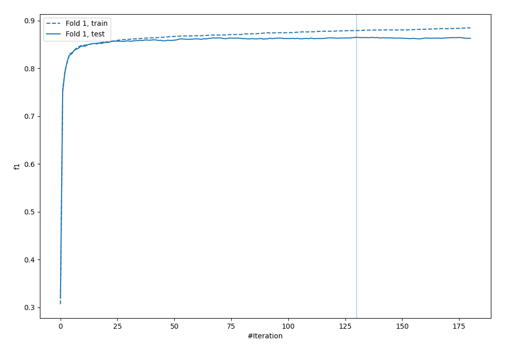
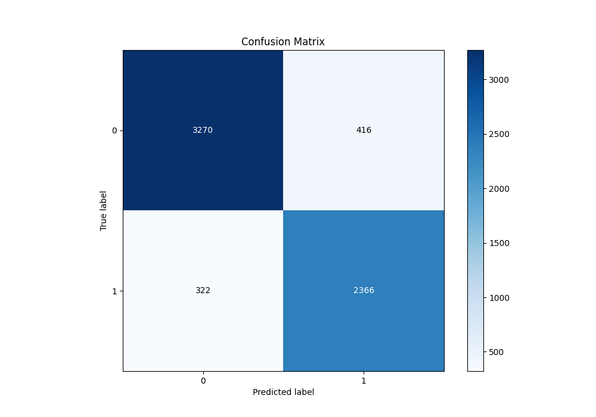
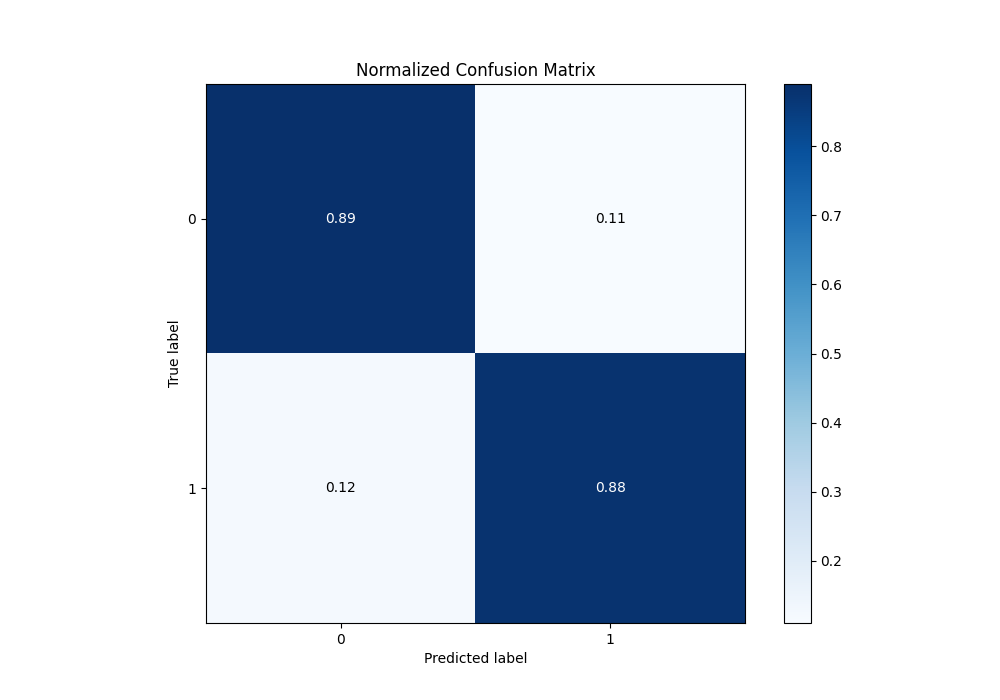
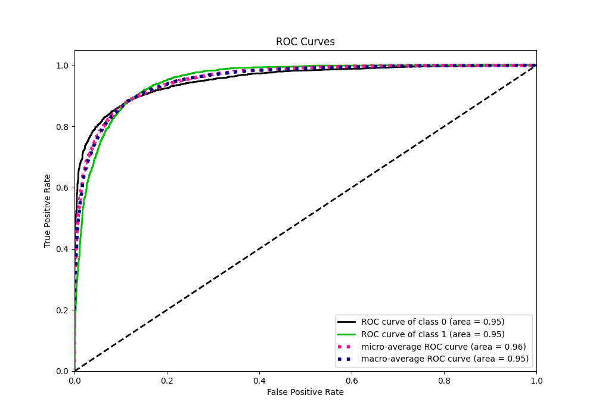
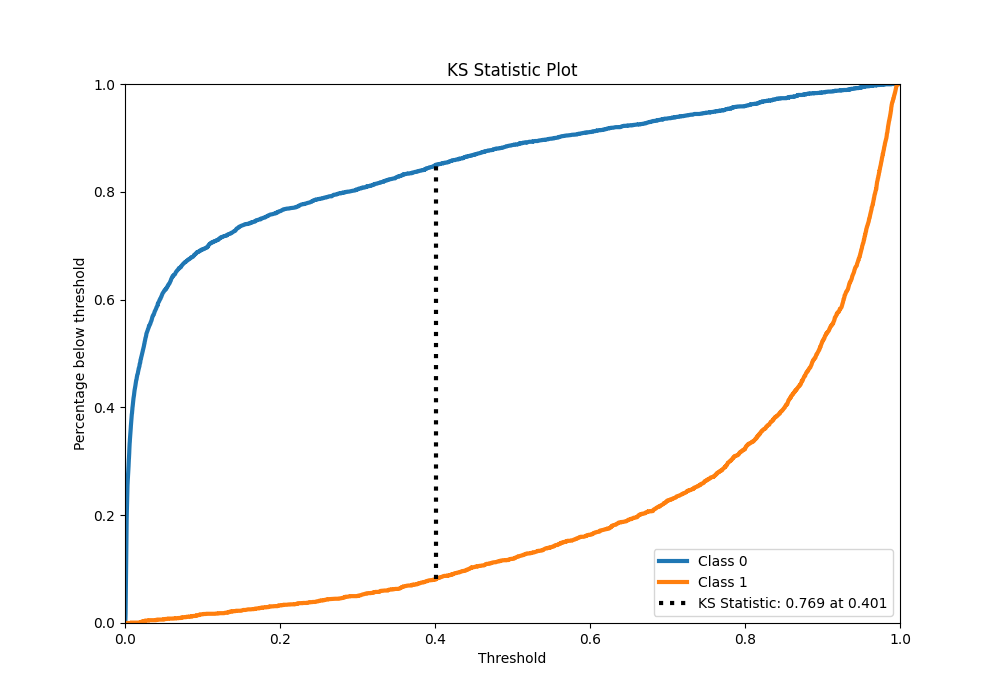
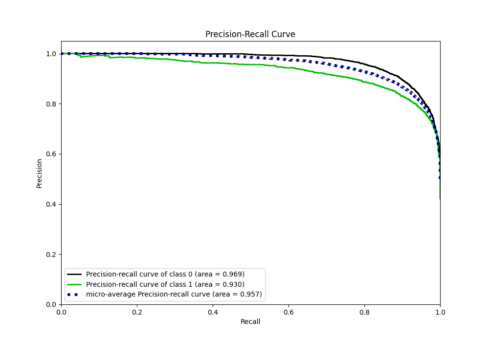
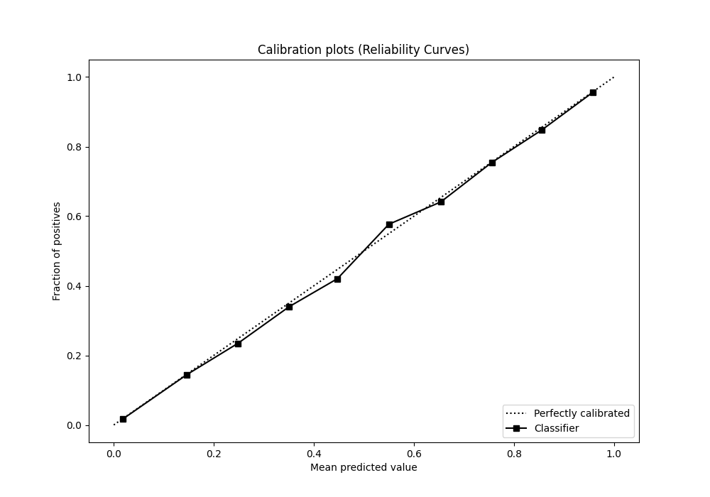
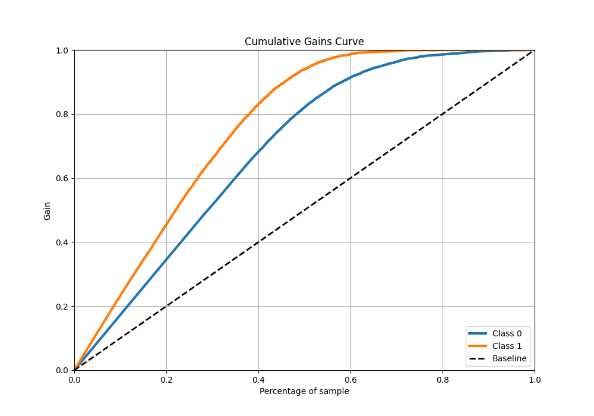
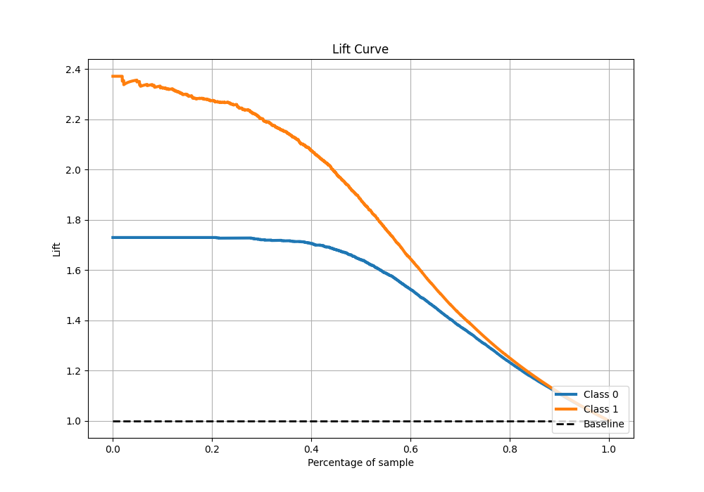

# Summary of 10_Xgboost

[<< Go back](../README.md)

## Extreme Gradient Boosting (Xgboost)
- **n_jobs**: -1
- **objective**: binary:logistic
- **eta**: 0.15
- **max_depth**: 8
- **min_child_weight**: 50
- **subsample**: 0.6
- **colsample_bytree**: 0.6
- **eval_metric**: f1
- **explain_level**: 0

## Validation
 - **validation_type**: split
 - **train_ratio**: 0.9
 - **shuffle**: True
 - **stratify**: True

## Optimized metric
f1

## Training time

7.1 seconds

## Metric details
|           |    score |     threshold |
|:----------|---------:|--------------:|
| logloss   | 0.270206 | nan           |
| auc       | 0.953492 | nan           |
| f1        | 0.865082 |   0.502335    |
| accuracy  | 0.884217 |   0.502335    |
| precision | 0.992647 |   0.988274    |
| recall    | 1        |   0.000348856 |
| mcc       | 0.764079 |   0.502335    |

## Metric details with threshold from accuracy metric
|           |    score |   threshold |
|:----------|---------:|------------:|
| logloss   | 0.270206 |  nan        |
| auc       | 0.953492 |  nan        |
| f1        | 0.865082 |    0.502335 |
| accuracy  | 0.884217 |    0.502335 |
| precision | 0.850467 |    0.502335 |
| recall    | 0.880208 |    0.502335 |
| mcc       | 0.764079 |    0.502335 |

## Confusion matrix (at threshold=0.502335)
|              |   Predicted as 0 |   Predicted as 1 |
|:-------------|-----------------:|-----------------:|
| Labeled as 0 |             3270 |              416 |
| Labeled as 1 |              322 |             2366 |

## Learning curves

## Confusion Matrix

## Normalized Confusion Matrix

## ROC Curve

## Kolmogorov-Smirnov Statistic

## Precision-Recall Curve

## Calibration Curve

## Cumulative Gains Curve

## Lift Curve

[<< Go back](../README.md)
