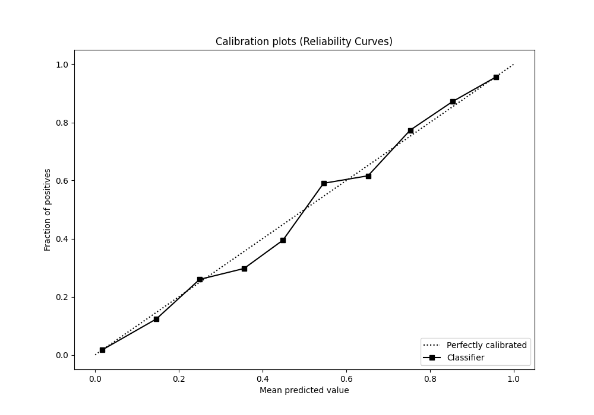

# Summary of 11_Xgboost

[<< Go back](../README.md)

## Extreme Gradient Boosting (Xgboost)
- **n_jobs**: -1
- **objective**: binary:logistic
- **eta**: 0.1
- **max_depth**: 6
- **min_child_weight**: 50
- **subsample**: 0.9
- **colsample_bytree**: 0.7
- **eval_metric**: f1
- **explain_level**: 0

## Validation
 - **validation_type**: split
 - **train_ratio**: 0.9
 - **shuffle**: True
 - **stratify**: True

## Optimized metric
f1

## Training time

9.3 seconds

## Metric details
|           |    score |    threshold |
|:----------|---------:|-------------:|
| logloss   | 0.26476  | nan          |
| auc       | 0.955349 | nan          |
| f1        | 0.872239 |   0.435425   |
| accuracy  | 0.887826 |   0.488266   |
| precision | 0.996183 |   0.982872   |
| recall    | 1        |   0.00011737 |
| mcc       | 0.773831 |   0.435425   |

## Metric details with threshold from accuracy metric
|           |    score |   threshold |
|:----------|---------:|------------:|
| logloss   | 0.26476  |  nan        |
| auc       | 0.955349 |  nan        |
| f1        | 0.870775 |    0.488266 |
| accuracy  | 0.887826 |    0.488266 |
| precision | 0.846749 |    0.488266 |
| recall    | 0.896205 |    0.488266 |
| mcc       | 0.772788 |    0.488266 |

## Confusion matrix (at threshold=0.488266)
|              |   Predicted as 0 |   Predicted as 1 |
|:-------------|-----------------:|-----------------:|
| Labeled as 0 |             3250 |              436 |
| Labeled as 1 |              279 |             2409 |

## Learning curves

## Confusion Matrix

## Normalized Confusion Matrix

## ROC Curve

## Kolmogorov-Smirnov Statistic

## Precision-Recall Curve

## Calibration Curve

## Cumulative Gains Curve

## Lift Curve

[<< Go back](../README.md)
