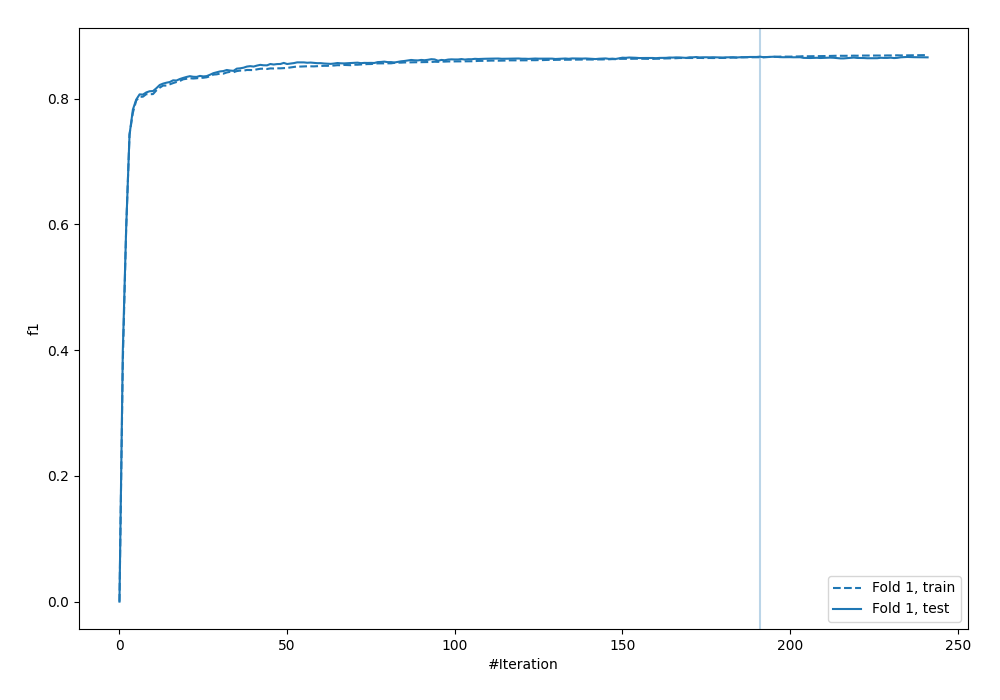
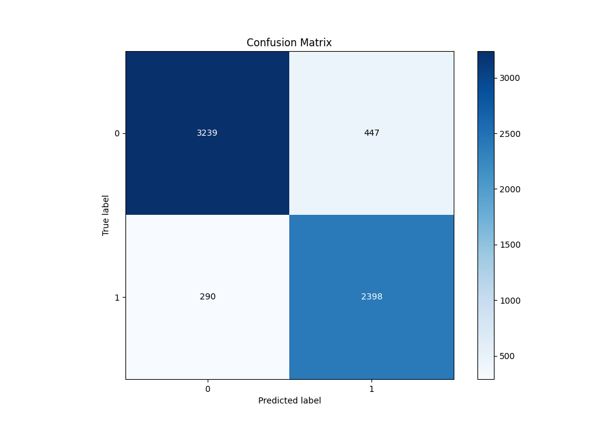
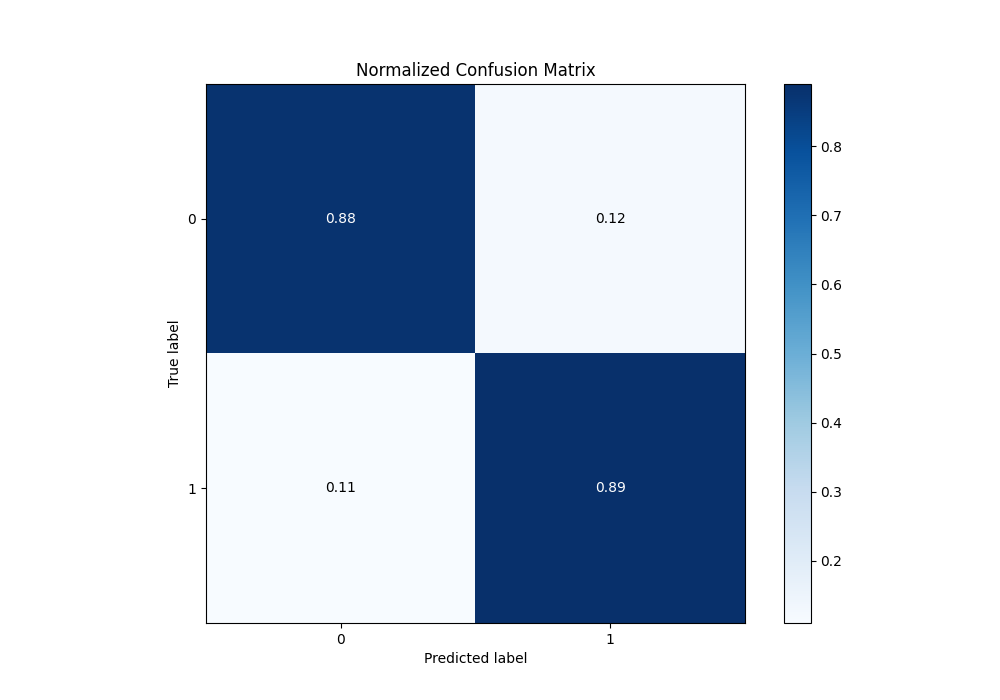
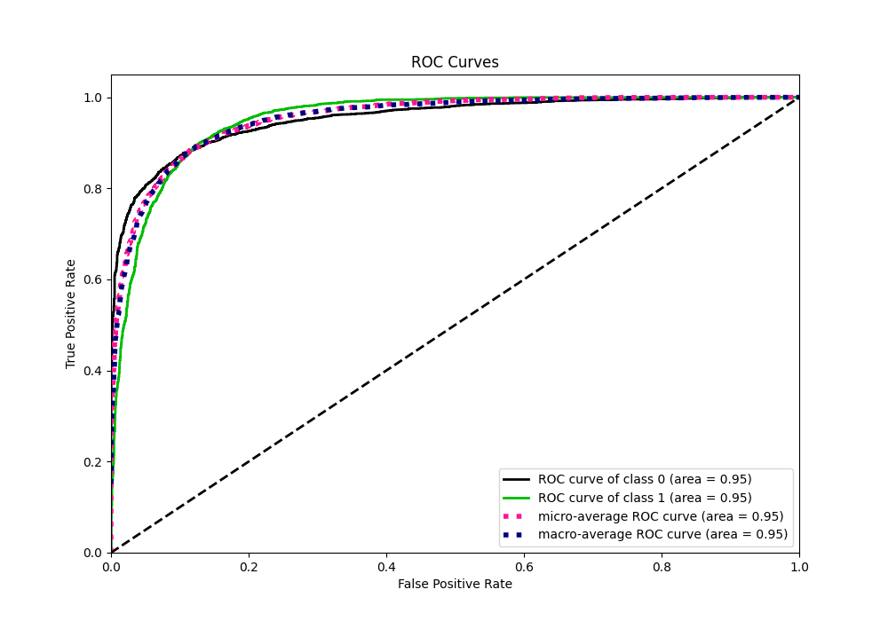
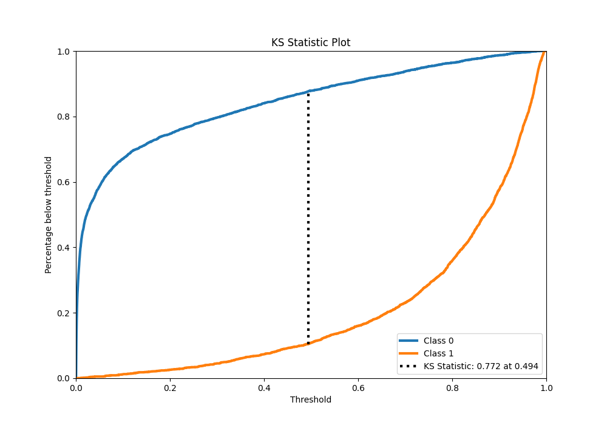
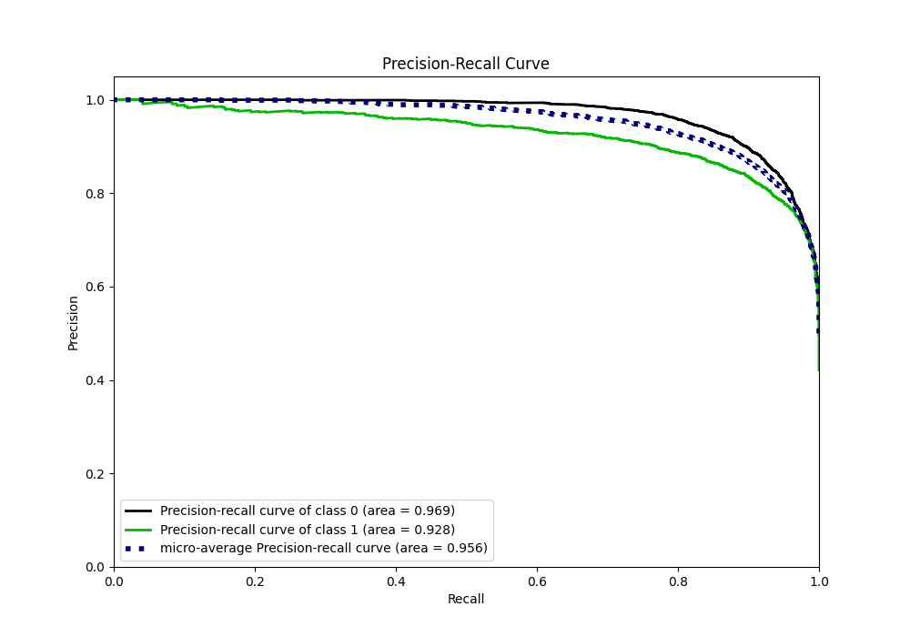
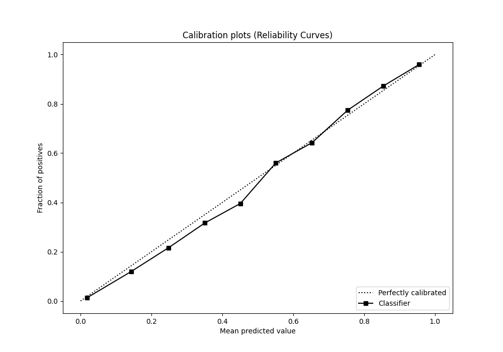
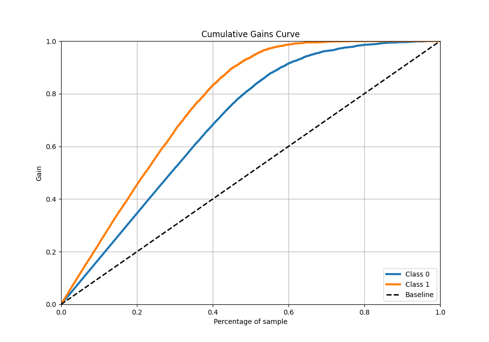
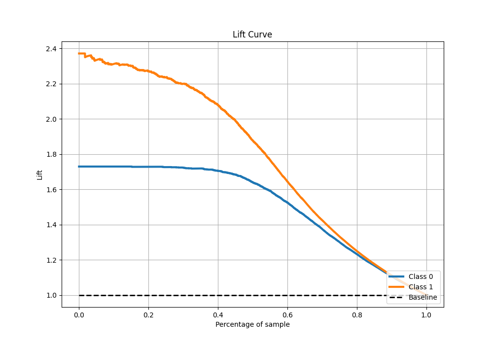

# Summary of 12_Xgboost

[<< Go back](../README.md)

## Extreme Gradient Boosting (Xgboost)
- **n_jobs**: -1
- **objective**: binary:logistic
- **eta**: 0.1
- **max_depth**: 4
- **min_child_weight**: 25
- **subsample**: 0.7
- **colsample_bytree**: 0.7
- **eval_metric**: f1
- **explain_level**: 0

## Validation
 - **validation_type**: split
 - **train_ratio**: 0.9
 - **shuffle**: True
 - **stratify**: True

## Optimized metric
f1

## Training time

7.6 seconds

## Metric details
|           |    score |     threshold |
|:----------|---------:|--------------:|
| logloss   | 0.272405 | nan           |
| auc       | 0.952862 | nan           |
| f1        | 0.866799 |   0.499281    |
| accuracy  | 0.884374 |   0.499281    |
| precision | 0.994975 |   0.980734    |
| recall    | 1        |   0.000180669 |
| mcc       | 0.765758 |   0.499281    |

## Metric details with threshold from accuracy metric
|           |    score |   threshold |
|:----------|---------:|------------:|
| logloss   | 0.272405 |  nan        |
| auc       | 0.952862 |  nan        |
| f1        | 0.866799 |    0.499281 |
| accuracy  | 0.884374 |    0.499281 |
| precision | 0.842882 |    0.499281 |
| recall    | 0.892113 |    0.499281 |
| mcc       | 0.765758 |    0.499281 |

## Confusion matrix (at threshold=0.499281)
|              |   Predicted as 0 |   Predicted as 1 |
|:-------------|-----------------:|-----------------:|
| Labeled as 0 |             3239 |              447 |
| Labeled as 1 |              290 |             2398 |

## Learning curves

## Confusion Matrix

## Normalized Confusion Matrix

## ROC Curve

## Kolmogorov-Smirnov Statistic

## Precision-Recall Curve

## Calibration Curve

## Cumulative Gains Curve

## Lift Curve

[<< Go back](../README.md)
