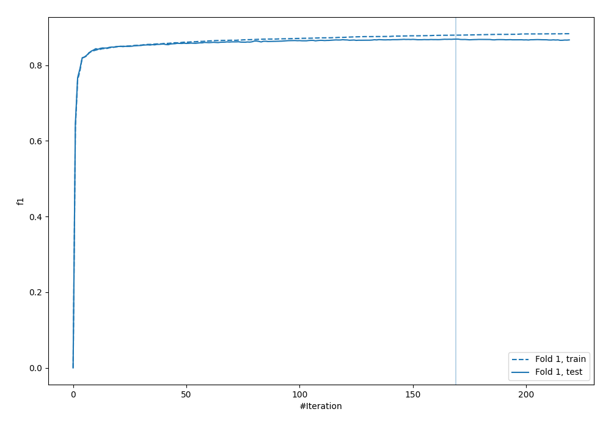
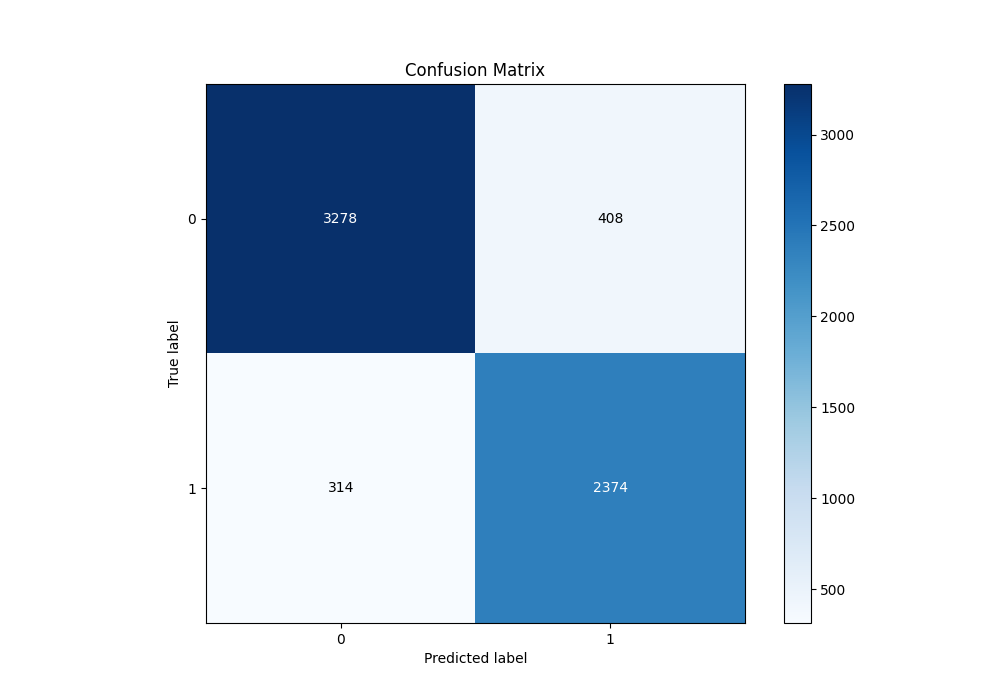
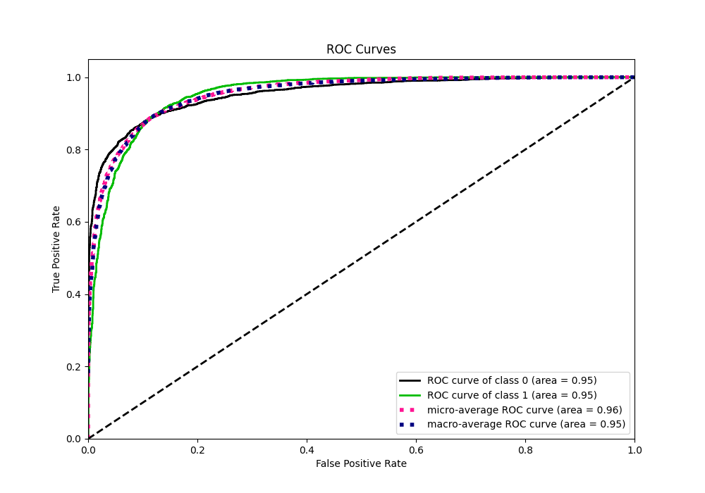
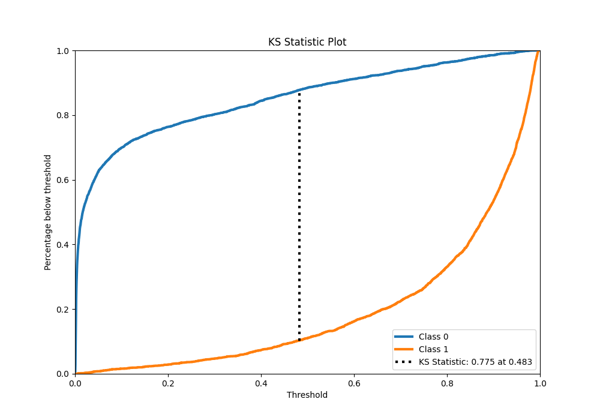
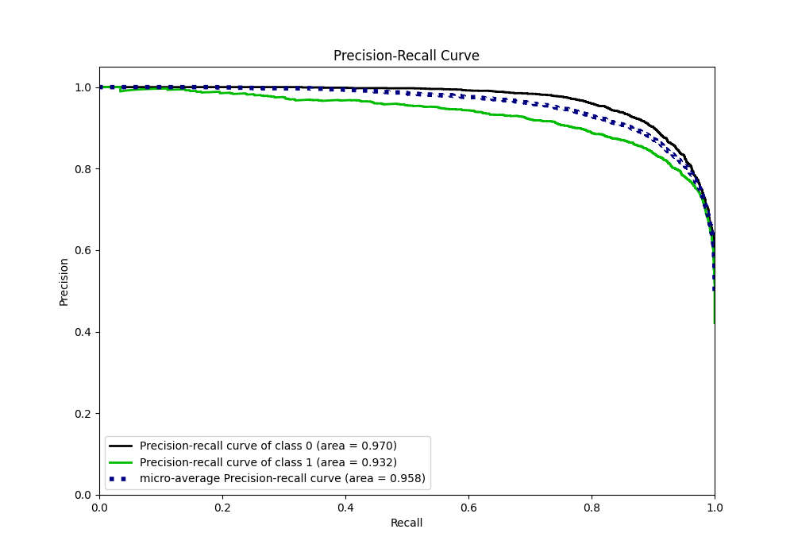
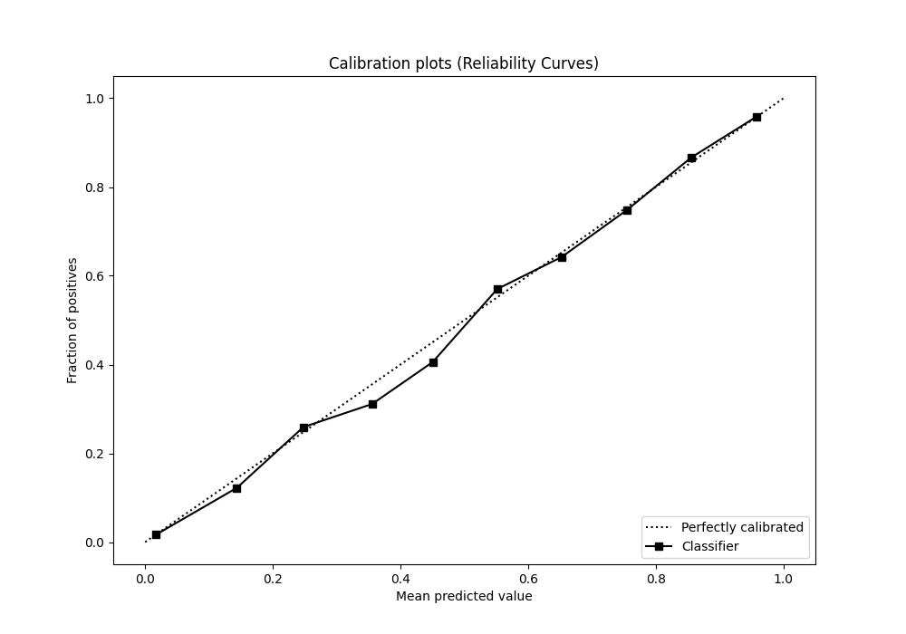
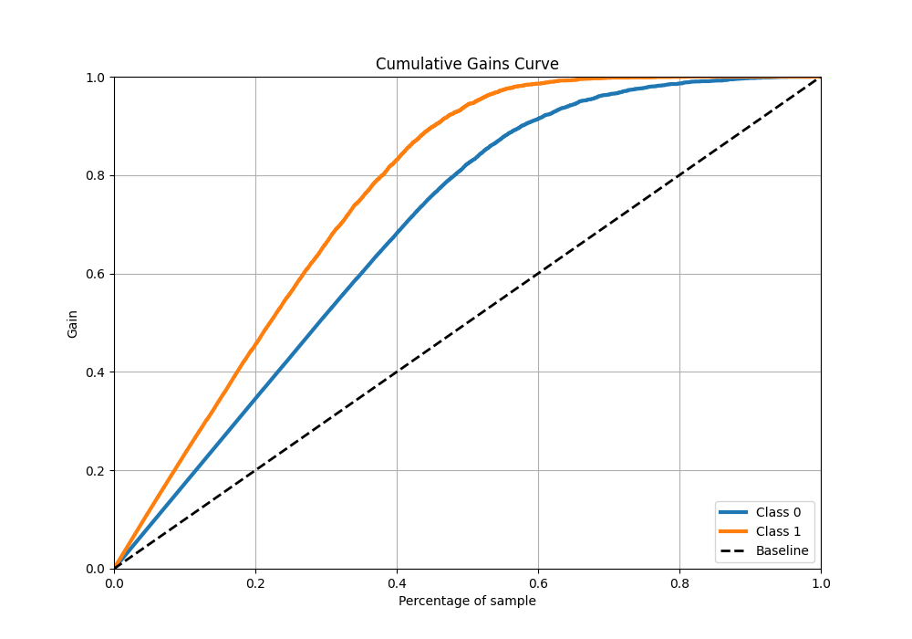
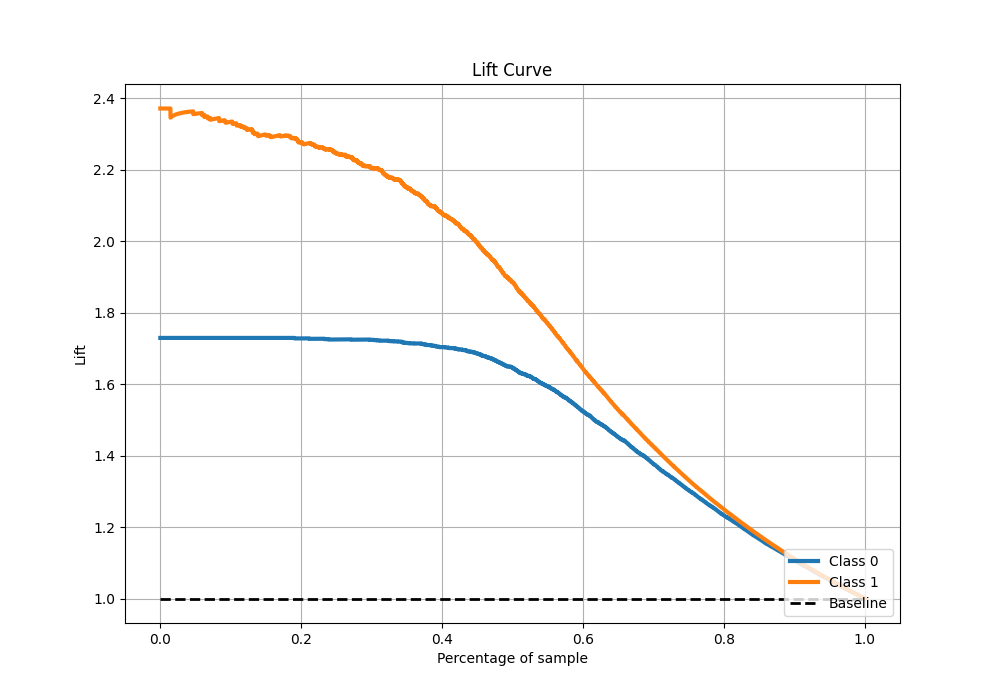

# Summary of 14_Xgboost

[<< Go back](../README.md)

## Extreme Gradient Boosting (Xgboost)
- **n_jobs**: -1
- **objective**: binary:logistic
- **eta**: 0.1
- **max_depth**: 7
- **min_child_weight**: 50
- **subsample**: 1.0
- **colsample_bytree**: 1.0
- **eval_metric**: f1
- **explain_level**: 0

## Validation
 - **validation_type**: split
 - **train_ratio**: 0.9
 - **shuffle**: True
 - **stratify**: True

## Optimized metric
f1

## Training time

8.0 seconds

## Metric details
|           |    score |     threshold |
|:----------|---------:|--------------:|
| logloss   | 0.266875 | nan           |
| auc       | 0.954636 | nan           |
| f1        | 0.868607 |   0.489784    |
| accuracy  | 0.886727 |   0.516714    |
| precision | 0.996183 |   0.982318    |
| recall    | 1        |   0.000342831 |
| mcc       | 0.769204 |   0.516714    |

## Metric details with threshold from accuracy metric
|           |    score |   threshold |
|:----------|---------:|------------:|
| logloss   | 0.266875 |  nan        |
| auc       | 0.954636 |  nan        |
| f1        | 0.868007 |    0.516714 |
| accuracy  | 0.886727 |    0.516714 |
| precision | 0.853343 |    0.516714 |
| recall    | 0.883185 |    0.516714 |
| mcc       | 0.769204 |    0.516714 |

## Confusion matrix (at threshold=0.516714)
|              |   Predicted as 0 |   Predicted as 1 |
|:-------------|-----------------:|-----------------:|
| Labeled as 0 |             3278 |              408 |
| Labeled as 1 |              314 |             2374 |

## Learning curves

## Confusion Matrix

## Normalized Confusion Matrix

## ROC Curve

## Kolmogorov-Smirnov Statistic

## Precision-Recall Curve

## Calibration Curve

## Cumulative Gains Curve

## Lift Curve

[<< Go back](../README.md)
