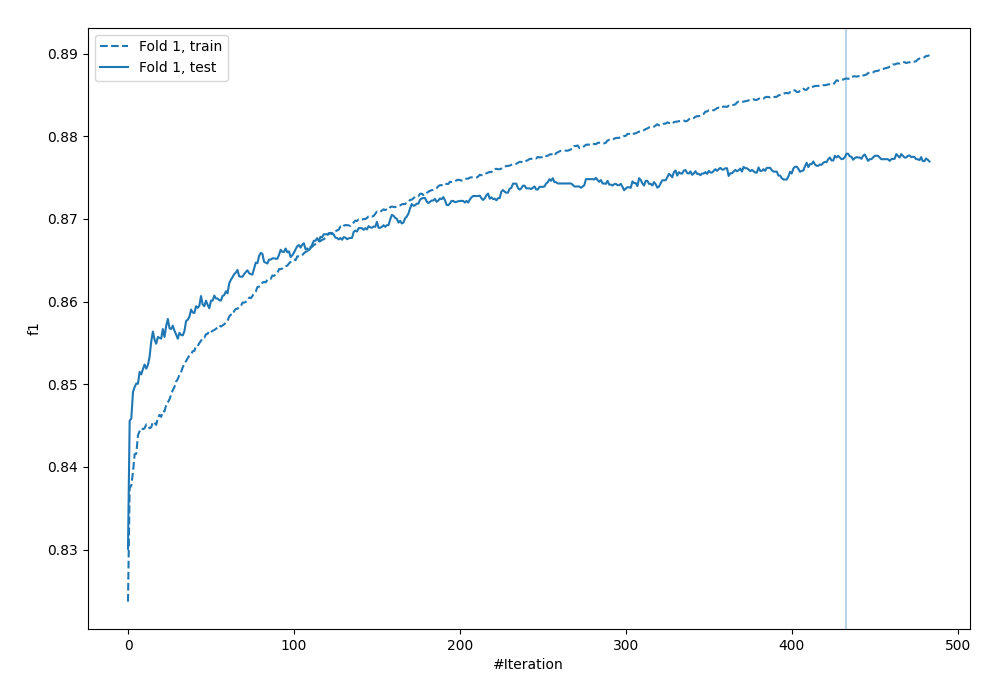
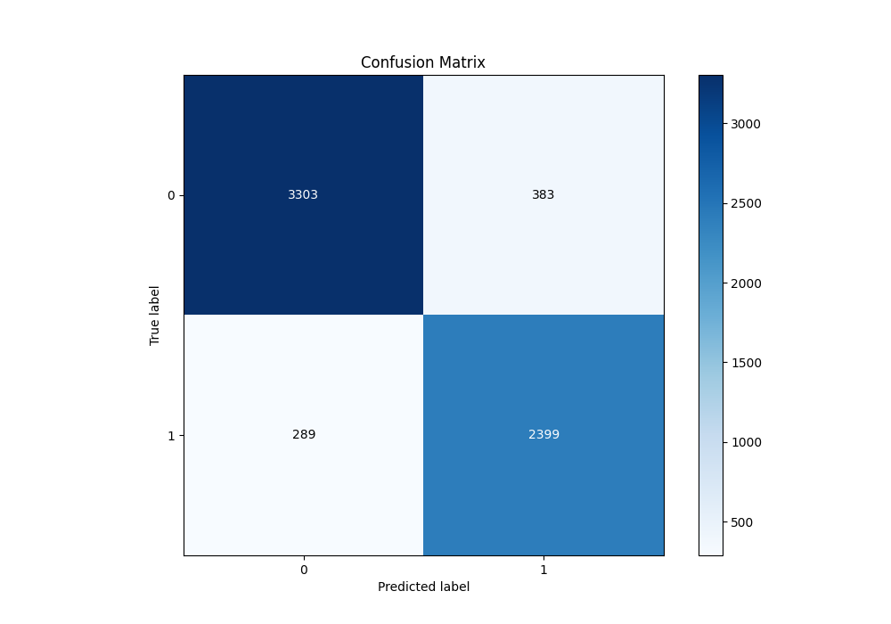
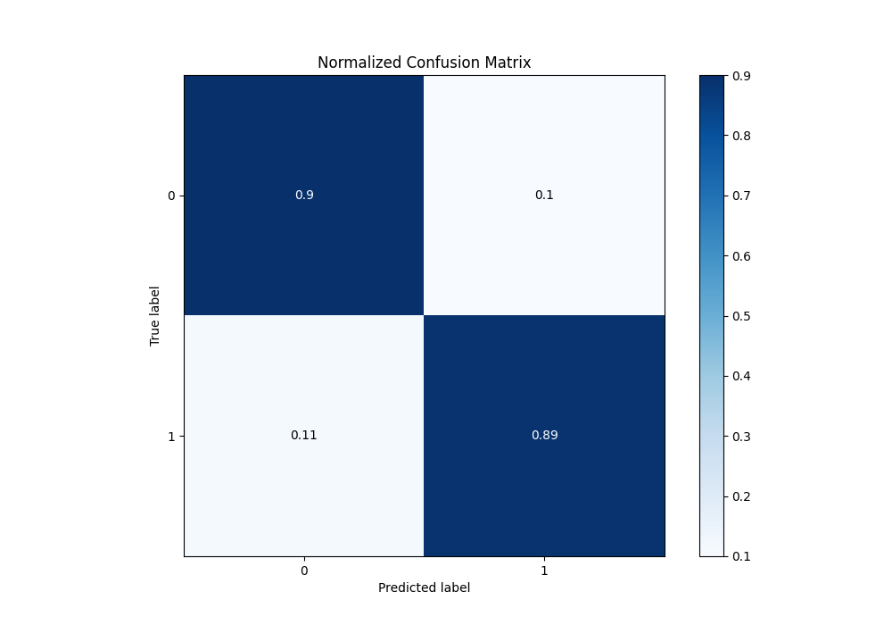
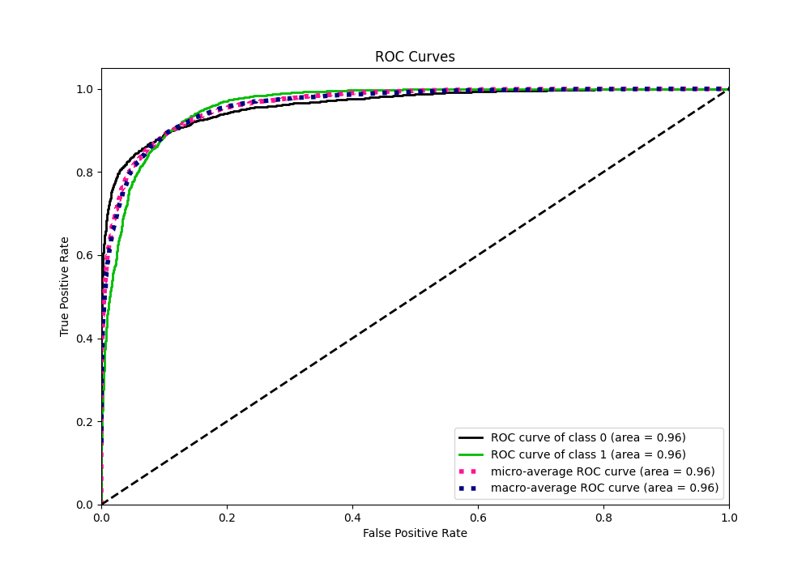
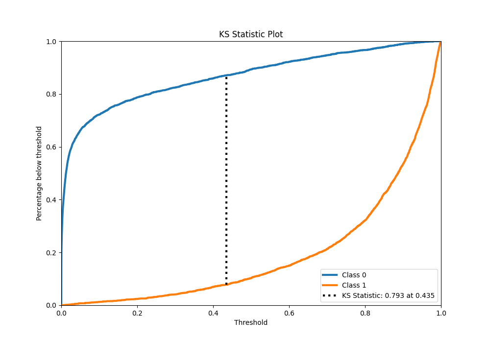
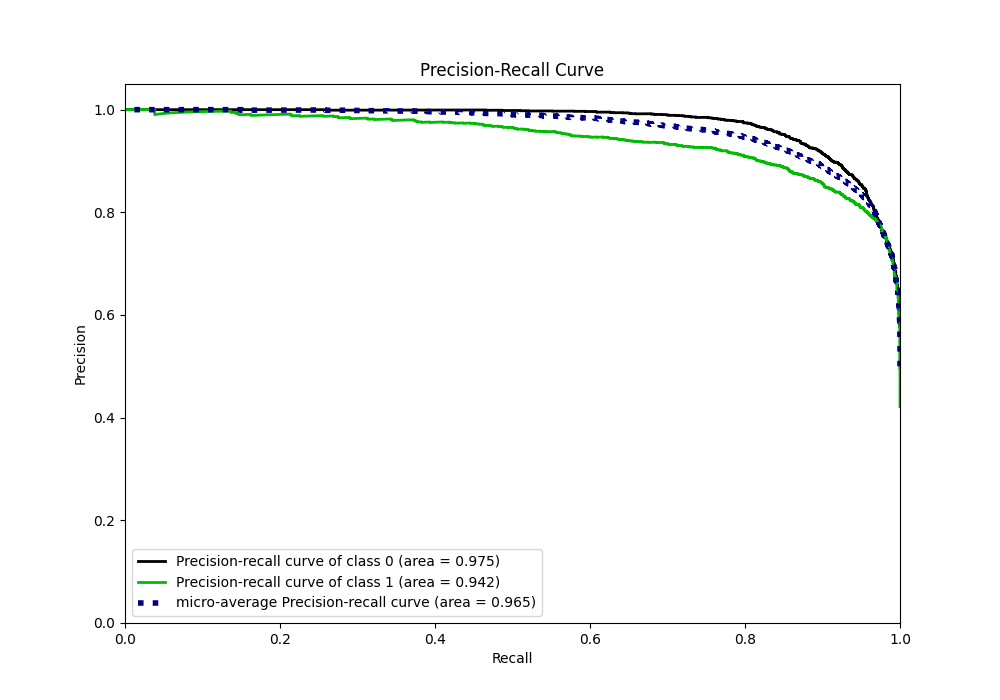
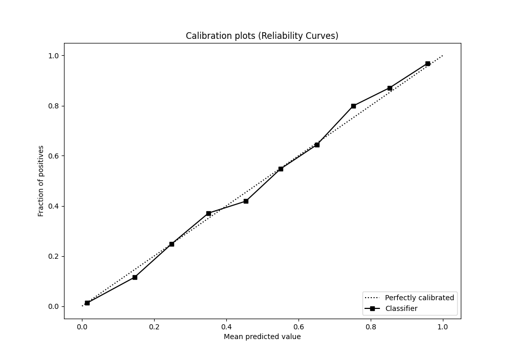
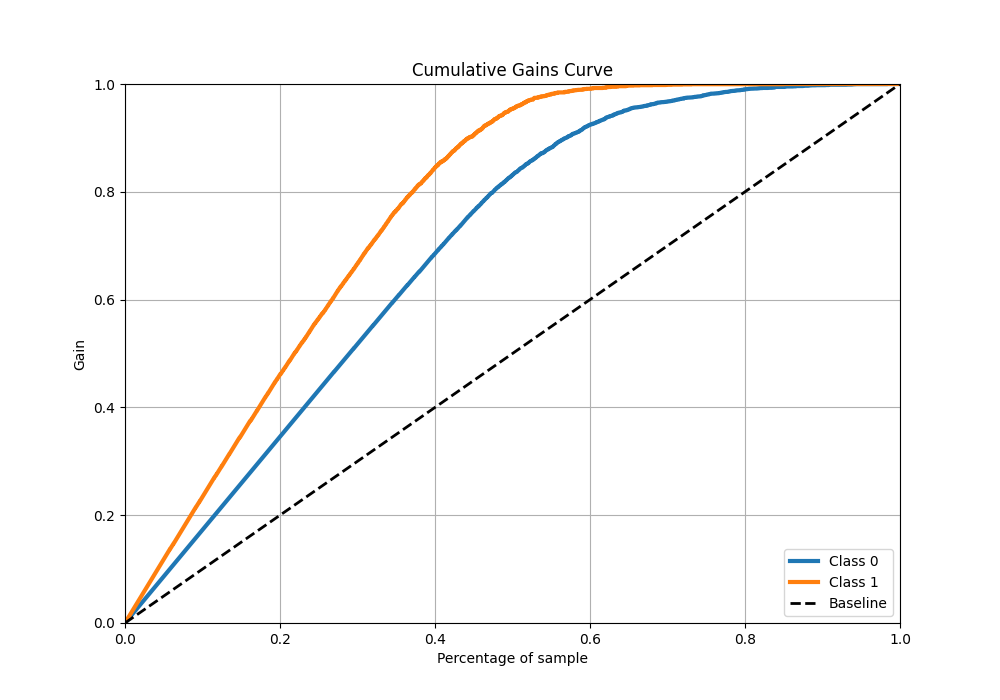
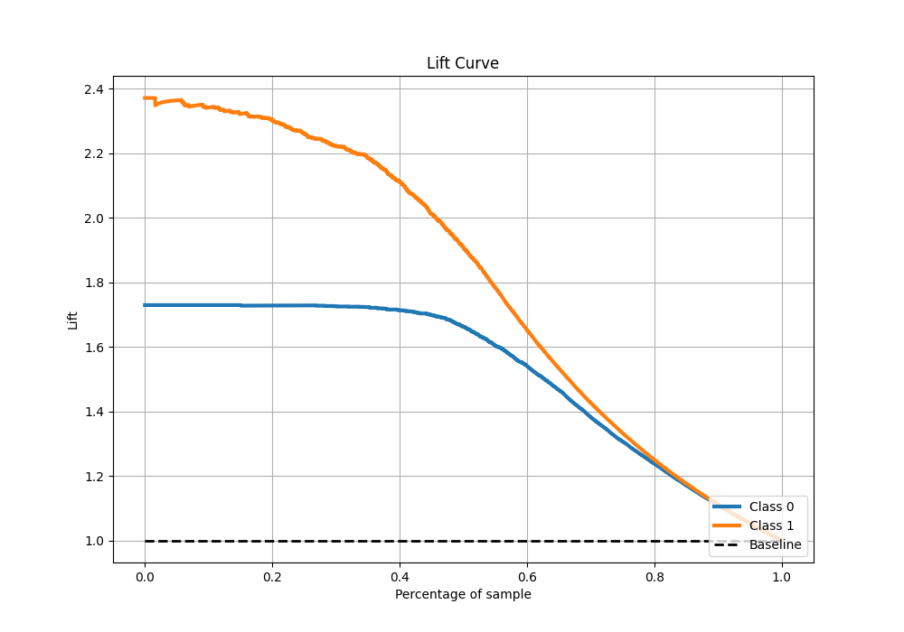

# Summary of 16_CatBoost

[<< Go back](../README.md)

## CatBoost
- **n_jobs**: -1
- **learning_rate**: 0.05
- **depth**: 8
- **rsm**: 0.8
- **loss_function**: Logloss
- **eval_metric**: F1
- **explain_level**: 0

## Validation
 - **validation_type**: split
 - **train_ratio**: 0.9
 - **shuffle**: True
 - **stratify**: True

## Optimized metric
f1

## Training time

25.1 seconds

## Metric details
|           |    score |     threshold |
|:----------|---------:|--------------:|
| logloss   | 0.245142 | nan           |
| auc       | 0.961628 | nan           |
| f1        | 0.87777  |   0.459643    |
| accuracy  | 0.894572 |   0.507472    |
| precision | 0.996923 |   0.982653    |
| recall    | 1        |   1.16219e-05 |
| mcc       | 0.785218 |   0.507472    |

## Metric details with threshold from accuracy metric
|           |    score |   threshold |
|:----------|---------:|------------:|
| logloss   | 0.245142 |  nan        |
| auc       | 0.961628 |  nan        |
| f1        | 0.877148 |    0.507472 |
| accuracy  | 0.894572 |    0.507472 |
| precision | 0.862329 |    0.507472 |
| recall    | 0.892485 |    0.507472 |
| mcc       | 0.785218 |    0.507472 |

## Confusion matrix (at threshold=0.507472)
|              |   Predicted as 0 |   Predicted as 1 |
|:-------------|-----------------:|-----------------:|
| Labeled as 0 |             3303 |              383 |
| Labeled as 1 |              289 |             2399 |

## Learning curves

## Confusion Matrix

## Normalized Confusion Matrix

## ROC Curve

## Kolmogorov-Smirnov Statistic

## Precision-Recall Curve

## Calibration Curve

## Cumulative Gains Curve

## Lift Curve

[<< Go back](../README.md)
