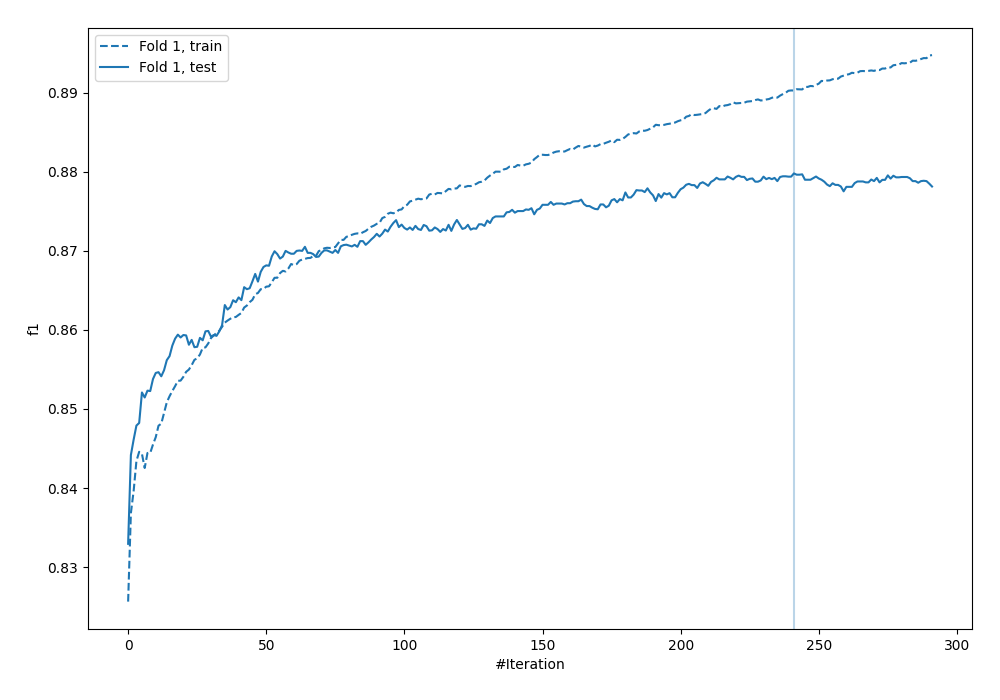
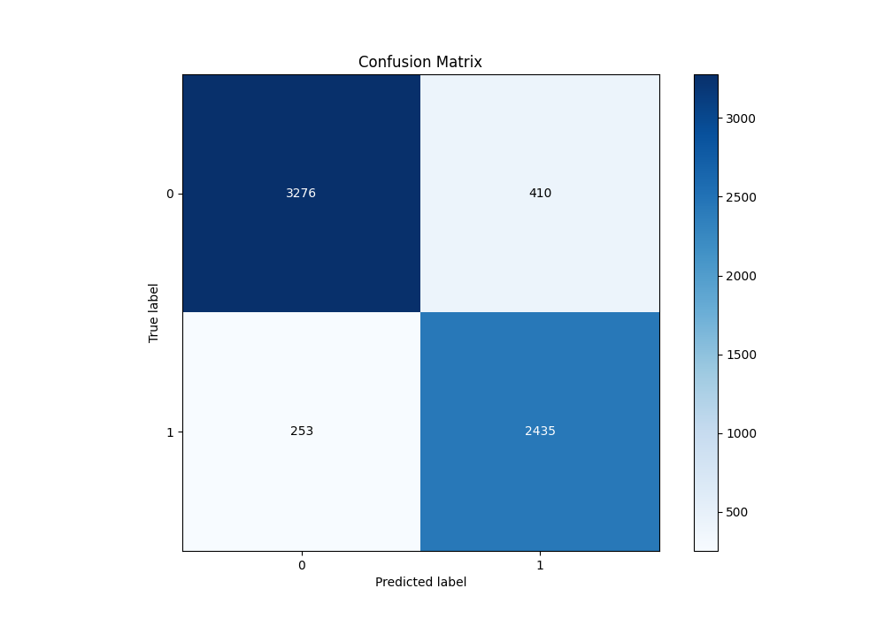
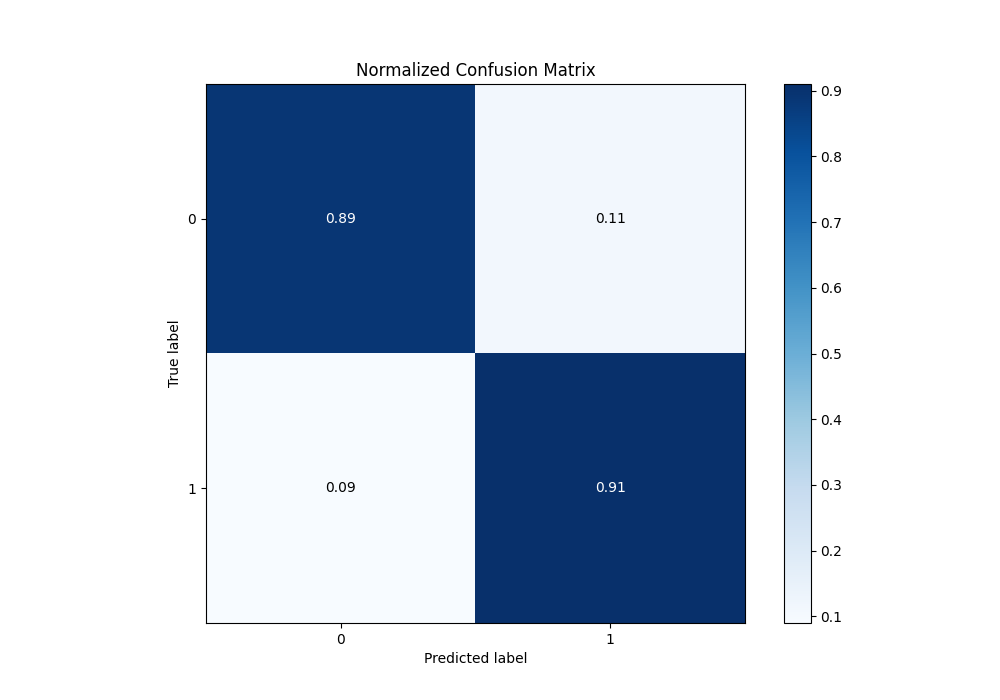
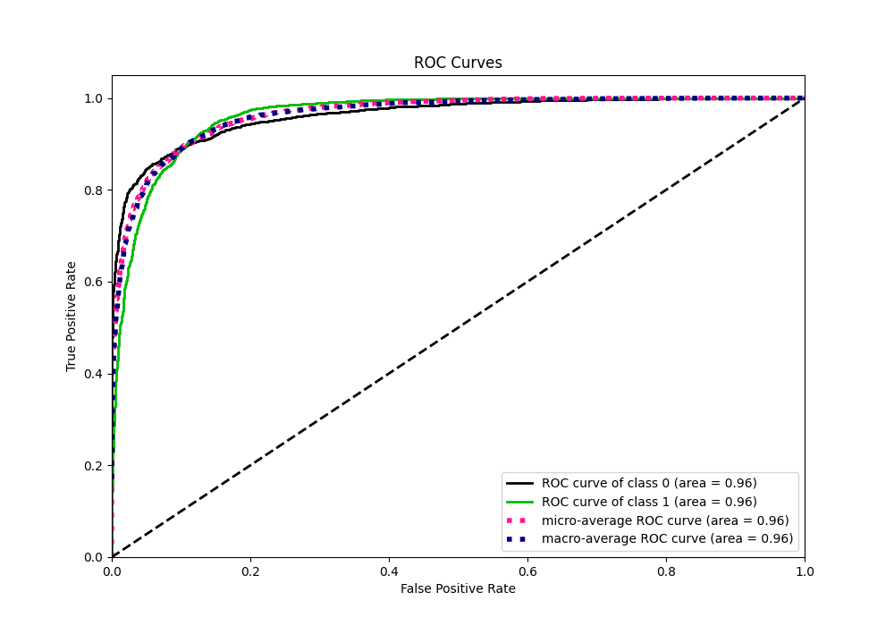
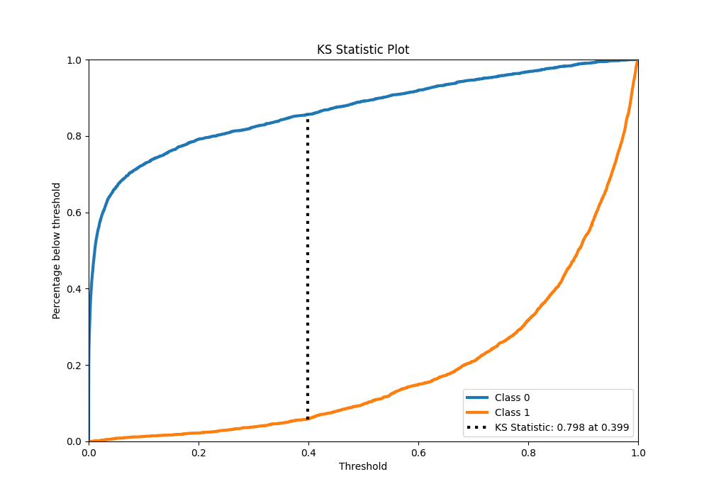
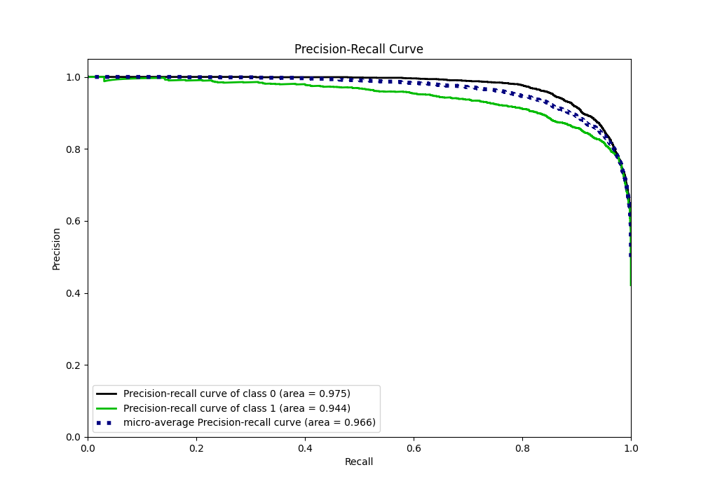
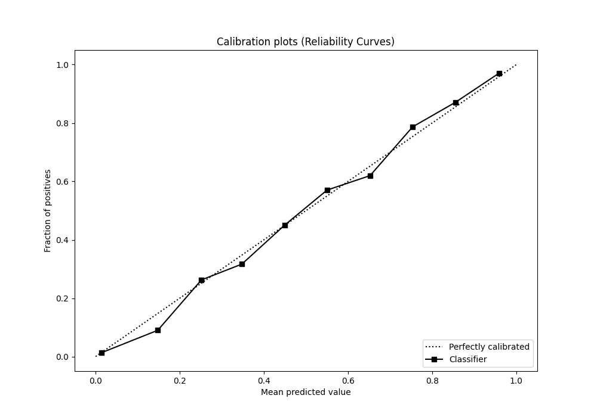
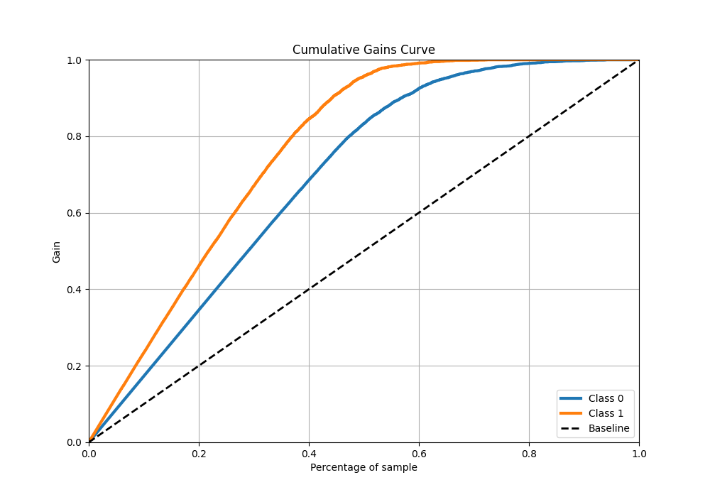
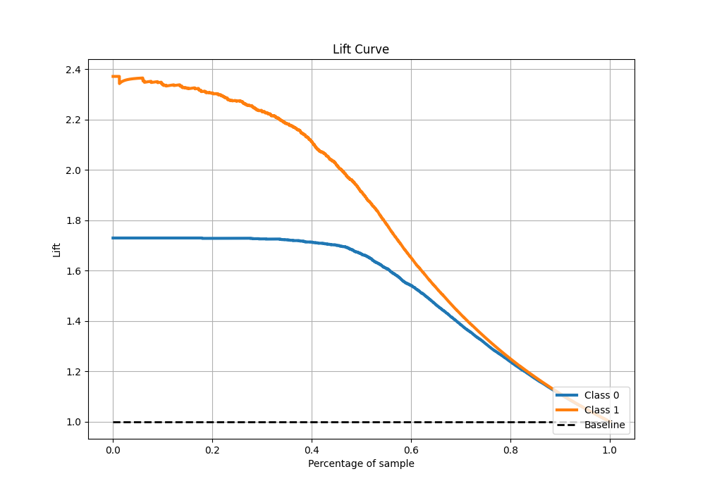

# Summary of 17_CatBoost

[<< Go back](../README.md)

## CatBoost
- **n_jobs**: -1
- **learning_rate**: 0.1
- **depth**: 8
- **rsm**: 1.0
- **loss_function**: Logloss
- **eval_metric**: F1
- **explain_level**: 0

## Validation
 - **validation_type**: split
 - **train_ratio**: 0.9
 - **shuffle**: True
 - **stratify**: True

## Optimized metric
f1

## Training time

17.8 seconds

## Metric details
|           |    score |     threshold |
|:----------|---------:|--------------:|
| logloss   | 0.241786 | nan           |
| auc       | 0.962774 | nan           |
| f1        | 0.880174 |   0.494583    |
| accuracy  | 0.895984 |   0.494583    |
| precision | 0.996923 |   0.985204    |
| recall    | 1        |   2.55569e-06 |
| mcc       | 0.789404 |   0.494583    |

## Metric details with threshold from accuracy metric
|           |    score |   threshold |
|:----------|---------:|------------:|
| logloss   | 0.241786 |  nan        |
| auc       | 0.962774 |  nan        |
| f1        | 0.880174 |    0.494583 |
| accuracy  | 0.895984 |    0.494583 |
| precision | 0.855888 |    0.494583 |
| recall    | 0.905878 |    0.494583 |
| mcc       | 0.789404 |    0.494583 |

## Confusion matrix (at threshold=0.494583)
|              |   Predicted as 0 |   Predicted as 1 |
|:-------------|-----------------:|-----------------:|
| Labeled as 0 |             3276 |              410 |
| Labeled as 1 |              253 |             2435 |

## Learning curves

## Confusion Matrix

## Normalized Confusion Matrix

## ROC Curve

## Kolmogorov-Smirnov Statistic

## Precision-Recall Curve

## Calibration Curve

## Cumulative Gains Curve

## Lift Curve

[<< Go back](../README.md)
