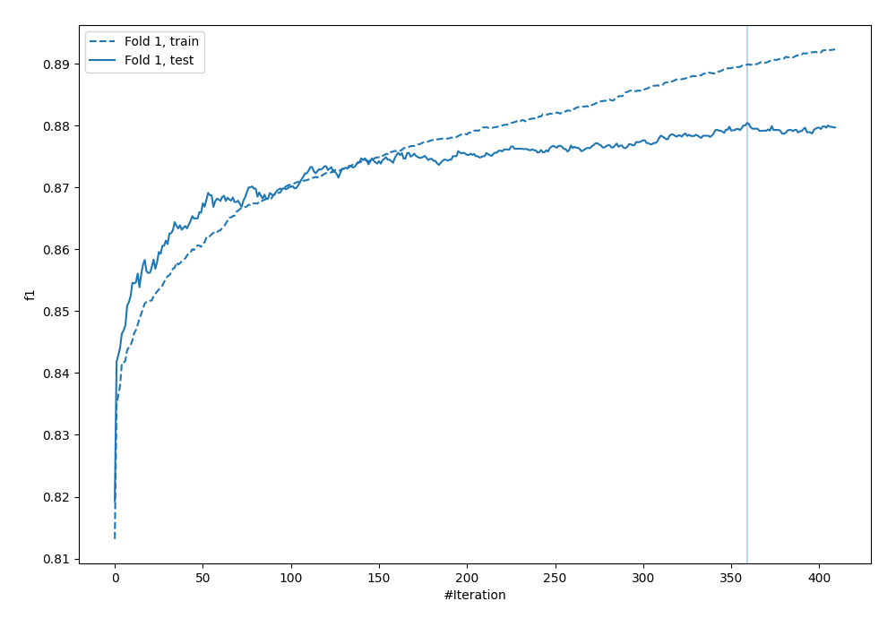
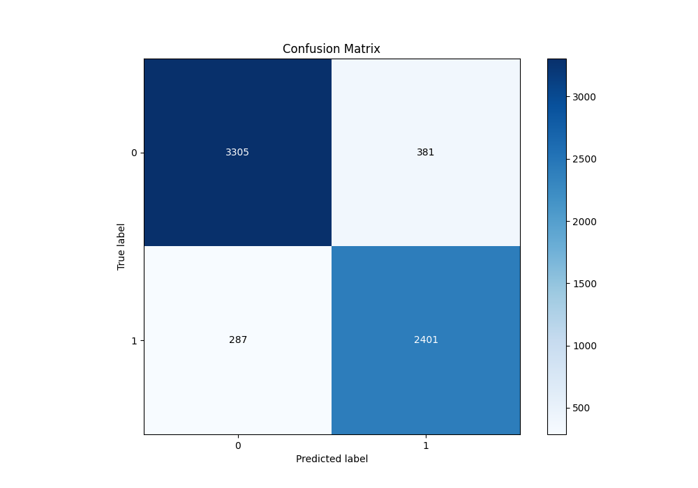
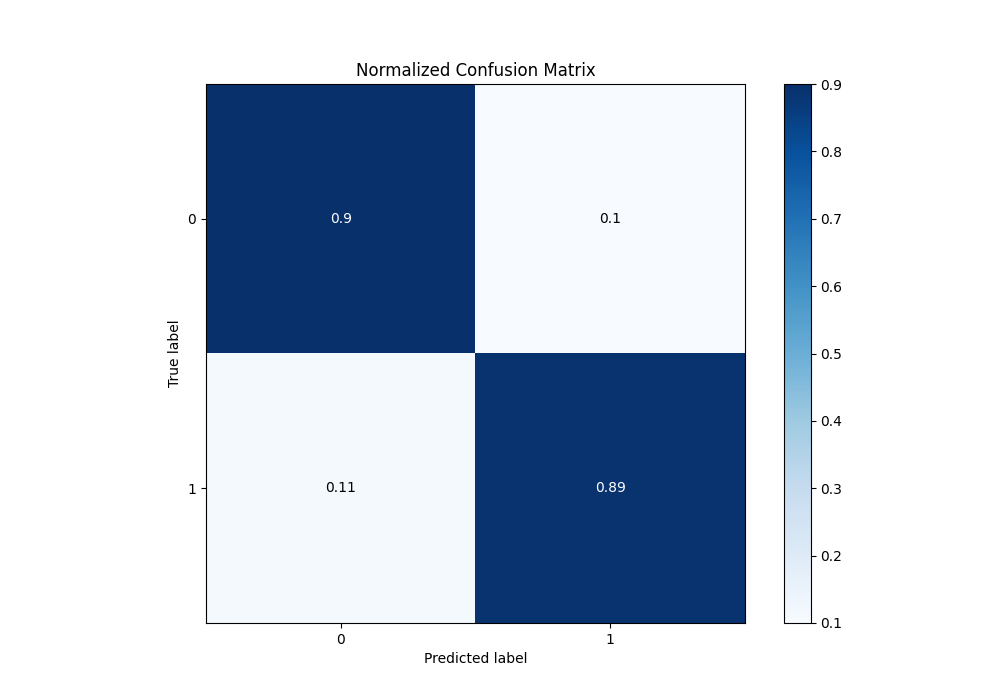
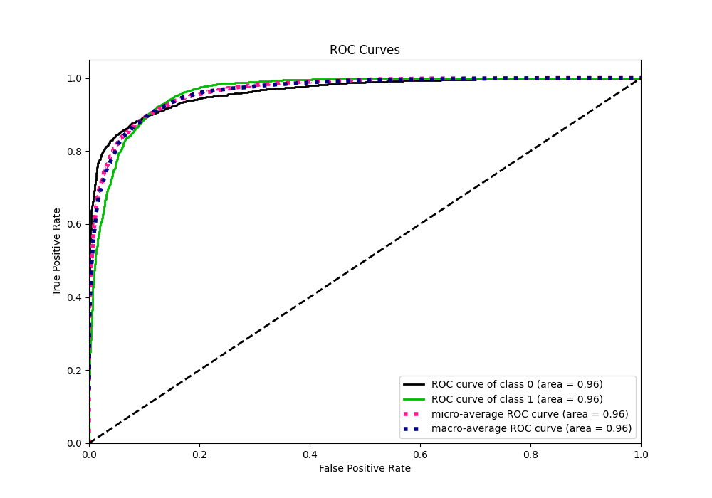
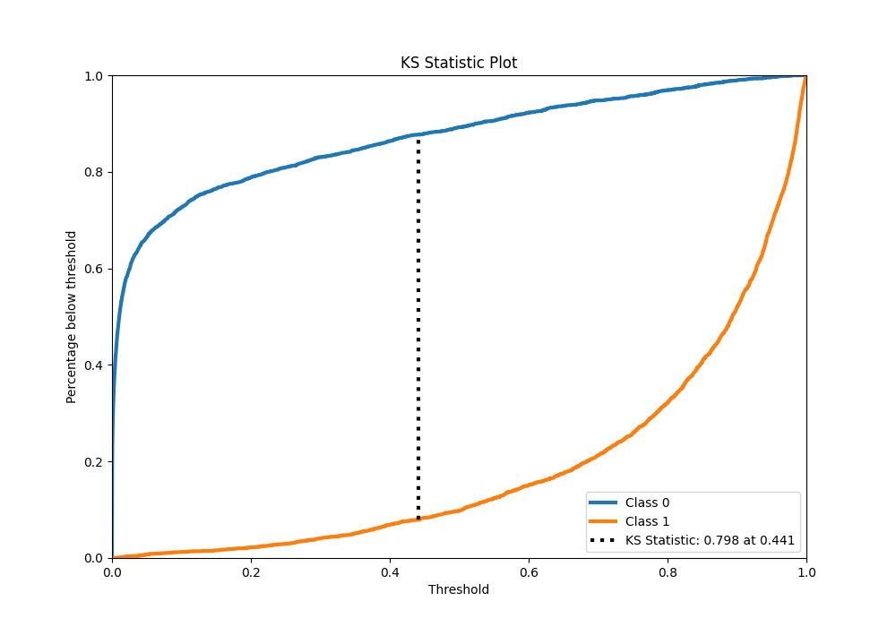
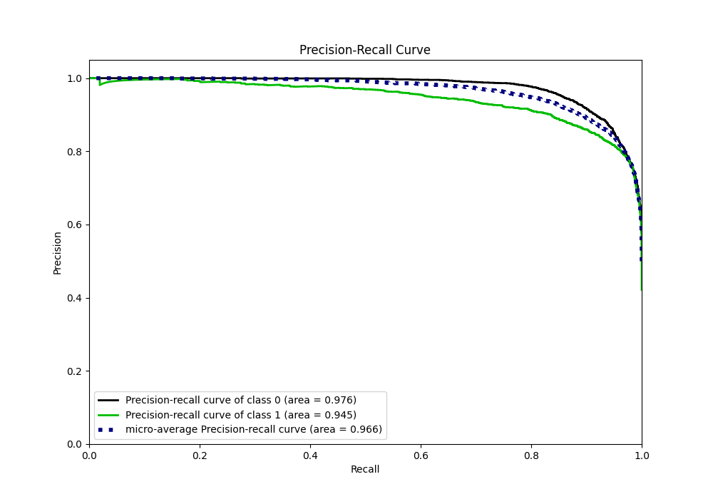
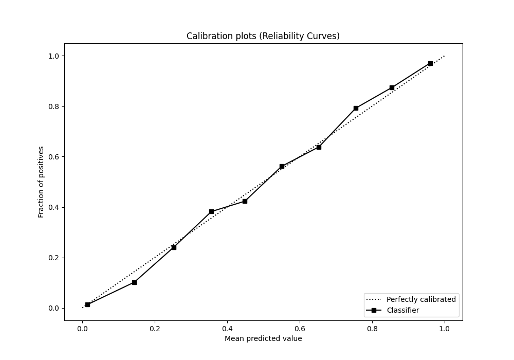
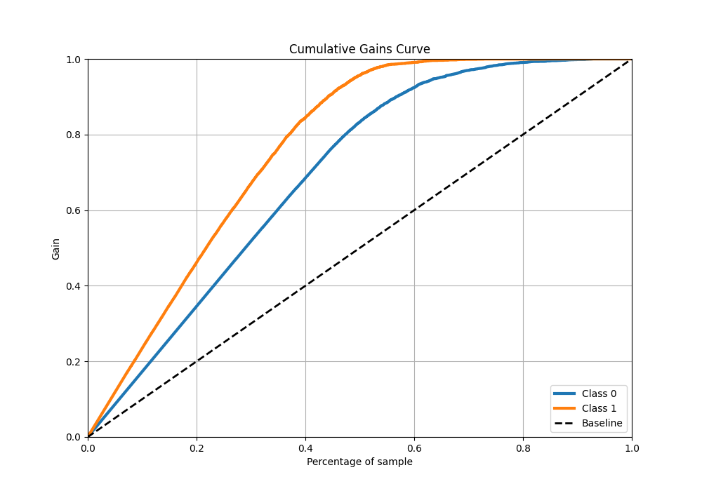
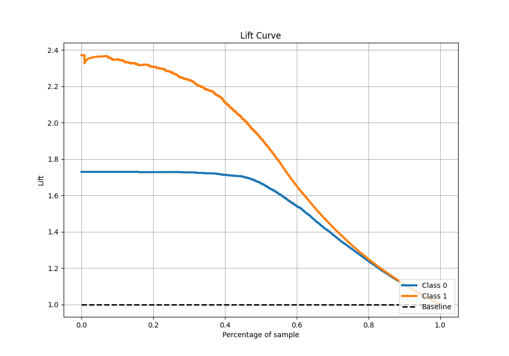

# Summary of 18_CatBoost

[<< Go back](../README.md)

## CatBoost
- **n_jobs**: -1
- **learning_rate**: 0.1
- **depth**: 7
- **rsm**: 1.0
- **loss_function**: Logloss
- **eval_metric**: F1
- **explain_level**: 0

## Validation
 - **validation_type**: split
 - **train_ratio**: 0.9
 - **shuffle**: True
 - **stratify**: True

## Optimized metric
f1

## Training time

18.2 seconds

## Metric details
|           |    score |     threshold |
|:----------|---------:|--------------:|
| logloss   | 0.24038  | nan           |
| auc       | 0.96312  | nan           |
| f1        | 0.880368 |   0.414093    |
| accuracy  | 0.895199 |   0.515357    |
| precision | 0.997783 |   0.979608    |
| recall    | 1        |   2.01071e-06 |
| mcc       | 0.788784 |   0.450792    |

## Metric details with threshold from accuracy metric
|           |    score |   threshold |
|:----------|---------:|------------:|
| logloss   | 0.24038  |  nan        |
| auc       | 0.96312  |  nan        |
| f1        | 0.877879 |    0.515357 |
| accuracy  | 0.895199 |    0.515357 |
| precision | 0.863048 |    0.515357 |
| recall    | 0.893229 |    0.515357 |
| mcc       | 0.7865   |    0.515357 |

## Confusion matrix (at threshold=0.515357)
|              |   Predicted as 0 |   Predicted as 1 |
|:-------------|-----------------:|-----------------:|
| Labeled as 0 |             3305 |              381 |
| Labeled as 1 |              287 |             2401 |

## Learning curves

## Confusion Matrix

## Normalized Confusion Matrix

## ROC Curve

## Kolmogorov-Smirnov Statistic

## Precision-Recall Curve

## Calibration Curve

## Cumulative Gains Curve

## Lift Curve

[<< Go back](../README.md)
