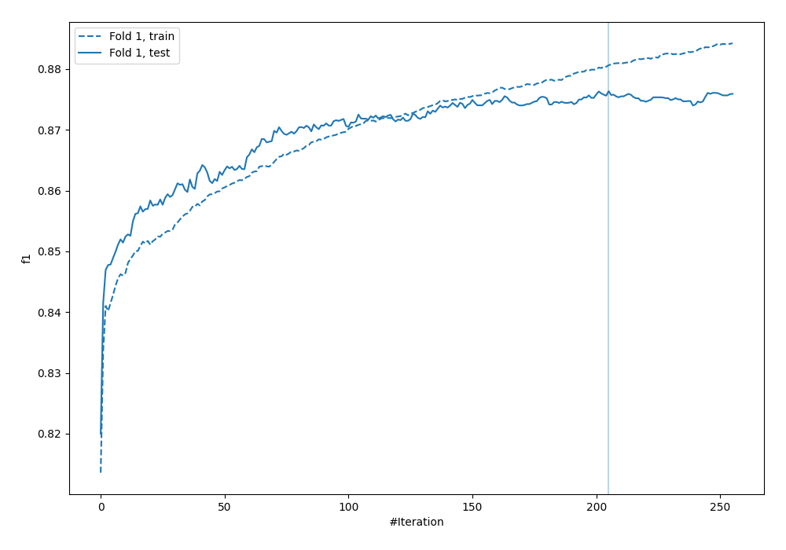
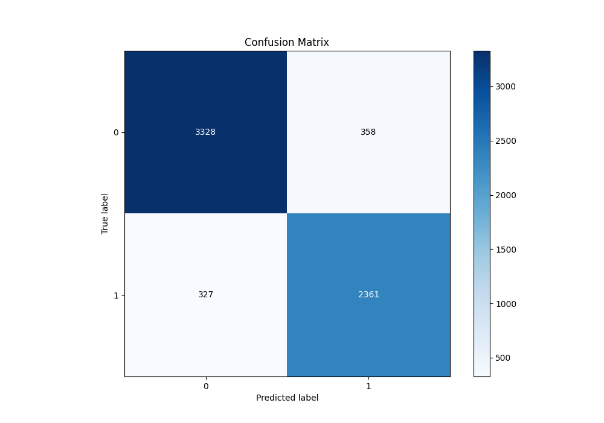
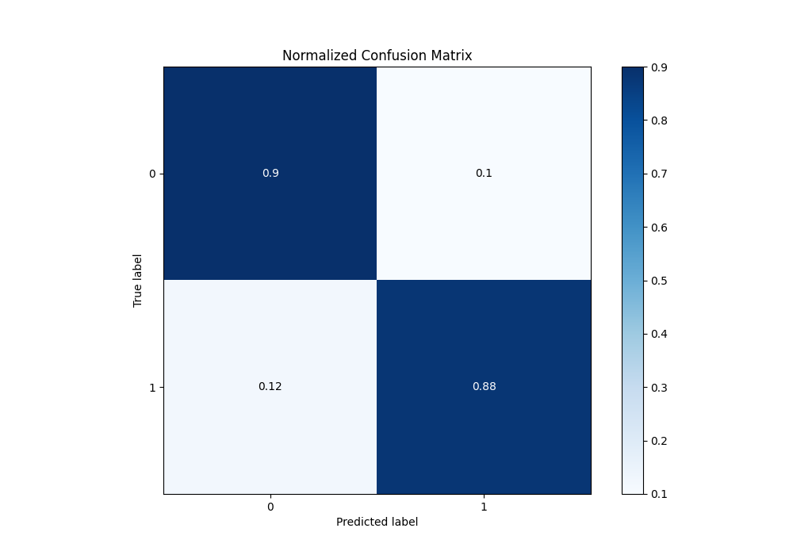
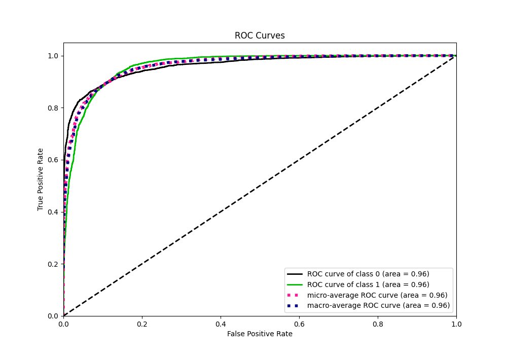
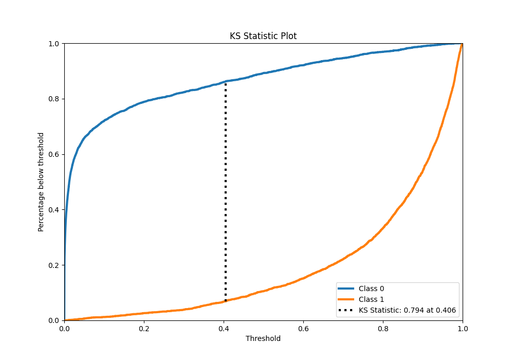
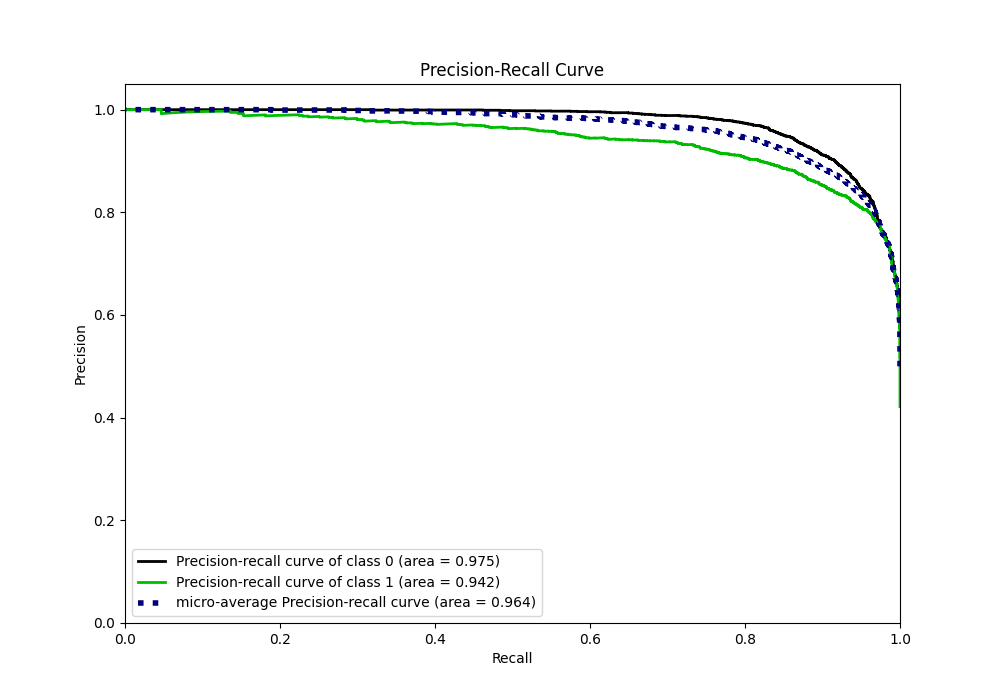
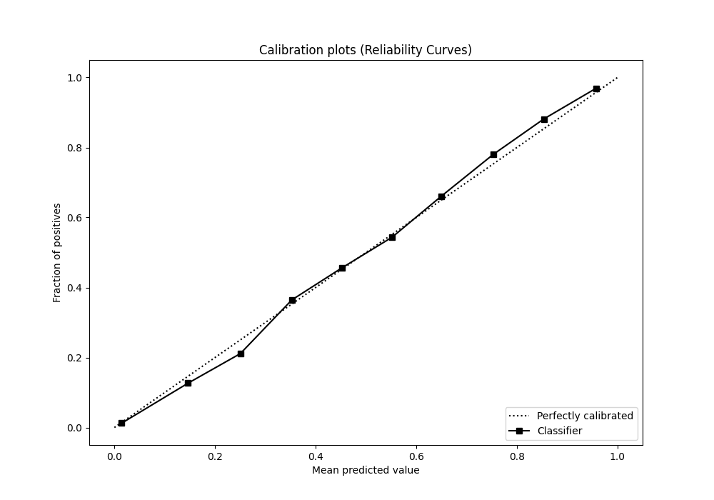
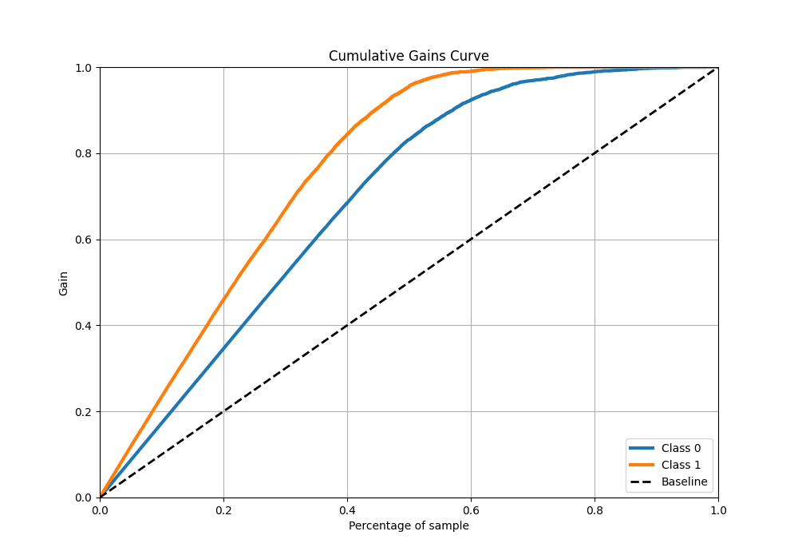
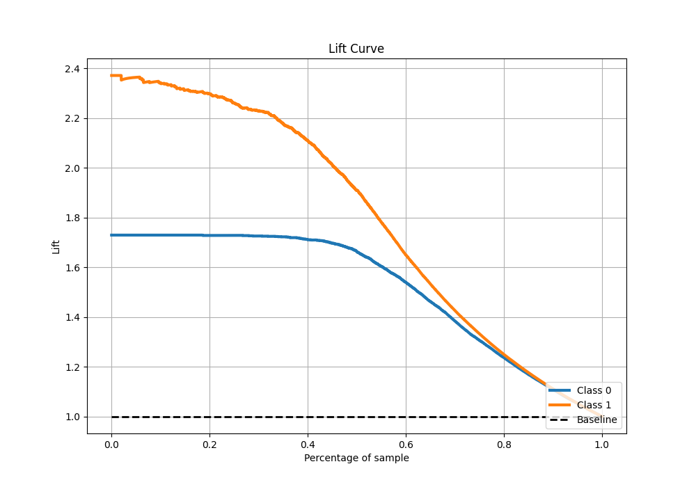

# Summary of 18_CatBoost_KMeansFeatures

[<< Go back](../README.md)

## CatBoost
- **n_jobs**: -1
- **learning_rate**: 0.1
- **depth**: 7
- **rsm**: 1.0
- **loss_function**: Logloss
- **eval_metric**: F1
- **explain_level**: 0

## Validation
 - **validation_type**: split
 - **train_ratio**: 0.9
 - **shuffle**: True
 - **stratify**: True

## Optimized metric
f1

## Training time

14.0 seconds

## Metric details
|           |    score |     threshold |
|:----------|---------:|--------------:|
| logloss   | 0.246485 | nan           |
| auc       | 0.961263 | nan           |
| f1        | 0.877665 |   0.396756    |
| accuracy  | 0.892532 |   0.5401      |
| precision | 0.996923 |   0.981152    |
| recall    | 1        |   5.88518e-06 |
| mcc       | 0.783395 |   0.396756    |

## Metric details with threshold from accuracy metric
|           |    score |   threshold |
|:----------|---------:|------------:|
| logloss   | 0.246485 |    nan      |
| auc       | 0.961263 |    nan      |
| f1        | 0.873312 |      0.5401 |
| accuracy  | 0.892532 |      0.5401 |
| precision | 0.868334 |      0.5401 |
| recall    | 0.878348 |      0.5401 |
| mcc       | 0.780045 |      0.5401 |

## Confusion matrix (at threshold=0.5401)
|              |   Predicted as 0 |   Predicted as 1 |
|:-------------|-----------------:|-----------------:|
| Labeled as 0 |             3328 |              358 |
| Labeled as 1 |              327 |             2361 |

## Learning curves

## Confusion Matrix

## Normalized Confusion Matrix

## ROC Curve

## Kolmogorov-Smirnov Statistic

## Precision-Recall Curve

## Calibration Curve

## Cumulative Gains Curve

## Lift Curve

[<< Go back](../README.md)
