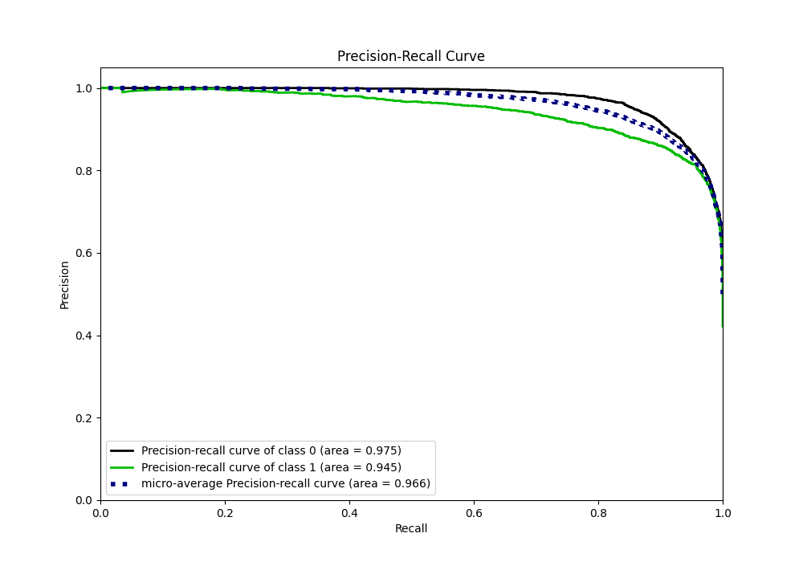
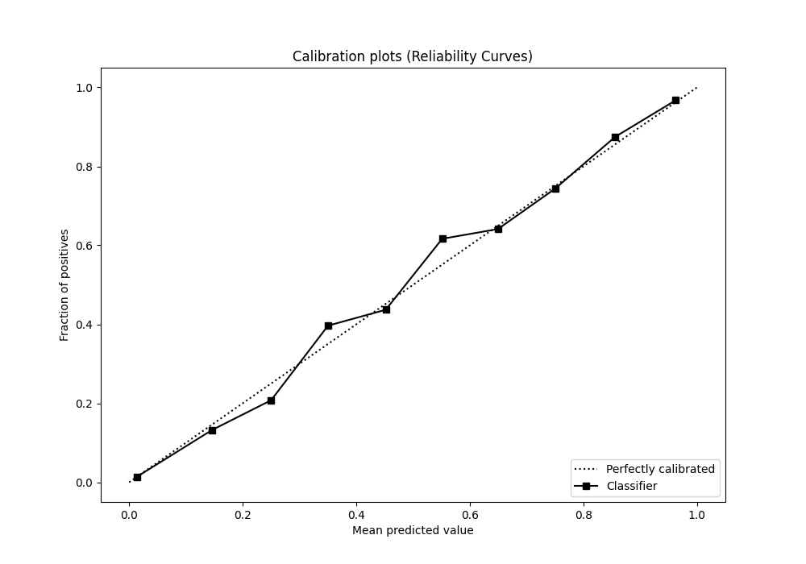

# Summary of 19_CatBoost_KMeansFeatures

[<< Go back](../README.md)

## CatBoost
- **n_jobs**: -1
- **learning_rate**: 0.2
- **depth**: 8
- **rsm**: 1.0
- **loss_function**: Logloss
- **eval_metric**: F1
- **explain_level**: 0

## Validation
 - **validation_type**: split
 - **train_ratio**: 0.9
 - **shuffle**: True
 - **stratify**: True

## Optimized metric
f1

## Training time

20.4 seconds

## Metric details
|           |    score |     threshold |
|:----------|---------:|--------------:|
| logloss   | 0.241267 | nan           |
| auc       | 0.962712 | nan           |
| f1        | 0.880986 |   0.457499    |
| accuracy  | 0.896611 |   0.487128    |
| precision | 0.998054 |   0.98088     |
| recall    | 1        |   1.35206e-06 |
| mcc       | 0.790682 |   0.487128    |

## Metric details with threshold from accuracy metric
|           |    score |   threshold |
|:----------|---------:|------------:|
| logloss   | 0.241267 |  nan        |
| auc       | 0.962712 |  nan        |
| f1        | 0.880896 |    0.487128 |
| accuracy  | 0.896611 |    0.487128 |
| precision | 0.856591 |    0.487128 |
| recall    | 0.906622 |    0.487128 |
| mcc       | 0.790682 |    0.487128 |

## Confusion matrix (at threshold=0.487128)
|              |   Predicted as 0 |   Predicted as 1 |
|:-------------|-----------------:|-----------------:|
| Labeled as 0 |             3278 |              408 |
| Labeled as 1 |              251 |             2437 |

## Learning curves

## Confusion Matrix

## Normalized Confusion Matrix

## ROC Curve

## Kolmogorov-Smirnov Statistic

## Precision-Recall Curve

## Calibration Curve

## Cumulative Gains Curve

## Lift Curve

[<< Go back](../README.md)
