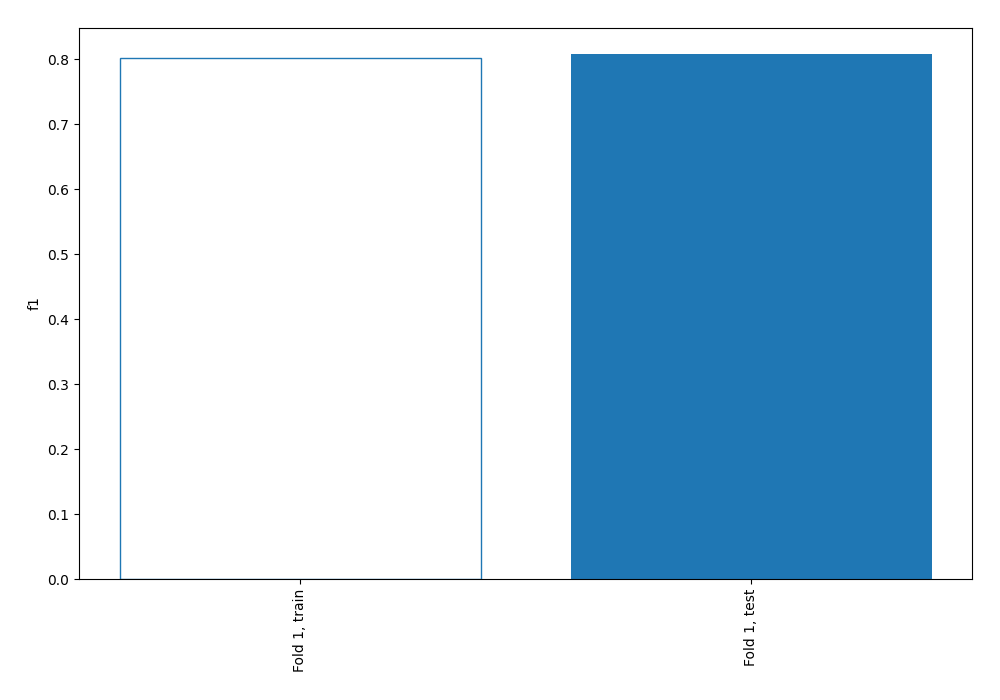
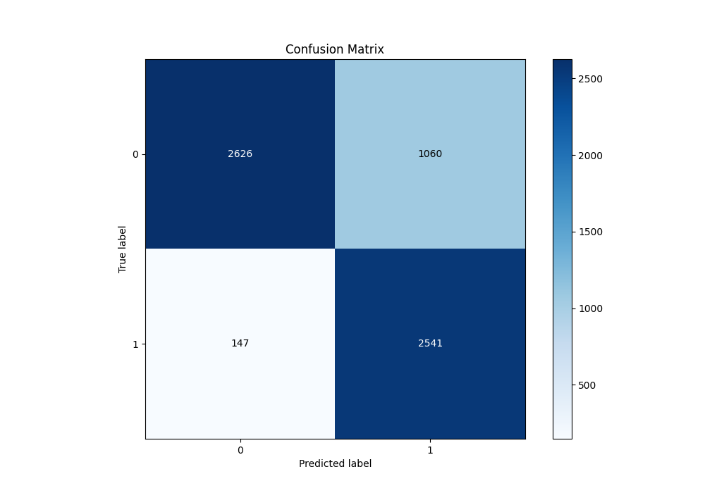
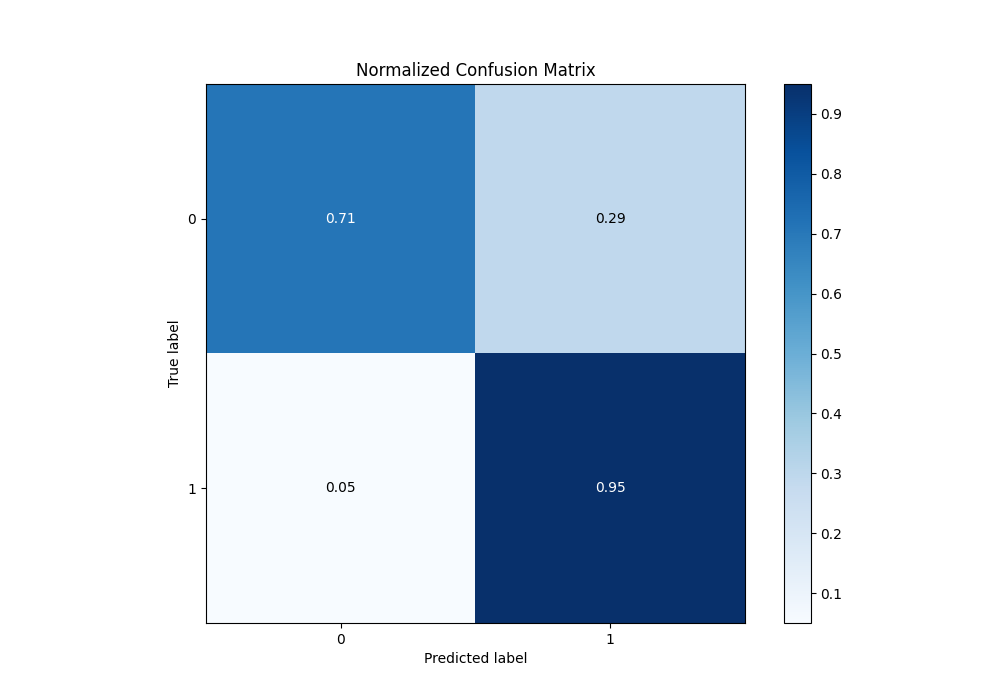
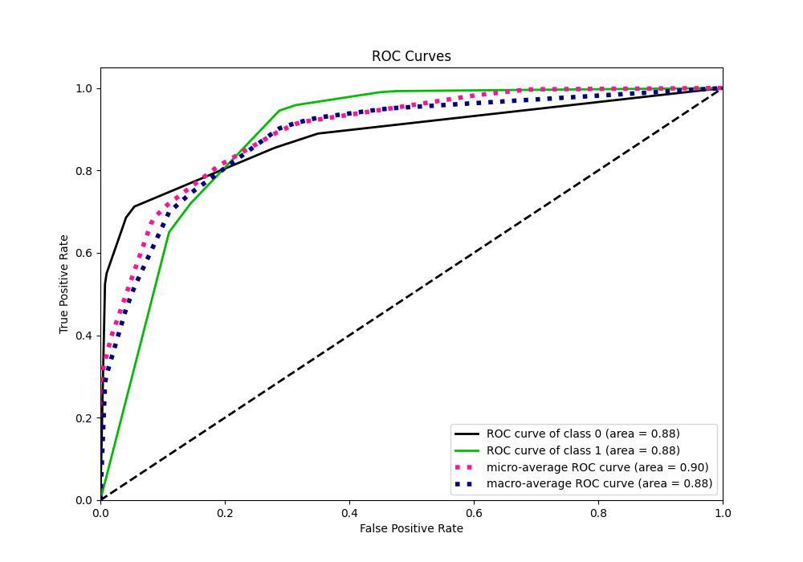
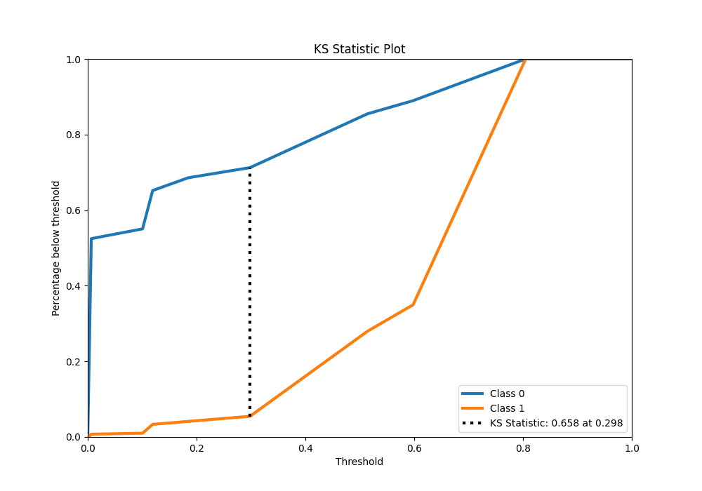
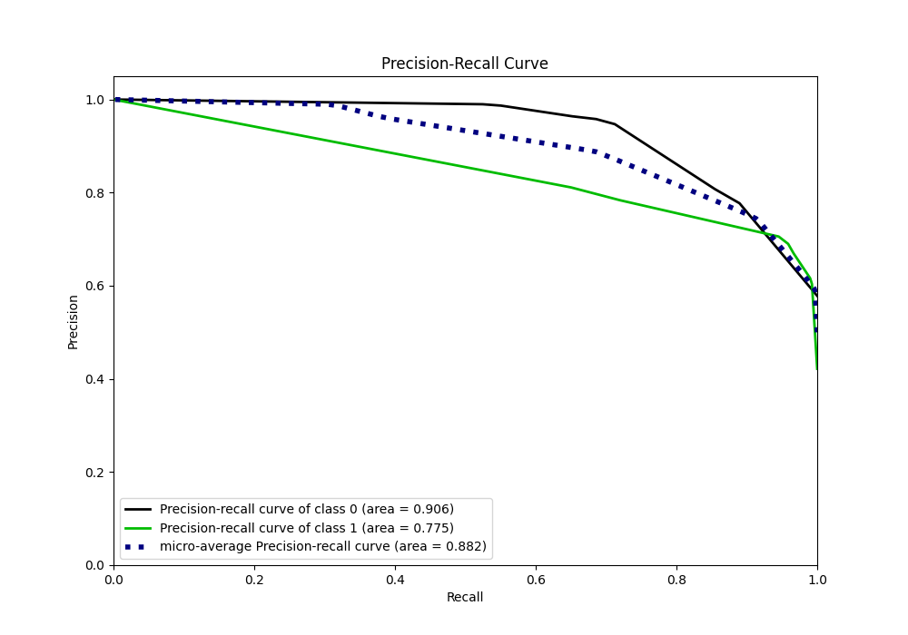
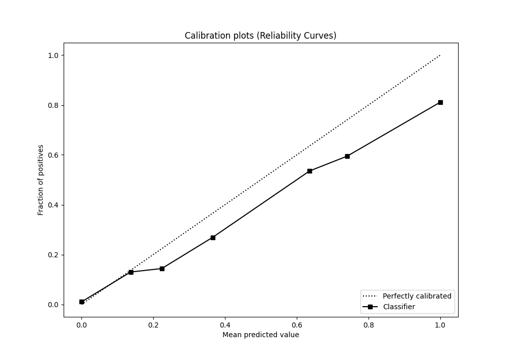
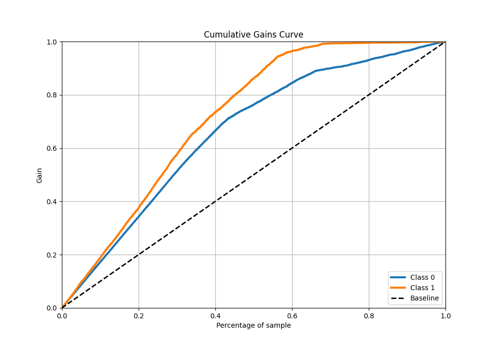
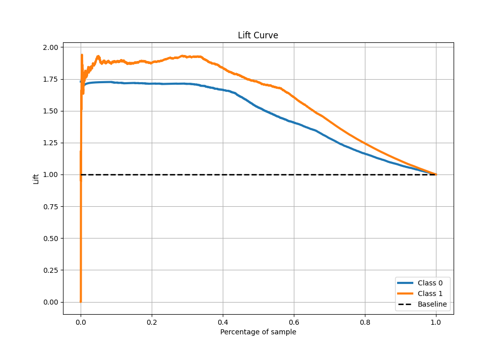

# Summary of 1_DecisionTree

[<< Go back](../README.md)

## Decision Tree
- **n_jobs**: -1
- **criterion**: gini
- **max_depth**: 3
- **explain_level**: 0

## Validation
 - **validation_type**: split
 - **train_ratio**: 0.9
 - **shuffle**: True
 - **stratify**: True

## Optimized metric
f1

## Training time

4.1 seconds

## Metric details
|           |    score |    threshold |
|:----------|---------:|-------------:|
| logloss   | 0.392128 | nan          |
| auc       | 0.883808 | nan          |
| f1        | 0.808078 |   0.298161   |
| accuracy  | 0.810637 |   0.298161   |
| precision | 0.811137 |   0.598013   |
| recall    | 1        |   0.00587886 |
| mcc       | 0.655177 |   0.298161   |

## Metric details with threshold from accuracy metric
|           |    score |   threshold |
|:----------|---------:|------------:|
| logloss   | 0.392128 |  nan        |
| auc       | 0.883808 |  nan        |
| f1        | 0.808078 |    0.298161 |
| accuracy  | 0.810637 |    0.298161 |
| precision | 0.705637 |    0.298161 |
| recall    | 0.945312 |    0.298161 |
| mcc       | 0.655177 |    0.298161 |

## Confusion matrix (at threshold=0.298161)
|              |   Predicted as 0 |   Predicted as 1 |
|:-------------|-----------------:|-----------------:|
| Labeled as 0 |             2626 |             1060 |
| Labeled as 1 |              147 |             2541 |

## Learning curves

## Confusion Matrix

## Normalized Confusion Matrix

## ROC Curve

## Kolmogorov-Smirnov Statistic

## Precision-Recall Curve

## Calibration Curve

## Cumulative Gains Curve

## Lift Curve

[<< Go back](../README.md)
