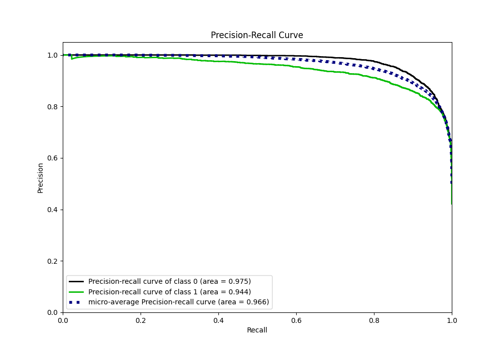
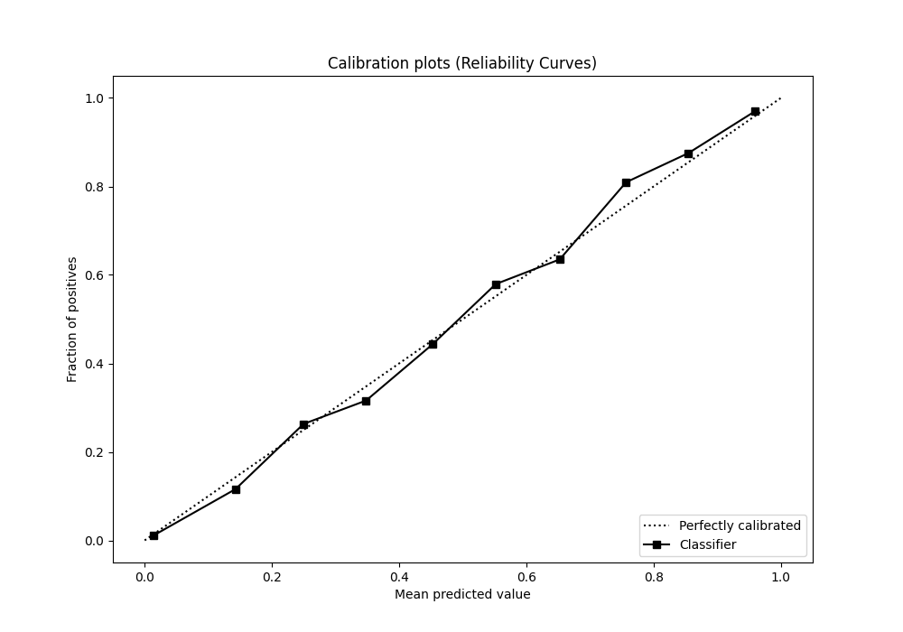

# Summary of 20_CatBoost

[<< Go back](../README.md)

## CatBoost
- **n_jobs**: -1
- **learning_rate**: 0.1
- **depth**: 6
- **rsm**: 0.7
- **loss_function**: Logloss
- **eval_metric**: F1
- **explain_level**: 0

## Validation
 - **validation_type**: split
 - **train_ratio**: 0.9
 - **shuffle**: True
 - **stratify**: True

## Optimized metric
f1

## Training time

11.7 seconds

## Metric details
|           |    score |     threshold |
|:----------|---------:|--------------:|
| logloss   | 0.242435 | nan           |
| auc       | 0.96266  | nan           |
| f1        | 0.880272 |   0.458096    |
| accuracy  | 0.89567  |   0.482303    |
| precision | 0.996923 |   0.983912    |
| recall    | 1        |   4.31764e-06 |
| mcc       | 0.788784 |   0.458096    |

## Metric details with threshold from accuracy metric
|           |    score |   threshold |
|:----------|---------:|------------:|
| logloss   | 0.242435 |  nan        |
| auc       | 0.96266  |  nan        |
| f1        | 0.879812 |    0.482303 |
| accuracy  | 0.89567  |    0.482303 |
| precision | 0.855536 |    0.482303 |
| recall    | 0.905506 |    0.482303 |
| mcc       | 0.788765 |    0.482303 |

## Confusion matrix (at threshold=0.482303)
|              |   Predicted as 0 |   Predicted as 1 |
|:-------------|-----------------:|-----------------:|
| Labeled as 0 |             3275 |              411 |
| Labeled as 1 |              254 |             2434 |

## Learning curves

## Confusion Matrix

## Normalized Confusion Matrix

## ROC Curve

## Kolmogorov-Smirnov Statistic

## Precision-Recall Curve

## Calibration Curve

## Cumulative Gains Curve

## Lift Curve

[<< Go back](../README.md)
