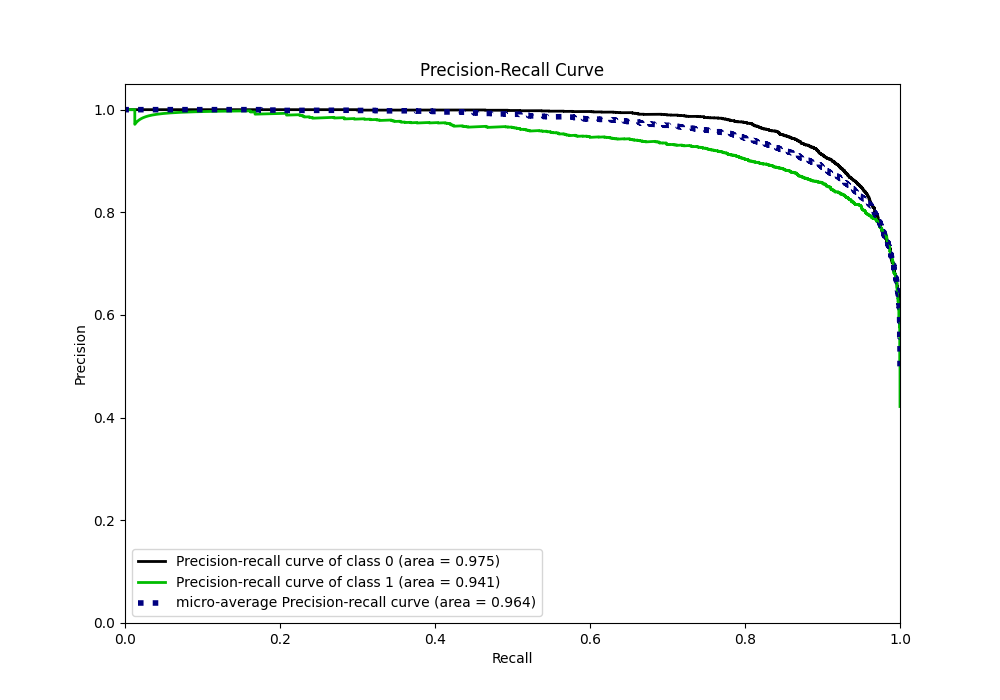
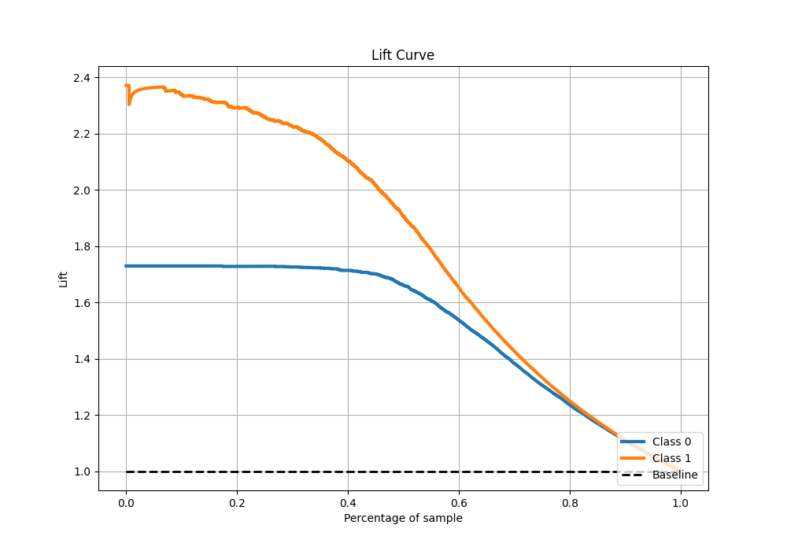

# Summary of 21_CatBoost

[<< Go back](../README.md)

## CatBoost
- **n_jobs**: -1
- **learning_rate**: 0.1
- **depth**: 4
- **rsm**: 0.7
- **loss_function**: Logloss
- **eval_metric**: F1
- **explain_level**: 0

## Validation
 - **validation_type**: split
 - **train_ratio**: 0.9
 - **shuffle**: True
 - **stratify**: True

## Optimized metric
f1

## Training time

10.4 seconds

## Metric details
|           |    score |     threshold |
|:----------|---------:|--------------:|
| logloss   | 0.246618 | nan           |
| auc       | 0.961213 | nan           |
| f1        | 0.878366 |   0.489371    |
| accuracy  | 0.894415 |   0.489371    |
| precision | 0.997423 |   0.980332    |
| recall    | 1        |   7.25246e-06 |
| mcc       | 0.786208 |   0.489371    |

## Metric details with threshold from accuracy metric
|           |    score |   threshold |
|:----------|---------:|------------:|
| logloss   | 0.246618 |  nan        |
| auc       | 0.961213 |  nan        |
| f1        | 0.878366 |    0.489371 |
| accuracy  | 0.894415 |    0.489371 |
| precision | 0.85413  |    0.489371 |
| recall    | 0.904018 |    0.489371 |
| mcc       | 0.786208 |    0.489371 |

## Confusion matrix (at threshold=0.489371)
|              |   Predicted as 0 |   Predicted as 1 |
|:-------------|-----------------:|-----------------:|
| Labeled as 0 |             3271 |              415 |
| Labeled as 1 |              258 |             2430 |

## Learning curves

## Confusion Matrix

## Normalized Confusion Matrix

## ROC Curve

## Kolmogorov-Smirnov Statistic

## Precision-Recall Curve

## Calibration Curve

## Cumulative Gains Curve

## Lift Curve

[<< Go back](../README.md)
