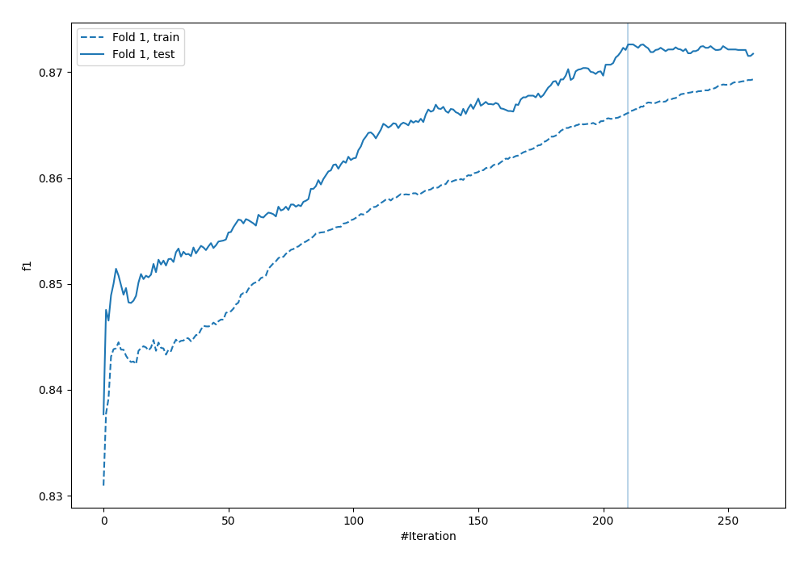
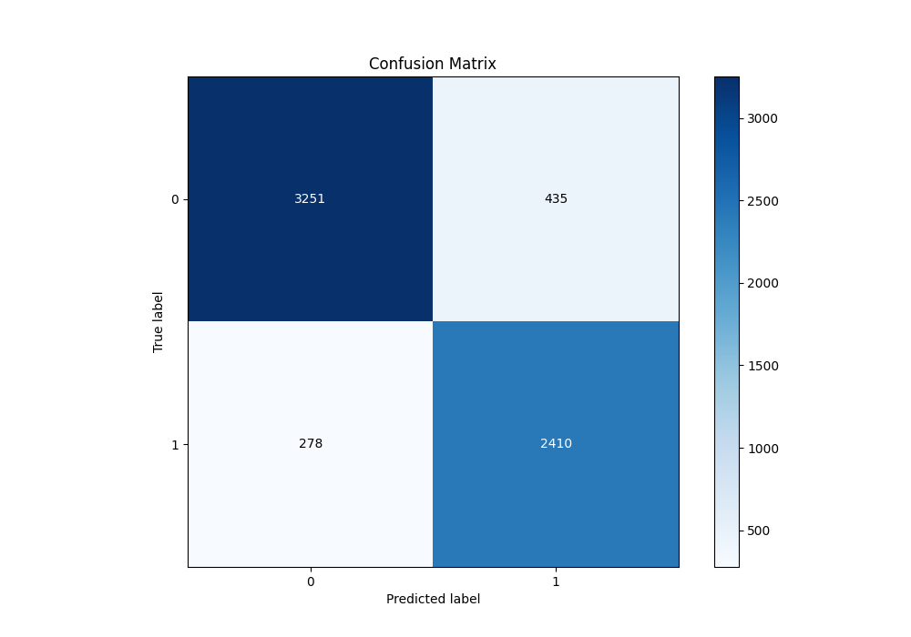
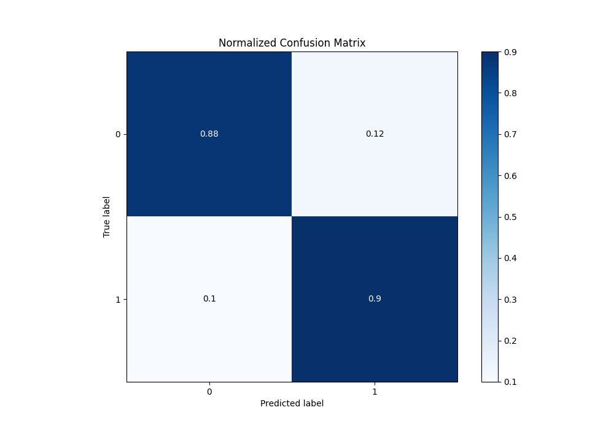
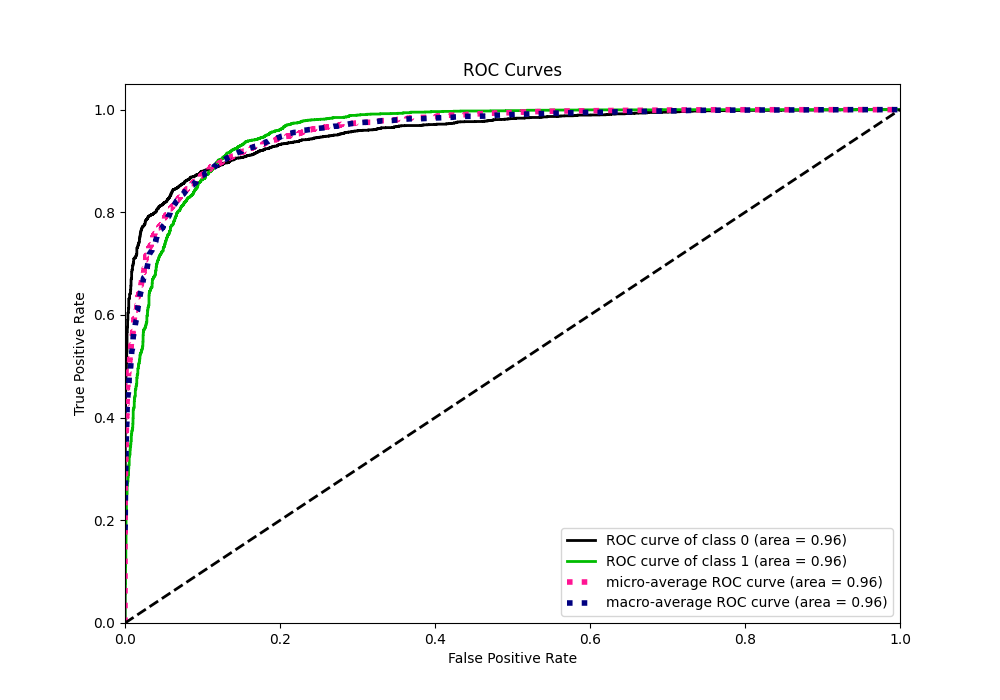
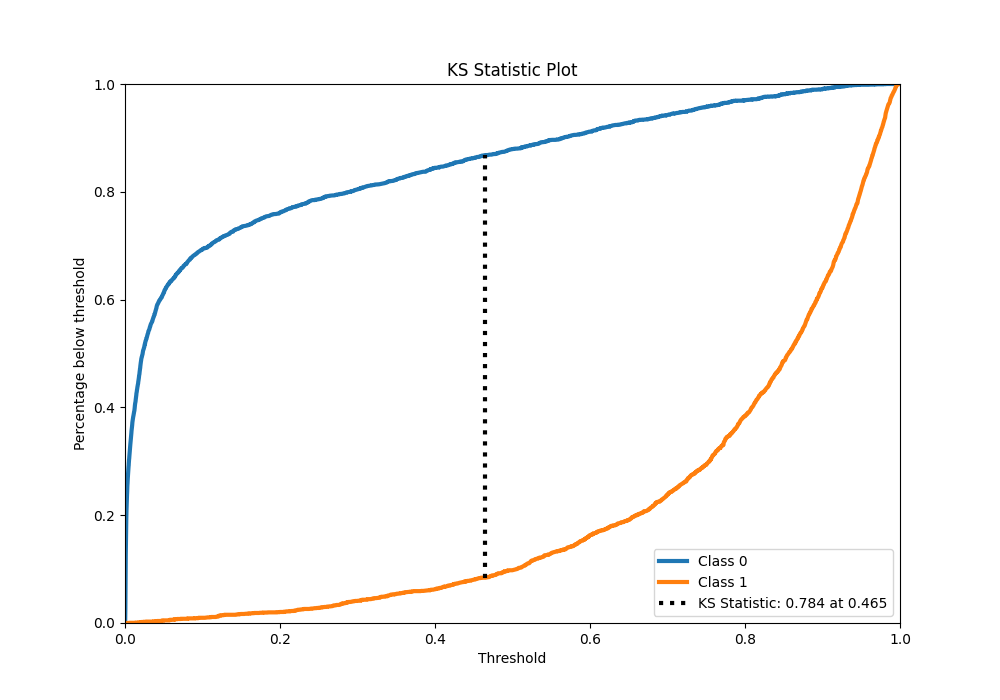
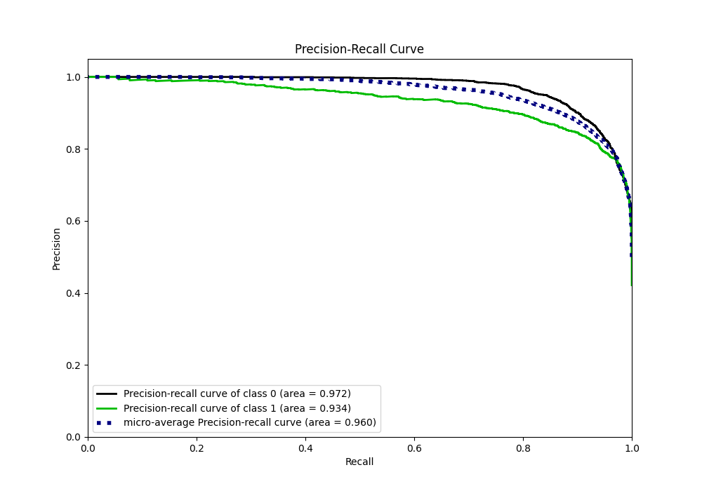
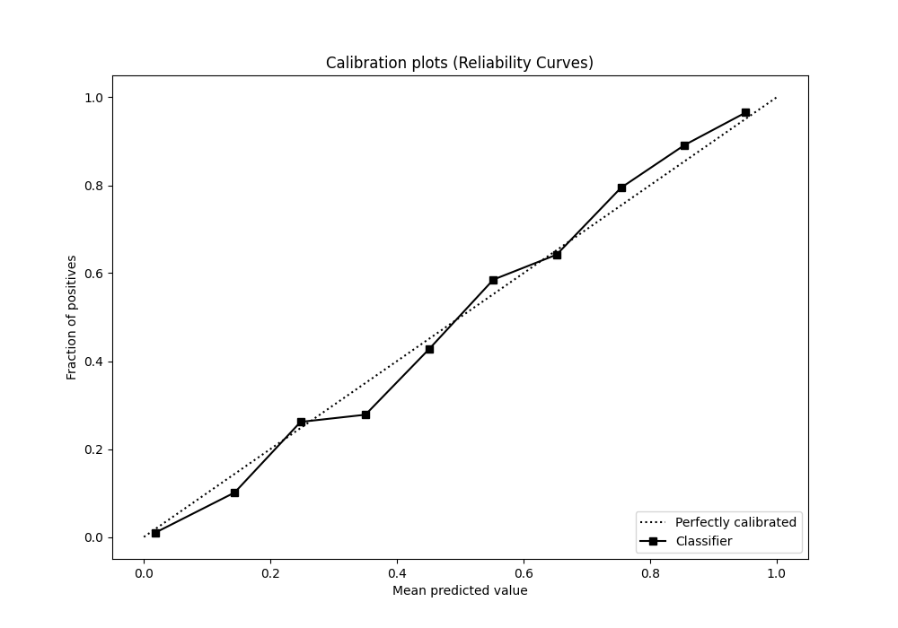
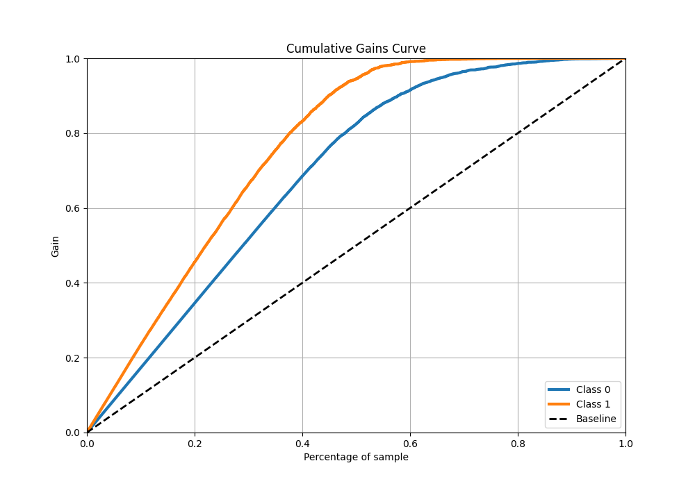
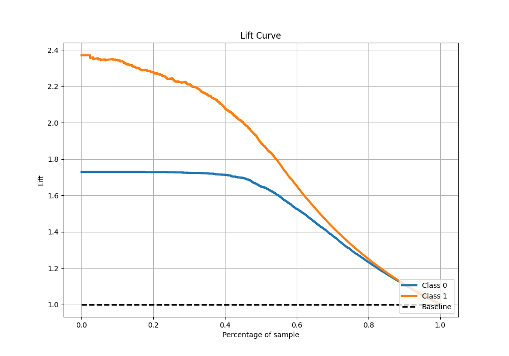

# Summary of 22_CatBoost

[<< Go back](../README.md)

## CatBoost
- **n_jobs**: -1
- **learning_rate**: 0.025
- **depth**: 8
- **rsm**: 1.0
- **loss_function**: Logloss
- **eval_metric**: F1
- **explain_level**: 0

## Validation
 - **validation_type**: split
 - **train_ratio**: 0.9
 - **shuffle**: True
 - **stratify**: True

## Optimized metric
f1

## Training time

15.2 seconds

## Metric details
|           |    score |    threshold |
|:----------|---------:|-------------:|
| logloss   | 0.261844 | nan          |
| auc       | 0.956663 | nan          |
| f1        | 0.872592 |   0.45315    |
| accuracy  | 0.888139 |   0.511592   |
| precision | 1        |   0.982383   |
| recall    | 1        |   0.00015789 |
| mcc       | 0.774467 |   0.45315    |

## Metric details with threshold from accuracy metric
|           |    score |   threshold |
|:----------|---------:|------------:|
| logloss   | 0.261844 |  nan        |
| auc       | 0.956663 |  nan        |
| f1        | 0.871137 |    0.511592 |
| accuracy  | 0.888139 |    0.511592 |
| precision | 0.8471   |    0.511592 |
| recall    | 0.896577 |    0.511592 |
| mcc       | 0.773427 |    0.511592 |

## Confusion matrix (at threshold=0.511592)
|              |   Predicted as 0 |   Predicted as 1 |
|:-------------|-----------------:|-----------------:|
| Labeled as 0 |             3251 |              435 |
| Labeled as 1 |              278 |             2410 |

## Learning curves

## Confusion Matrix

## Normalized Confusion Matrix

## ROC Curve

## Kolmogorov-Smirnov Statistic

## Precision-Recall Curve

## Calibration Curve

## Cumulative Gains Curve

## Lift Curve

[<< Go back](../README.md)
