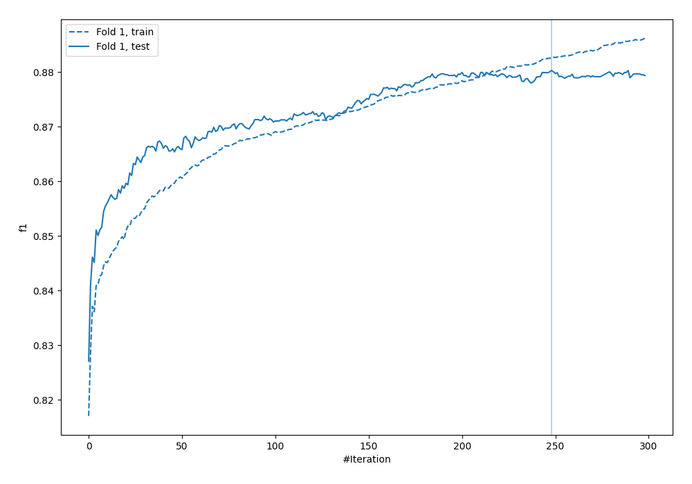
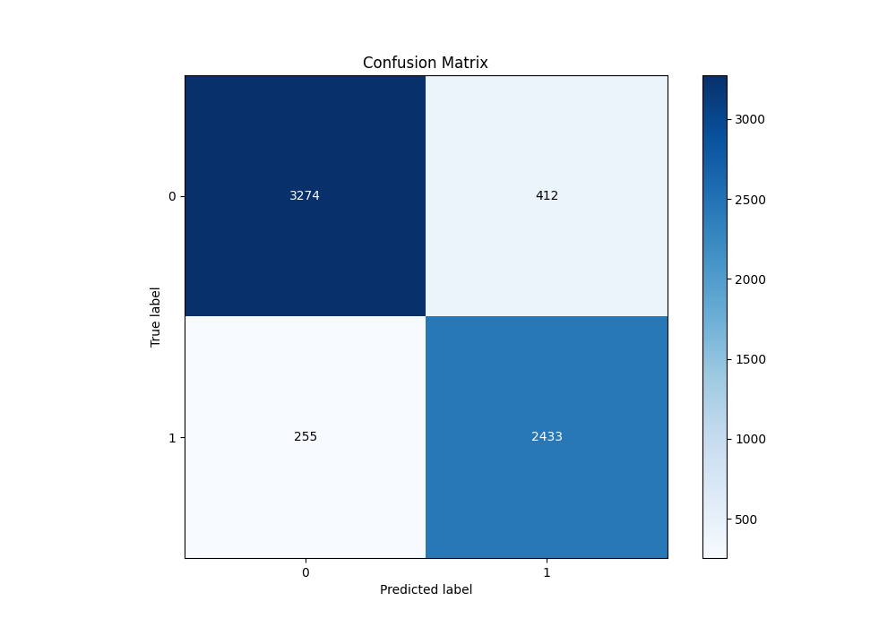
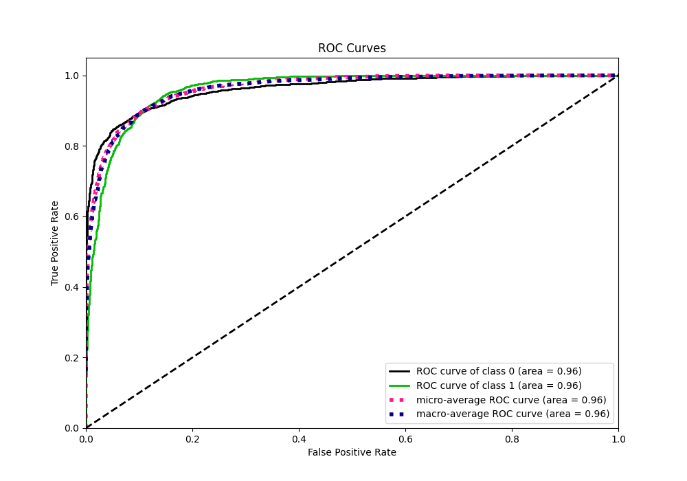
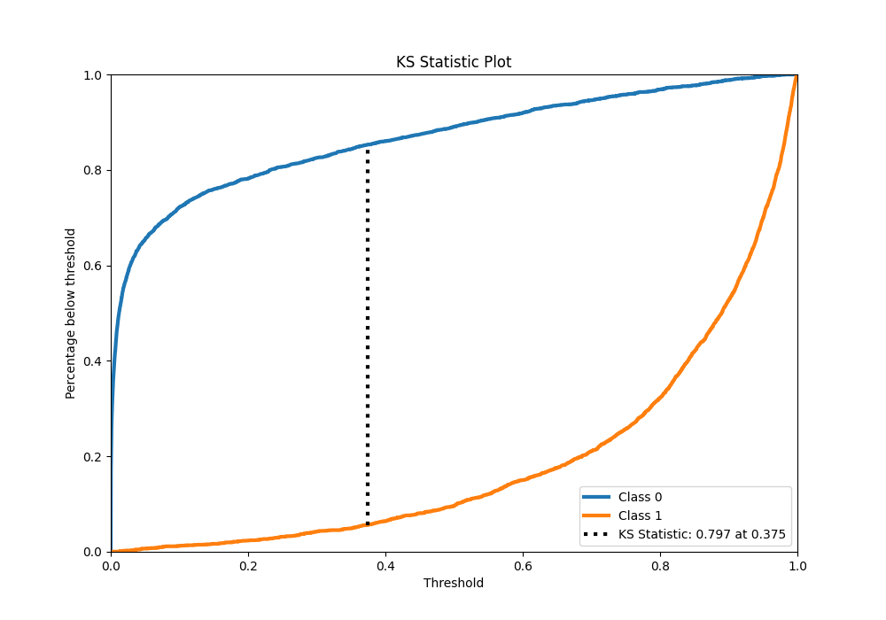
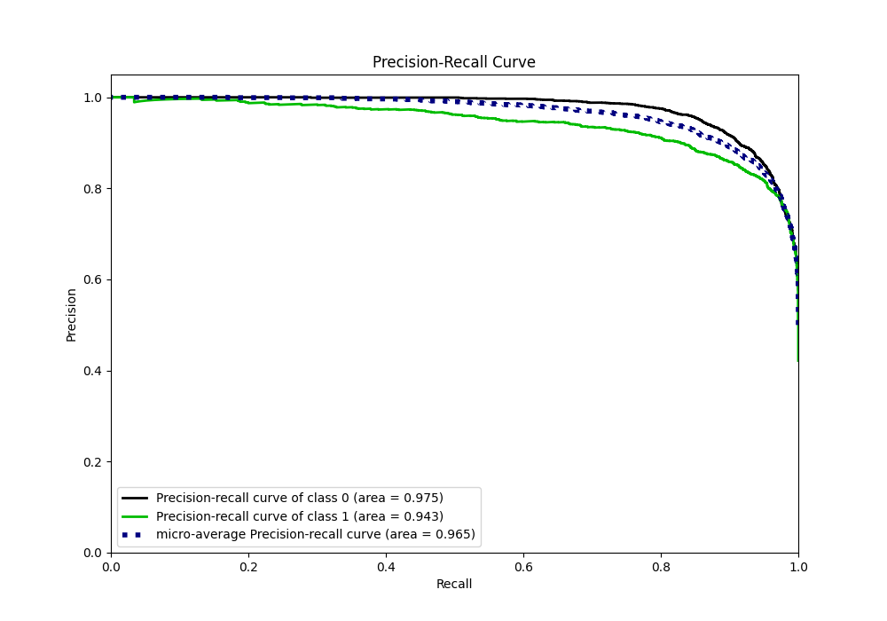
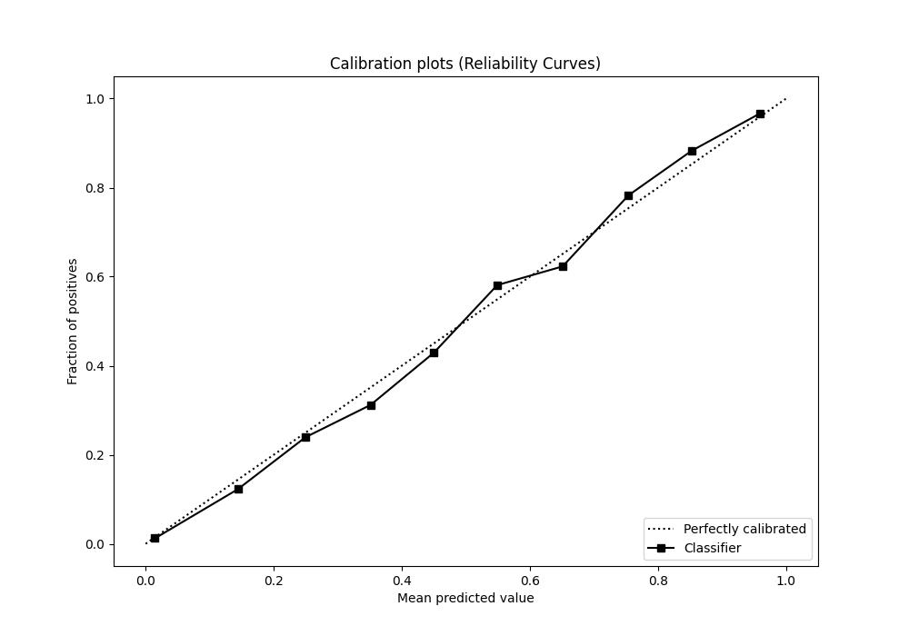
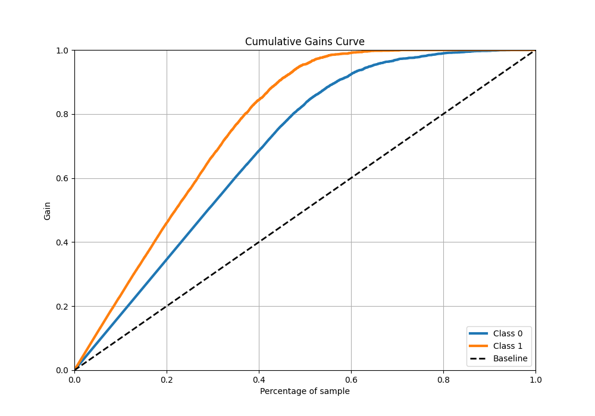
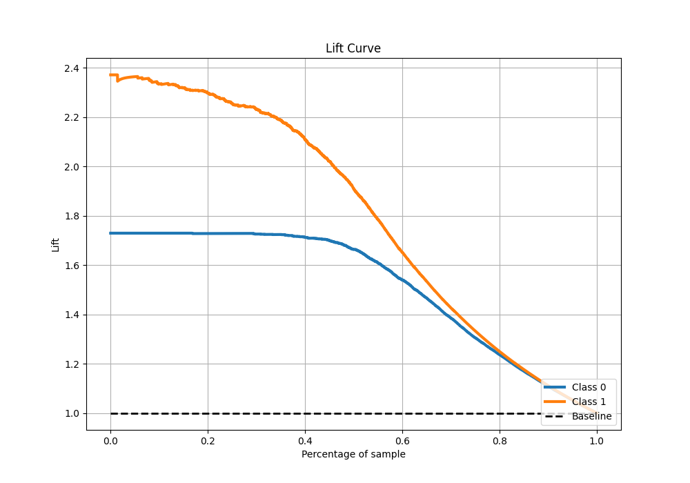

# Summary of 23_CatBoost

[<< Go back](../README.md)

## CatBoost
- **n_jobs**: -1
- **learning_rate**: 0.1
- **depth**: 7
- **rsm**: 0.8
- **loss_function**: Logloss
- **eval_metric**: F1
- **explain_level**: 0

## Validation
 - **validation_type**: split
 - **train_ratio**: 0.9
 - **shuffle**: True
 - **stratify**: True

## Optimized metric
f1

## Training time

13.2 seconds

## Metric details
|           |    score |     threshold |
|:----------|---------:|--------------:|
| logloss   | 0.243814 | nan           |
| auc       | 0.96205  | nan           |
| f1        | 0.879557 |   0.464918    |
| accuracy  | 0.895356 |   0.495364    |
| precision | 0.996923 |   0.983607    |
| recall    | 1        |   5.69061e-06 |
| mcc       | 0.788126 |   0.495364    |

## Metric details with threshold from accuracy metric
|           |    score |   threshold |
|:----------|---------:|------------:|
| logloss   | 0.243814 |  nan        |
| auc       | 0.96205  |  nan        |
| f1        | 0.879451 |    0.495364 |
| accuracy  | 0.895356 |    0.495364 |
| precision | 0.855185 |    0.495364 |
| recall    | 0.905134 |    0.495364 |
| mcc       | 0.788126 |    0.495364 |

## Confusion matrix (at threshold=0.495364)
|              |   Predicted as 0 |   Predicted as 1 |
|:-------------|-----------------:|-----------------:|
| Labeled as 0 |             3274 |              412 |
| Labeled as 1 |              255 |             2433 |

## Learning curves

## Confusion Matrix

## Normalized Confusion Matrix

## ROC Curve

## Kolmogorov-Smirnov Statistic

## Precision-Recall Curve

## Calibration Curve

## Cumulative Gains Curve

## Lift Curve

[<< Go back](../README.md)
