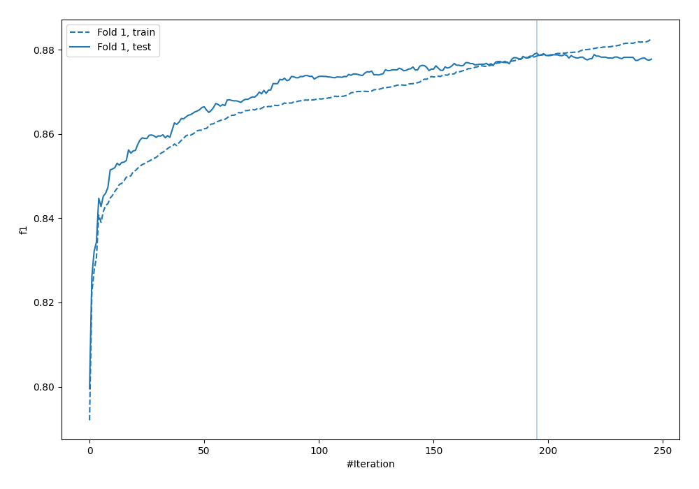
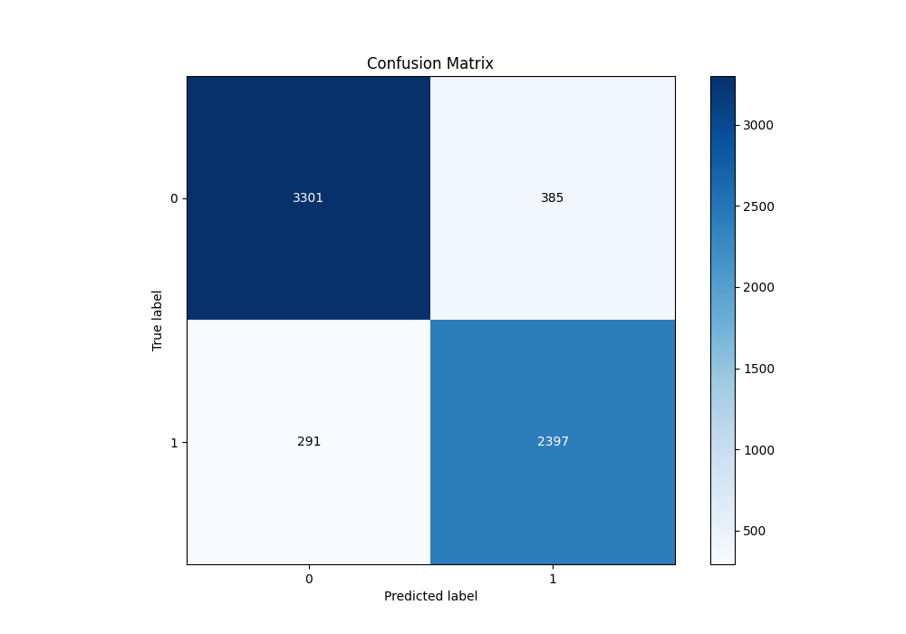
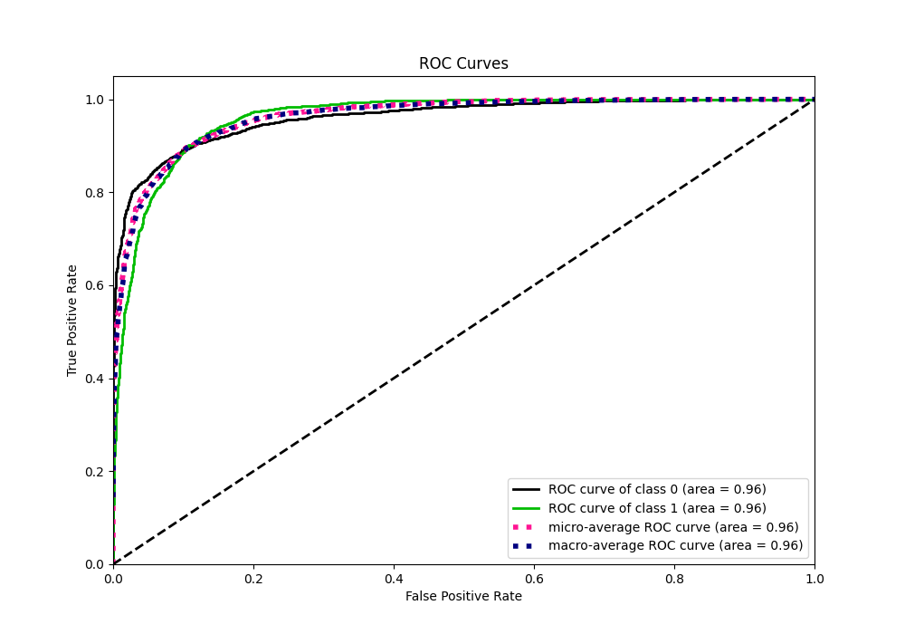
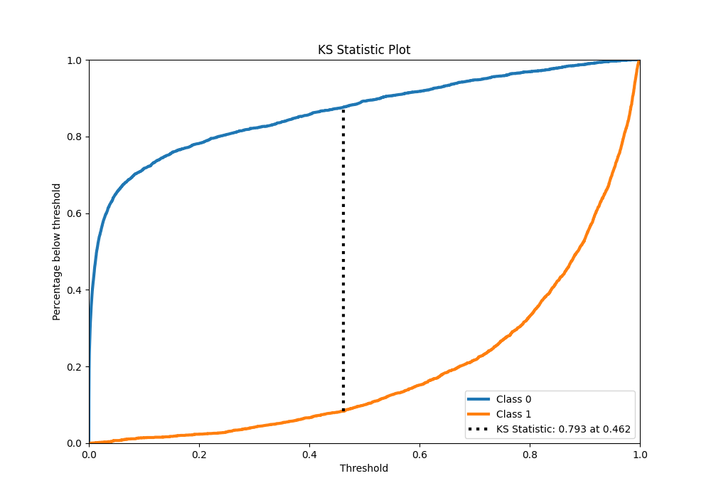
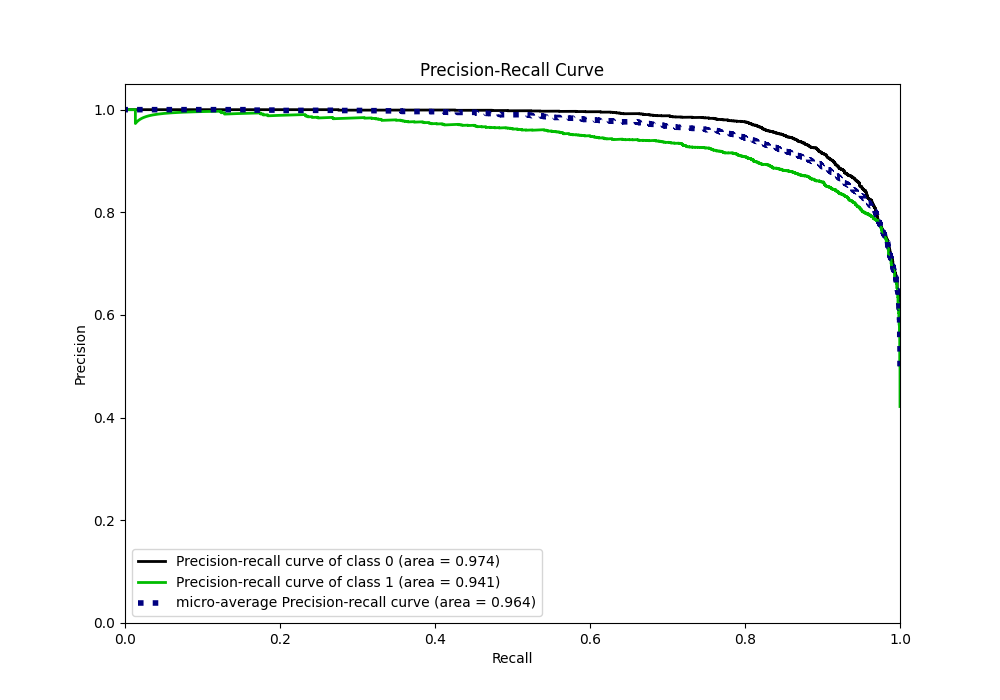
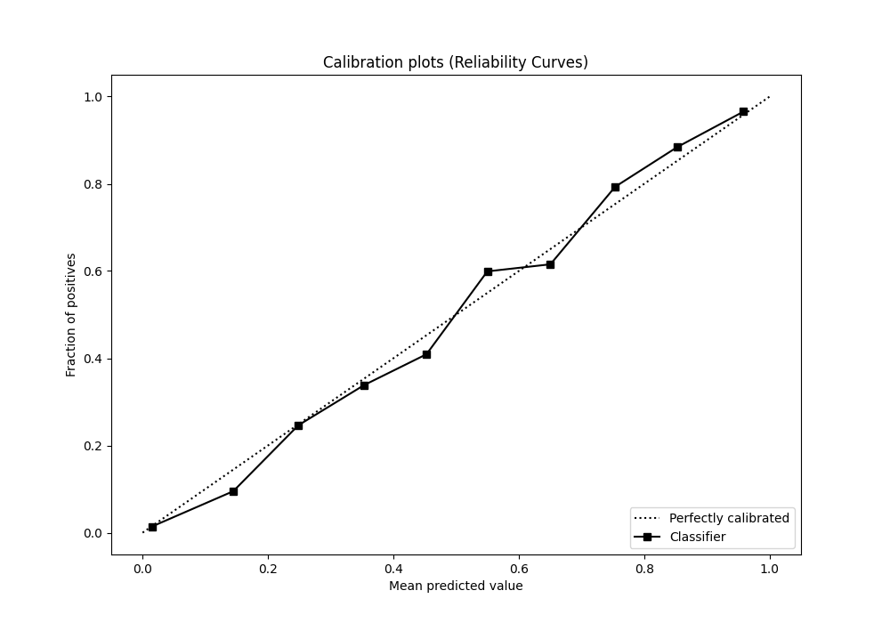
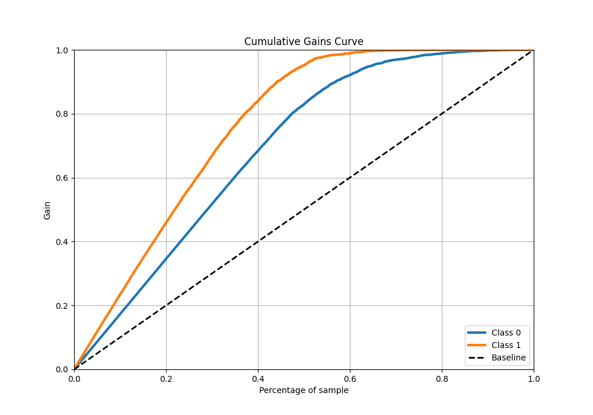
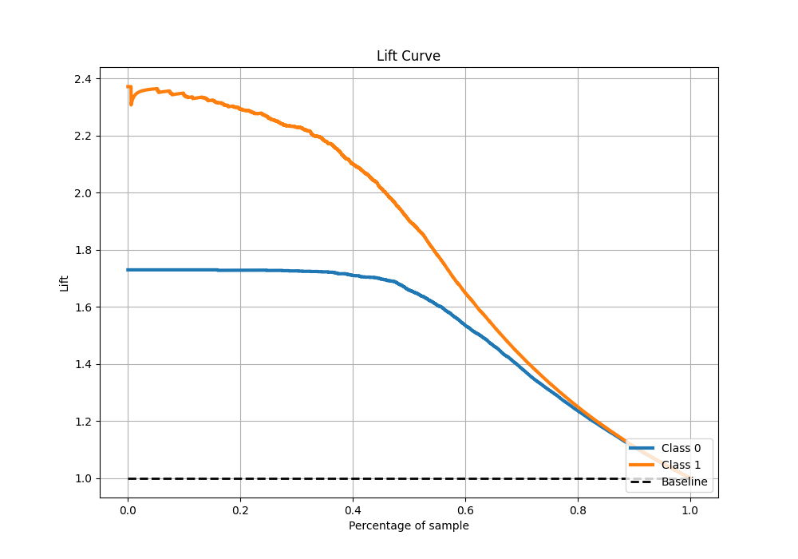

# Summary of 23_CatBoost_KMeansFeatures_RandomFeature

[<< Go back](../README.md)

## CatBoost
- **n_jobs**: -1
- **learning_rate**: 0.1
- **depth**: 7
- **rsm**: 0.8
- **loss_function**: Logloss
- **eval_metric**: F1
- **explain_level**: 1

## Validation
 - **validation_type**: split
 - **train_ratio**: 0.9
 - **shuffle**: True
 - **stratify**: True

## Optimized metric
f1

## Training time

13.7 seconds

## Metric details
|           |    score |     threshold |
|:----------|---------:|--------------:|
| logloss   | 0.24721  | nan           |
| auc       | 0.96114  | nan           |
| f1        | 0.878127 |   0.465967    |
| accuracy  | 0.893944 |   0.516326    |
| precision | 0.996923 |   0.984149    |
| recall    | 1        |   7.78587e-06 |
| mcc       | 0.784957 |   0.465967    |

## Metric details with threshold from accuracy metric
|           |    score |   threshold |
|:----------|---------:|------------:|
| logloss   | 0.24721  |  nan        |
| auc       | 0.96114  |  nan        |
| f1        | 0.876417 |    0.516326 |
| accuracy  | 0.893944 |    0.516326 |
| precision | 0.86161  |    0.516326 |
| recall    | 0.891741 |    0.516326 |
| mcc       | 0.783937 |    0.516326 |

## Confusion matrix (at threshold=0.516326)
|              |   Predicted as 0 |   Predicted as 1 |
|:-------------|-----------------:|-----------------:|
| Labeled as 0 |             3301 |              385 |
| Labeled as 1 |              291 |             2397 |

## Learning curves

## Confusion Matrix

## Normalized Confusion Matrix

## ROC Curve

## Kolmogorov-Smirnov Statistic

## Precision-Recall Curve

## Calibration Curve

## Cumulative Gains Curve

## Lift Curve

[<< Go back](../README.md)
