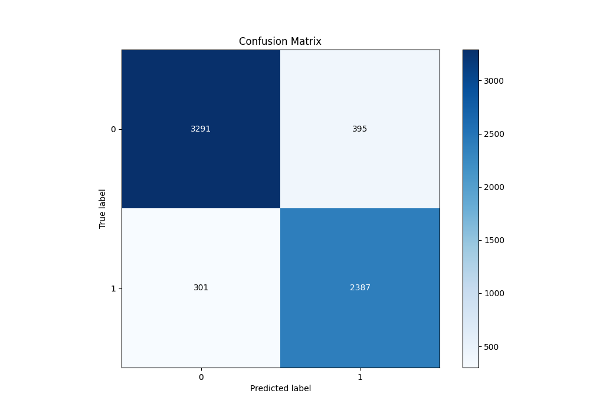

# Summary of 24_CatBoost

[<< Go back](../README.md)

## CatBoost
- **n_jobs**: -1
- **learning_rate**: 0.025
- **depth**: 7
- **rsm**: 0.7
- **loss_function**: Logloss
- **eval_metric**: F1
- **explain_level**: 0

## Validation
 - **validation_type**: split
 - **train_ratio**: 0.9
 - **shuffle**: True
 - **stratify**: True

## Optimized metric
f1

## Training time

17.6 seconds

## Metric details
|           |    score |     threshold |
|:----------|---------:|--------------:|
| logloss   | 0.254114 | nan           |
| auc       | 0.959157 | nan           |
| f1        | 0.875918 |   0.402664    |
| accuracy  | 0.890806 |   0.514941    |
| precision | 0.996923 |   0.975351    |
| recall    | 1        |   5.58625e-05 |
| mcc       | 0.780215 |   0.402664    |

## Metric details with threshold from accuracy metric
|           |    score |   threshold |
|:----------|---------:|------------:|
| logloss   | 0.254114 |  nan        |
| auc       | 0.959157 |  nan        |
| f1        | 0.872761 |    0.514941 |
| accuracy  | 0.890806 |    0.514941 |
| precision | 0.858016 |    0.514941 |
| recall    | 0.888021 |    0.514941 |
| mcc       | 0.777531 |    0.514941 |

## Confusion matrix (at threshold=0.514941)
|              |   Predicted as 0 |   Predicted as 1 |
|:-------------|-----------------:|-----------------:|
| Labeled as 0 |             3291 |              395 |
| Labeled as 1 |              301 |             2387 |

## Learning curves

## Confusion Matrix

## Normalized Confusion Matrix

## ROC Curve

## Kolmogorov-Smirnov Statistic

## Precision-Recall Curve

## Calibration Curve

## Cumulative Gains Curve

## Lift Curve

[<< Go back](../README.md)
