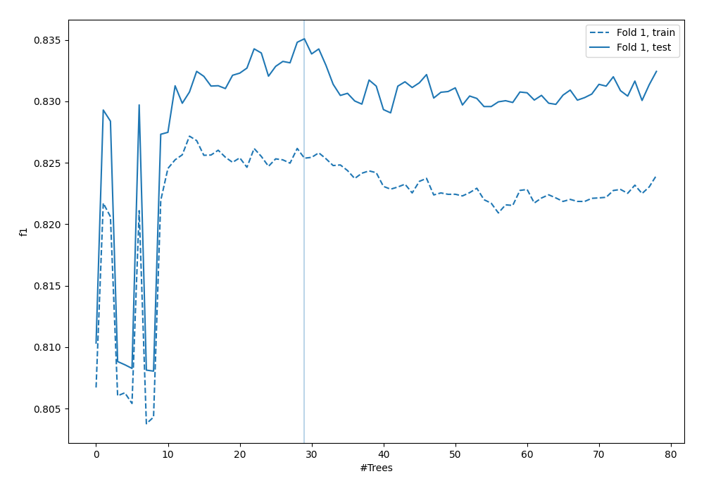
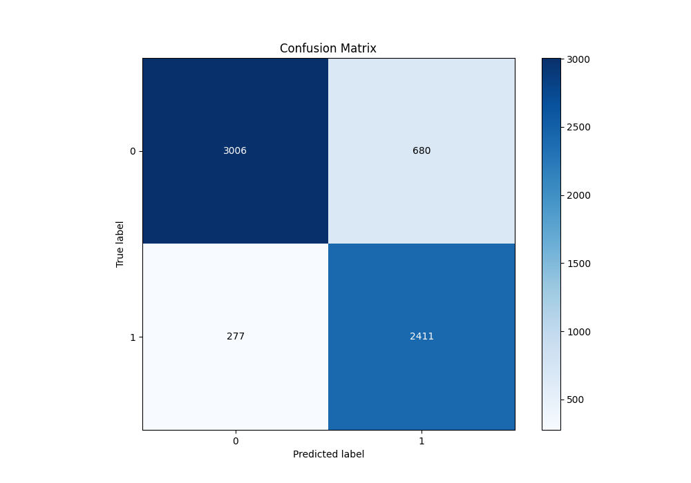
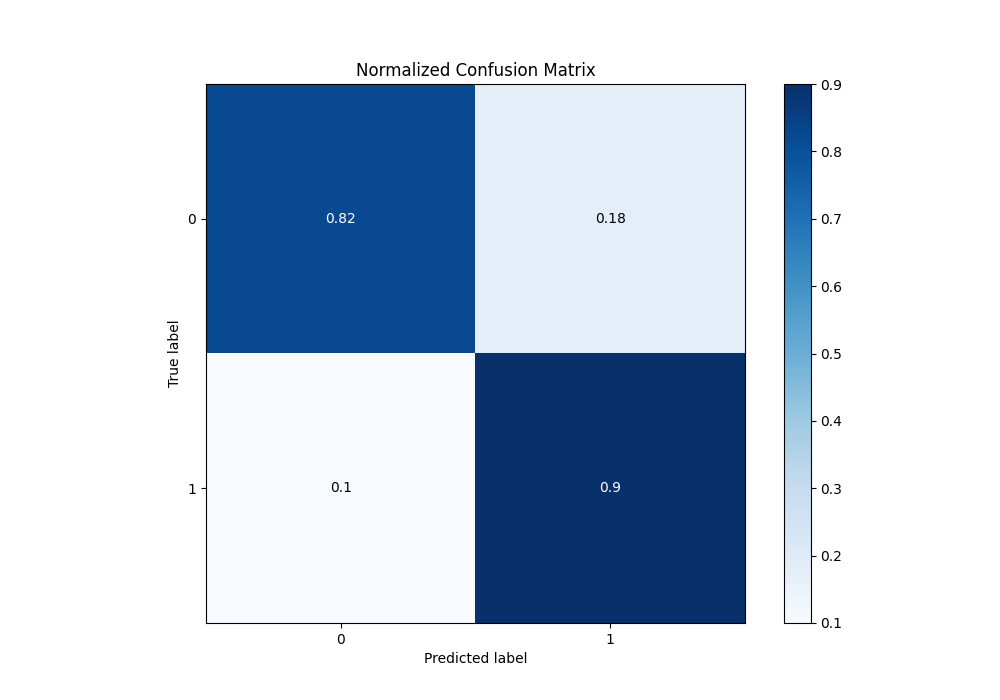
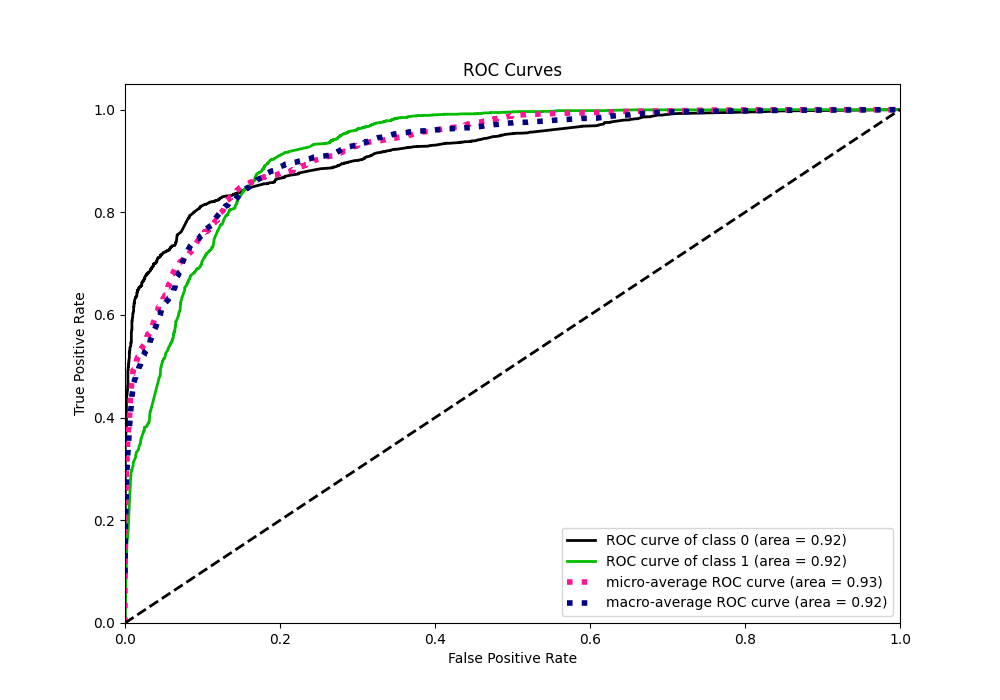
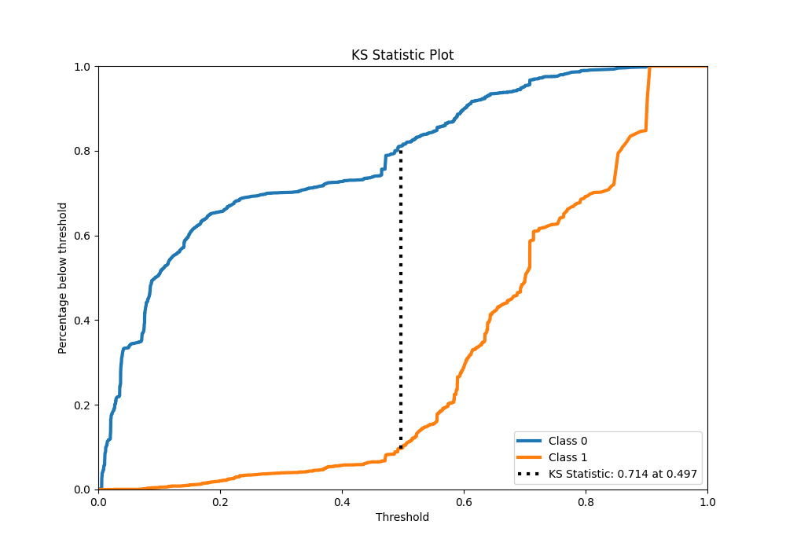
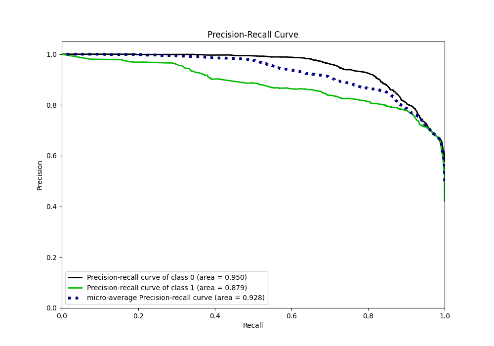
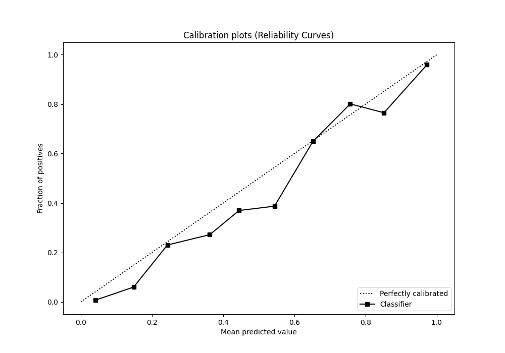
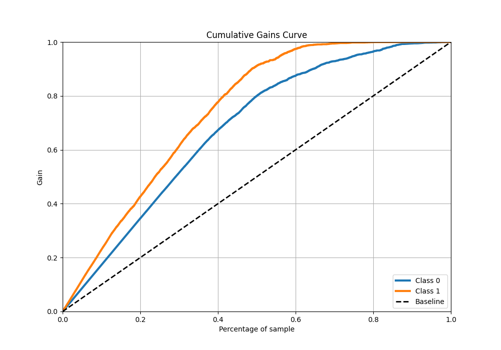
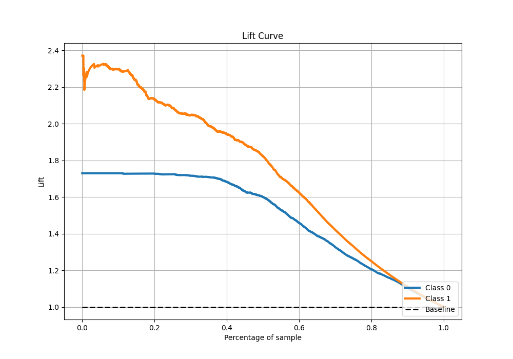

# Summary of 25_RandomForest

[<< Go back](../README.md)

## Random Forest
- **n_jobs**: -1
- **criterion**: gini
- **max_features**: 0.5
- **min_samples_split**: 20
- **max_depth**: 4
- **eval_metric_name**: f1
- **explain_level**: 0

## Validation
 - **validation_type**: split
 - **train_ratio**: 0.9
 - **shuffle**: True
 - **stratify**: True

## Optimized metric
f1

## Training time

18.5 seconds

## Metric details
|           |    score |   threshold |
|:----------|---------:|------------:|
| logloss   | 0.361178 | nan         |
| auc       | 0.92211  | nan         |
| f1        | 0.8344   |   0.500414  |
| accuracy  | 0.849859 |   0.500414  |
| precision | 0.980392 |   0.901457  |
| recall    | 1        |   0.0047191 |
| mcc       | 0.704    |   0.500414  |

## Metric details with threshold from accuracy metric
|           |    score |   threshold |
|:----------|---------:|------------:|
| logloss   | 0.361178 |  nan        |
| auc       | 0.92211  |  nan        |
| f1        | 0.8344   |    0.500414 |
| accuracy  | 0.849859 |    0.500414 |
| precision | 0.780006 |    0.500414 |
| recall    | 0.896949 |    0.500414 |
| mcc       | 0.704    |    0.500414 |

## Confusion matrix (at threshold=0.500414)
|              |   Predicted as 0 |   Predicted as 1 |
|:-------------|-----------------:|-----------------:|
| Labeled as 0 |             3006 |              680 |
| Labeled as 1 |              277 |             2411 |

## Learning curves

## Confusion Matrix

## Normalized Confusion Matrix

## ROC Curve

## Kolmogorov-Smirnov Statistic

## Precision-Recall Curve

## Calibration Curve

## Cumulative Gains Curve

## Lift Curve

[<< Go back](../README.md)
