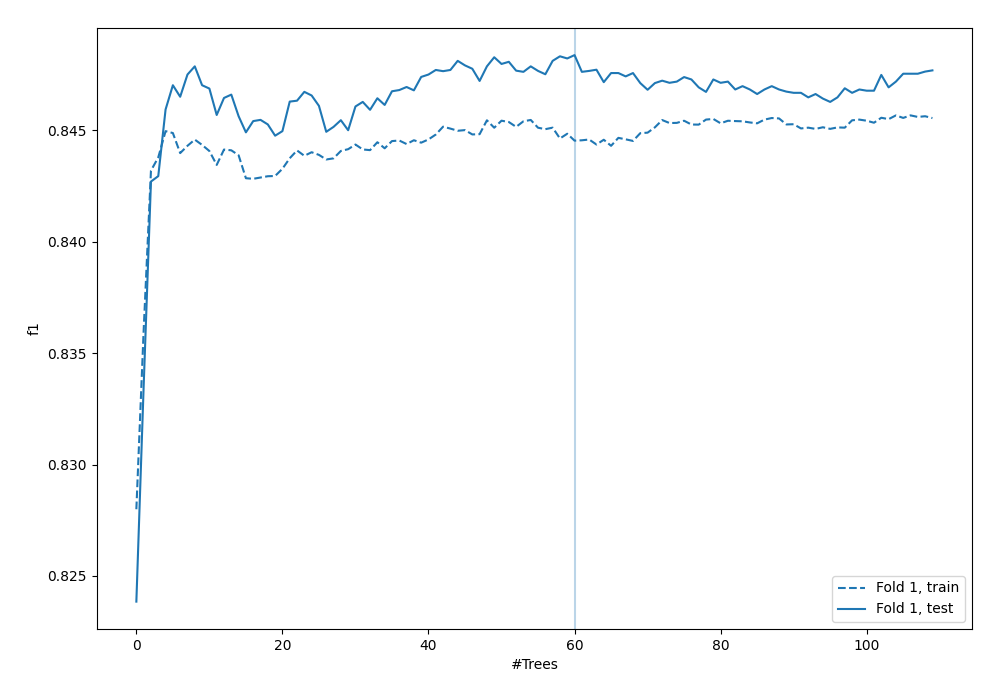
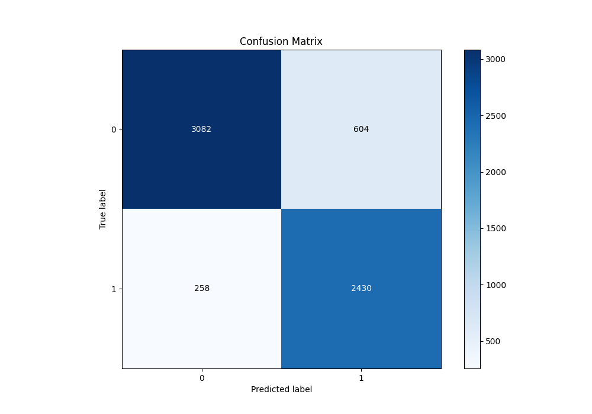
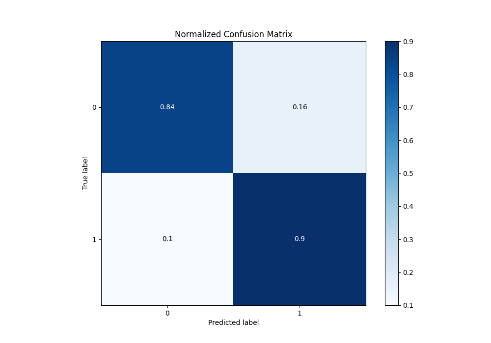
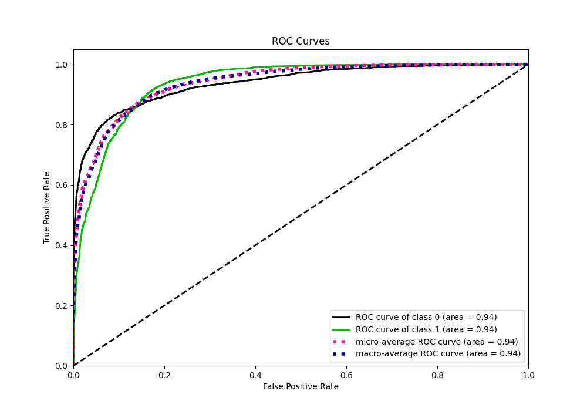
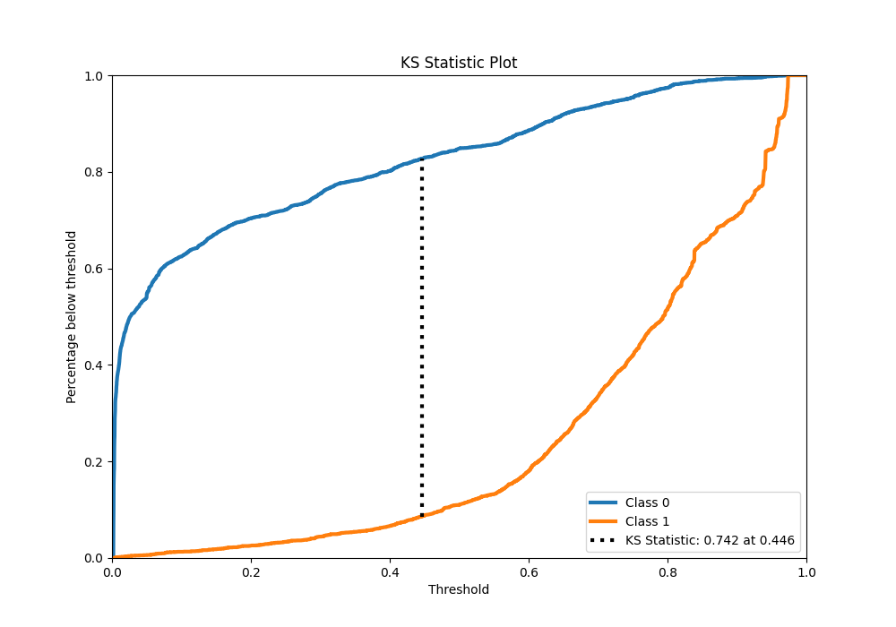
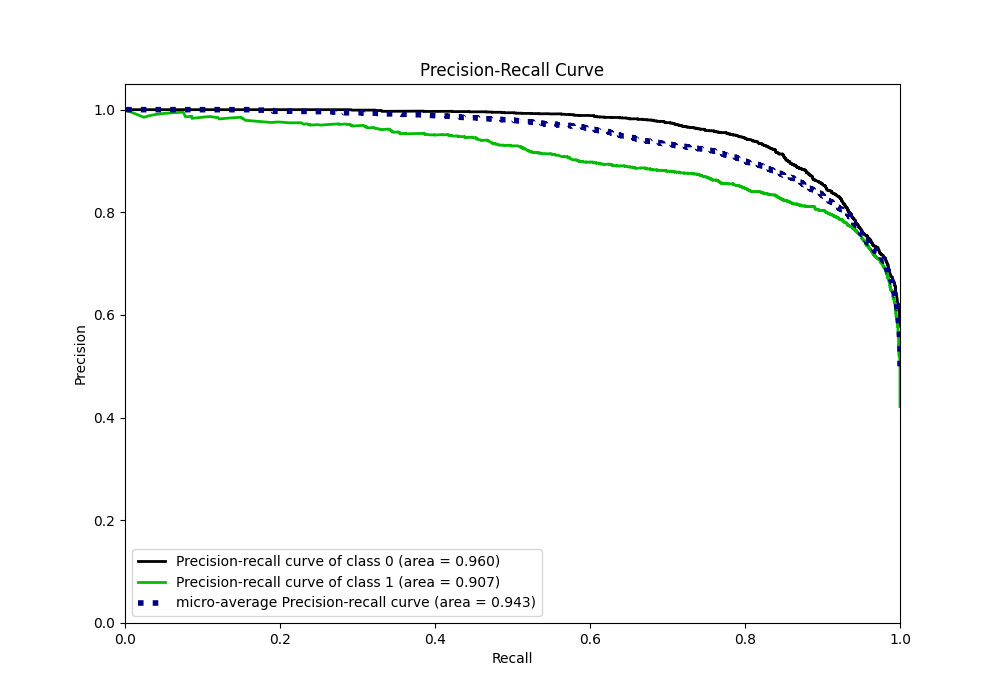
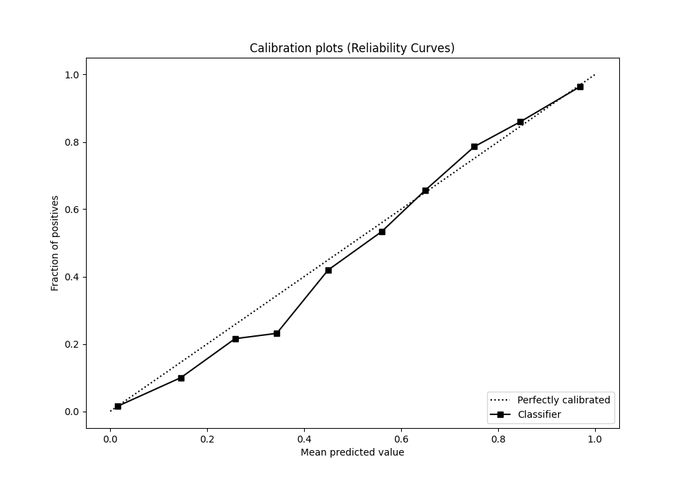
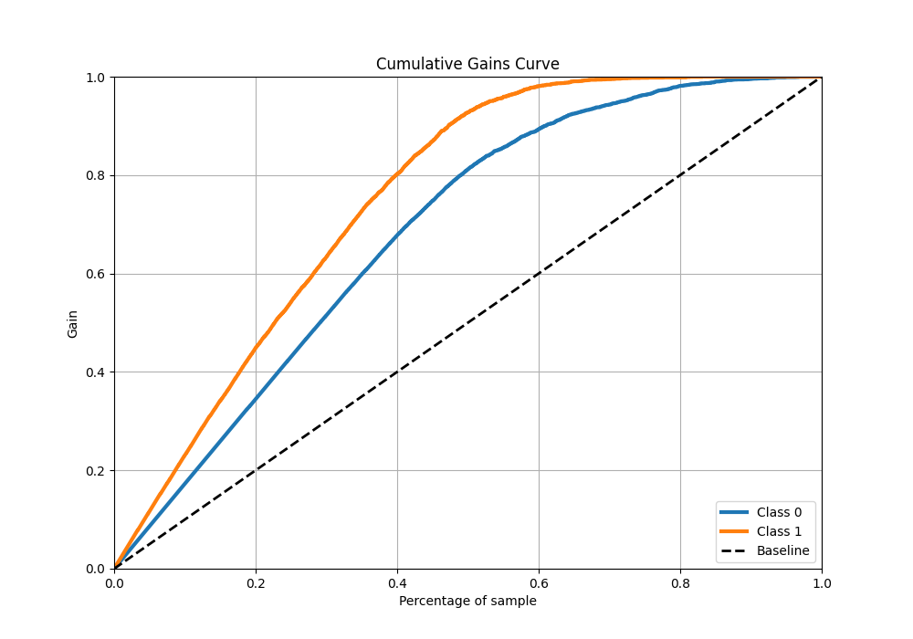
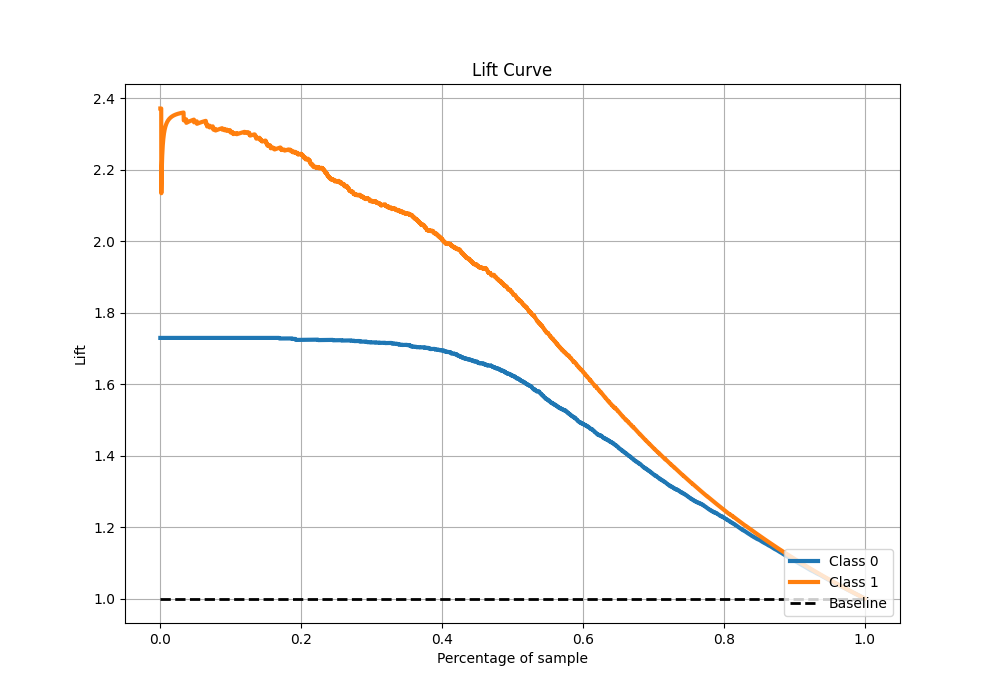

# Summary of 26_RandomForest

[<< Go back](../README.md)

## Random Forest
- **n_jobs**: -1
- **criterion**: gini
- **max_features**: 0.7
- **min_samples_split**: 30
- **max_depth**: 7
- **eval_metric_name**: f1
- **explain_level**: 0

## Validation
 - **validation_type**: split
 - **train_ratio**: 0.9
 - **shuffle**: True
 - **stratify**: True

## Optimized metric
f1

## Training time

29.2 seconds

## Metric details
|           |    score |    threshold |
|:----------|---------:|-------------:|
| logloss   | 0.310544 | nan          |
| auc       | 0.938385 | nan          |
| f1        | 0.849784 |   0.444766   |
| accuracy  | 0.864763 |   0.469125   |
| precision | 0.994949 |   0.969646   |
| recall    | 1        |   0.00168315 |
| mcc       | 0.732228 |   0.444766   |

## Metric details with threshold from accuracy metric
|           |    score |   threshold |
|:----------|---------:|------------:|
| logloss   | 0.310544 |  nan        |
| auc       | 0.938385 |  nan        |
| f1        | 0.849353 |    0.469125 |
| accuracy  | 0.864763 |    0.469125 |
| precision | 0.800923 |    0.469125 |
| recall    | 0.904018 |    0.469125 |
| mcc       | 0.73187  |    0.469125 |

## Confusion matrix (at threshold=0.469125)
|              |   Predicted as 0 |   Predicted as 1 |
|:-------------|-----------------:|-----------------:|
| Labeled as 0 |             3082 |              604 |
| Labeled as 1 |              258 |             2430 |

## Learning curves

## Confusion Matrix

## Normalized Confusion Matrix

## ROC Curve

## Kolmogorov-Smirnov Statistic

## Precision-Recall Curve

## Calibration Curve

## Cumulative Gains Curve

## Lift Curve

[<< Go back](../README.md)
