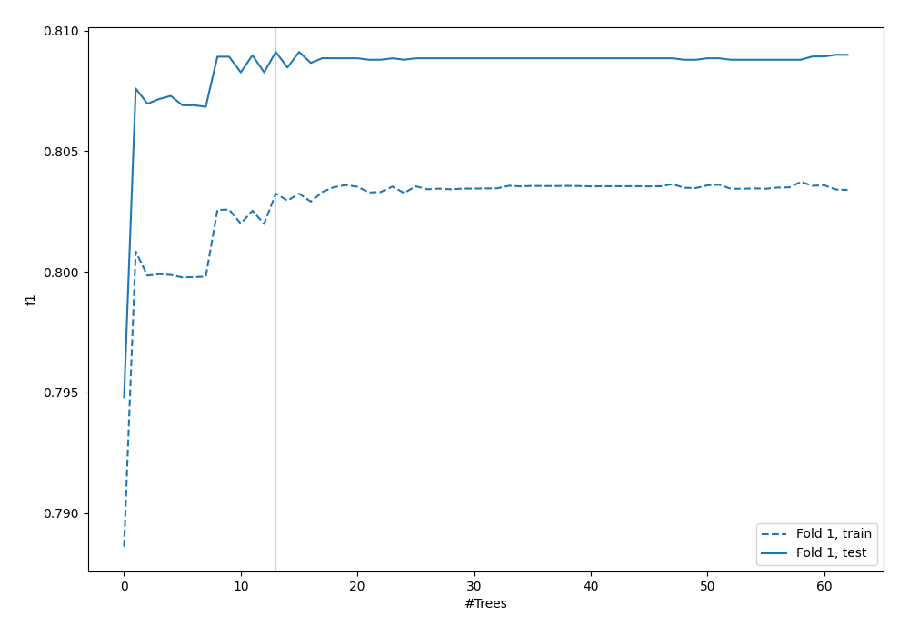
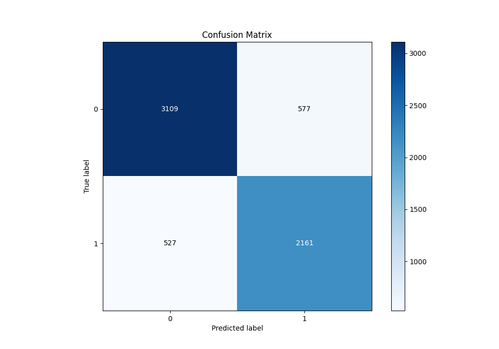
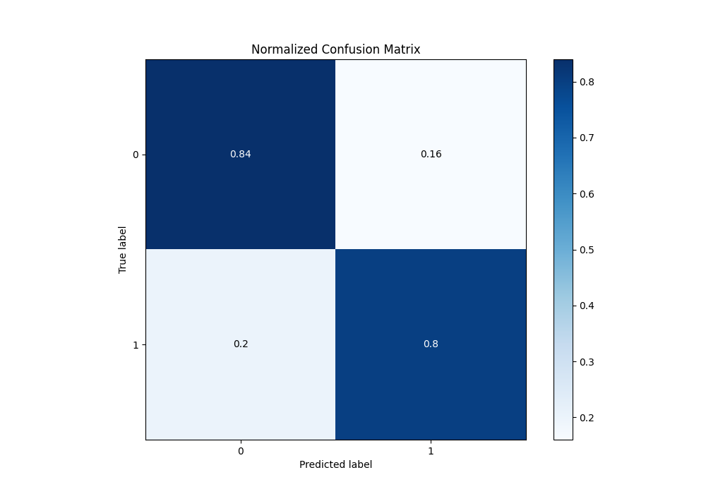
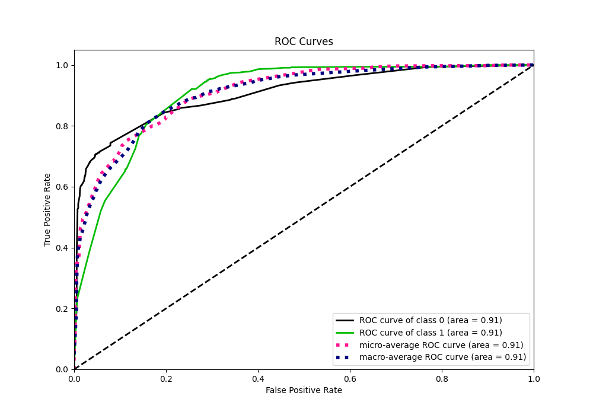
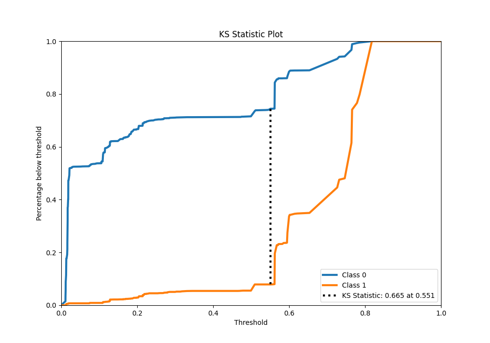
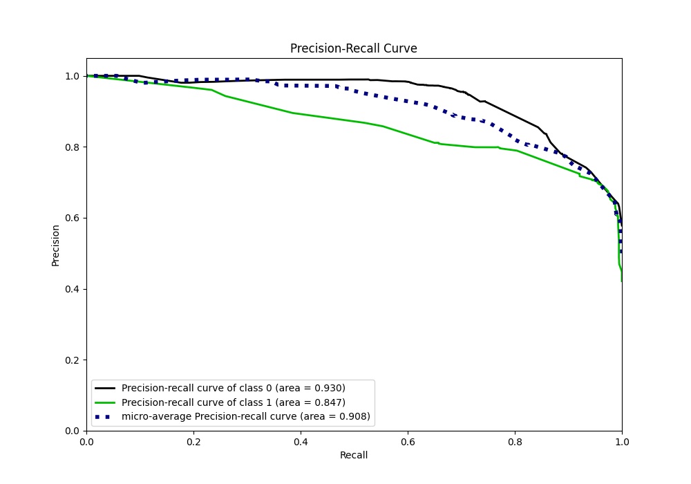
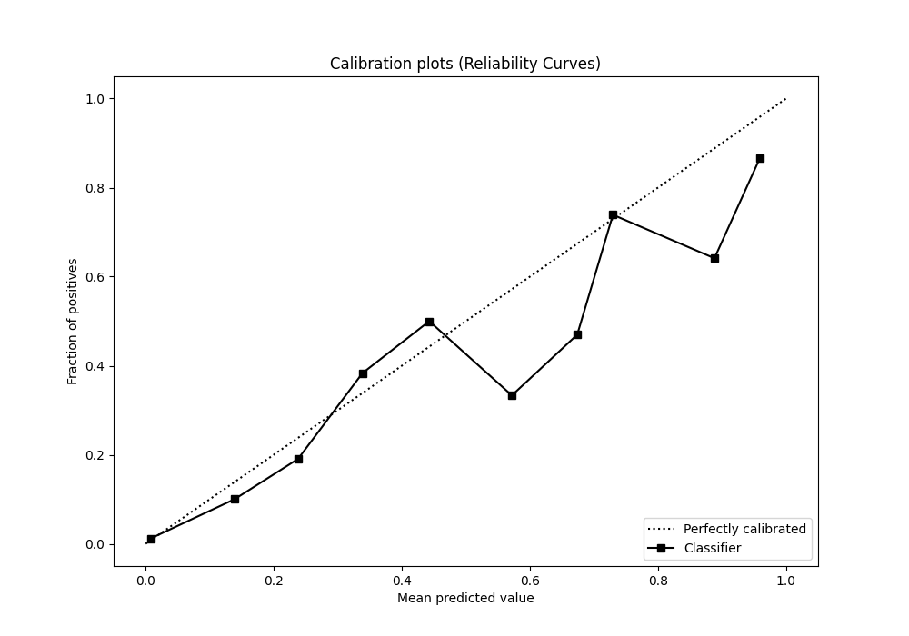
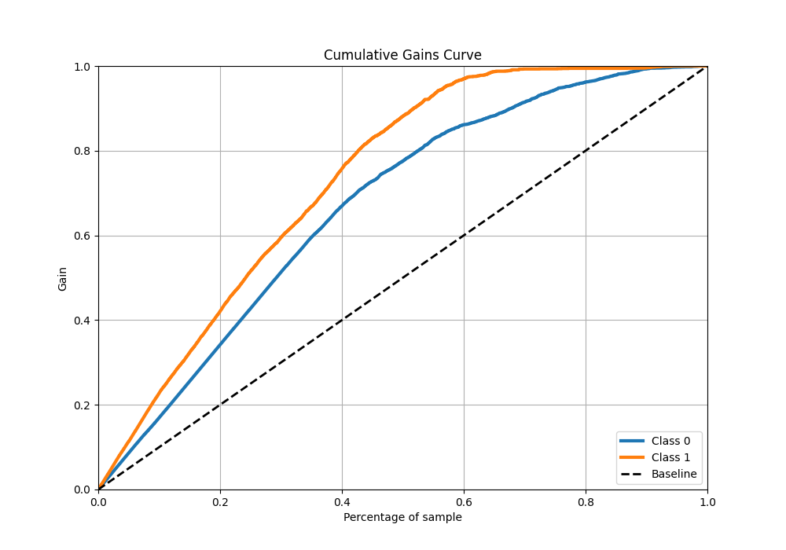
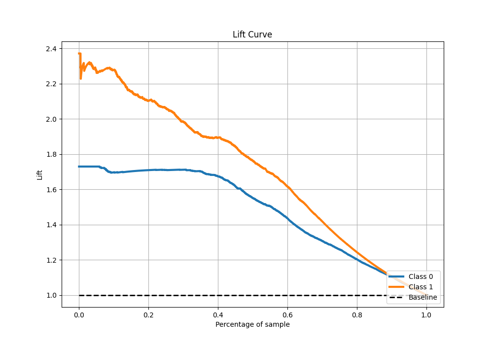

# Summary of 27_RandomForest

[<< Go back](../README.md)

## Random Forest
- **n_jobs**: -1
- **criterion**: gini
- **max_features**: 0.8
- **min_samples_split**: 40
- **max_depth**: 3
- **eval_metric_name**: f1
- **explain_level**: 0

## Validation
 - **validation_type**: split
 - **train_ratio**: 0.9
 - **shuffle**: True
 - **stratify**: True

## Optimized metric
f1

## Training time

16.2 seconds

## Metric details
|           |    score |    threshold |
|:----------|---------:|-------------:|
| logloss   | 0.383126 | nan          |
| auc       | 0.906127 | nan          |
| f1        | 0.808524 |   0.464964   |
| accuracy  | 0.826796 |   0.562326   |
| precision | 0.966132 |   0.785665   |
| recall    | 1        |   0.00994689 |
| mcc       | 0.656061 |   0.464964   |

## Metric details with threshold from accuracy metric
|           |    score |   threshold |
|:----------|---------:|------------:|
| logloss   | 0.383126 |  nan        |
| auc       | 0.906127 |  nan        |
| f1        | 0.796535 |    0.562326 |
| accuracy  | 0.826796 |    0.562326 |
| precision | 0.789262 |    0.562326 |
| recall    | 0.803943 |    0.562326 |
| mcc       | 0.645862 |    0.562326 |

## Confusion matrix (at threshold=0.562326)
|              |   Predicted as 0 |   Predicted as 1 |
|:-------------|-----------------:|-----------------:|
| Labeled as 0 |             3109 |              577 |
| Labeled as 1 |              527 |             2161 |

## Learning curves

## Confusion Matrix

## Normalized Confusion Matrix

## ROC Curve

## Kolmogorov-Smirnov Statistic

## Precision-Recall Curve

## Calibration Curve

## Cumulative Gains Curve

## Lift Curve

[<< Go back](../README.md)
