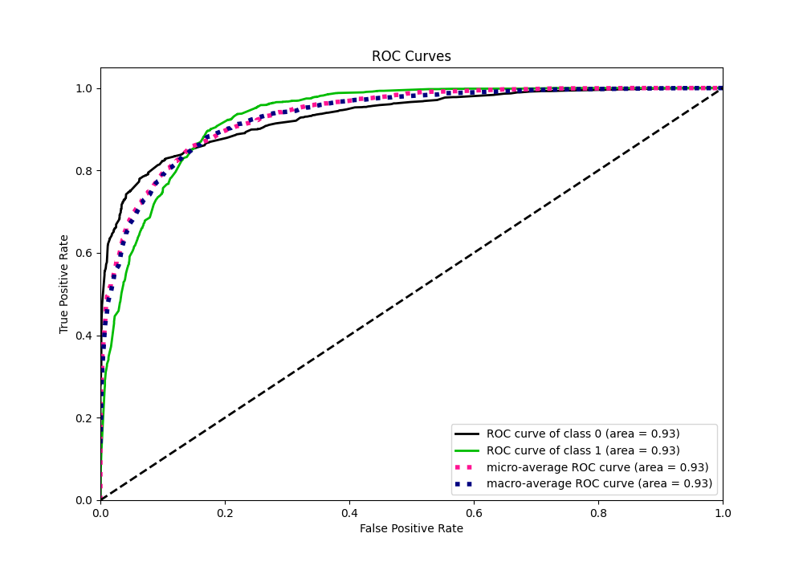

# Summary of 28_RandomForest

[<< Go back](../README.md)

## Random Forest
- **n_jobs**: -1
- **criterion**: entropy
- **max_features**: 0.6
- **min_samples_split**: 50
- **max_depth**: 6
- **eval_metric_name**: f1
- **explain_level**: 0

## Validation
 - **validation_type**: split
 - **train_ratio**: 0.9
 - **shuffle**: True
 - **stratify**: True

## Optimized metric
f1

## Training time

15.3 seconds

## Metric details
|           |    score |   threshold |
|:----------|---------:|------------:|
| logloss   | 0.326471 |  nan        |
| auc       | 0.931598 |  nan        |
| f1        | 0.840266 |    0.525175 |
| accuracy  | 0.856605 |    0.525175 |
| precision | 0.989848 |    0.965353 |
| recall    | 1        |    0        |
| mcc       | 0.715331 |    0.525175 |

## Metric details with threshold from accuracy metric
|           |    score |   threshold |
|:----------|---------:|------------:|
| logloss   | 0.326471 |  nan        |
| auc       | 0.931598 |  nan        |
| f1        | 0.840266 |    0.525175 |
| accuracy  | 0.856605 |    0.525175 |
| precision | 0.792353 |    0.525175 |
| recall    | 0.894345 |    0.525175 |
| mcc       | 0.715331 |    0.525175 |

## Confusion matrix (at threshold=0.525175)
|              |   Predicted as 0 |   Predicted as 1 |
|:-------------|-----------------:|-----------------:|
| Labeled as 0 |             3056 |              630 |
| Labeled as 1 |              284 |             2404 |

## Learning curves

## Confusion Matrix

## Normalized Confusion Matrix

## ROC Curve

## Kolmogorov-Smirnov Statistic

## Precision-Recall Curve

## Calibration Curve

## Cumulative Gains Curve

## Lift Curve

[<< Go back](../README.md)
