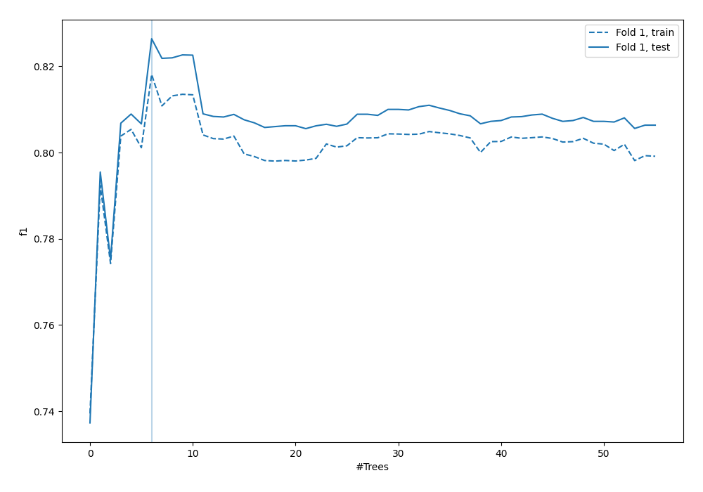
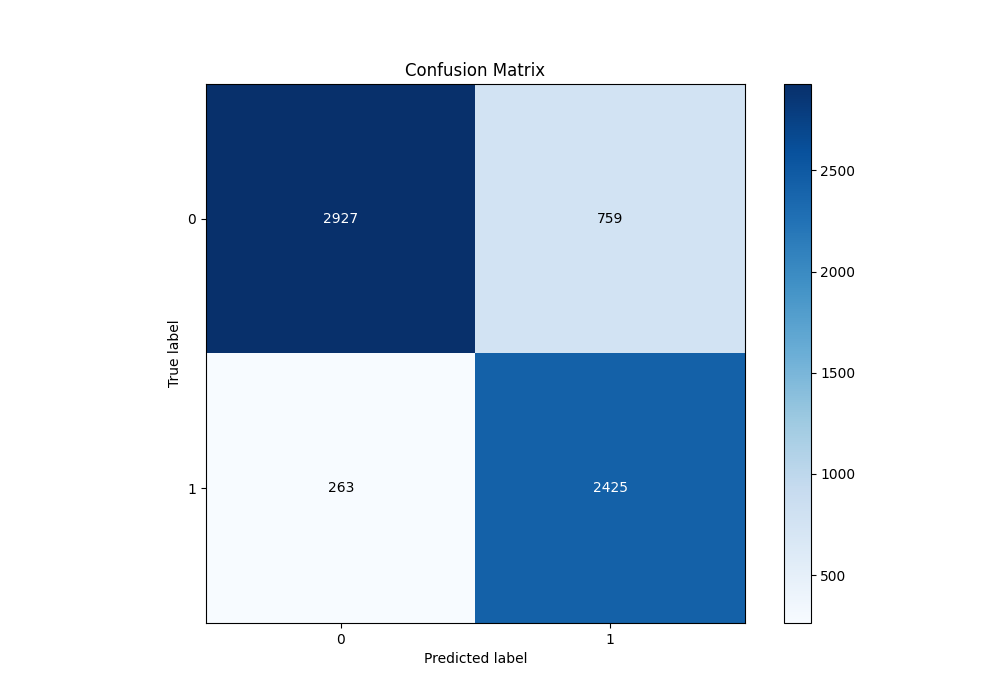
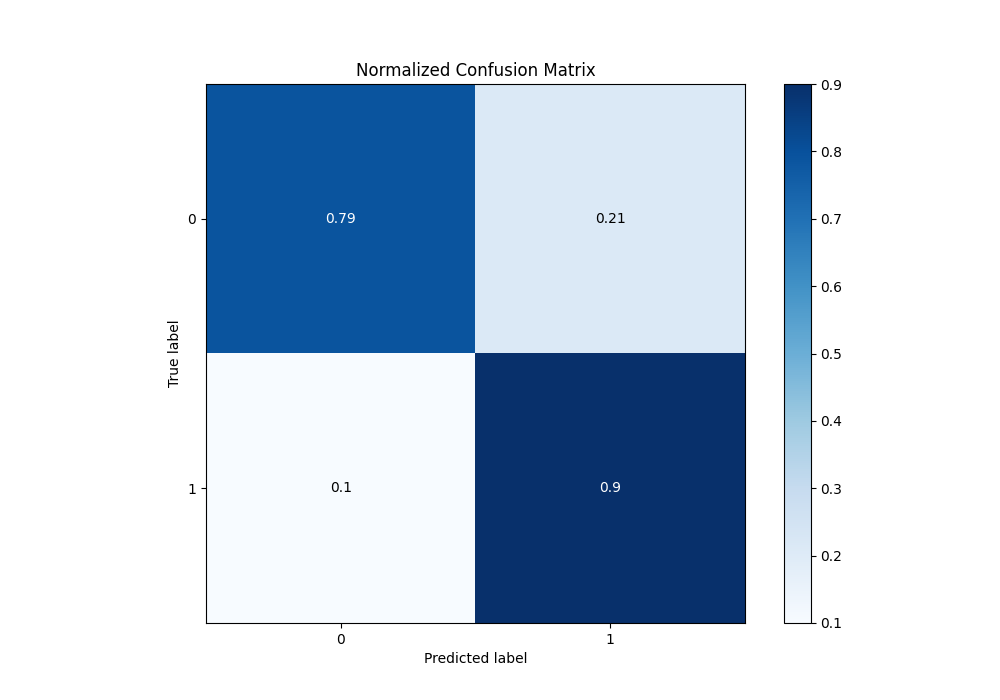
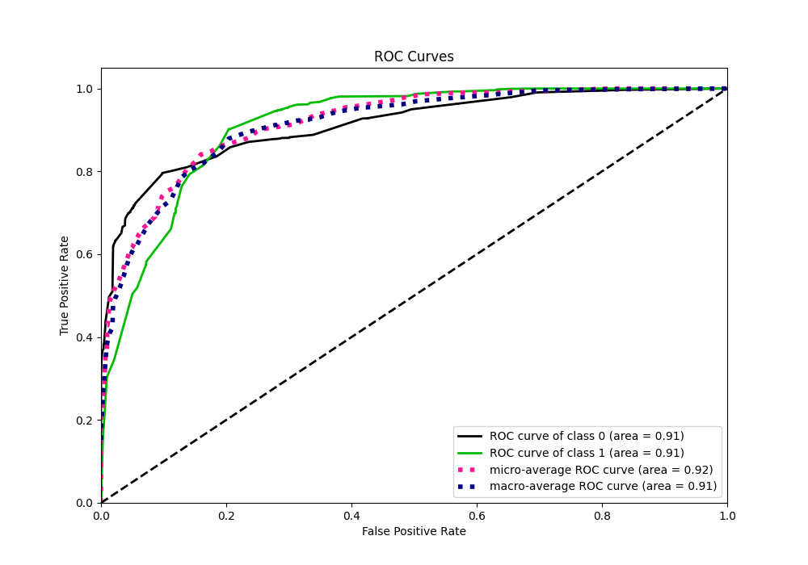
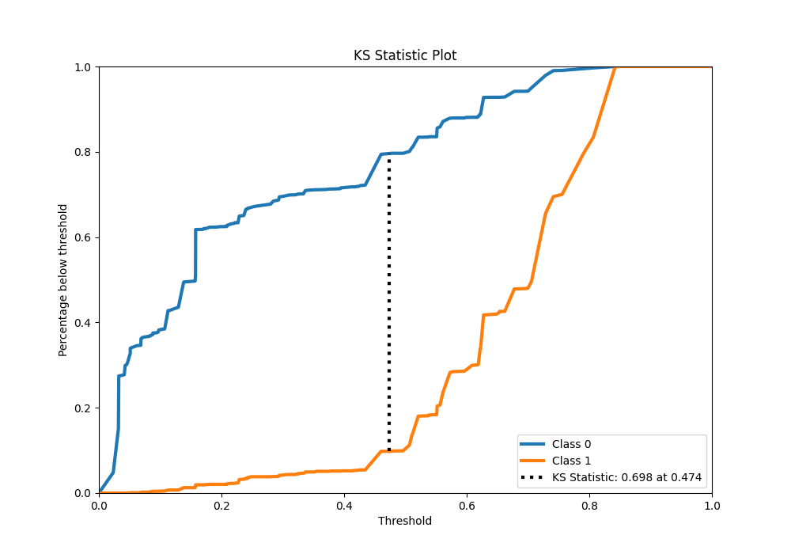
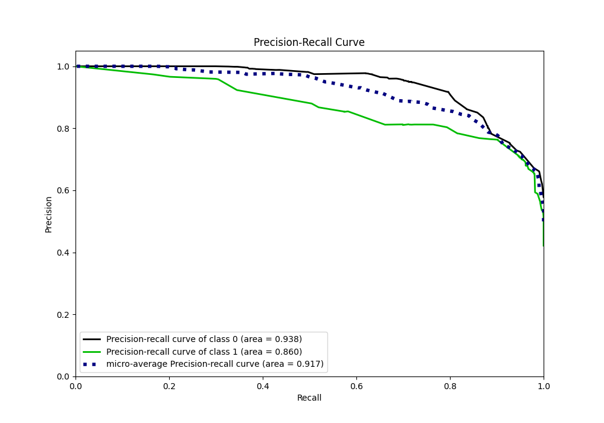
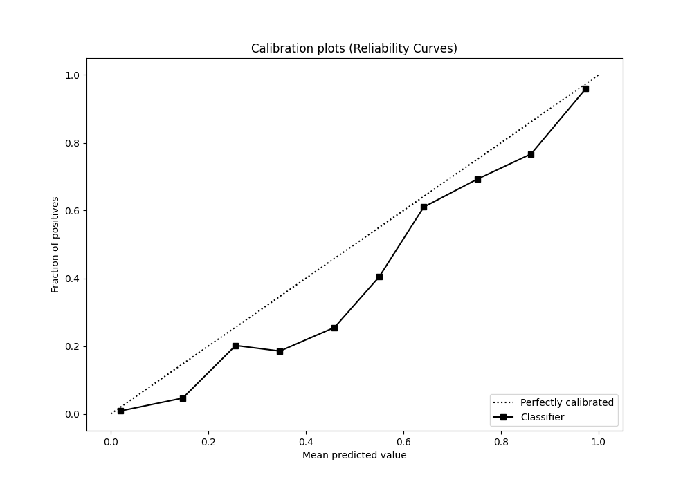
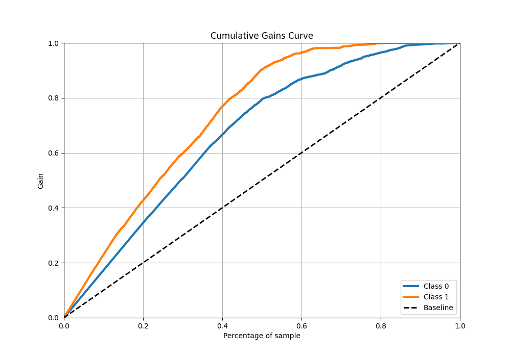
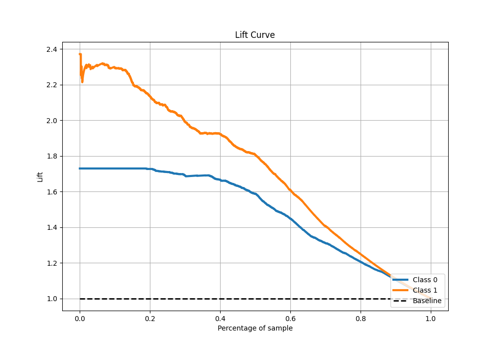

# Summary of 29_RandomForest

[<< Go back](../README.md)

## Random Forest
- **n_jobs**: -1
- **criterion**: gini
- **max_features**: 0.7
- **min_samples_split**: 50
- **max_depth**: 3
- **eval_metric_name**: f1
- **explain_level**: 0

## Validation
 - **validation_type**: split
 - **train_ratio**: 0.9
 - **shuffle**: True
 - **stratify**: True

## Optimized metric
f1

## Training time

14.9 seconds

## Metric details
|           |    score |   threshold |
|:----------|---------:|------------:|
| logloss   | 0.385619 | nan         |
| auc       | 0.911858 | nan         |
| f1        | 0.825954 |   0.46031   |
| accuracy  | 0.839661 |   0.46031   |
| precision | 0.973799 |   0.806583  |
| recall    | 1        |   0.0210724 |
| mcc       | 0.687657 |   0.46031   |

## Metric details with threshold from accuracy metric
|           |    score |   threshold |
|:----------|---------:|------------:|
| logloss   | 0.385619 |   nan       |
| auc       | 0.911858 |   nan       |
| f1        | 0.825954 |     0.46031 |
| accuracy  | 0.839661 |     0.46031 |
| precision | 0.761621 |     0.46031 |
| recall    | 0.902158 |     0.46031 |
| mcc       | 0.687657 |     0.46031 |

## Confusion matrix (at threshold=0.46031)
|              |   Predicted as 0 |   Predicted as 1 |
|:-------------|-----------------:|-----------------:|
| Labeled as 0 |             2927 |              759 |
| Labeled as 1 |              263 |             2425 |

## Learning curves

## Confusion Matrix

## Normalized Confusion Matrix

## ROC Curve

## Kolmogorov-Smirnov Statistic

## Precision-Recall Curve

## Calibration Curve

## Cumulative Gains Curve

## Lift Curve

[<< Go back](../README.md)
