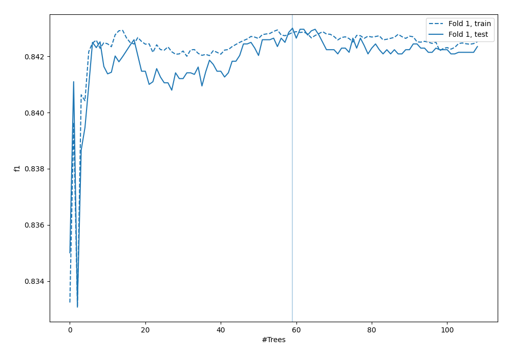
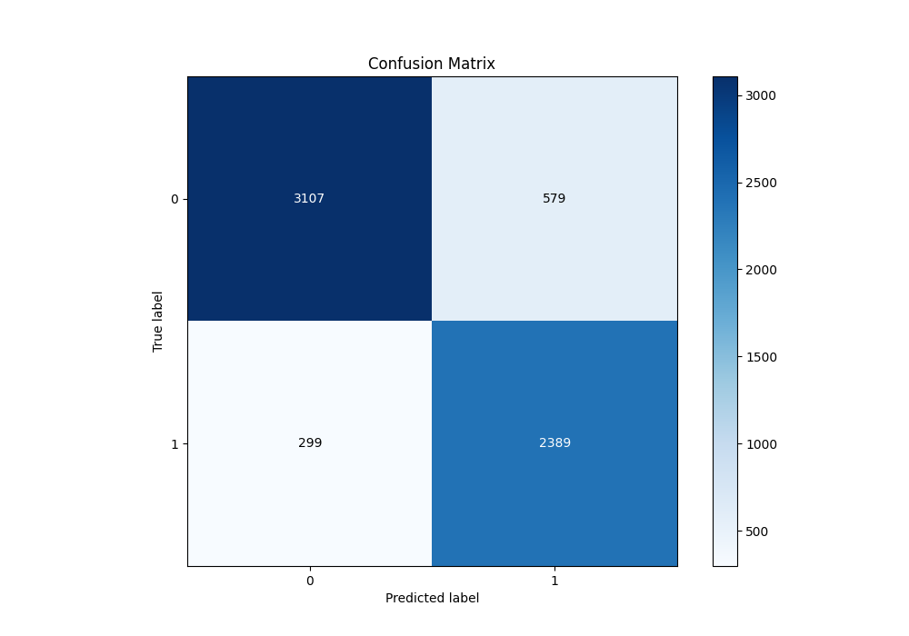
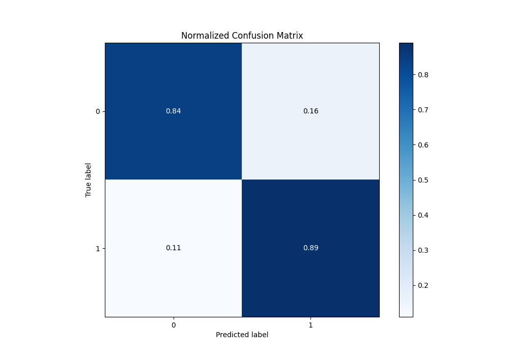
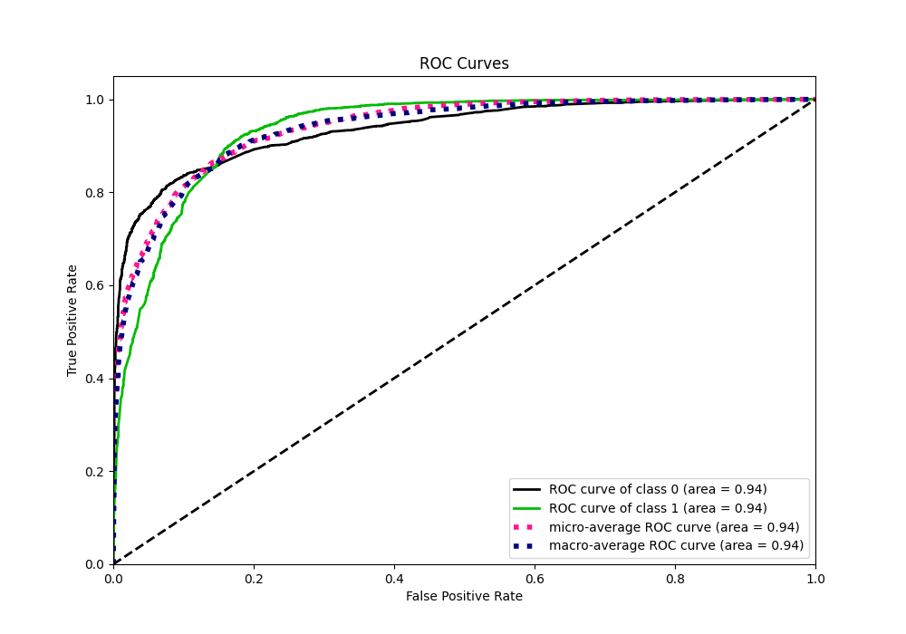
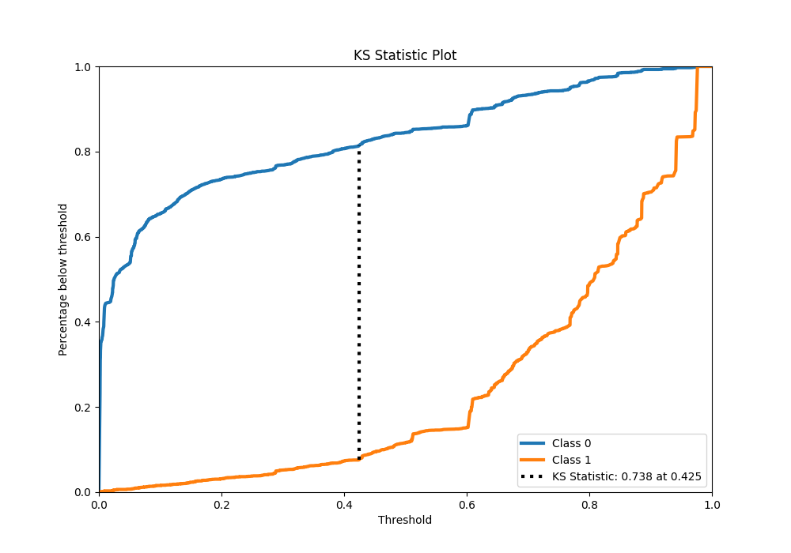
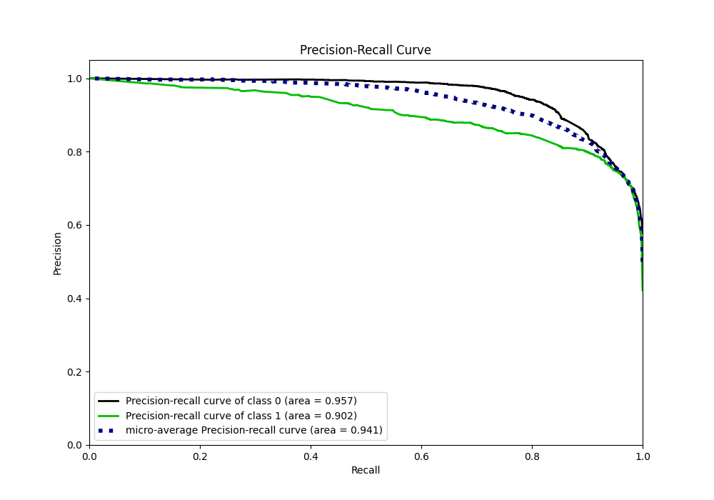
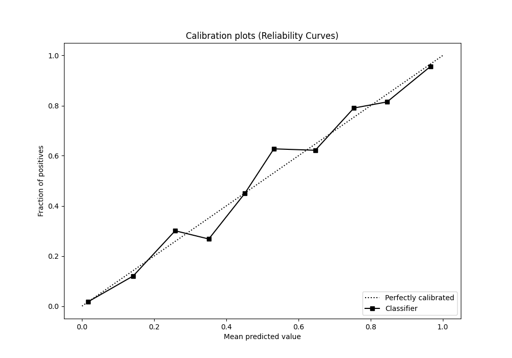
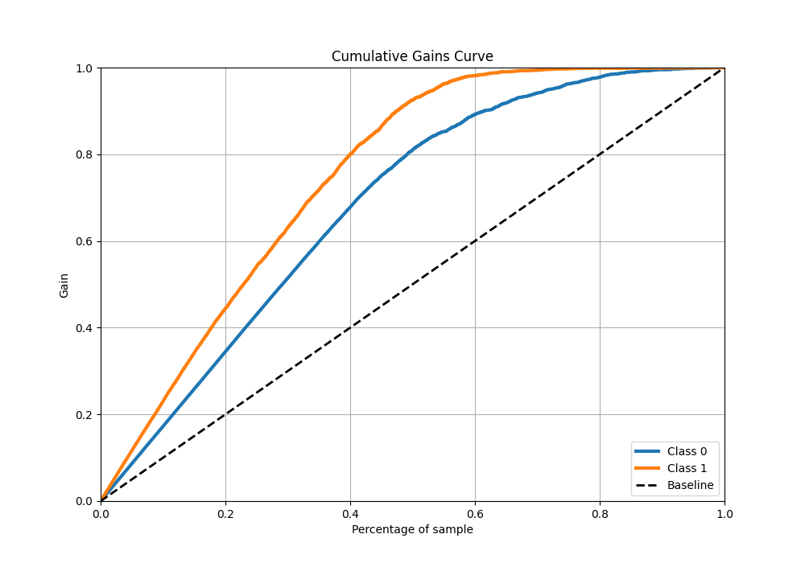
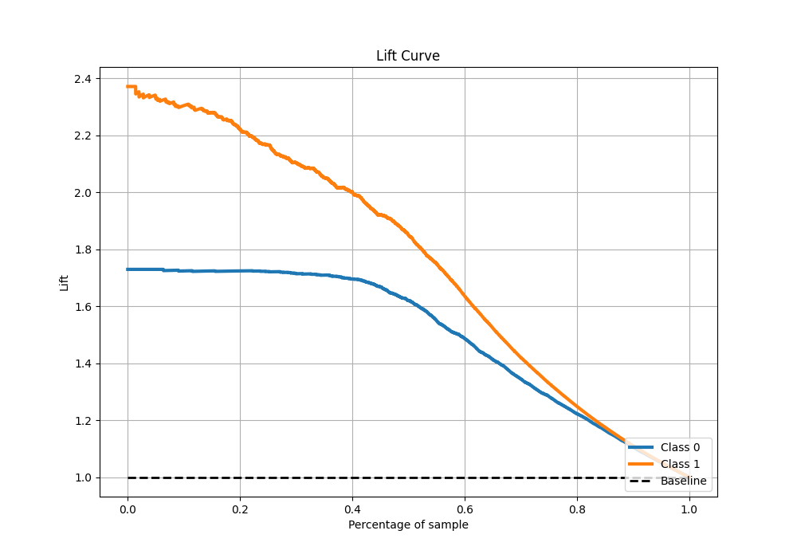

# Summary of 30_RandomForest

[<< Go back](../README.md)

## Random Forest
- **n_jobs**: -1
- **criterion**: gini
- **max_features**: 1.0
- **min_samples_split**: 40
- **max_depth**: 7
- **eval_metric_name**: f1
- **explain_level**: 0

## Validation
 - **validation_type**: split
 - **train_ratio**: 0.9
 - **shuffle**: True
 - **stratify**: True

## Optimized metric
f1

## Training time

30.9 seconds

## Metric details
|           |    score |    threshold |
|:----------|---------:|-------------:|
| logloss   | 0.312679 | nan          |
| auc       | 0.935959 | nan          |
| f1        | 0.847405 |   0.426126   |
| accuracy  | 0.862253 |   0.484199   |
| precision | 0.986395 |   0.97286    |
| recall    | 1        |   0.00157254 |
| mcc       | 0.727778 |   0.437741   |

## Metric details with threshold from accuracy metric
|           |    score |   threshold |
|:----------|---------:|------------:|
| logloss   | 0.312679 |  nan        |
| auc       | 0.935959 |  nan        |
| f1        | 0.844767 |    0.484199 |
| accuracy  | 0.862253 |    0.484199 |
| precision | 0.804919 |    0.484199 |
| recall    | 0.888765 |    0.484199 |
| mcc       | 0.724372 |    0.484199 |

## Confusion matrix (at threshold=0.484199)
|              |   Predicted as 0 |   Predicted as 1 |
|:-------------|-----------------:|-----------------:|
| Labeled as 0 |             3107 |              579 |
| Labeled as 1 |              299 |             2389 |

## Learning curves

## Confusion Matrix

## Normalized Confusion Matrix

## ROC Curve

## Kolmogorov-Smirnov Statistic

## Precision-Recall Curve

## Calibration Curve

## Cumulative Gains Curve

## Lift Curve

[<< Go back](../README.md)
