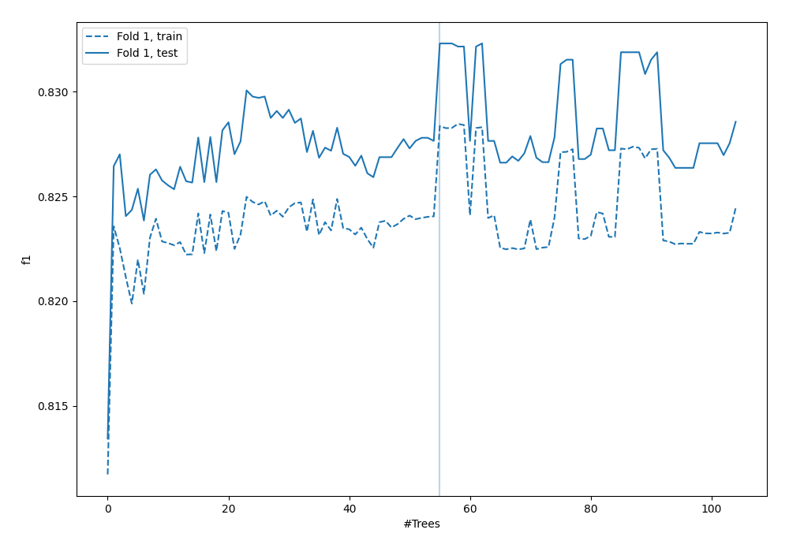
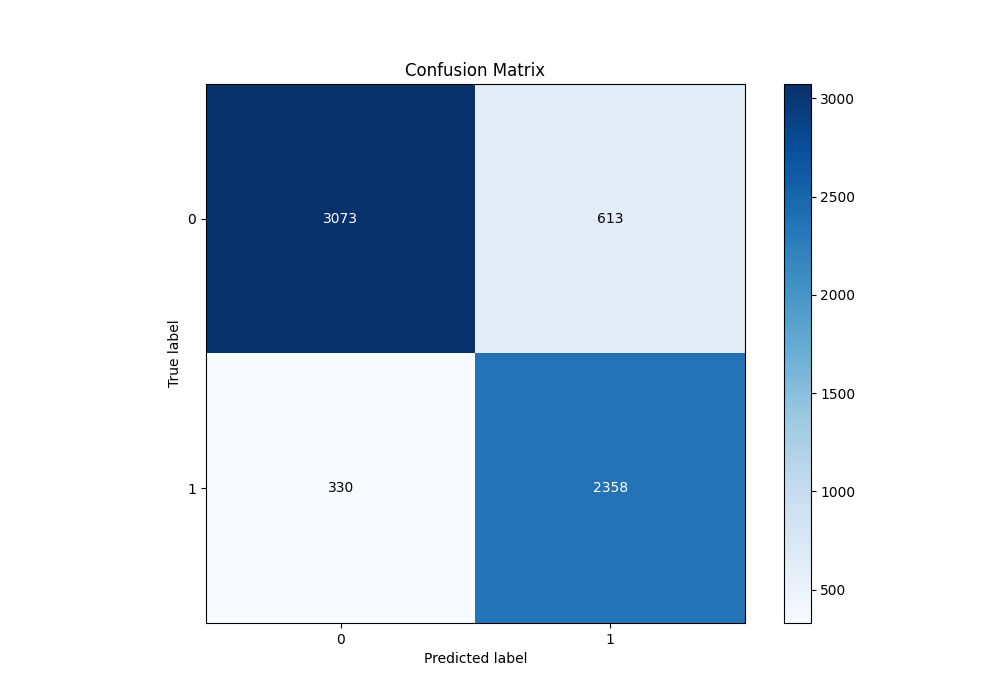
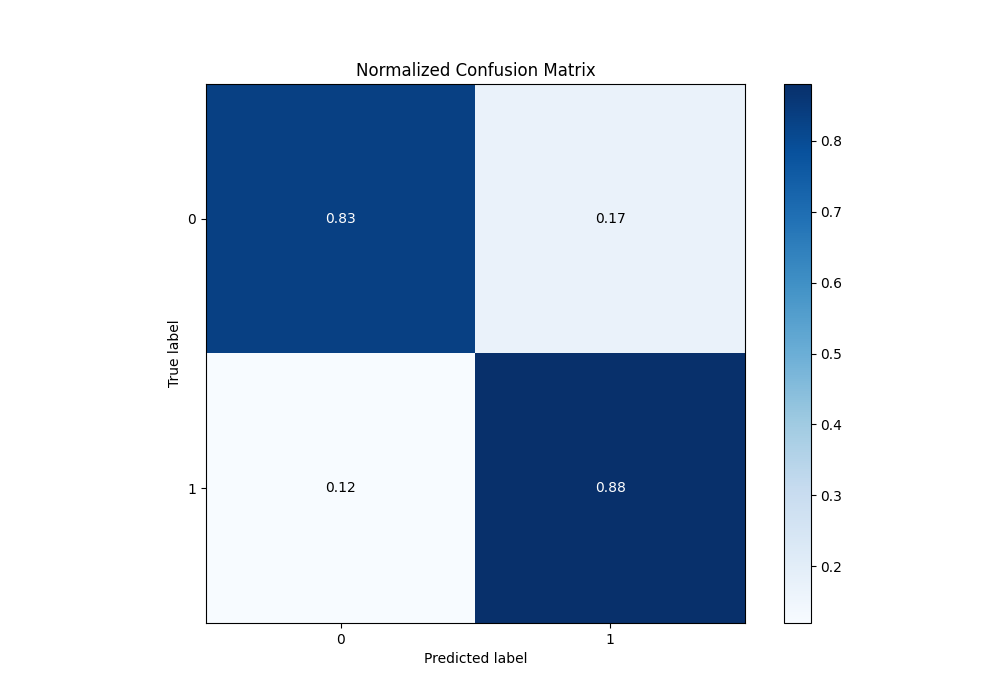
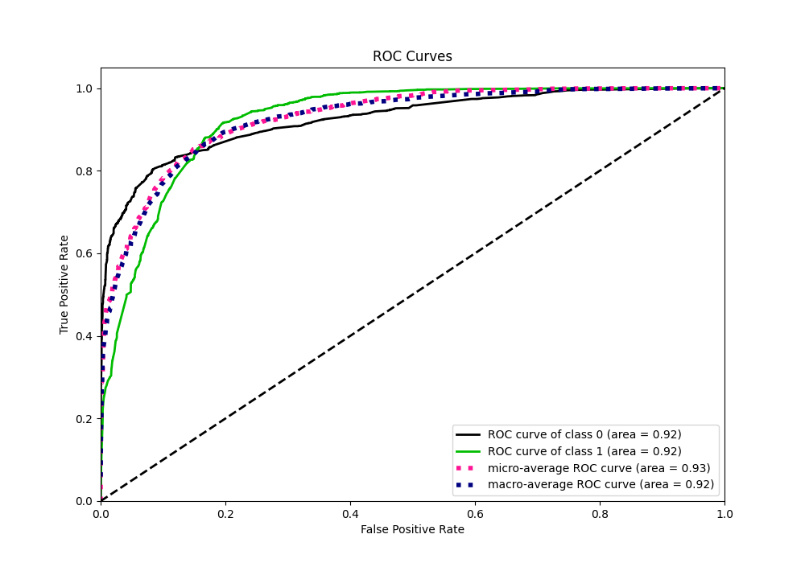
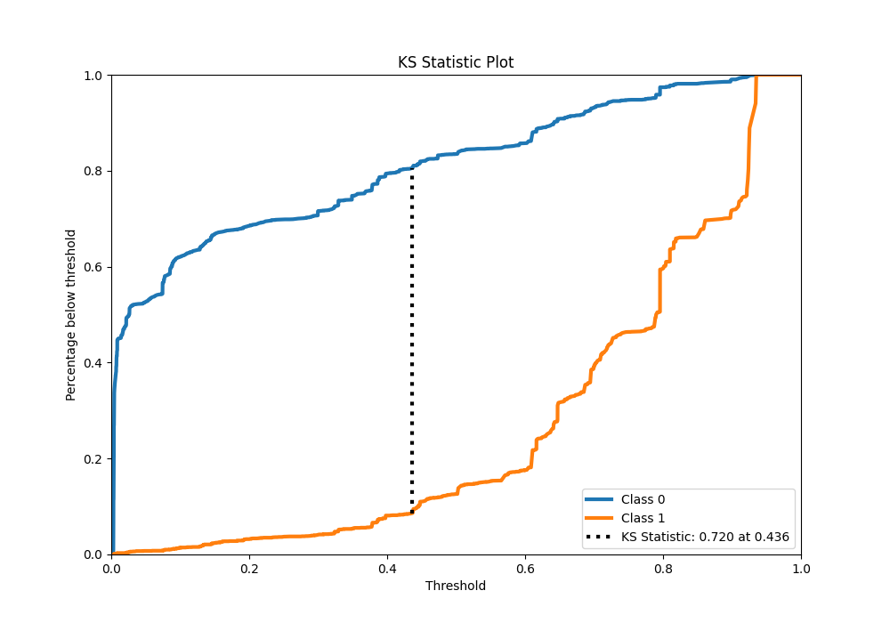
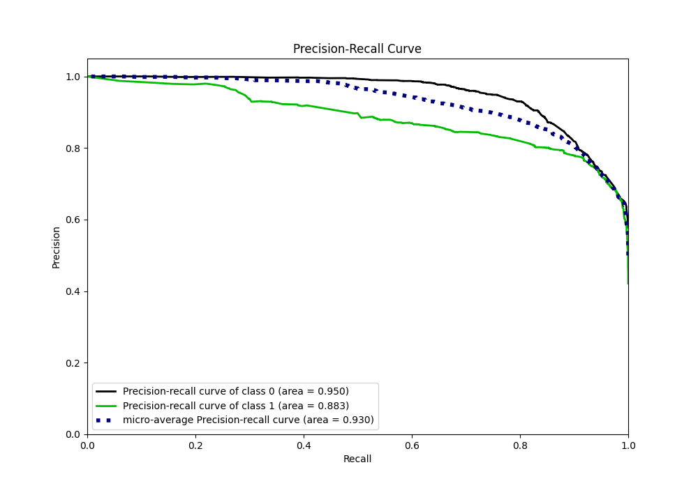
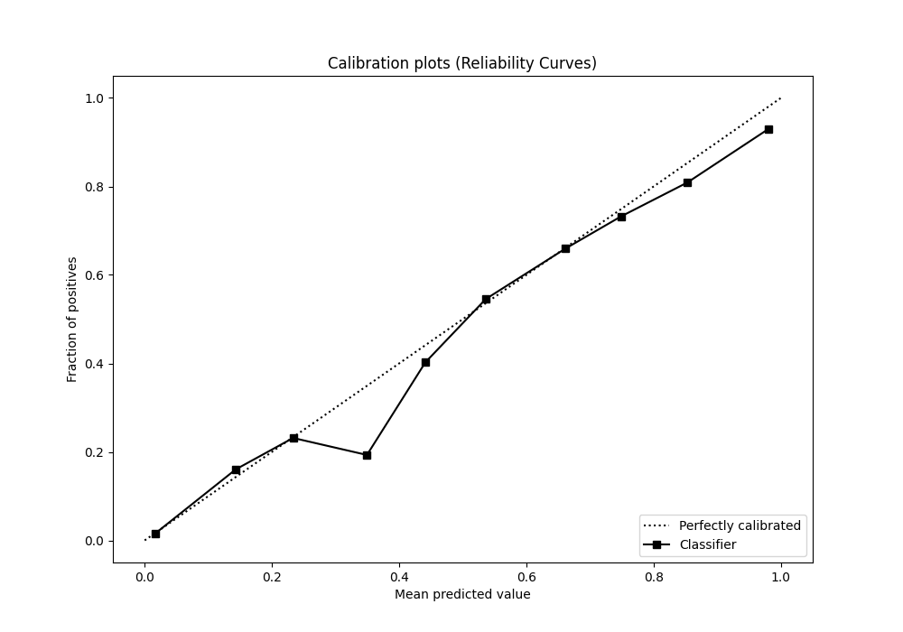
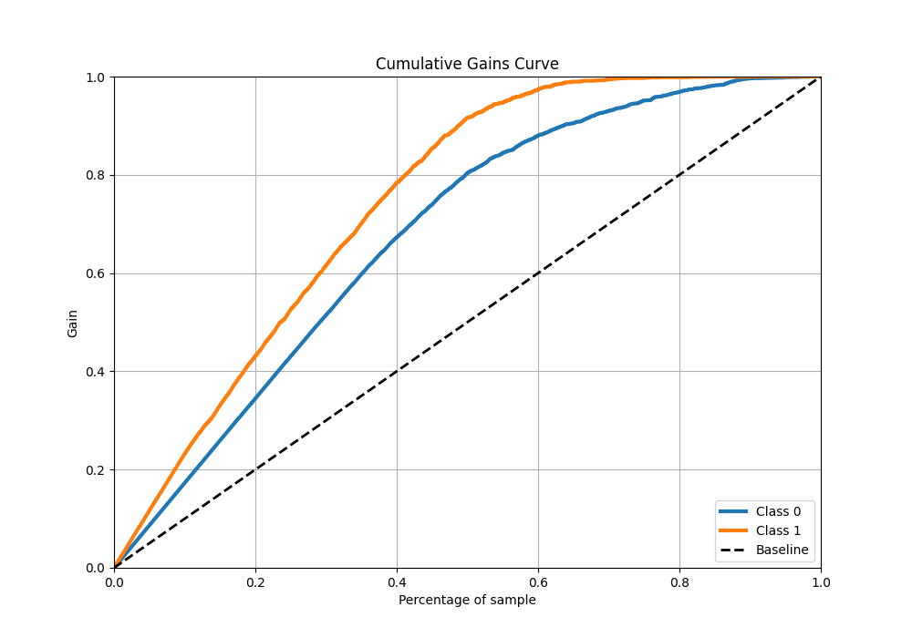
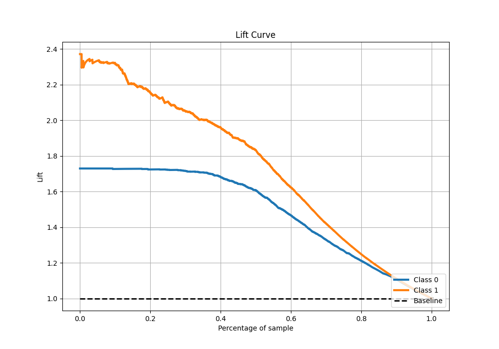

# Summary of 31_RandomForest

[<< Go back](../README.md)

## Random Forest
- **n_jobs**: -1
- **criterion**: gini
- **max_features**: 0.9
- **min_samples_split**: 40
- **max_depth**: 5
- **eval_metric_name**: f1
- **explain_level**: 0

## Validation
 - **validation_type**: split
 - **train_ratio**: 0.9
 - **shuffle**: True
 - **stratify**: True

## Optimized metric
f1

## Training time

27.0 seconds

## Metric details
|           |    score |    threshold |
|:----------|---------:|-------------:|
| logloss   | 0.34034  | nan          |
| auc       | 0.92469  | nan          |
| f1        | 0.836226 |   0.438025   |
| accuracy  | 0.852055 |   0.485411   |
| precision | 0.987654 |   0.934226   |
| recall    | 1        |   0.00270275 |
| mcc       | 0.70705  |   0.438025   |

## Metric details with threshold from accuracy metric
|           |    score |   threshold |
|:----------|---------:|------------:|
| logloss   | 0.34034  |  nan        |
| auc       | 0.92469  |  nan        |
| f1        | 0.833363 |    0.485411 |
| accuracy  | 0.852055 |    0.485411 |
| precision | 0.793672 |    0.485411 |
| recall    | 0.877232 |    0.485411 |
| mcc       | 0.703777 |    0.485411 |

## Confusion matrix (at threshold=0.485411)
|              |   Predicted as 0 |   Predicted as 1 |
|:-------------|-----------------:|-----------------:|
| Labeled as 0 |             3073 |              613 |
| Labeled as 1 |              330 |             2358 |

## Learning curves

## Confusion Matrix

## Normalized Confusion Matrix

## ROC Curve

## Kolmogorov-Smirnov Statistic

## Precision-Recall Curve

## Calibration Curve

## Cumulative Gains Curve

## Lift Curve

[<< Go back](../README.md)
