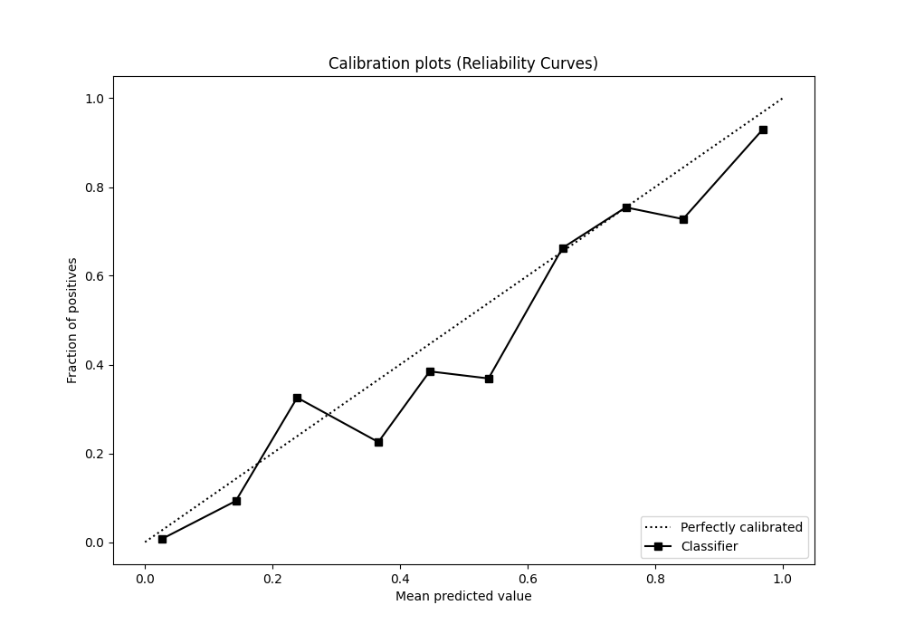

# Summary of 32_RandomForest

[<< Go back](../README.md)

## Random Forest
- **n_jobs**: -1
- **criterion**: gini
- **max_features**: 0.6
- **min_samples_split**: 20
- **max_depth**: 4
- **eval_metric_name**: f1
- **explain_level**: 0

## Validation
 - **validation_type**: split
 - **train_ratio**: 0.9
 - **shuffle**: True
 - **stratify**: True

## Optimized metric
f1

## Training time

32.9 seconds

## Metric details
|           |    score |    threshold |
|:----------|---------:|-------------:|
| logloss   | 0.357411 | nan          |
| auc       | 0.920962 | nan          |
| f1        | 0.832421 |   0.493139   |
| accuracy  | 0.848761 |   0.502453   |
| precision | 0.99005  |   0.898459   |
| recall    | 1        |   0.00581251 |
| mcc       | 0.699831 |   0.493139   |

## Metric details with threshold from accuracy metric
|           |    score |   threshold |
|:----------|---------:|------------:|
| logloss   | 0.357411 |  nan        |
| auc       | 0.920962 |  nan        |
| f1        | 0.831527 |    0.502453 |
| accuracy  | 0.848761 |    0.502453 |
| precision | 0.784113 |    0.502453 |
| recall    | 0.885045 |    0.502453 |
| mcc       | 0.699428 |    0.502453 |

## Confusion matrix (at threshold=0.502453)
|              |   Predicted as 0 |   Predicted as 1 |
|:-------------|-----------------:|-----------------:|
| Labeled as 0 |             3031 |              655 |
| Labeled as 1 |              309 |             2379 |

## Learning curves

## Confusion Matrix

## Normalized Confusion Matrix

## ROC Curve

## Kolmogorov-Smirnov Statistic

## Precision-Recall Curve

## Calibration Curve

## Cumulative Gains Curve

## Lift Curve

[<< Go back](../README.md)
