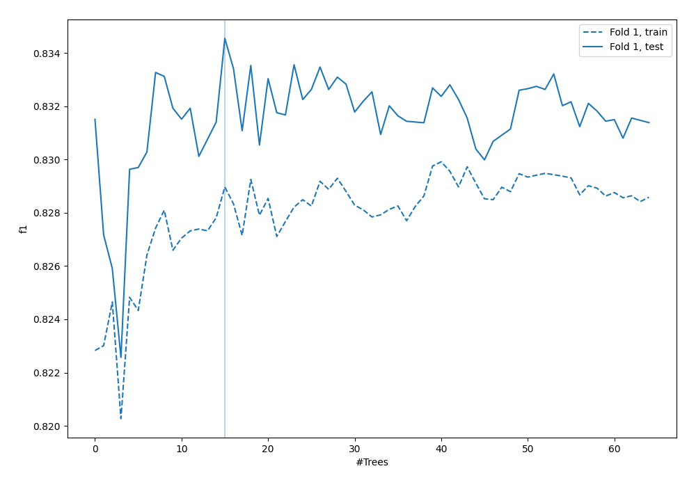
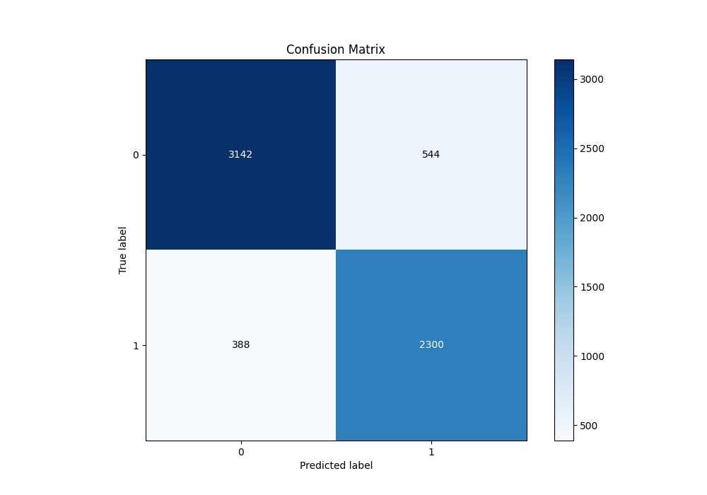
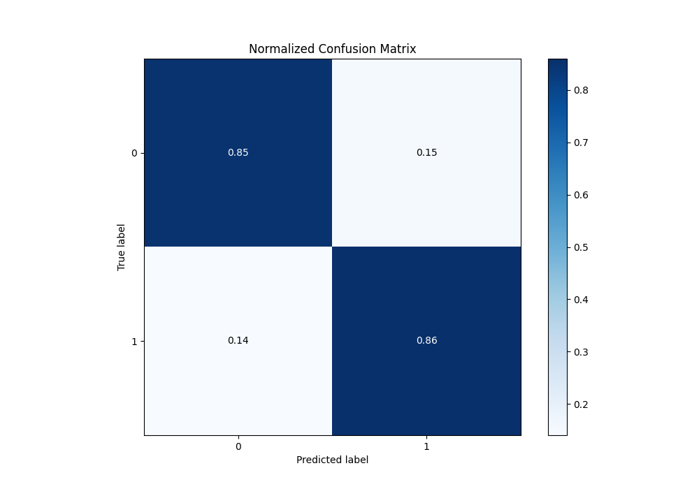
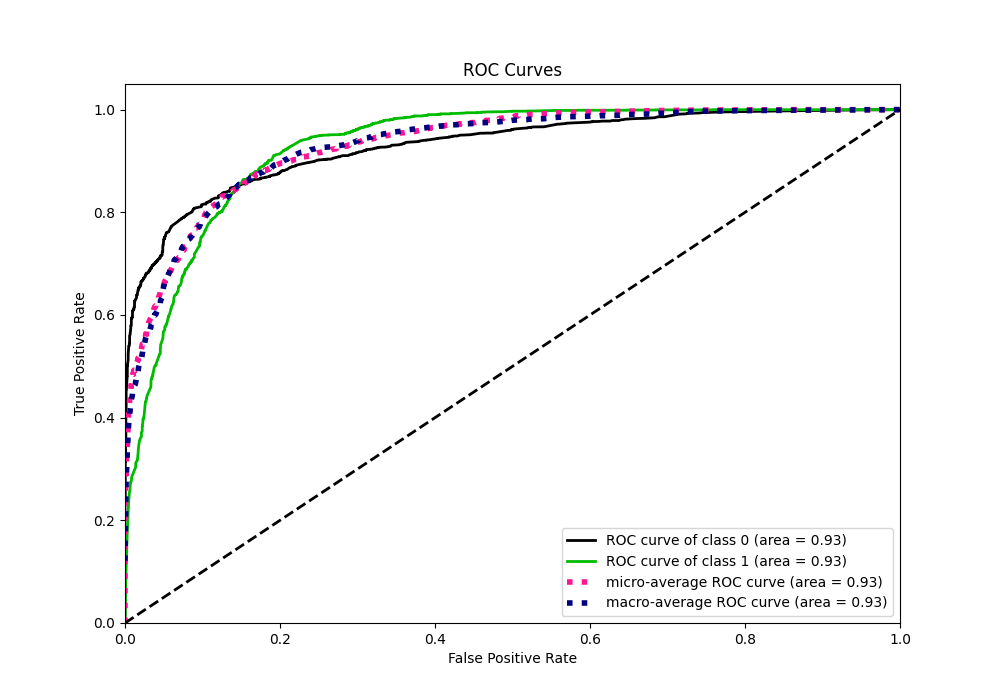
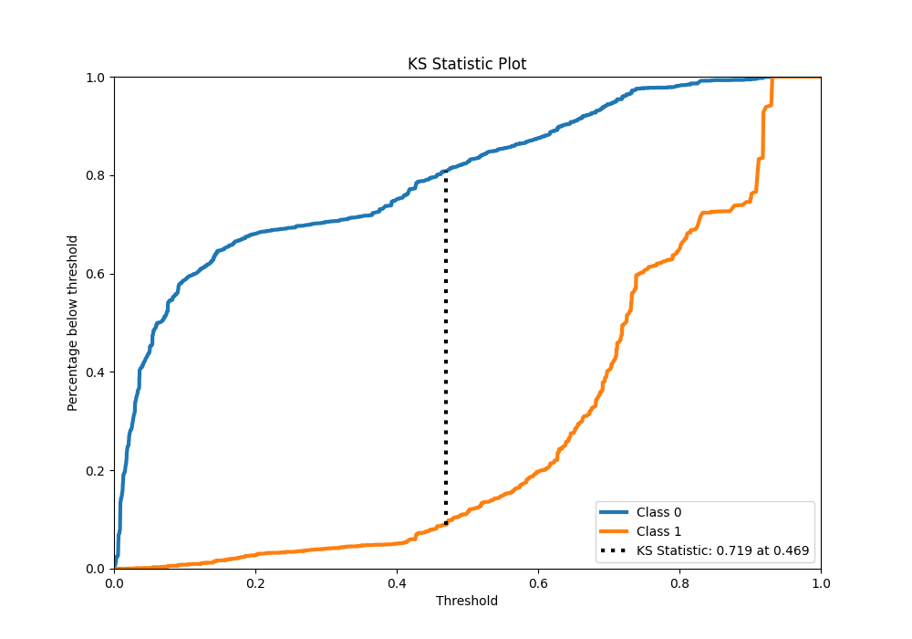
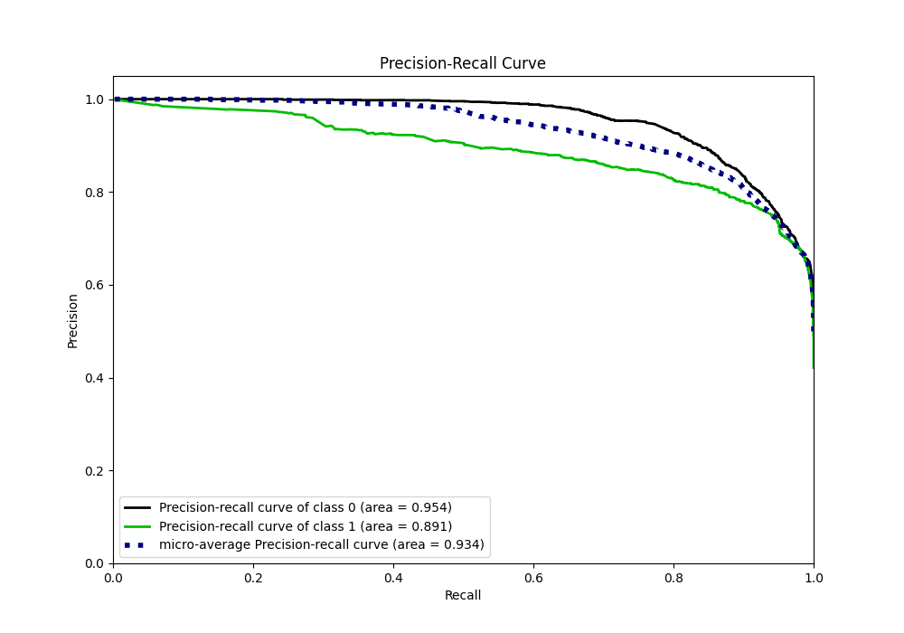
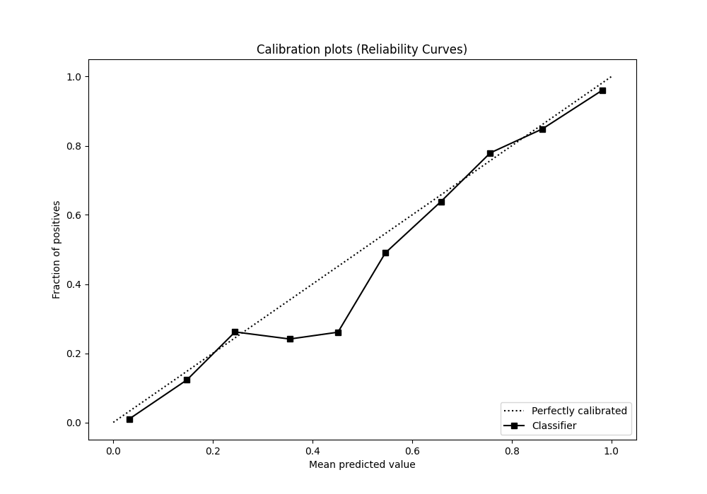
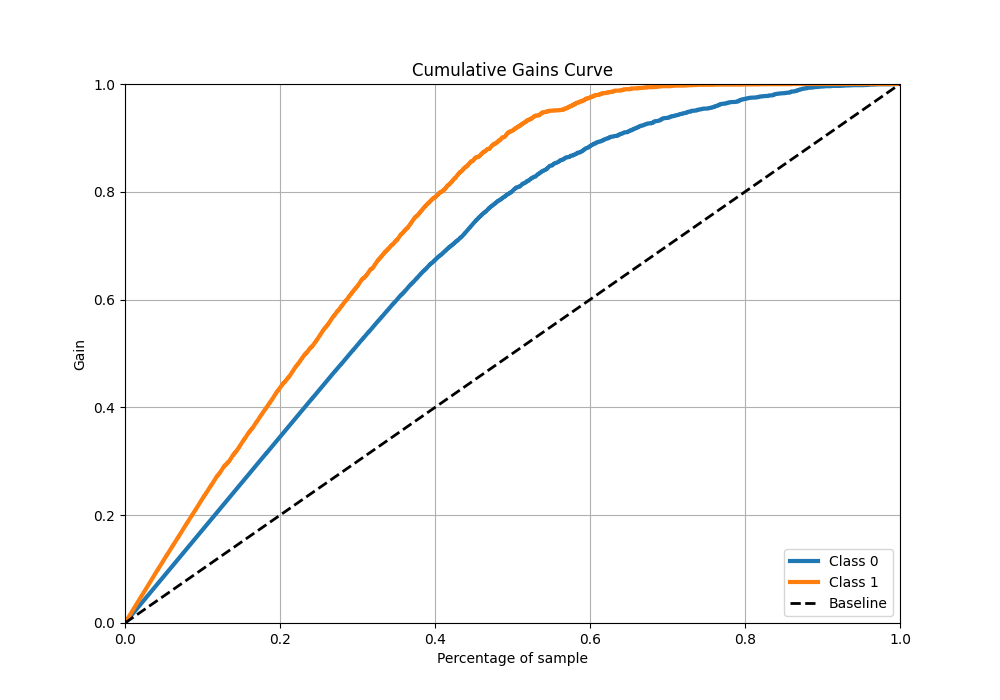
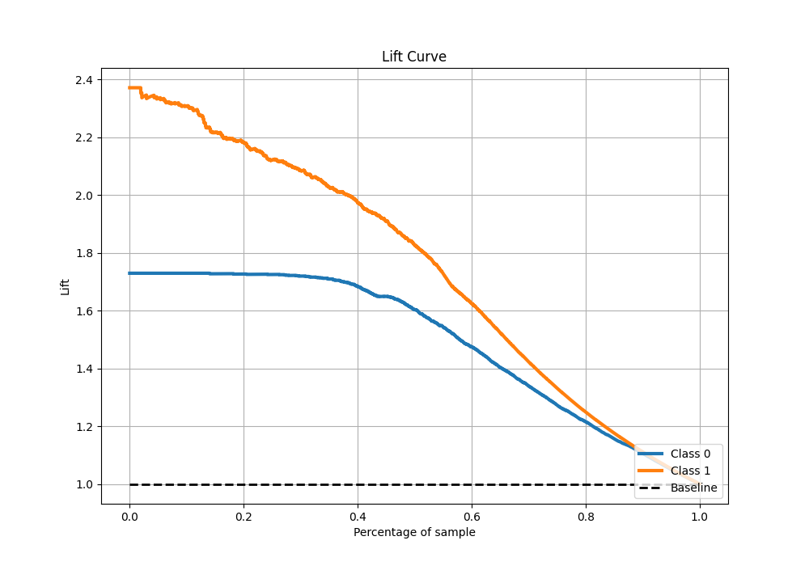

# Summary of 33_RandomForest

[<< Go back](../README.md)

## Random Forest
- **n_jobs**: -1
- **criterion**: gini
- **max_features**: 0.5
- **min_samples_split**: 50
- **max_depth**: 5
- **eval_metric_name**: f1
- **explain_level**: 0

## Validation
 - **validation_type**: split
 - **train_ratio**: 0.9
 - **shuffle**: True
 - **stratify**: True

## Optimized metric
f1

## Training time

16.8 seconds

## Metric details
|           |    score |   threshold |
|:----------|---------:|------------:|
| logloss   | 0.340115 | nan         |
| auc       | 0.929187 | nan         |
| f1        | 0.837209 |   0.465899  |
| accuracy  | 0.853781 |   0.544468  |
| precision | 0.984694 |   0.918869  |
| recall    | 1        |   0.0021333 |
| mcc       | 0.708726 |   0.465899  |

## Metric details with threshold from accuracy metric
|           |    score |   threshold |
|:----------|---------:|------------:|
| logloss   | 0.340115 |  nan        |
| auc       | 0.929187 |  nan        |
| f1        | 0.831526 |    0.544468 |
| accuracy  | 0.853781 |    0.544468 |
| precision | 0.80872  |    0.544468 |
| recall    | 0.855655 |    0.544468 |
| mcc       | 0.703422 |    0.544468 |

## Confusion matrix (at threshold=0.544468)
|              |   Predicted as 0 |   Predicted as 1 |
|:-------------|-----------------:|-----------------:|
| Labeled as 0 |             3142 |              544 |
| Labeled as 1 |              388 |             2300 |

## Learning curves

## Confusion Matrix

## Normalized Confusion Matrix

## ROC Curve

## Kolmogorov-Smirnov Statistic

## Precision-Recall Curve

## Calibration Curve

## Cumulative Gains Curve

## Lift Curve

[<< Go back](../README.md)
