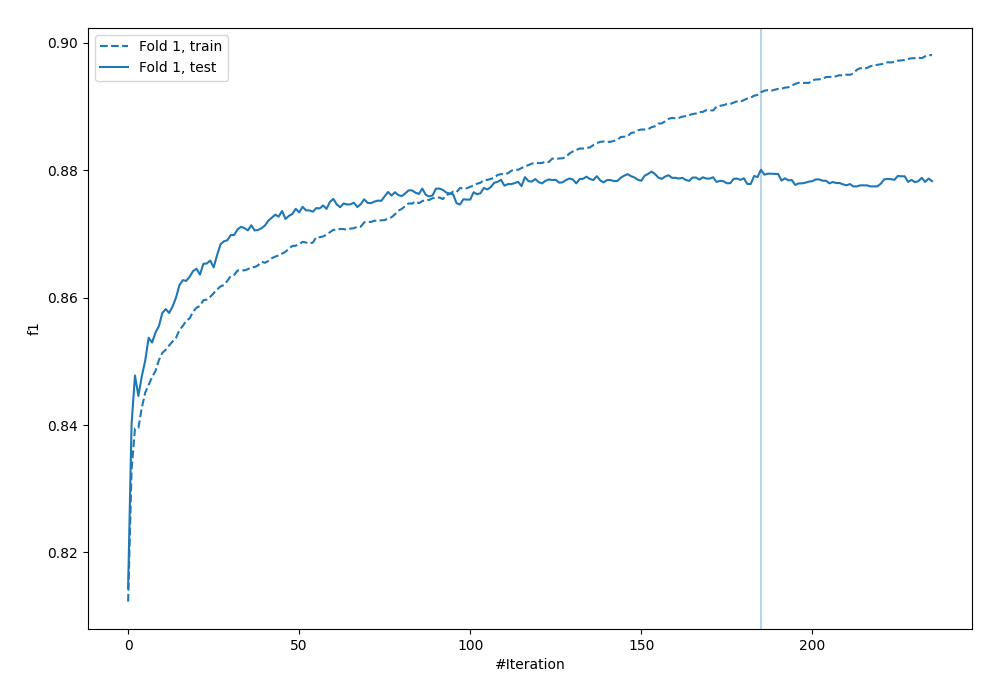
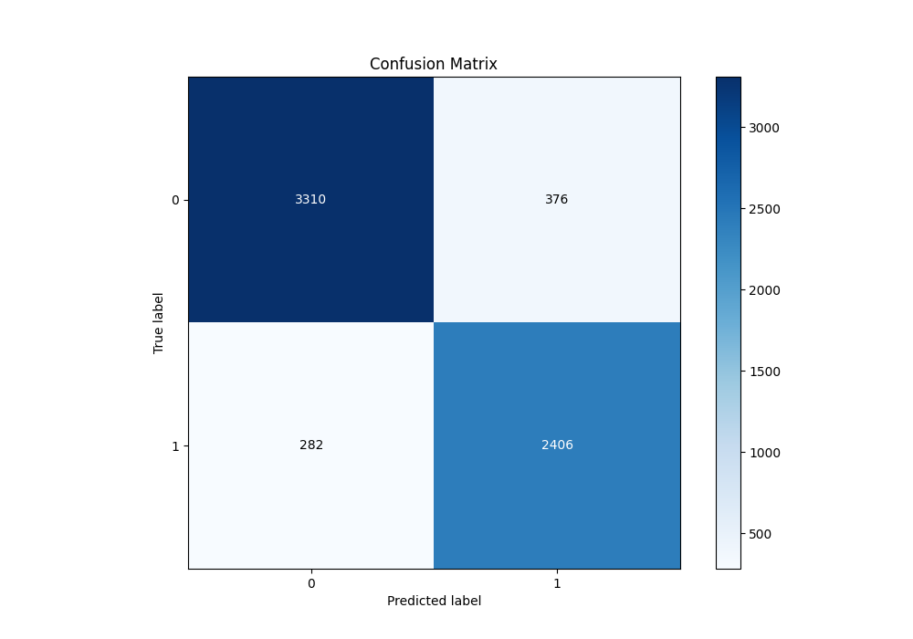
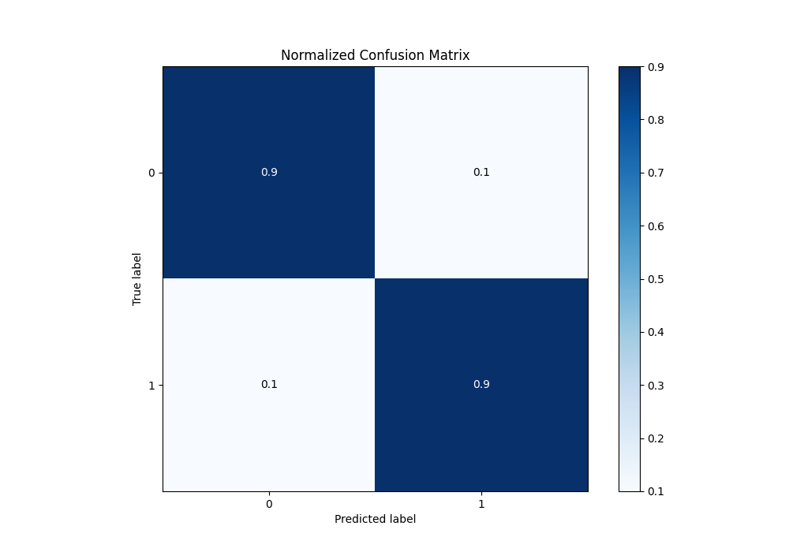
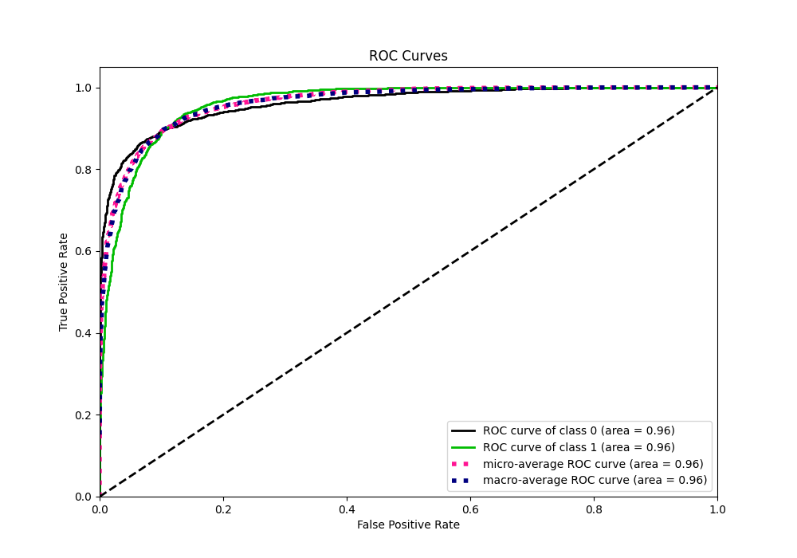
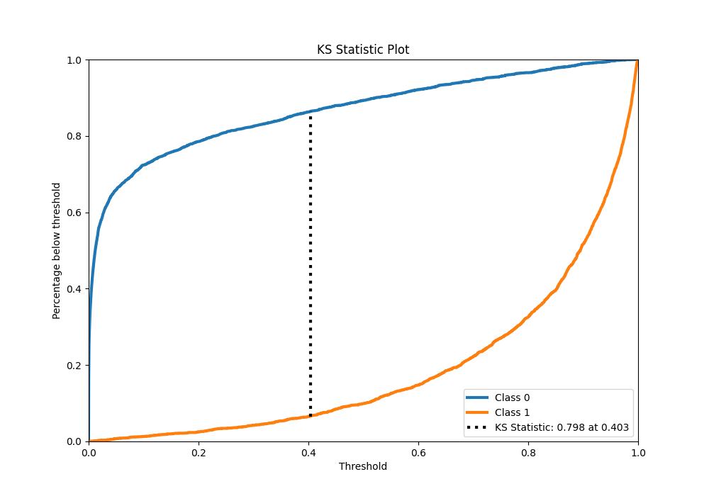
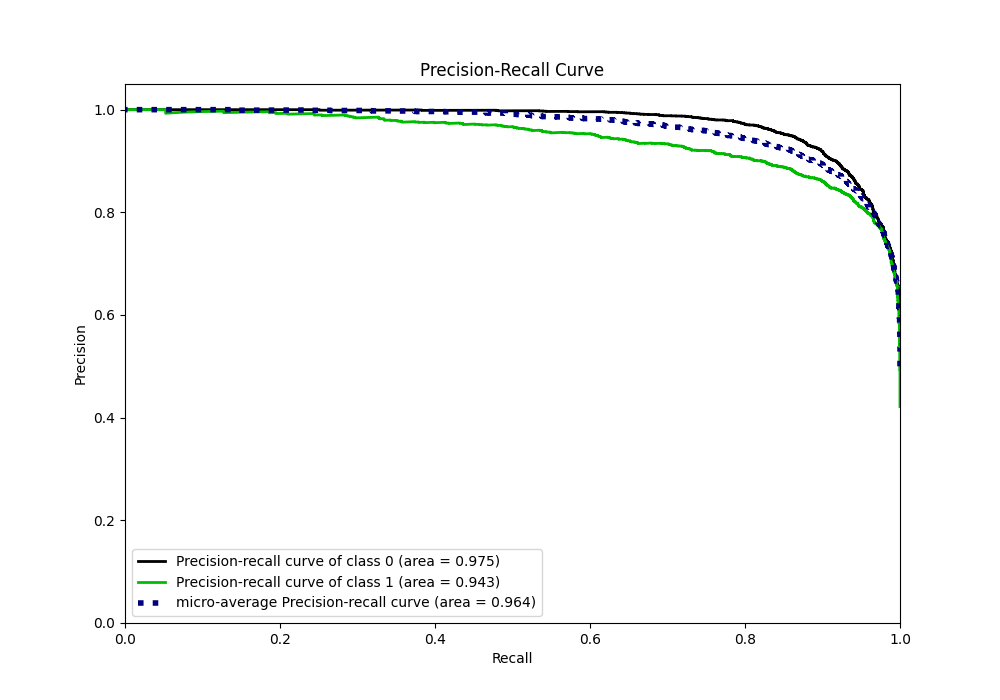
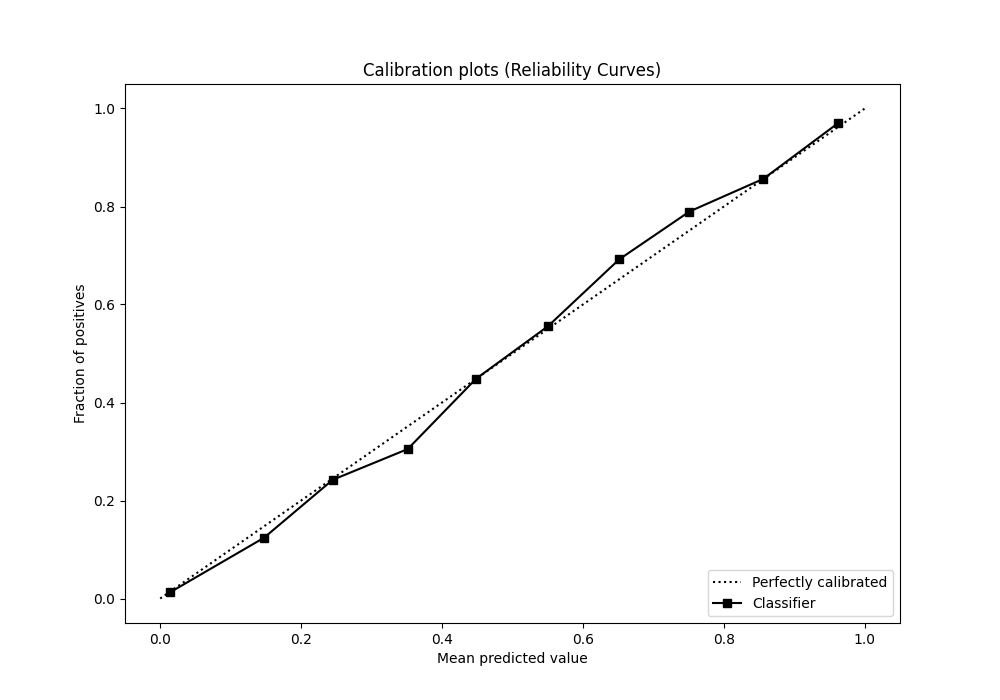
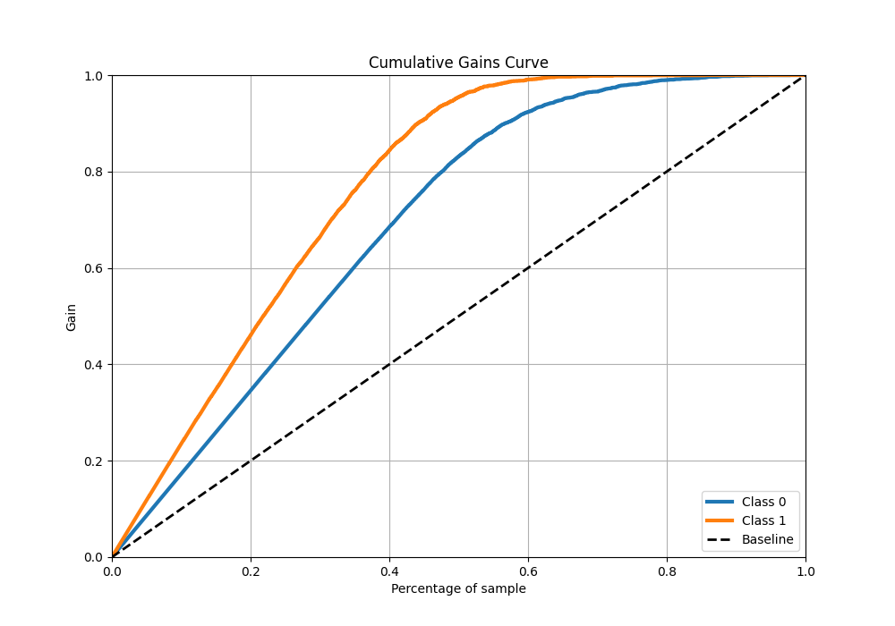
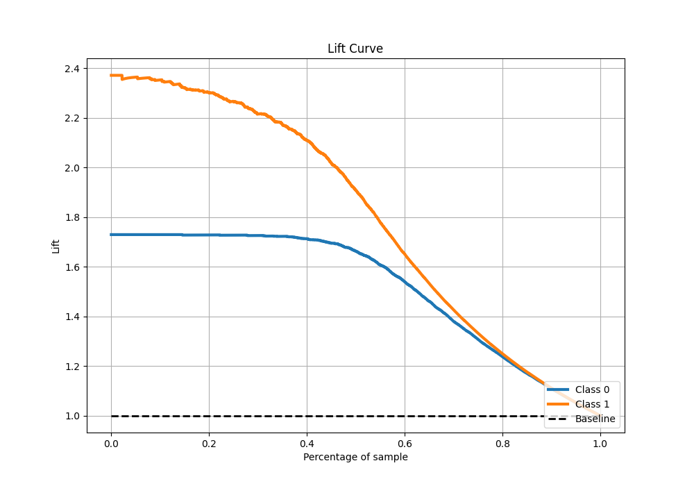

# Summary of 35_CatBoost

[<< Go back](../README.md)

## CatBoost
- **n_jobs**: -1
- **learning_rate**: 0.2
- **depth**: 7
- **rsm**: 0.8
- **loss_function**: Logloss
- **eval_metric**: F1
- **explain_level**: 0

## Validation
 - **validation_type**: split
 - **train_ratio**: 0.9
 - **shuffle**: True
 - **stratify**: True

## Optimized metric
f1

## Training time

13.0 seconds

## Metric details
|           |    score |     threshold |
|:----------|---------:|--------------:|
| logloss   | 0.245575 | nan           |
| auc       | 0.961452 | nan           |
| f1        | 0.880368 |   0.422779    |
| accuracy  | 0.896768 |   0.515387    |
| precision | 1        |   0.994118    |
| recall    | 1        |   1.43713e-06 |
| mcc       | 0.789702 |   0.515387    |

## Metric details with threshold from accuracy metric
|           |    score |   threshold |
|:----------|---------:|------------:|
| logloss   | 0.245575 |  nan        |
| auc       | 0.961452 |  nan        |
| f1        | 0.879707 |    0.515387 |
| accuracy  | 0.896768 |    0.515387 |
| precision | 0.864845 |    0.515387 |
| recall    | 0.895089 |    0.515387 |
| mcc       | 0.789702 |    0.515387 |

## Confusion matrix (at threshold=0.515387)
|              |   Predicted as 0 |   Predicted as 1 |
|:-------------|-----------------:|-----------------:|
| Labeled as 0 |             3310 |              376 |
| Labeled as 1 |              282 |             2406 |

## Learning curves

## Confusion Matrix

## Normalized Confusion Matrix

## ROC Curve

## Kolmogorov-Smirnov Statistic

## Precision-Recall Curve

## Calibration Curve

## Cumulative Gains Curve

## Lift Curve

[<< Go back](../README.md)
