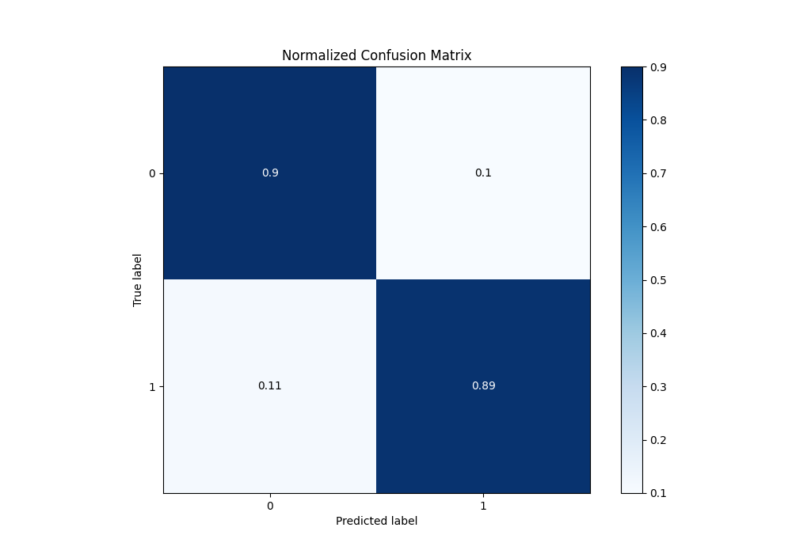
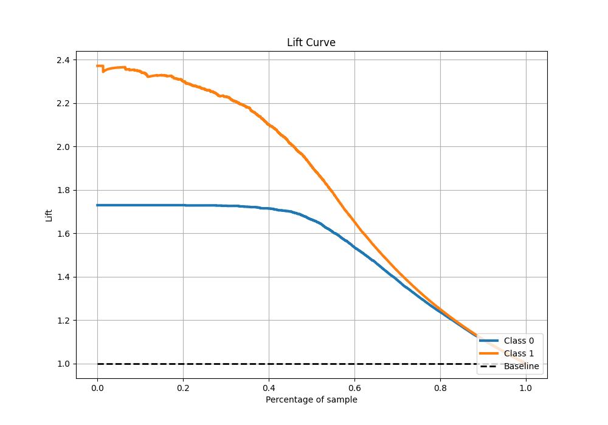

# Summary of 36_CatBoost

[<< Go back](../README.md)

## CatBoost
- **n_jobs**: -1
- **learning_rate**: 0.1
- **depth**: 8
- **rsm**: 1.0
- **loss_function**: Logloss
- **eval_metric**: F1
- **explain_level**: 0

## Validation
 - **validation_type**: split
 - **train_ratio**: 0.9
 - **shuffle**: True
 - **stratify**: True

## Optimized metric
f1

## Training time

16.2 seconds

## Metric details
|           |    score |     threshold |
|:----------|---------:|--------------:|
| logloss   | 0.245107 | nan           |
| auc       | 0.961545 | nan           |
| f1        | 0.878714 |   0.390394    |
| accuracy  | 0.89363  |   0.515048    |
| precision | 0.997423 |   0.98096     |
| recall    | 1        |   7.76727e-06 |
| mcc       | 0.785304 |   0.390394    |

## Metric details with threshold from accuracy metric
|           |    score |   threshold |
|:----------|---------:|------------:|
| logloss   | 0.245107 |  nan        |
| auc       | 0.961545 |  nan        |
| f1        | 0.876051 |    0.515048 |
| accuracy  | 0.89363  |    0.515048 |
| precision | 0.861251 |    0.515048 |
| recall    | 0.891369 |    0.515048 |
| mcc       | 0.783297 |    0.515048 |

## Confusion matrix (at threshold=0.515048)
|              |   Predicted as 0 |   Predicted as 1 |
|:-------------|-----------------:|-----------------:|
| Labeled as 0 |             3300 |              386 |
| Labeled as 1 |              292 |             2396 |

## Learning curves

## Confusion Matrix

## Normalized Confusion Matrix

## ROC Curve

## Kolmogorov-Smirnov Statistic

## Precision-Recall Curve

## Calibration Curve

## Cumulative Gains Curve

## Lift Curve

[<< Go back](../README.md)
