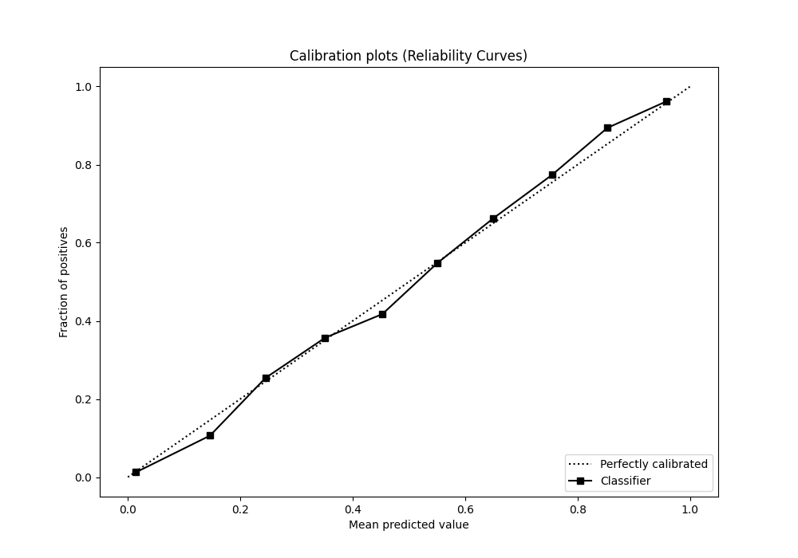

# Summary of 38_CatBoost

[<< Go back](../README.md)

## CatBoost
- **n_jobs**: -1
- **learning_rate**: 0.2
- **depth**: 7
- **rsm**: 1.0
- **loss_function**: Logloss
- **eval_metric**: F1
- **explain_level**: 0

## Validation
 - **validation_type**: split
 - **train_ratio**: 0.9
 - **shuffle**: True
 - **stratify**: True

## Optimized metric
f1

## Training time

9.0 seconds

## Metric details
|           |    score |     threshold |
|:----------|---------:|--------------:|
| logloss   | 0.25003  | nan           |
| auc       | 0.960089 | nan           |
| f1        | 0.87542  |   0.434159    |
| accuracy  | 0.892218 |   0.538898    |
| precision | 0.994975 |   0.989086    |
| recall    | 1        |   1.40724e-05 |
| mcc       | 0.780457 |   0.49184     |

## Metric details with threshold from accuracy metric
|           |    score |   threshold |
|:----------|---------:|------------:|
| logloss   | 0.25003  |  nan        |
| auc       | 0.960089 |  nan        |
| f1        | 0.872942 |    0.538898 |
| accuracy  | 0.892218 |    0.538898 |
| precision | 0.867966 |    0.538898 |
| recall    | 0.877976 |    0.538898 |
| mcc       | 0.779402 |    0.538898 |

## Confusion matrix (at threshold=0.538898)
|              |   Predicted as 0 |   Predicted as 1 |
|:-------------|-----------------:|-----------------:|
| Labeled as 0 |             3327 |              359 |
| Labeled as 1 |              328 |             2360 |

## Learning curves

## Confusion Matrix

## Normalized Confusion Matrix

## ROC Curve

## Kolmogorov-Smirnov Statistic

## Precision-Recall Curve

## Calibration Curve

## Cumulative Gains Curve

## Lift Curve

[<< Go back](../README.md)
