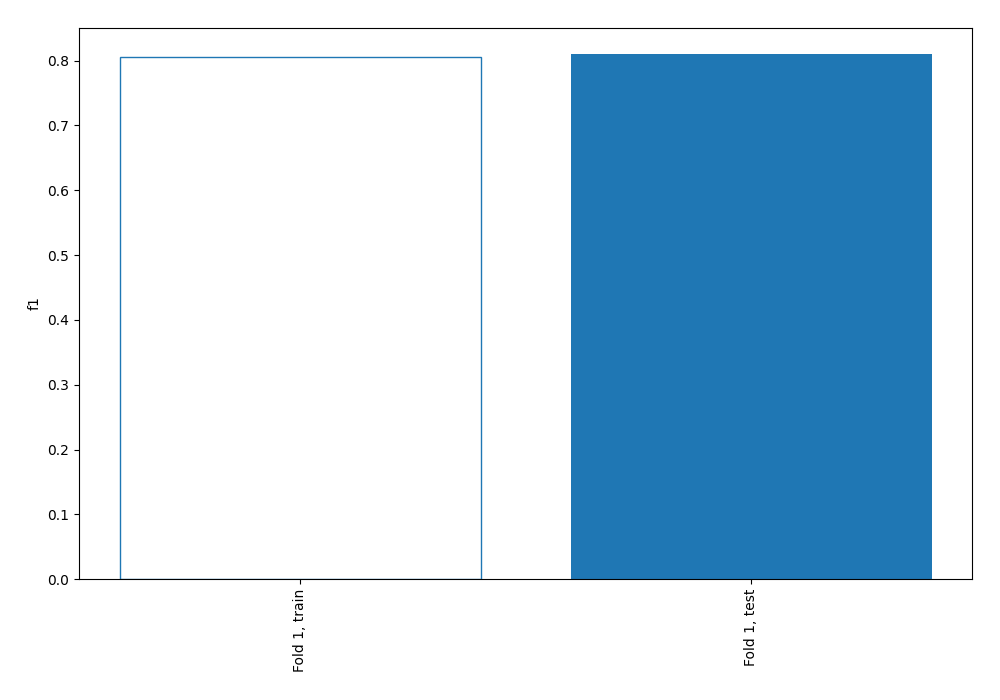
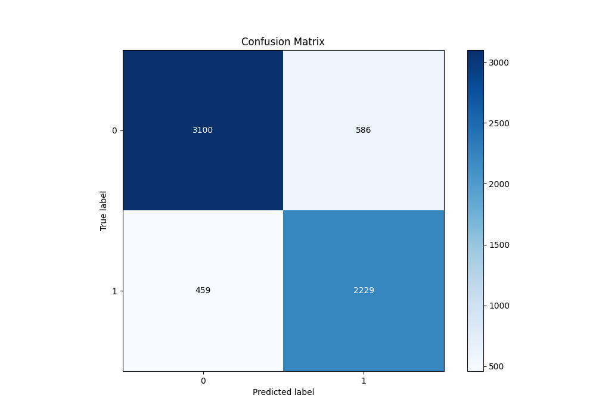
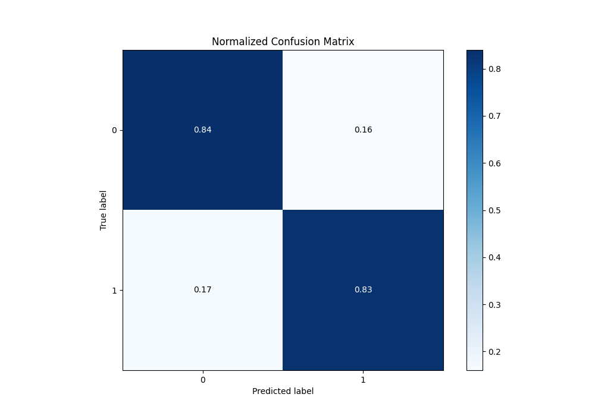
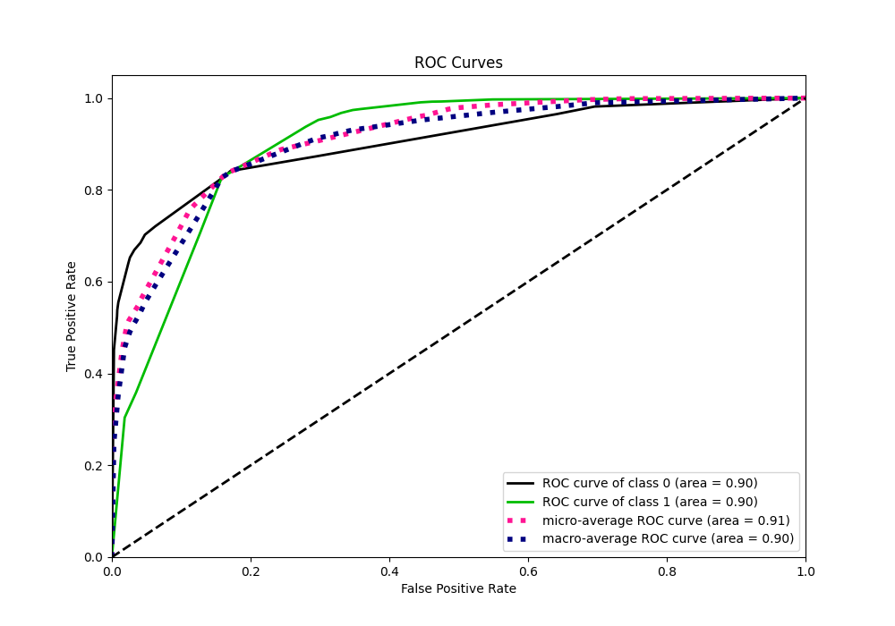
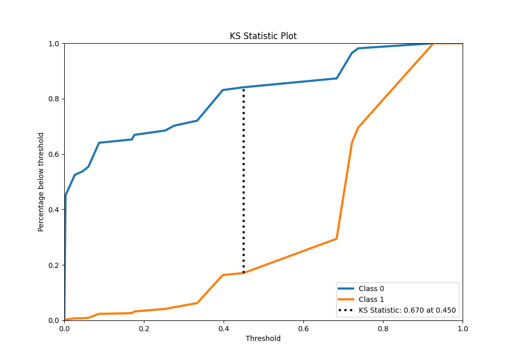
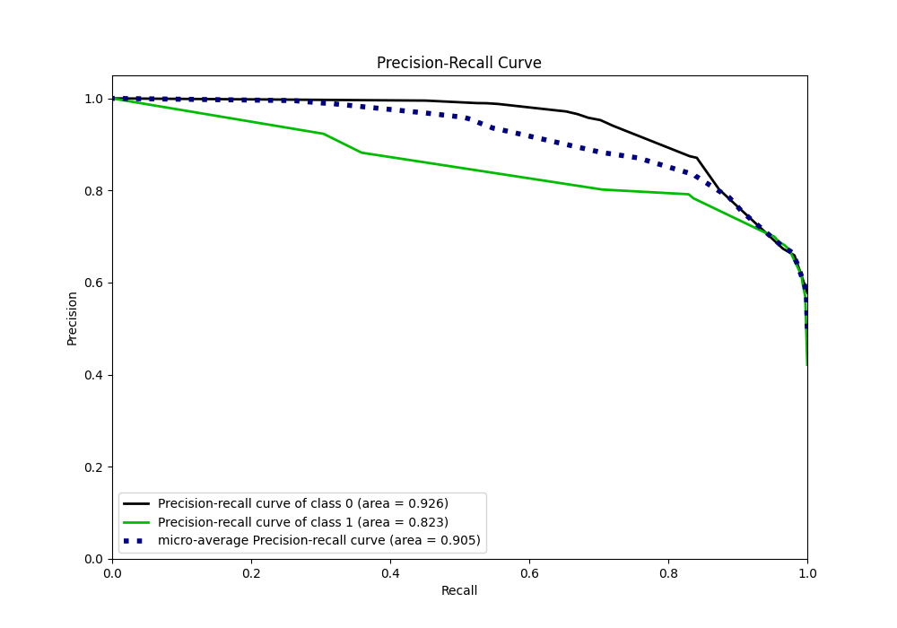
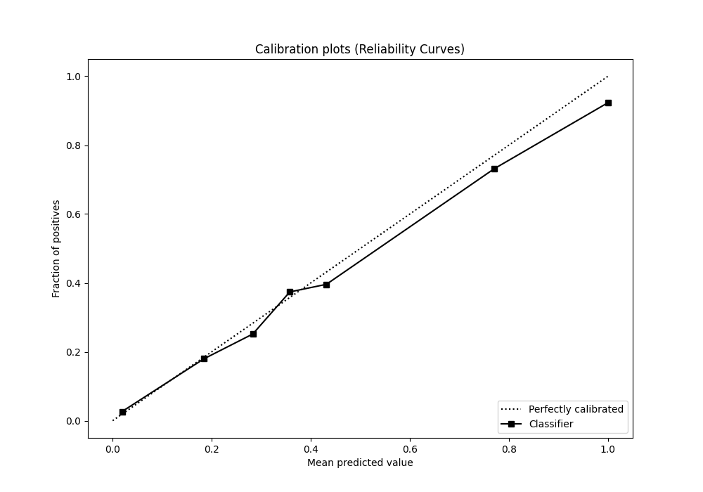
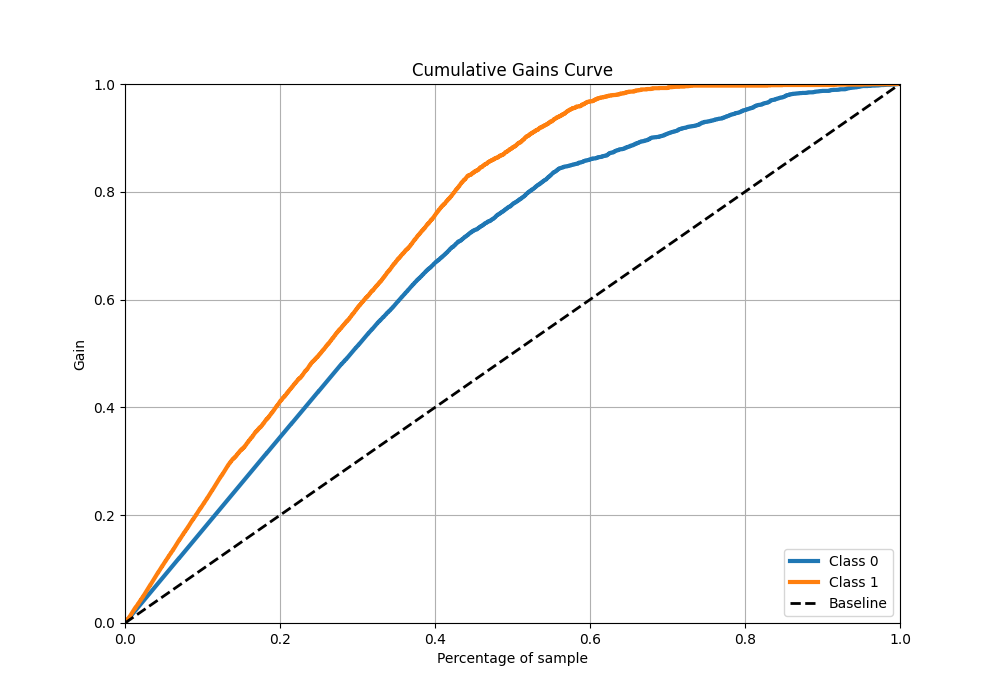
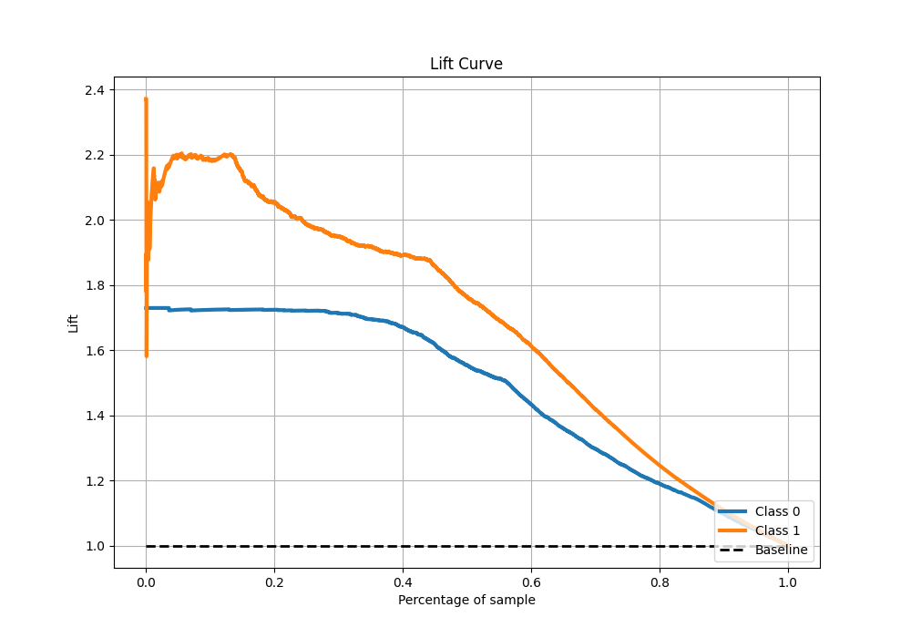

# Summary of 3_DecisionTree

[<< Go back](../README.md)

## Decision Tree
- **n_jobs**: -1
- **criterion**: gini
- **max_depth**: 4
- **explain_level**: 0

## Validation
 - **validation_type**: split
 - **train_ratio**: 0.9
 - **shuffle**: True
 - **stratify**: True

## Optimized metric
f1

## Training time

4.2 seconds

## Metric details
|           |    score |    threshold |
|:----------|---------:|-------------:|
| logloss   | 0.365704 | nan          |
| auc       | 0.902797 | nan          |
| f1        | 0.810104 |   0.449821   |
| accuracy  | 0.836053 |   0.449821   |
| precision | 0.923164 |   0.738095   |
| recall    | 1        |   0.00292916 |
| mcc       | 0.666551 |   0.449821   |

## Metric details with threshold from accuracy metric
|           |    score |   threshold |
|:----------|---------:|------------:|
| logloss   | 0.365704 |  nan        |
| auc       | 0.902797 |  nan        |
| f1        | 0.810104 |    0.449821 |
| accuracy  | 0.836053 |    0.449821 |
| precision | 0.791829 |    0.449821 |
| recall    | 0.829241 |    0.449821 |
| mcc       | 0.666551 |    0.449821 |

## Confusion matrix (at threshold=0.449821)
|              |   Predicted as 0 |   Predicted as 1 |
|:-------------|-----------------:|-----------------:|
| Labeled as 0 |             3100 |              586 |
| Labeled as 1 |              459 |             2229 |

## Learning curves

## Confusion Matrix

## Normalized Confusion Matrix

## ROC Curve

## Kolmogorov-Smirnov Statistic

## Precision-Recall Curve

## Calibration Curve

## Cumulative Gains Curve

## Lift Curve

[<< Go back](../README.md)
