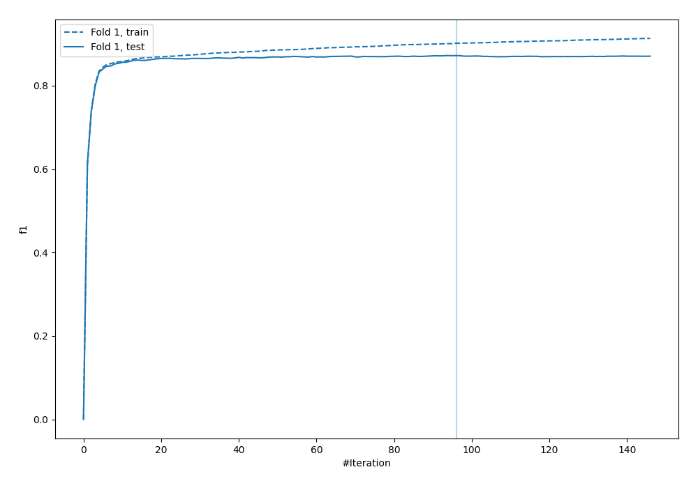
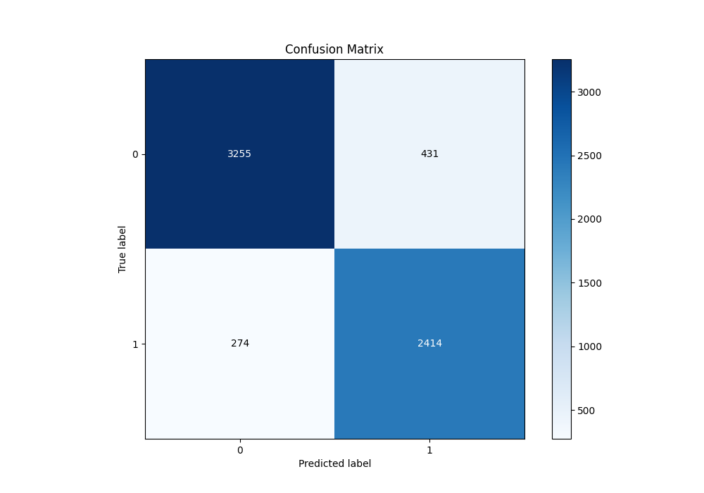
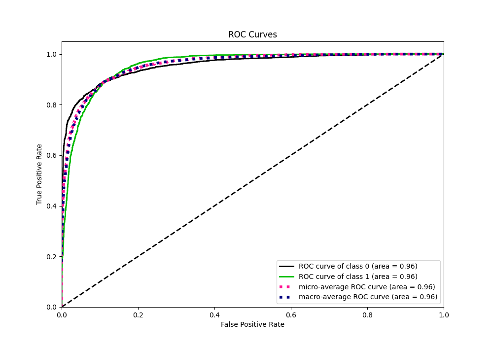
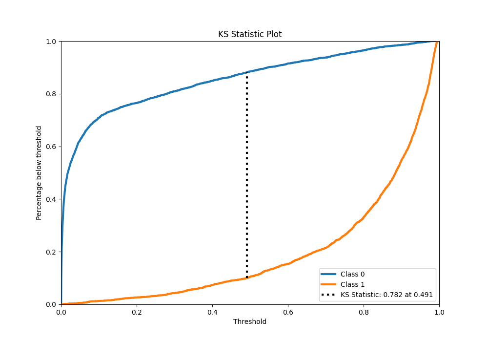
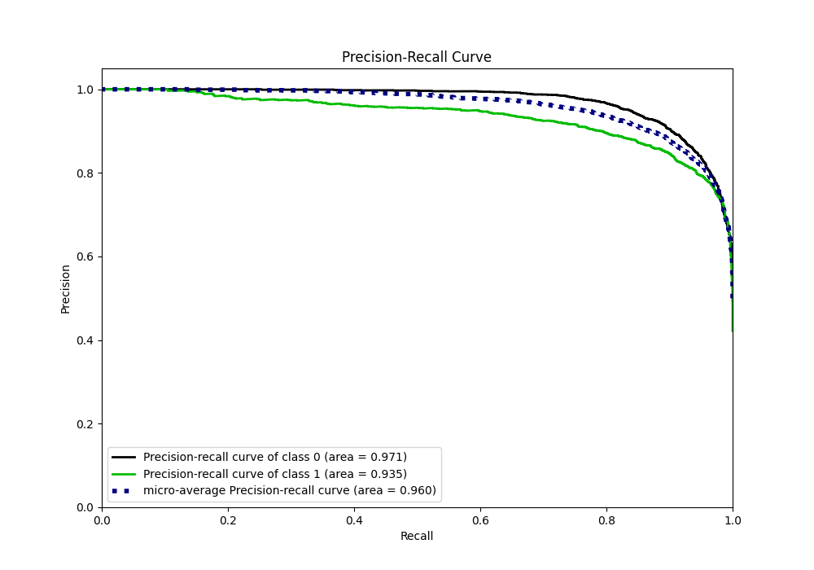
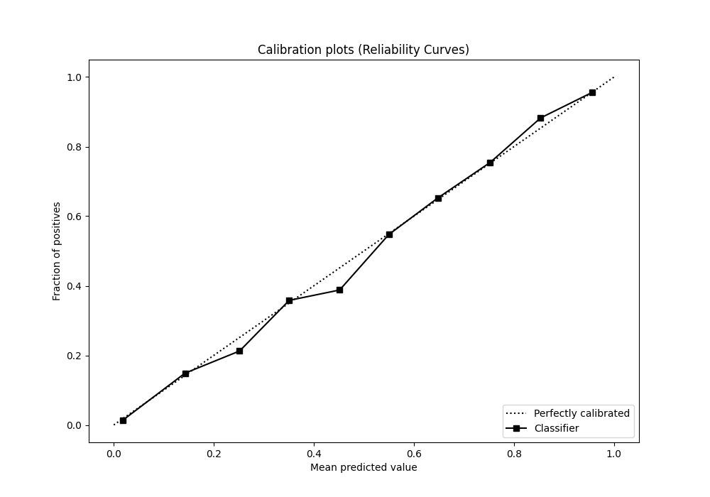
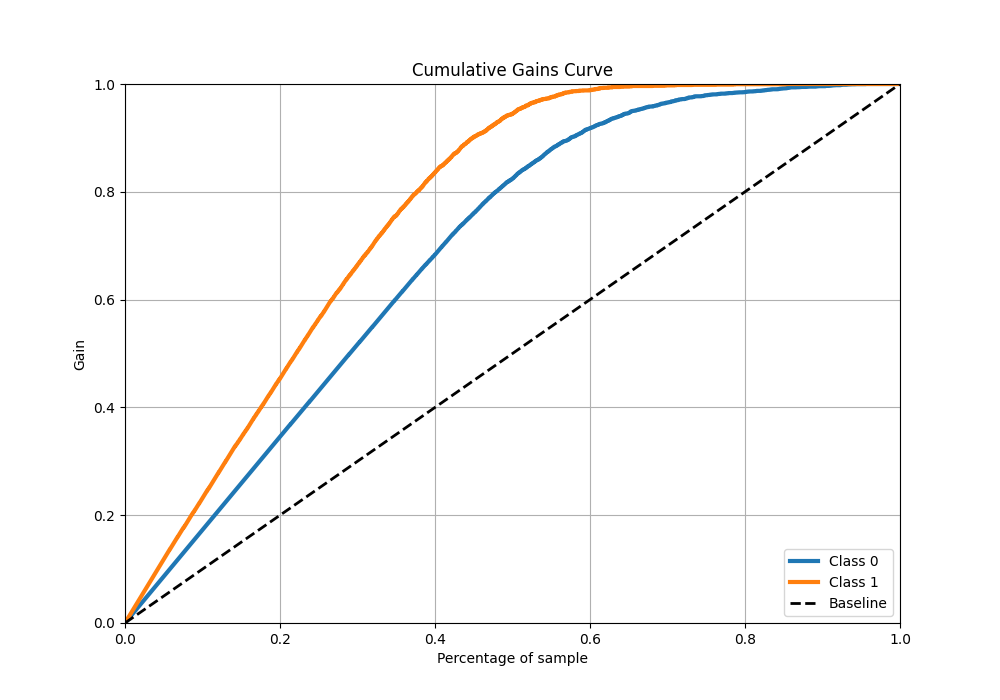
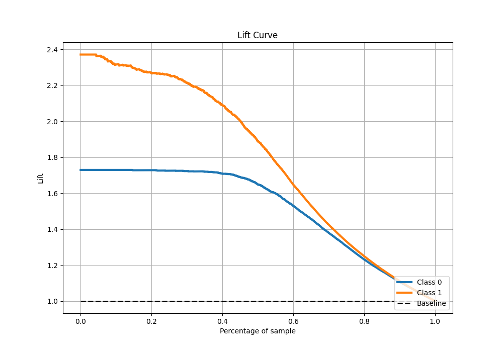

# Summary of 42_Xgboost

[<< Go back](../README.md)

## Extreme Gradient Boosting (Xgboost)
- **n_jobs**: -1
- **objective**: binary:logistic
- **eta**: 0.1
- **max_depth**: 8
- **min_child_weight**: 1
- **subsample**: 1.0
- **colsample_bytree**: 0.9
- **eval_metric**: f1
- **explain_level**: 0

## Validation
 - **validation_type**: split
 - **train_ratio**: 0.9
 - **shuffle**: True
 - **stratify**: True

## Optimized metric
f1

## Training time

7.5 seconds

## Metric details
|           |    score |     threshold |
|:----------|---------:|--------------:|
| logloss   | 0.260322 | nan           |
| auc       | 0.956737 | nan           |
| f1        | 0.872583 |   0.495561    |
| accuracy  | 0.889394 |   0.495561    |
| precision | 1        |   0.981037    |
| recall    | 1        |   0.000241864 |
| mcc       | 0.775983 |   0.495561    |

## Metric details with threshold from accuracy metric
|           |    score |   threshold |
|:----------|---------:|------------:|
| logloss   | 0.260322 |  nan        |
| auc       | 0.956737 |  nan        |
| f1        | 0.872583 |    0.495561 |
| accuracy  | 0.889394 |    0.495561 |
| precision | 0.848506 |    0.495561 |
| recall    | 0.898065 |    0.495561 |
| mcc       | 0.775983 |    0.495561 |

## Confusion matrix (at threshold=0.495561)
|              |   Predicted as 0 |   Predicted as 1 |
|:-------------|-----------------:|-----------------:|
| Labeled as 0 |             3255 |              431 |
| Labeled as 1 |              274 |             2414 |

## Learning curves

## Confusion Matrix

## Normalized Confusion Matrix

## ROC Curve

## Kolmogorov-Smirnov Statistic

## Precision-Recall Curve

## Calibration Curve

## Cumulative Gains Curve

## Lift Curve

[<< Go back](../README.md)
