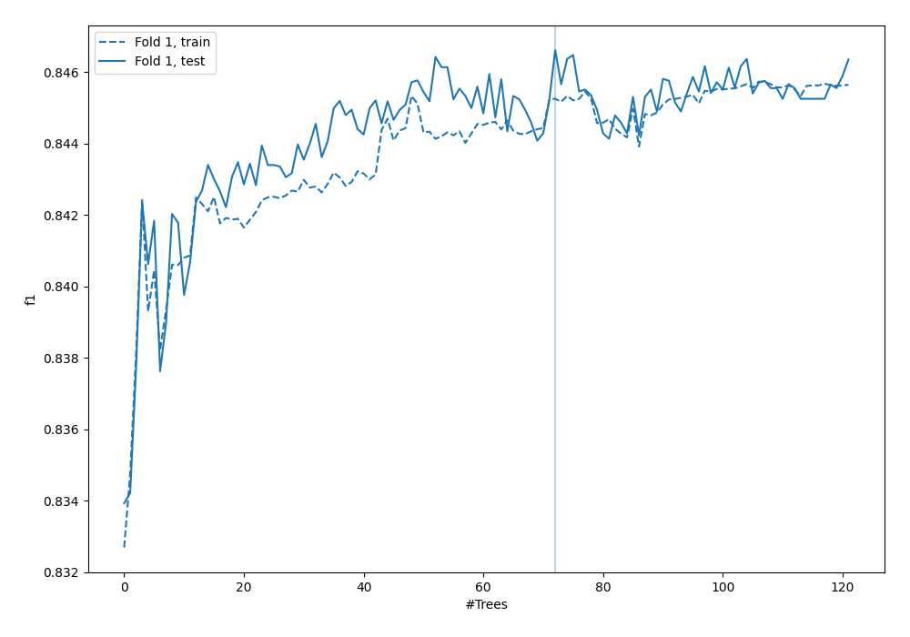
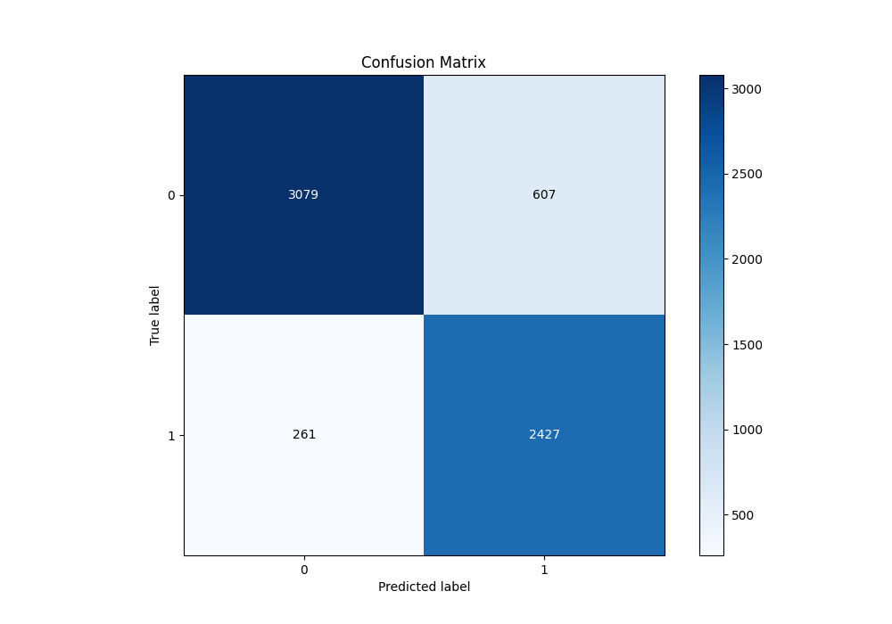
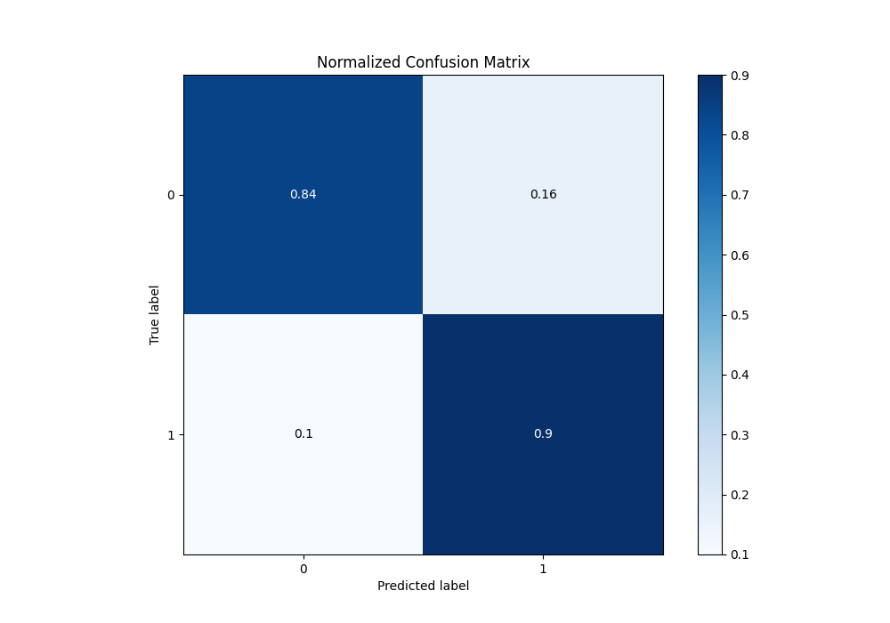
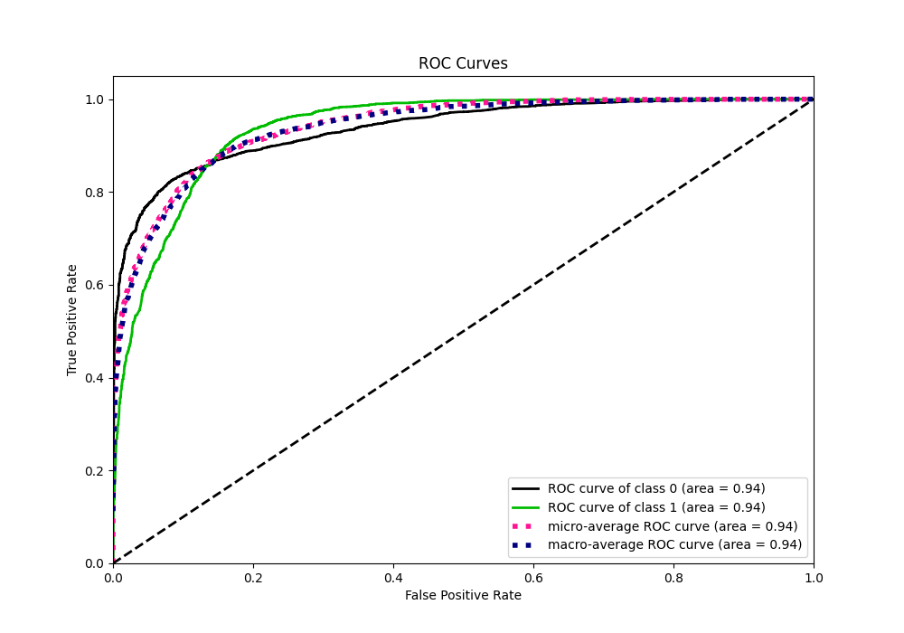
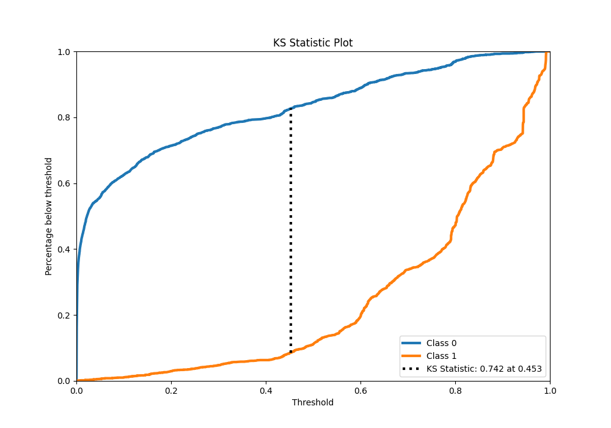
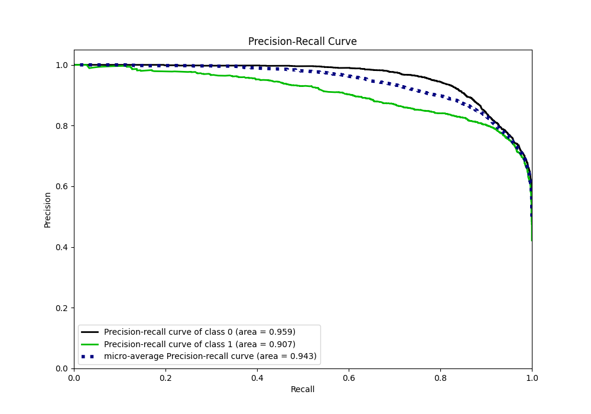
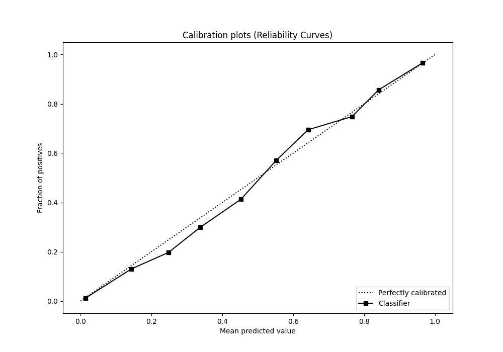
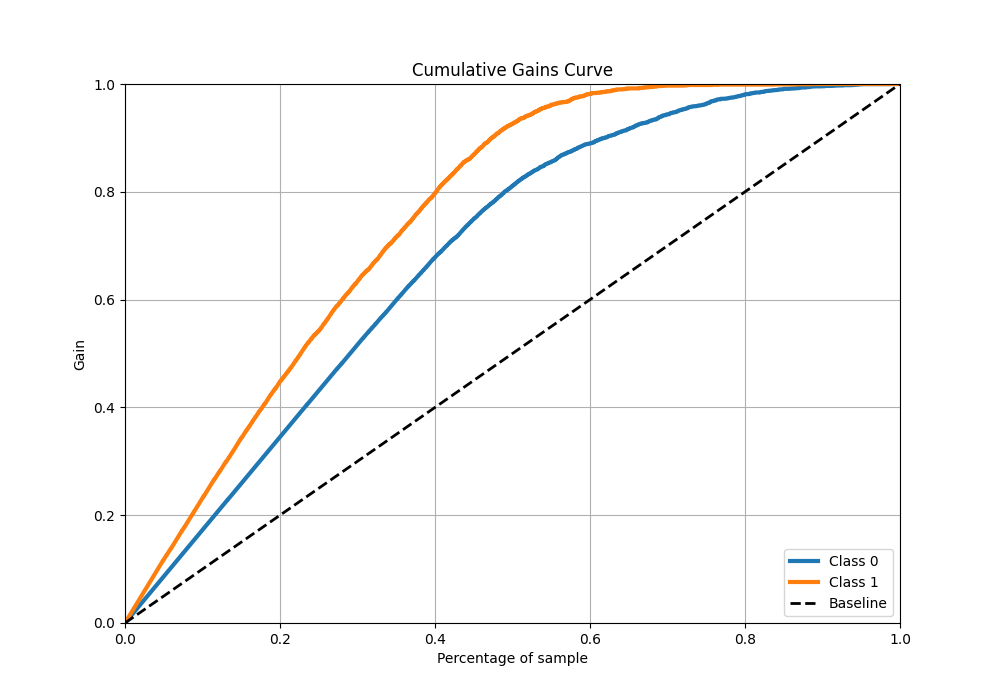
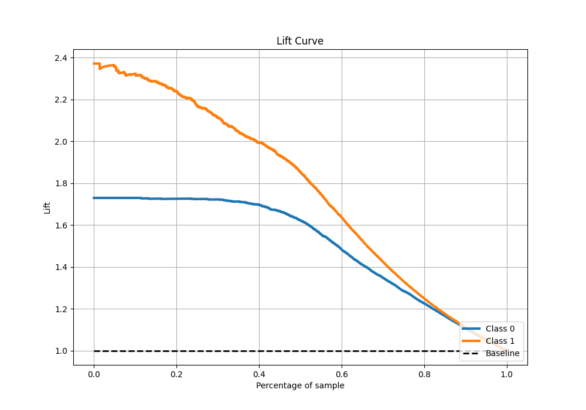

# Summary of 44_RandomForest

[<< Go back](../README.md)

## Random Forest
- **n_jobs**: -1
- **criterion**: entropy
- **max_features**: 1.0
- **min_samples_split**: 40
- **max_depth**: 7
- **eval_metric_name**: f1
- **explain_level**: 0

## Validation
 - **validation_type**: split
 - **train_ratio**: 0.9
 - **shuffle**: True
 - **stratify**: True

## Optimized metric
f1

## Training time

35.2 seconds

## Metric details
|           |    score |     threshold |
|:----------|---------:|--------------:|
| logloss   | 0.308734 | nan           |
| auc       | 0.937735 | nan           |
| f1        | 0.849784 |   0.453056    |
| accuracy  | 0.863822 |   0.476162    |
| precision | 0.996047 |   0.973351    |
| recall    | 1        |   0.000143225 |
| mcc       | 0.732228 |   0.453056    |

## Metric details with threshold from accuracy metric
|           |    score |   threshold |
|:----------|---------:|------------:|
| logloss   | 0.308734 |  nan        |
| auc       | 0.937735 |  nan        |
| f1        | 0.848305 |    0.476162 |
| accuracy  | 0.863822 |    0.476162 |
| precision | 0.799934 |    0.476162 |
| recall    | 0.902902 |    0.476162 |
| mcc       | 0.729961 |    0.476162 |

## Confusion matrix (at threshold=0.476162)
|              |   Predicted as 0 |   Predicted as 1 |
|:-------------|-----------------:|-----------------:|
| Labeled as 0 |             3079 |              607 |
| Labeled as 1 |              261 |             2427 |

## Learning curves

## Confusion Matrix

## Normalized Confusion Matrix

## ROC Curve

## Kolmogorov-Smirnov Statistic

## Precision-Recall Curve

## Calibration Curve

## Cumulative Gains Curve

## Lift Curve

[<< Go back](../README.md)
