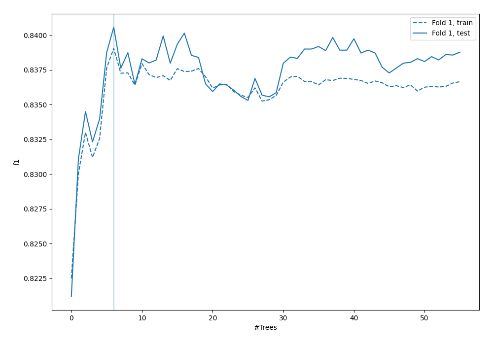
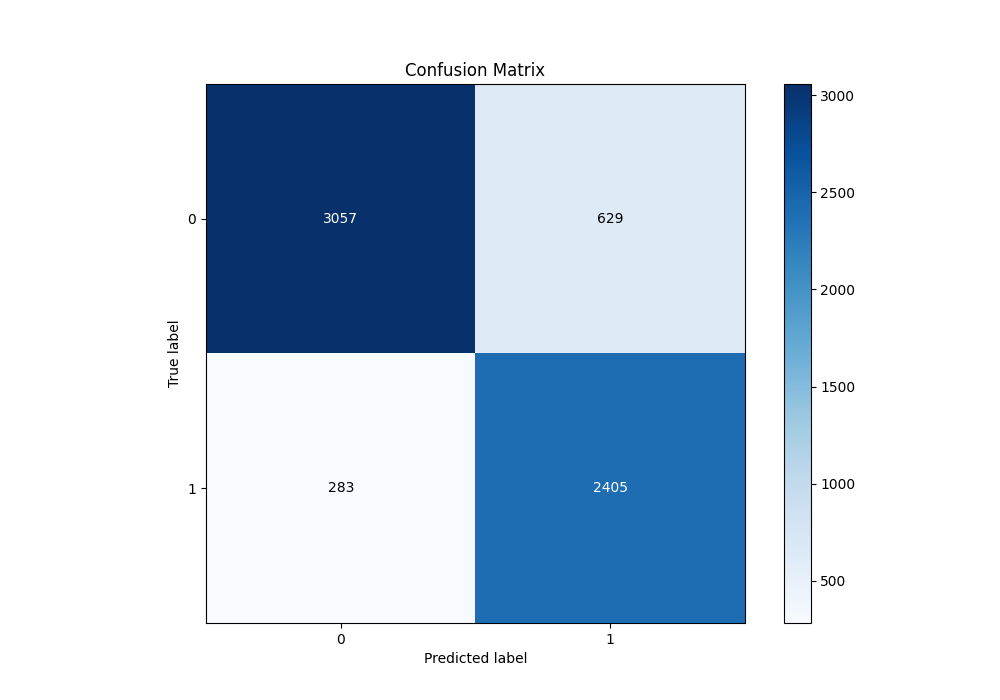
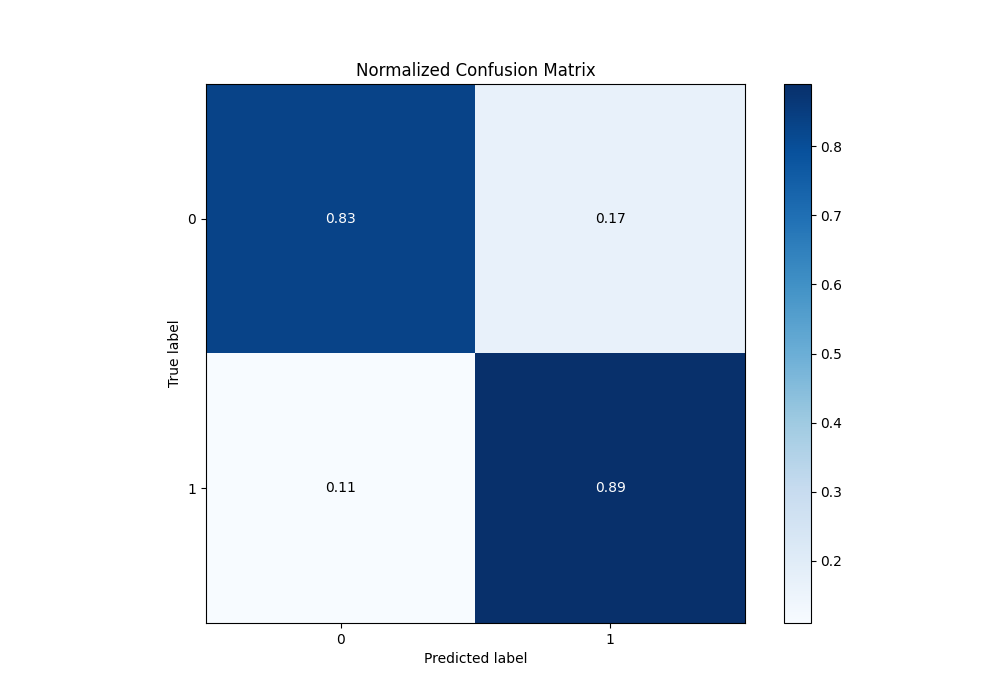
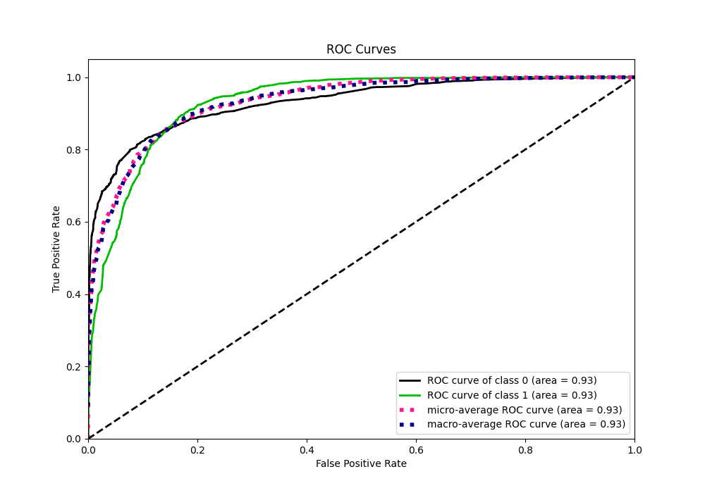
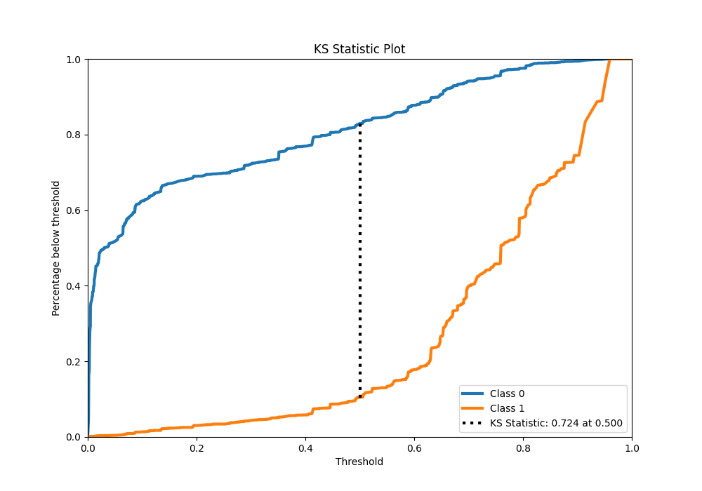
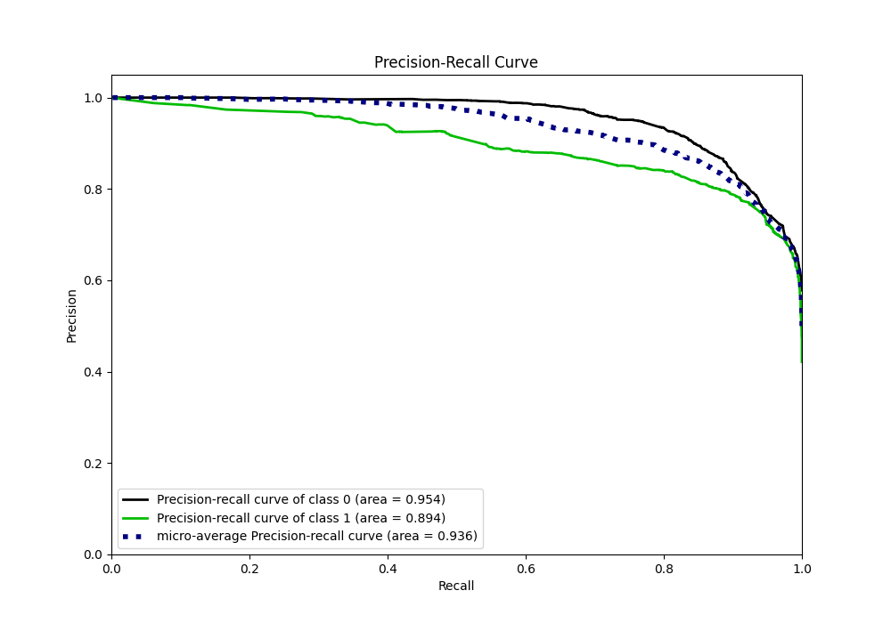
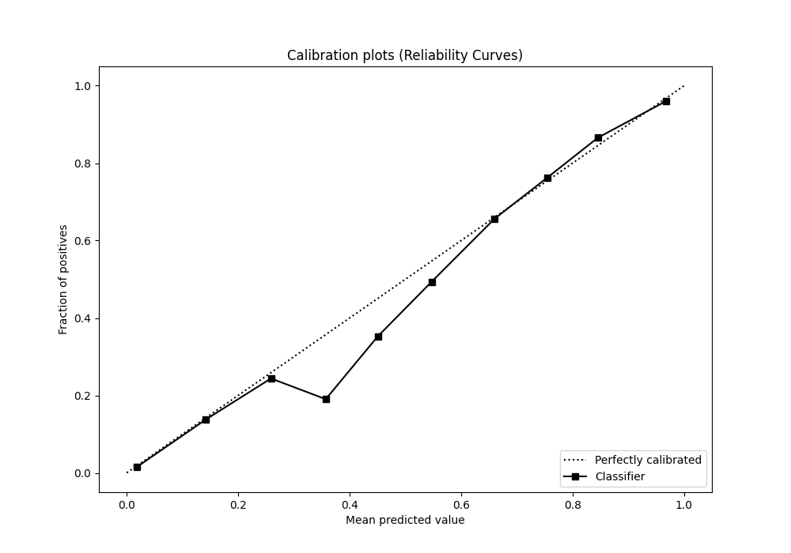
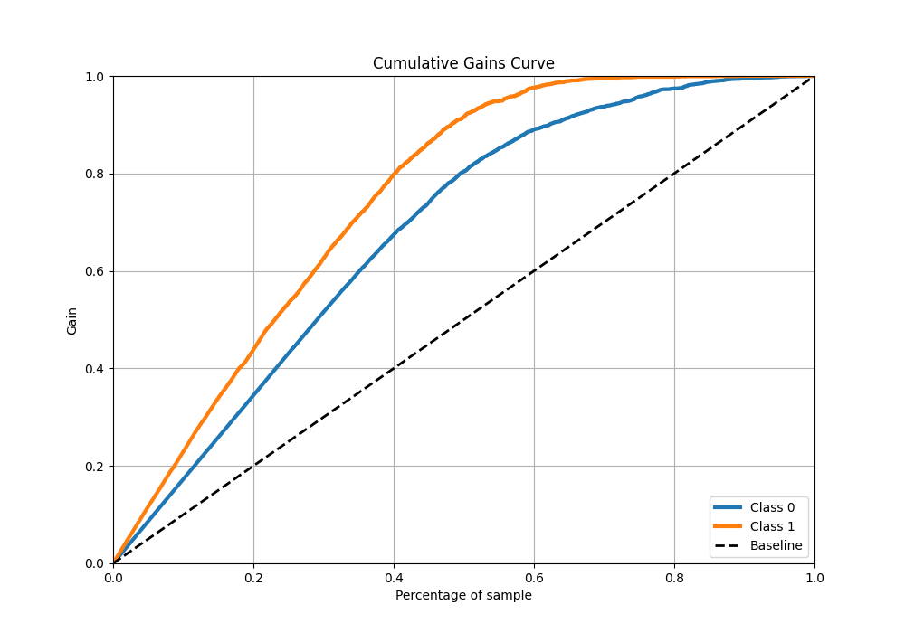
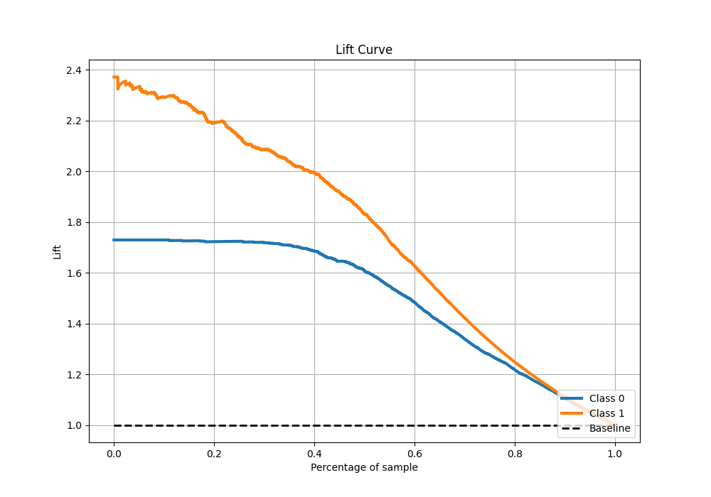

# Summary of 45_RandomForest

[<< Go back](../README.md)

## Random Forest
- **n_jobs**: -1
- **criterion**: gini
- **max_features**: 0.6
- **min_samples_split**: 50
- **max_depth**: 6
- **eval_metric_name**: f1
- **explain_level**: 0

## Validation
 - **validation_type**: split
 - **train_ratio**: 0.9
 - **shuffle**: True
 - **stratify**: True

## Optimized metric
f1

## Training time

16.3 seconds

## Metric details
|           |    score |    threshold |
|:----------|---------:|-------------:|
| logloss   | 0.32776  | nan          |
| auc       | 0.931354 | nan          |
| f1        | 0.840615 |   0.505088   |
| accuracy  | 0.856919 |   0.505088   |
| precision | 0.988024 |   0.950893   |
| recall    | 1        |   0.00127744 |
| mcc       | 0.715967 |   0.505088   |

## Metric details with threshold from accuracy metric
|           |    score |   threshold |
|:----------|---------:|------------:|
| logloss   | 0.32776  |  nan        |
| auc       | 0.931354 |  nan        |
| f1        | 0.840615 |    0.505088 |
| accuracy  | 0.856919 |    0.505088 |
| precision | 0.792683 |    0.505088 |
| recall    | 0.894717 |    0.505088 |
| mcc       | 0.715967 |    0.505088 |

## Confusion matrix (at threshold=0.505088)
|              |   Predicted as 0 |   Predicted as 1 |
|:-------------|-----------------:|-----------------:|
| Labeled as 0 |             3057 |              629 |
| Labeled as 1 |              283 |             2405 |

## Learning curves

## Confusion Matrix

## Normalized Confusion Matrix

## ROC Curve

## Kolmogorov-Smirnov Statistic

## Precision-Recall Curve

## Calibration Curve

## Cumulative Gains Curve

## Lift Curve

[<< Go back](../README.md)
