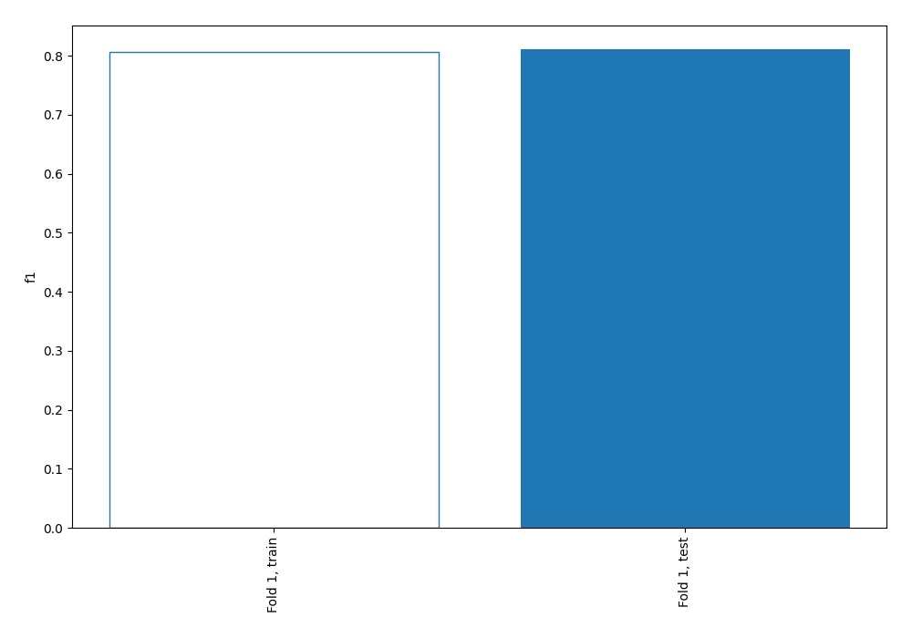
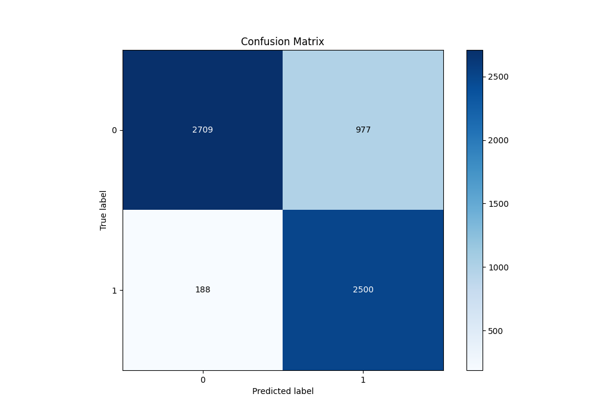
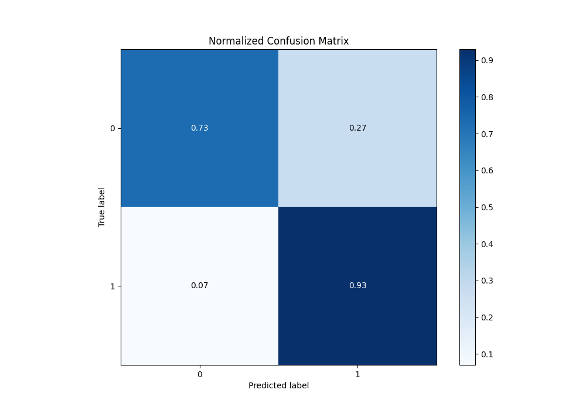
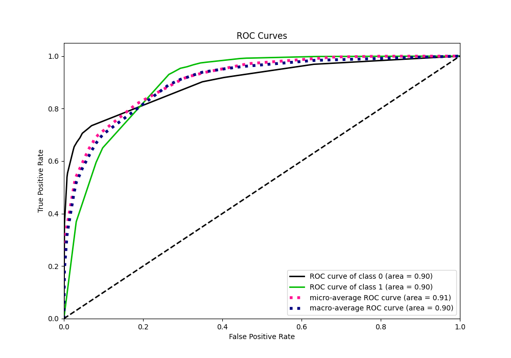
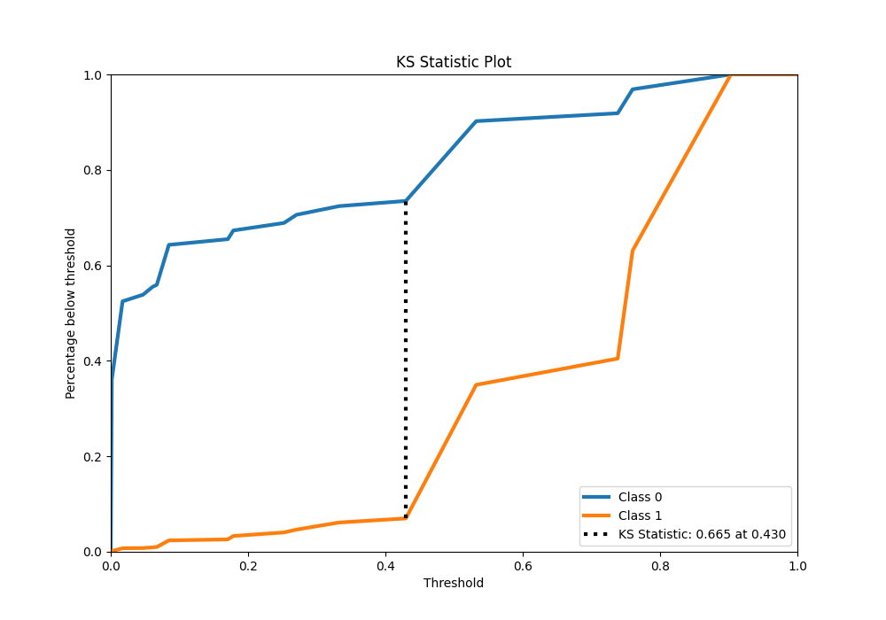
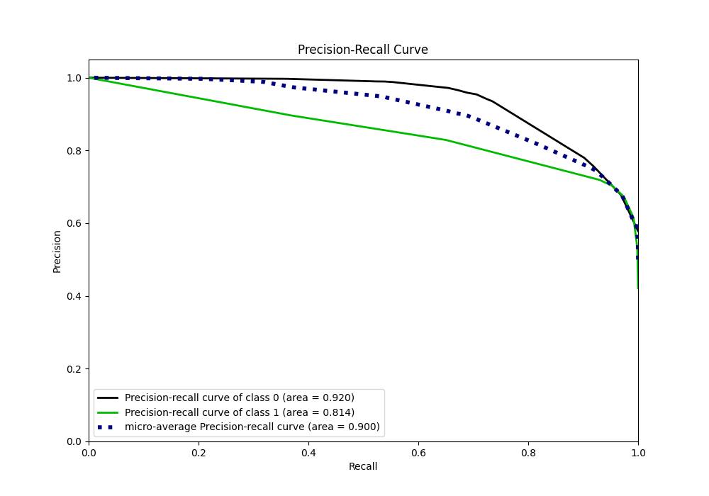
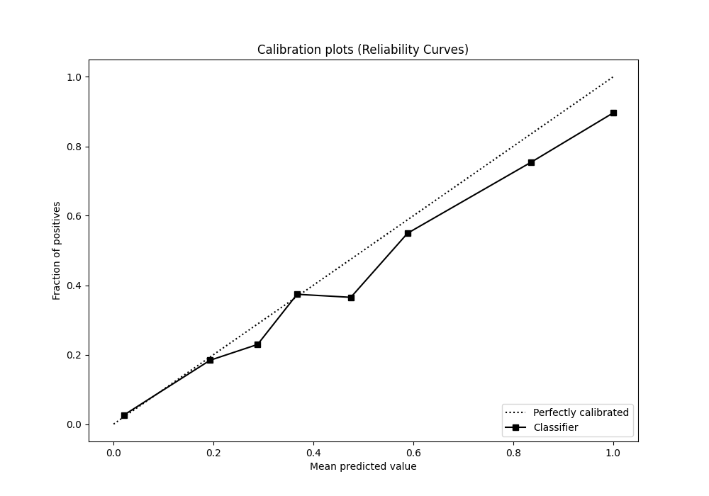
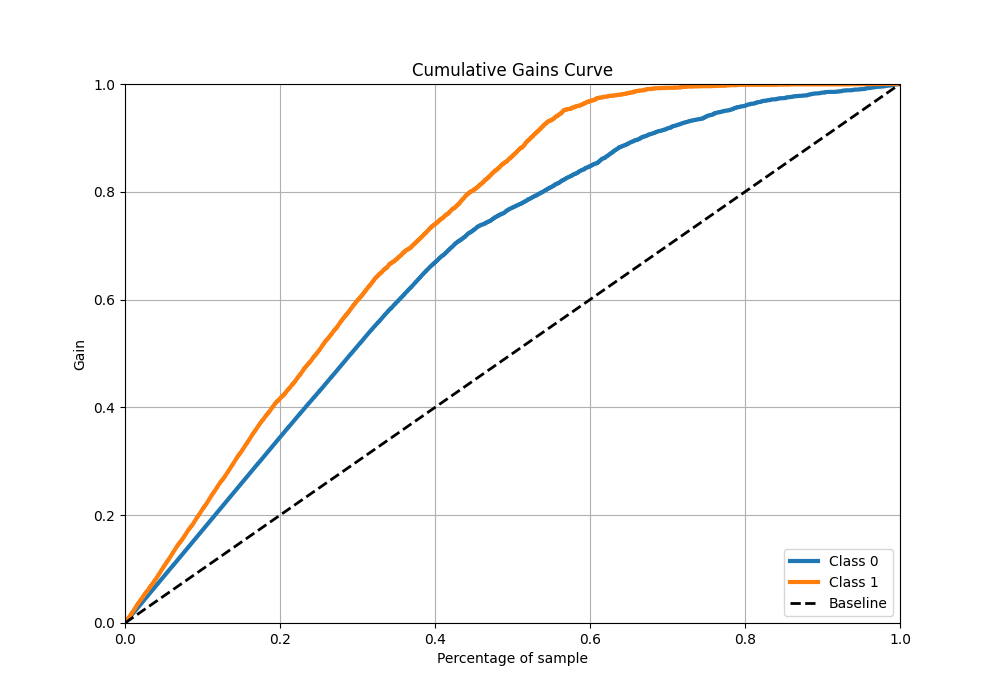
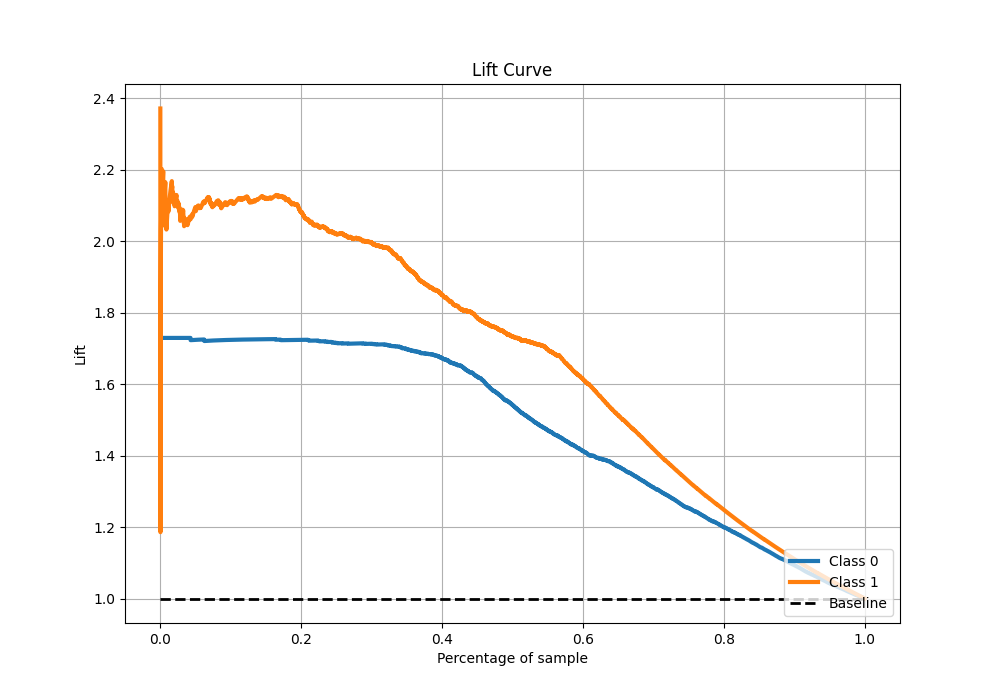

# Summary of 46_DecisionTree

[<< Go back](../README.md)

## Decision Tree
- **n_jobs**: -1
- **criterion**: entropy
- **max_depth**: 4
- **explain_level**: 0

## Validation
 - **validation_type**: split
 - **train_ratio**: 0.9
 - **shuffle**: True
 - **stratify**: True

## Optimized metric
f1

## Training time

4.5 seconds

## Metric details
|           |    score |   threshold |
|:----------|---------:|------------:|
| logloss   | 0.373633 | nan         |
| auc       | 0.900702 | nan         |
| f1        | 0.81103  |   0.429752  |
| accuracy  | 0.817226 |   0.429752  |
| precision | 0.896116 |   0.760027  |
| recall    | 1        |   0.0013373 |
| mcc       | 0.659537 |   0.429752  |

## Metric details with threshold from accuracy metric
|           |    score |   threshold |
|:----------|---------:|------------:|
| logloss   | 0.373633 |  nan        |
| auc       | 0.900702 |  nan        |
| f1        | 0.81103  |    0.429752 |
| accuracy  | 0.817226 |    0.429752 |
| precision | 0.719011 |    0.429752 |
| recall    | 0.93006  |    0.429752 |
| mcc       | 0.659537 |    0.429752 |

## Confusion matrix (at threshold=0.429752)
|              |   Predicted as 0 |   Predicted as 1 |
|:-------------|-----------------:|-----------------:|
| Labeled as 0 |             2709 |              977 |
| Labeled as 1 |              188 |             2500 |

## Learning curves

## Confusion Matrix

## Normalized Confusion Matrix

## ROC Curve

## Kolmogorov-Smirnov Statistic

## Precision-Recall Curve

## Calibration Curve

## Cumulative Gains Curve

## Lift Curve

[<< Go back](../README.md)
