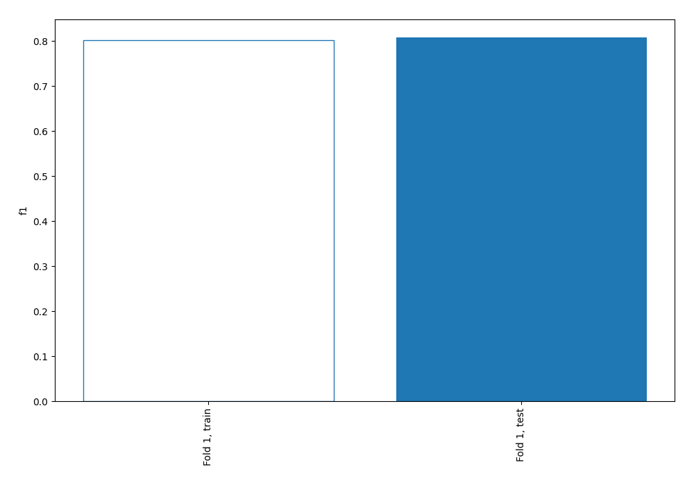
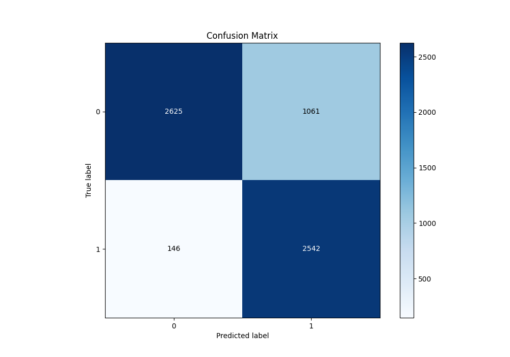
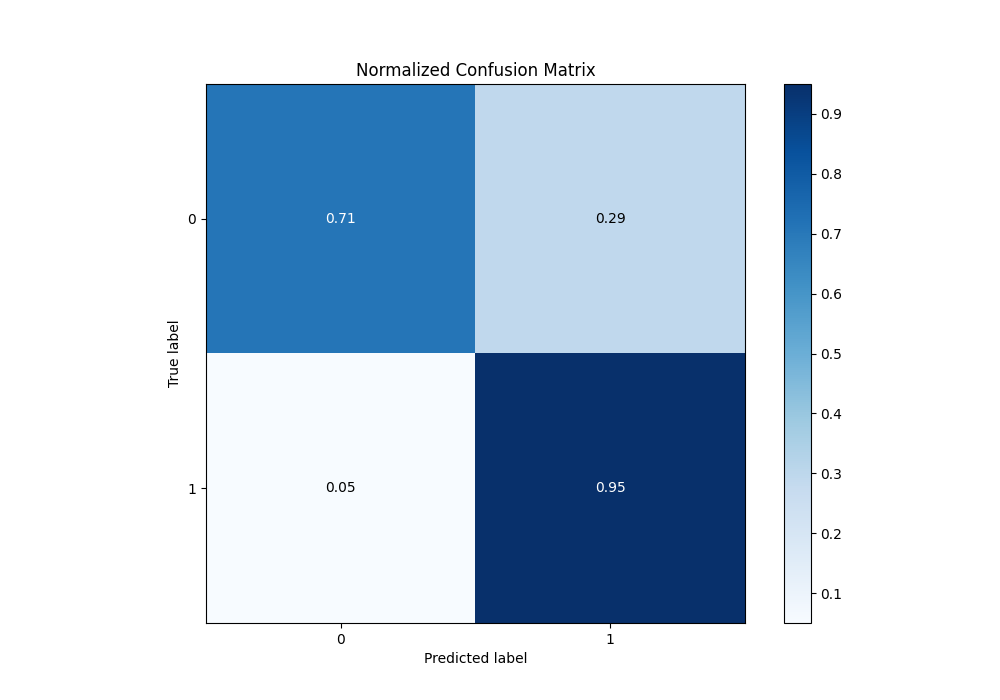
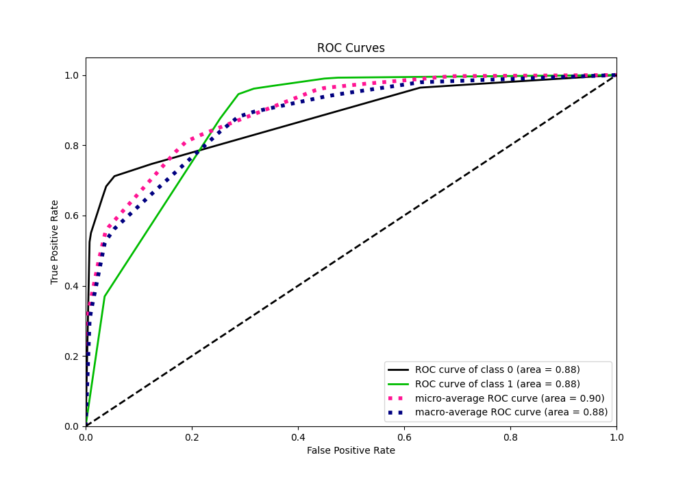
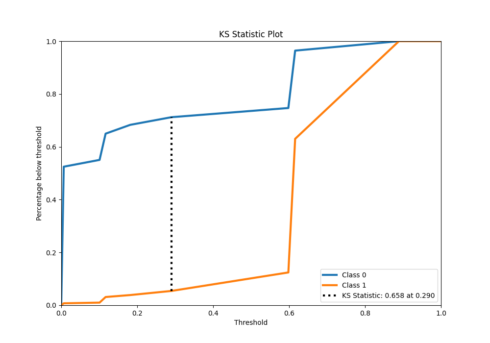
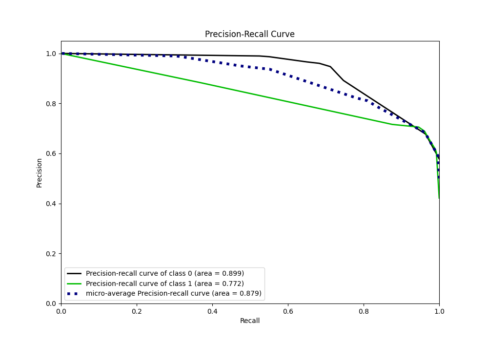
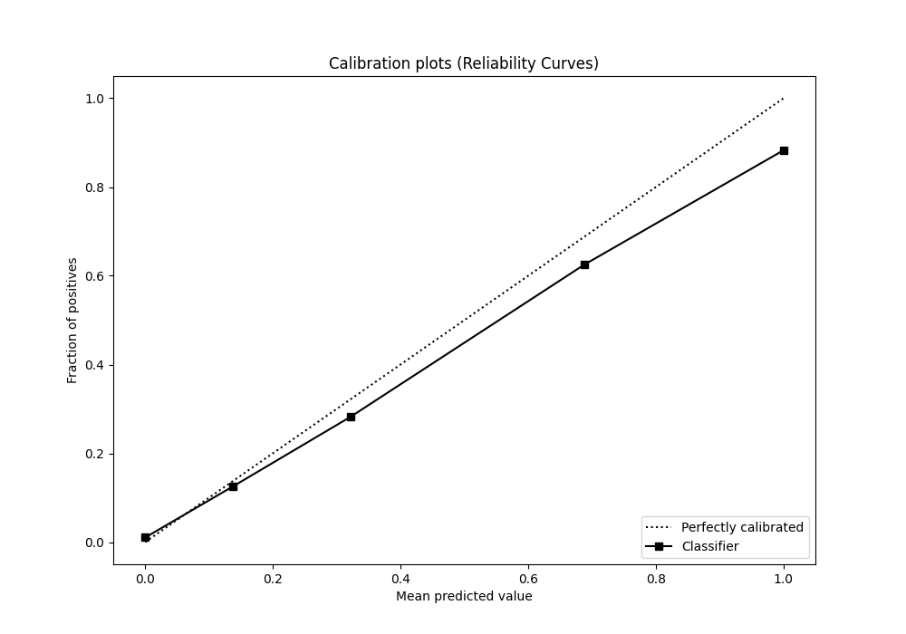
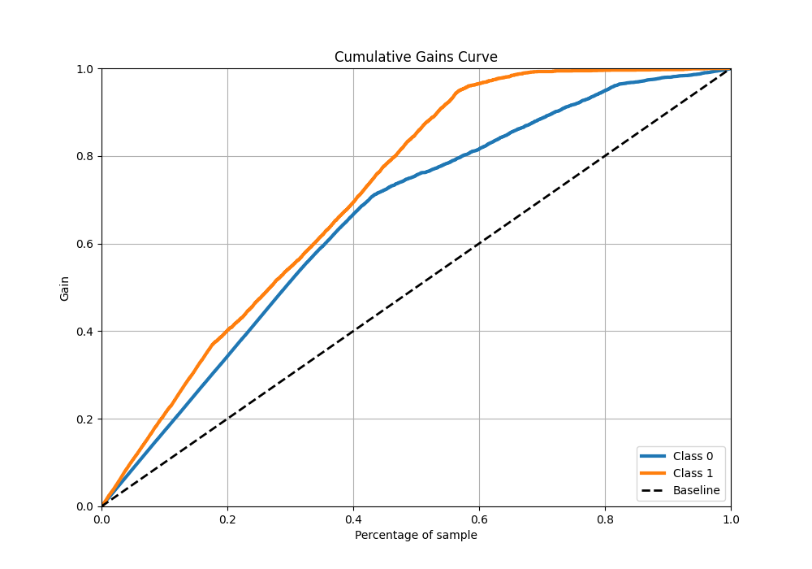
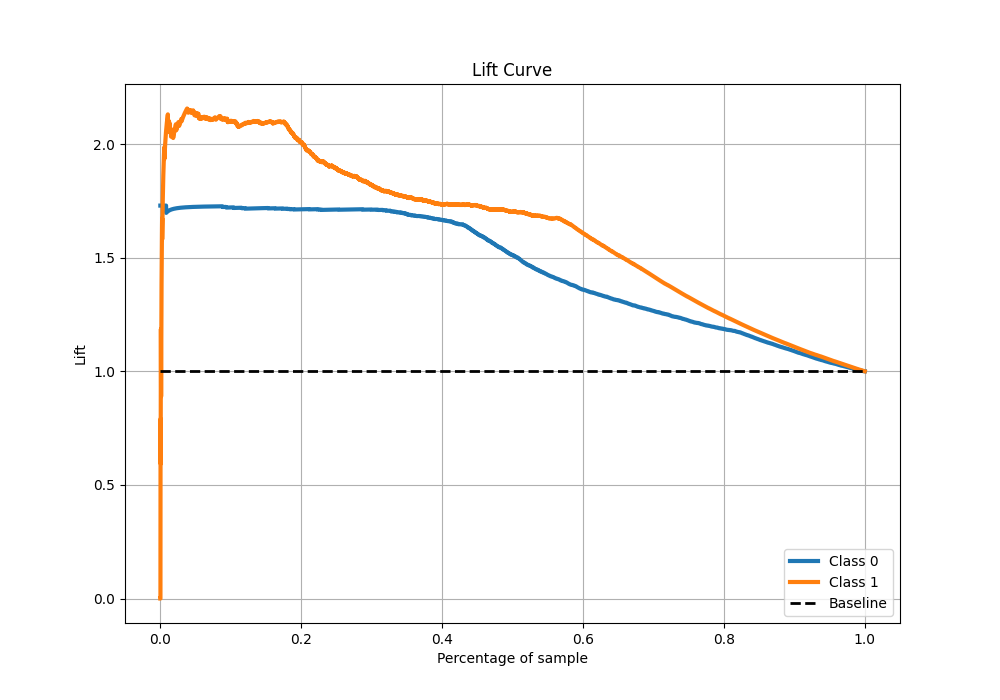

# Summary of 48_DecisionTree

[<< Go back](../README.md)

## Decision Tree
- **n_jobs**: -1
- **criterion**: entropy
- **max_depth**: 3
- **explain_level**: 0

## Validation
 - **validation_type**: split
 - **train_ratio**: 0.9
 - **shuffle**: True
 - **stratify**: True

## Optimized metric
f1

## Training time

4.4 seconds

## Metric details
|           |    score |    threshold |
|:----------|---------:|-------------:|
| logloss   | 0.392336 | nan          |
| auc       | 0.878989 | nan          |
| f1        | 0.808139 |   0.290228   |
| accuracy  | 0.810637 |   0.290228   |
| precision | 0.882771 |   0.615934   |
| recall    | 1        |   0.00587886 |
| mcc       | 0.655332 |   0.290228   |

## Metric details with threshold from accuracy metric
|           |    score |   threshold |
|:----------|---------:|------------:|
| logloss   | 0.392336 |  nan        |
| auc       | 0.878989 |  nan        |
| f1        | 0.808139 |    0.290228 |
| accuracy  | 0.810637 |    0.290228 |
| precision | 0.705523 |    0.290228 |
| recall    | 0.945685 |    0.290228 |
| mcc       | 0.655332 |    0.290228 |

## Confusion matrix (at threshold=0.290228)
|              |   Predicted as 0 |   Predicted as 1 |
|:-------------|-----------------:|-----------------:|
| Labeled as 0 |             2625 |             1061 |
| Labeled as 1 |              146 |             2542 |

## Learning curves

## Confusion Matrix

## Normalized Confusion Matrix

## ROC Curve

## Kolmogorov-Smirnov Statistic

## Precision-Recall Curve

## Calibration Curve

## Cumulative Gains Curve

## Lift Curve

[<< Go back](../README.md)
