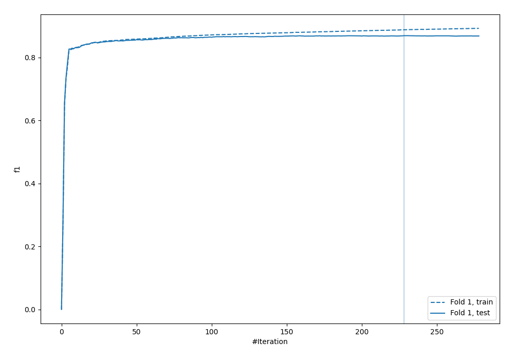
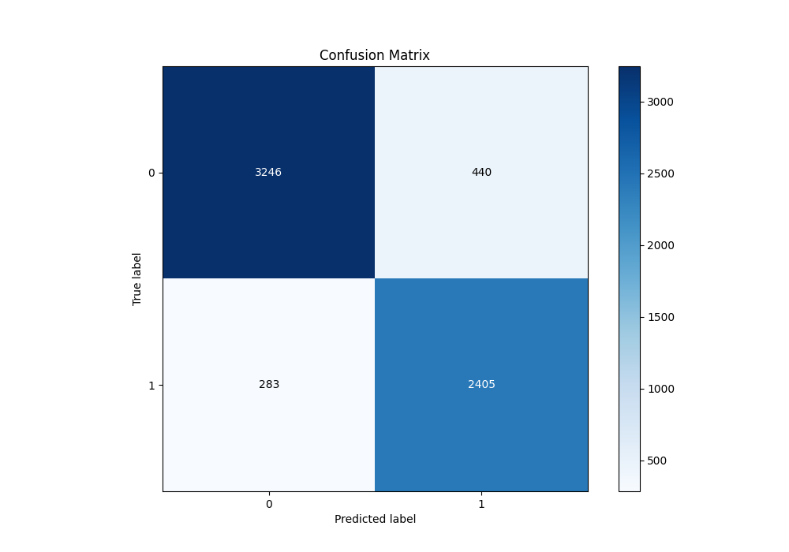
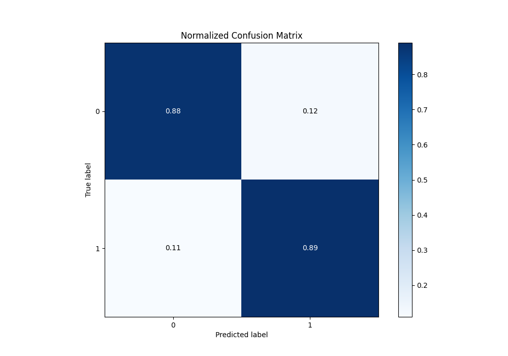
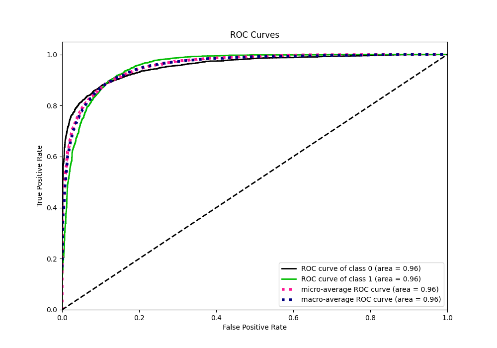
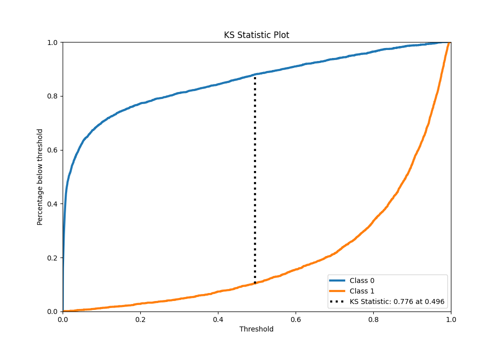
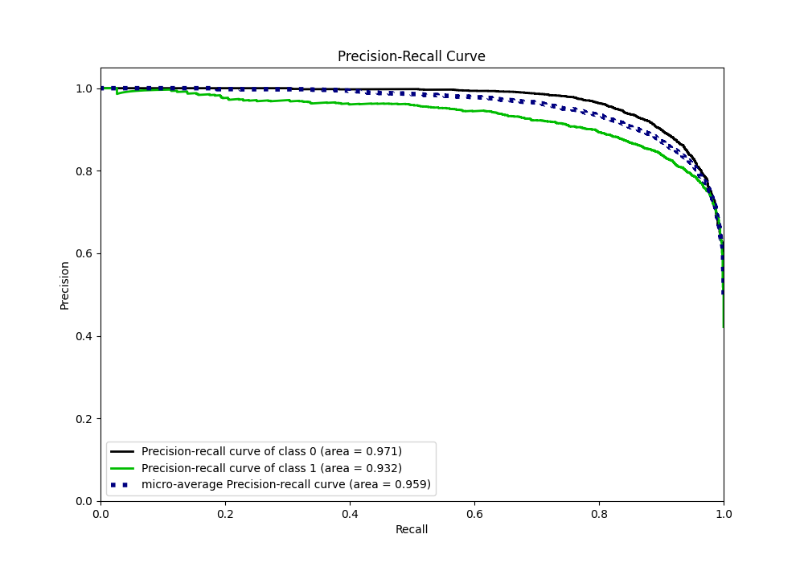
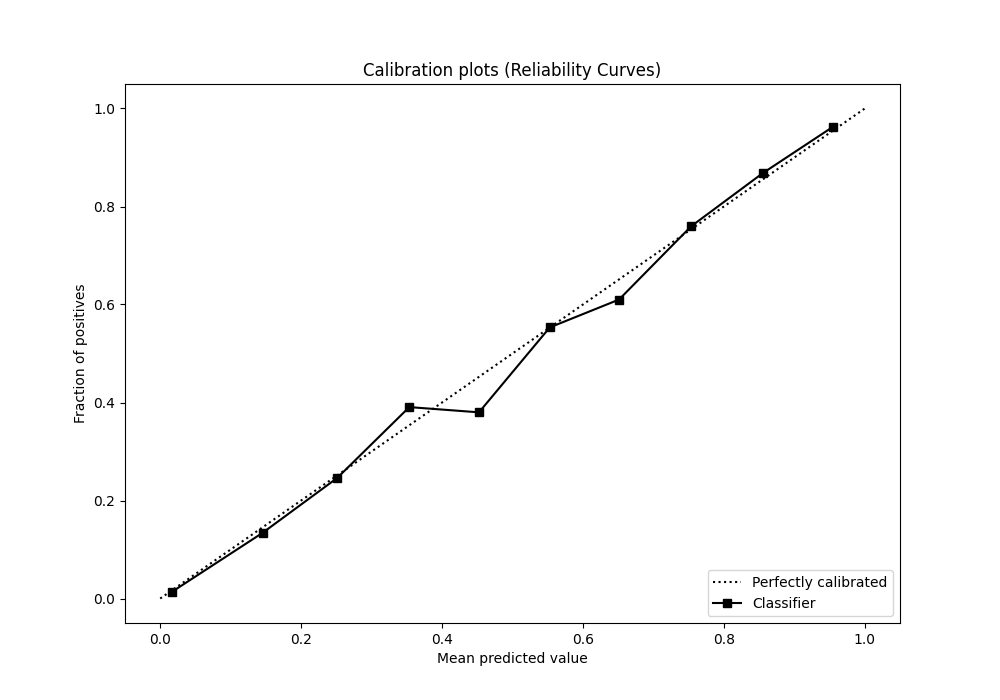
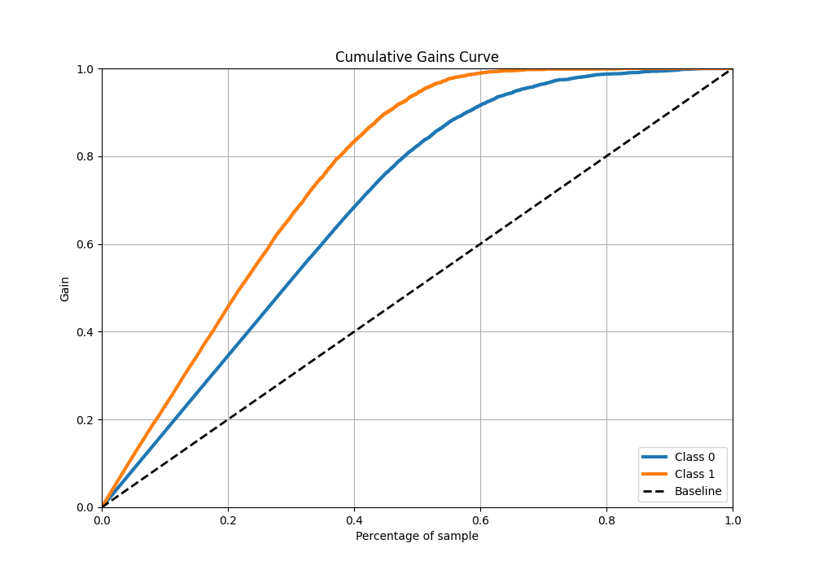
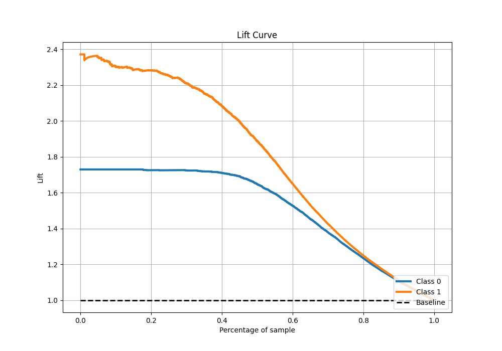

# Summary of 4_Default_Xgboost

[<< Go back](../README.md)

## Extreme Gradient Boosting (Xgboost)
- **n_jobs**: -1
- **objective**: binary:logistic
- **eta**: 0.075
- **max_depth**: 6
- **min_child_weight**: 1
- **subsample**: 1.0
- **colsample_bytree**: 1.0
- **eval_metric**: f1
- **explain_level**: 0

## Validation
 - **validation_type**: split
 - **train_ratio**: 0.9
 - **shuffle**: True
 - **stratify**: True

## Optimized metric
f1

## Training time

8.8 seconds

## Metric details
|           |    score |     threshold |
|:----------|---------:|--------------:|
| logloss   | 0.263691 | nan           |
| auc       | 0.955545 | nan           |
| f1        | 0.869329 |   0.497802    |
| accuracy  | 0.88657  |   0.497802    |
| precision | 0.996183 |   0.979532    |
| recall    | 1        |   6.03638e-05 |
| mcc       | 0.770231 |   0.497802    |

## Metric details with threshold from accuracy metric
|           |    score |   threshold |
|:----------|---------:|------------:|
| logloss   | 0.263691 |  nan        |
| auc       | 0.955545 |  nan        |
| f1        | 0.869329 |    0.497802 |
| accuracy  | 0.88657  |    0.497802 |
| precision | 0.845343 |    0.497802 |
| recall    | 0.894717 |    0.497802 |
| mcc       | 0.770231 |    0.497802 |

## Confusion matrix (at threshold=0.497802)
|              |   Predicted as 0 |   Predicted as 1 |
|:-------------|-----------------:|-----------------:|
| Labeled as 0 |             3246 |              440 |
| Labeled as 1 |              283 |             2405 |

## Learning curves

## Confusion Matrix

## Normalized Confusion Matrix

## ROC Curve

## Kolmogorov-Smirnov Statistic

## Precision-Recall Curve

## Calibration Curve

## Cumulative Gains Curve

## Lift Curve

[<< Go back](../README.md)
