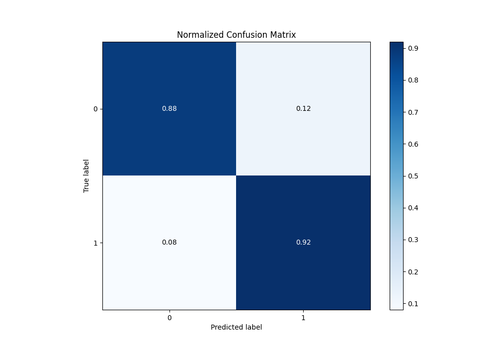

# Summary of 50_CatBoost

[<< Go back](../README.md)

## CatBoost
- **n_jobs**: -1
- **learning_rate**: 0.1
- **depth**: 7
- **rsm**: 0.9
- **loss_function**: Logloss
- **eval_metric**: F1
- **explain_level**: 0

## Validation
 - **validation_type**: split
 - **train_ratio**: 0.9
 - **shuffle**: True
 - **stratify**: True

## Optimized metric
f1

## Training time

14.6 seconds

## Metric details
|           |    score |     threshold |
|:----------|---------:|--------------:|
| logloss   | 0.244311 | nan           |
| auc       | 0.961866 | nan           |
| f1        | 0.881074 |   0.431611    |
| accuracy  | 0.895513 |   0.458382    |
| precision | 1        |   0.992657    |
| recall    | 1        |   3.95371e-06 |
| mcc       | 0.790059 |   0.458382    |

## Metric details with threshold from accuracy metric
|           |    score |   threshold |
|:----------|---------:|------------:|
| logloss   | 0.244311 |  nan        |
| auc       | 0.961866 |  nan        |
| f1        | 0.880986 |    0.458382 |
| accuracy  | 0.895513 |    0.458382 |
| precision | 0.847662 |    0.458382 |
| recall    | 0.917039 |    0.458382 |
| mcc       | 0.790059 |    0.458382 |

## Confusion matrix (at threshold=0.458382)
|              |   Predicted as 0 |   Predicted as 1 |
|:-------------|-----------------:|-----------------:|
| Labeled as 0 |             3243 |              443 |
| Labeled as 1 |              223 |             2465 |

## Learning curves

## Confusion Matrix

## Normalized Confusion Matrix

## ROC Curve

## Kolmogorov-Smirnov Statistic

## Precision-Recall Curve

## Calibration Curve

## Cumulative Gains Curve

## Lift Curve

[<< Go back](../README.md)
