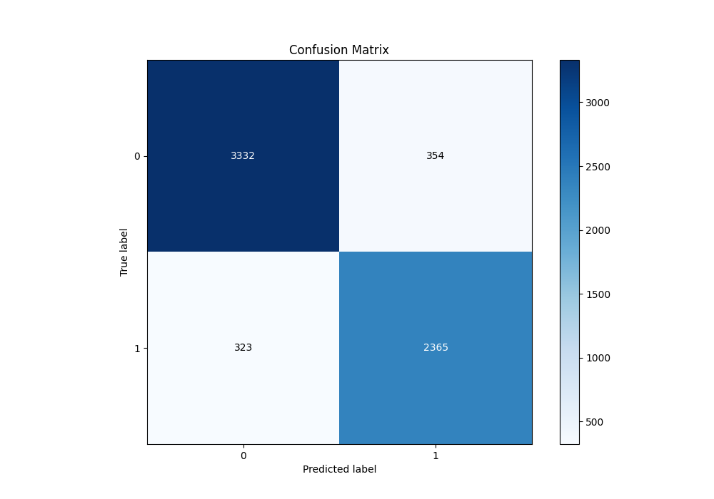

# Summary of 51_CatBoost

[<< Go back](../README.md)

## CatBoost
- **n_jobs**: -1
- **learning_rate**: 0.2
- **depth**: 8
- **rsm**: 0.9
- **loss_function**: Logloss
- **eval_metric**: F1
- **explain_level**: 0

## Validation
 - **validation_type**: split
 - **train_ratio**: 0.9
 - **shuffle**: True
 - **stratify**: True

## Optimized metric
f1

## Training time

15.7 seconds

## Metric details
|           |    score |     threshold |
|:----------|---------:|--------------:|
| logloss   | 0.247555 | nan           |
| auc       | 0.960886 | nan           |
| f1        | 0.878954 |   0.427909    |
| accuracy  | 0.893787 |   0.538701    |
| precision | 1        |   0.994592    |
| recall    | 1        |   1.47094e-06 |
| mcc       | 0.785931 |   0.427909    |

## Metric details with threshold from accuracy metric
|           |    score |   threshold |
|:----------|---------:|------------:|
| logloss   | 0.247555 |  nan        |
| auc       | 0.960886 |  nan        |
| f1        | 0.874792 |    0.538701 |
| accuracy  | 0.893787 |    0.538701 |
| precision | 0.869805 |    0.538701 |
| recall    | 0.879836 |    0.538701 |
| mcc       | 0.782614 |    0.538701 |

## Confusion matrix (at threshold=0.538701)
|              |   Predicted as 0 |   Predicted as 1 |
|:-------------|-----------------:|-----------------:|
| Labeled as 0 |             3332 |              354 |
| Labeled as 1 |              323 |             2365 |

## Learning curves

## Confusion Matrix

## Normalized Confusion Matrix

## ROC Curve

## Kolmogorov-Smirnov Statistic

## Precision-Recall Curve

## Calibration Curve

## Cumulative Gains Curve

## Lift Curve

[<< Go back](../README.md)
