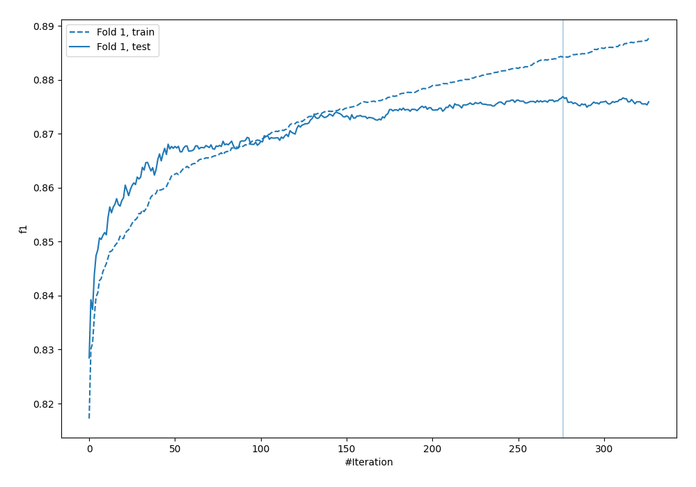
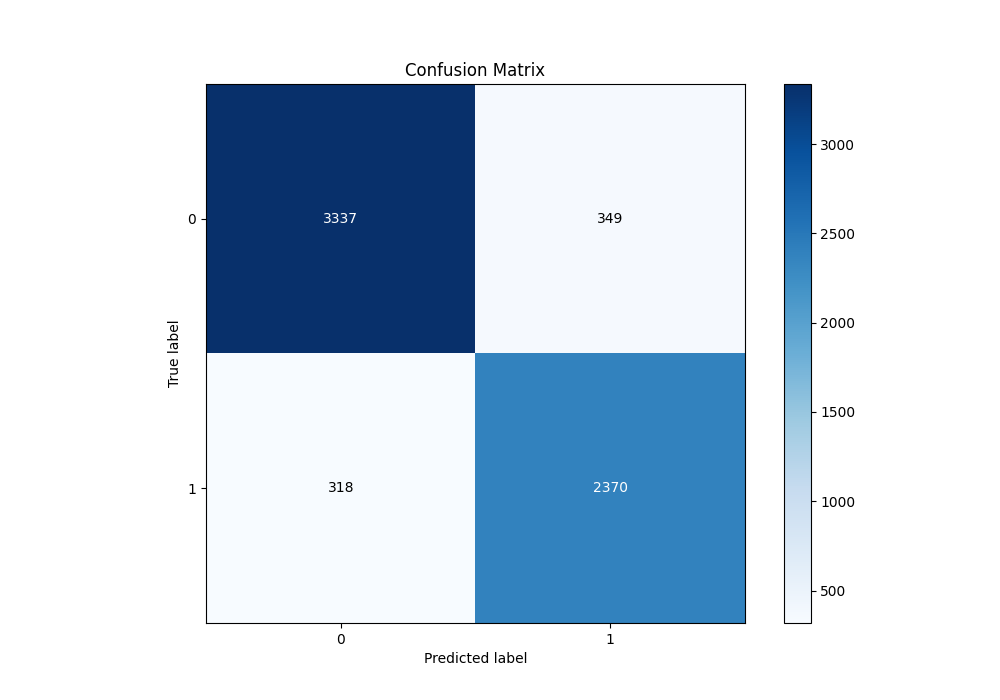
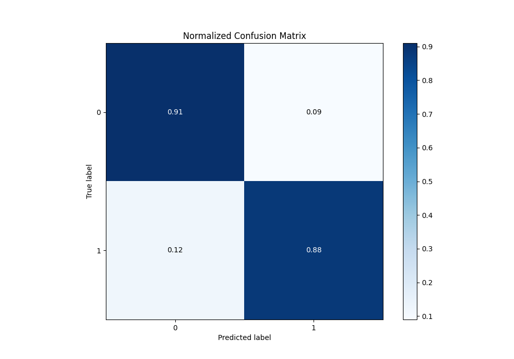
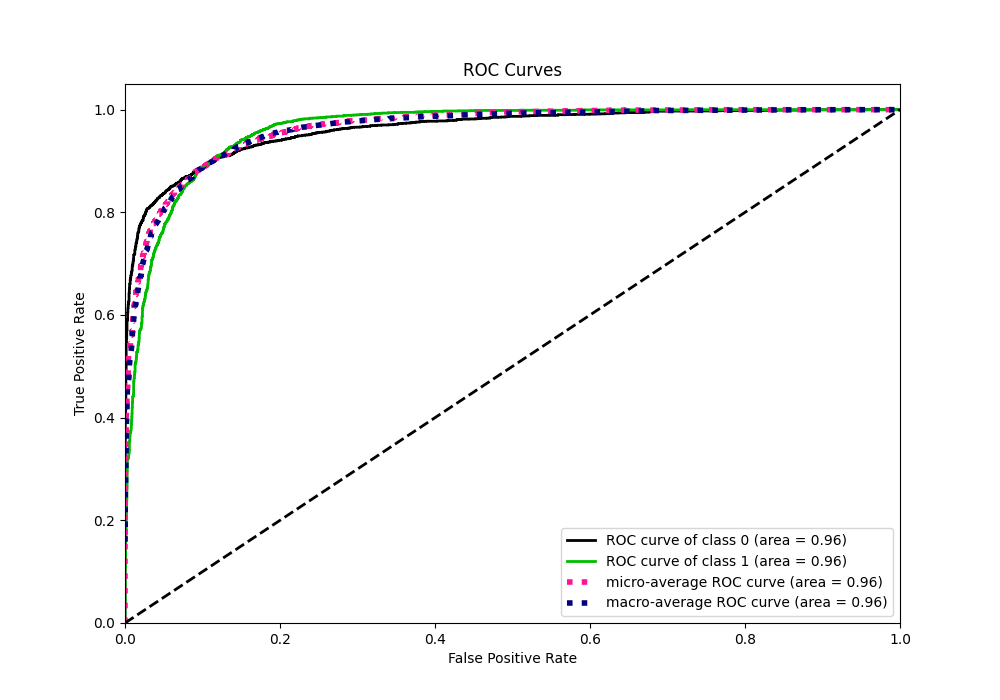
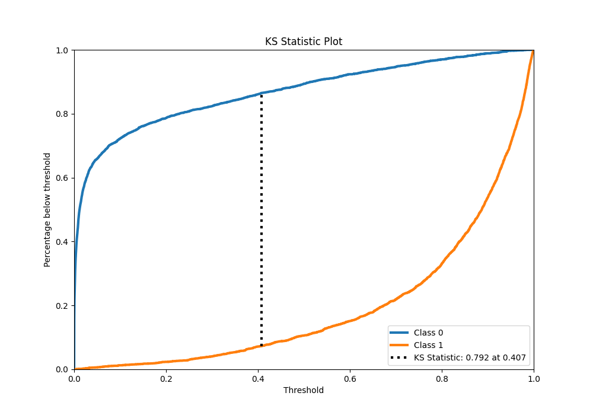
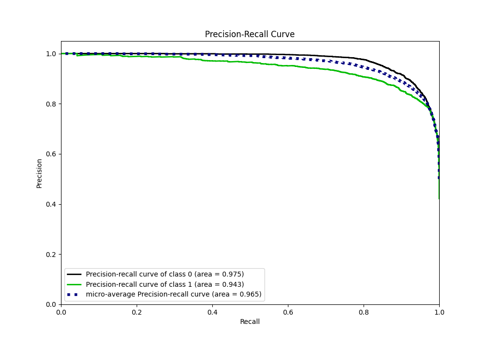
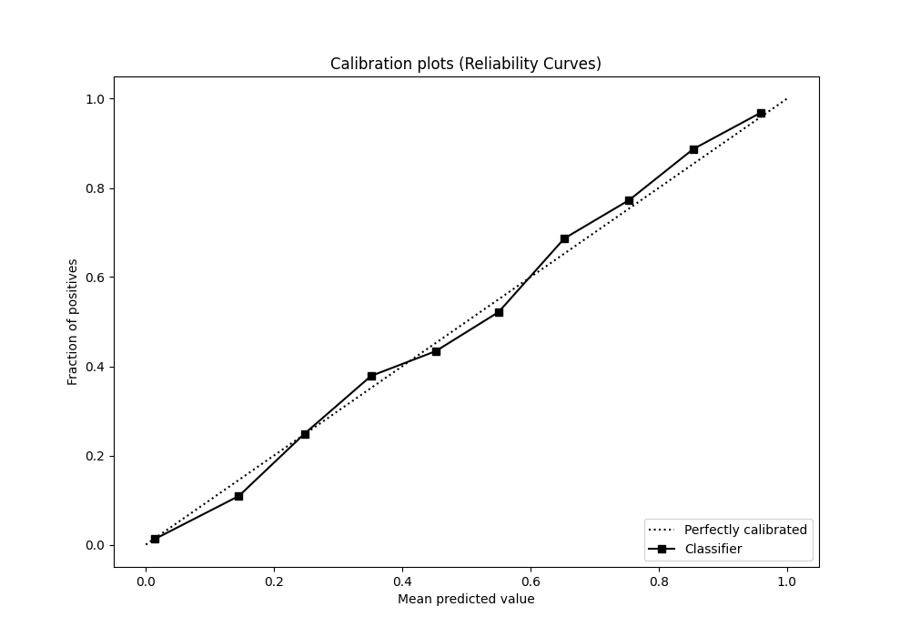
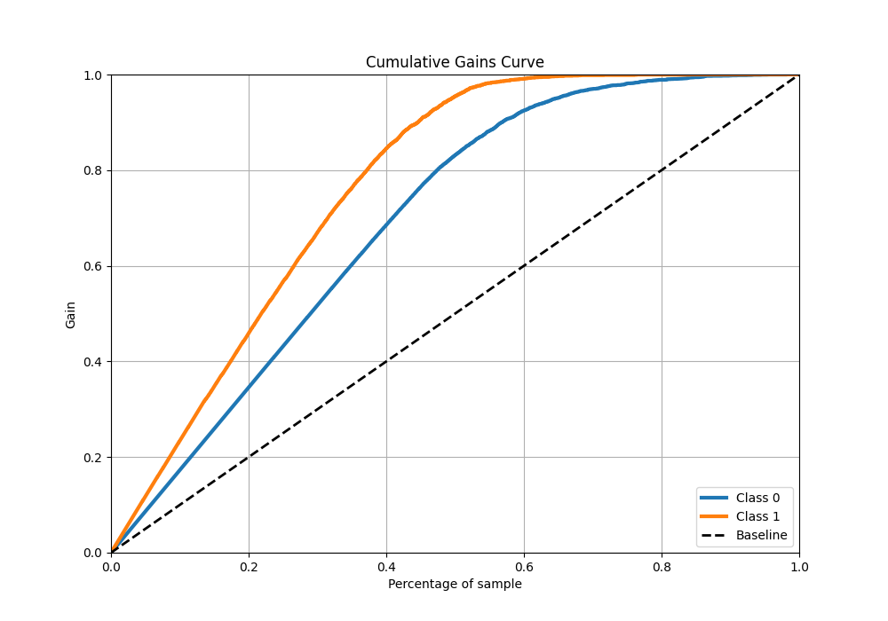
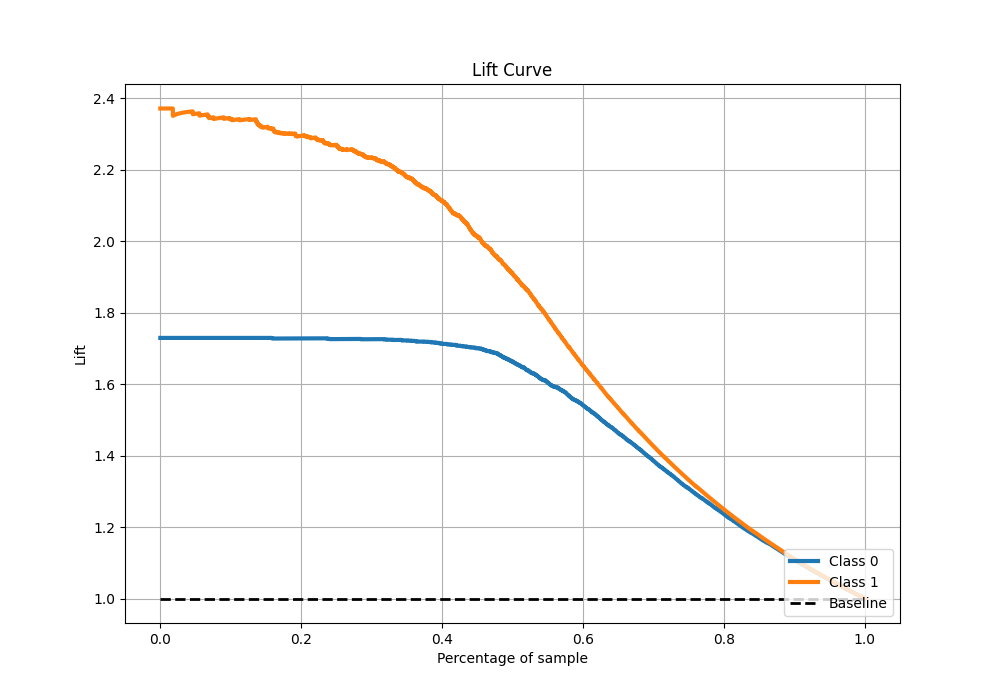

# Summary of 52_CatBoost

[<< Go back](../README.md)

## CatBoost
- **n_jobs**: -1
- **learning_rate**: 0.1
- **depth**: 7
- **rsm**: 0.9
- **loss_function**: Logloss
- **eval_metric**: F1
- **explain_level**: 0

## Validation
 - **validation_type**: split
 - **train_ratio**: 0.9
 - **shuffle**: True
 - **stratify**: True

## Optimized metric
f1

## Training time

15.5 seconds

## Metric details
|           |    score |     threshold |
|:----------|---------:|--------------:|
| logloss   | 0.244593 | nan           |
| auc       | 0.961869 | nan           |
| f1        | 0.877879 |   0.506126    |
| accuracy  | 0.895356 |   0.533549    |
| precision | 0.996183 |   0.985696    |
| recall    | 1        |   7.69786e-06 |
| mcc       | 0.7865   |   0.506126    |

## Metric details with threshold from accuracy metric
|           |    score |   threshold |
|:----------|---------:|------------:|
| logloss   | 0.244593 |  nan        |
| auc       | 0.961869 |  nan        |
| f1        | 0.876641 |    0.533549 |
| accuracy  | 0.895356 |    0.533549 |
| precision | 0.871644 |    0.533549 |
| recall    | 0.881696 |    0.533549 |
| mcc       | 0.785826 |    0.533549 |

## Confusion matrix (at threshold=0.533549)
|              |   Predicted as 0 |   Predicted as 1 |
|:-------------|-----------------:|-----------------:|
| Labeled as 0 |             3337 |              349 |
| Labeled as 1 |              318 |             2370 |

## Learning curves

## Confusion Matrix

## Normalized Confusion Matrix

## ROC Curve

## Kolmogorov-Smirnov Statistic

## Precision-Recall Curve

## Calibration Curve

## Cumulative Gains Curve

## Lift Curve

[<< Go back](../README.md)
