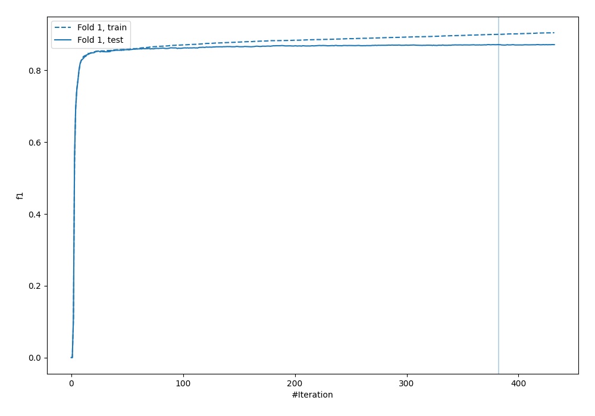

# Summary of 55_Xgboost

[<< Go back](../README.md)

## Extreme Gradient Boosting (Xgboost)
- **n_jobs**: -1
- **objective**: binary:logistic
- **eta**: 0.05
- **max_depth**: 7
- **min_child_weight**: 5
- **subsample**: 0.9
- **colsample_bytree**: 0.9
- **eval_metric**: f1
- **explain_level**: 0

## Validation
 - **validation_type**: split
 - **train_ratio**: 0.9
 - **shuffle**: True
 - **stratify**: True

## Optimized metric
f1

## Training time

12.2 seconds

## Metric details
|           |    score |     threshold |
|:----------|---------:|--------------:|
| logloss   | 0.259042 | nan           |
| auc       | 0.957019 | nan           |
| f1        | 0.871137 |   0.488753    |
| accuracy  | 0.888924 |   0.512018    |
| precision | 0.996183 |   0.981963    |
| recall    | 1        |   8.65995e-05 |
| mcc       | 0.773688 |   0.512018    |

## Metric details with threshold from accuracy metric
|           |    score |   threshold |
|:----------|---------:|------------:|
| logloss   | 0.259042 |  nan        |
| auc       | 0.957019 |  nan        |
| f1        | 0.870567 |    0.512018 |
| accuracy  | 0.888924 |    0.512018 |
| precision | 0.855859 |    0.512018 |
| recall    | 0.885789 |    0.512018 |
| mcc       | 0.773688 |    0.512018 |

## Confusion matrix (at threshold=0.512018)
|              |   Predicted as 0 |   Predicted as 1 |
|:-------------|-----------------:|-----------------:|
| Labeled as 0 |             3285 |              401 |
| Labeled as 1 |              307 |             2381 |

## Learning curves

## Confusion Matrix

## Normalized Confusion Matrix

## ROC Curve

## Kolmogorov-Smirnov Statistic

## Precision-Recall Curve

## Calibration Curve

## Cumulative Gains Curve

## Lift Curve

[<< Go back](../README.md)
