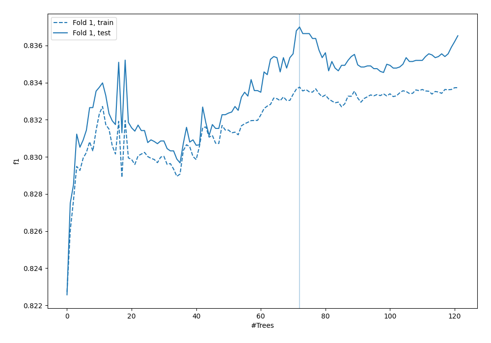
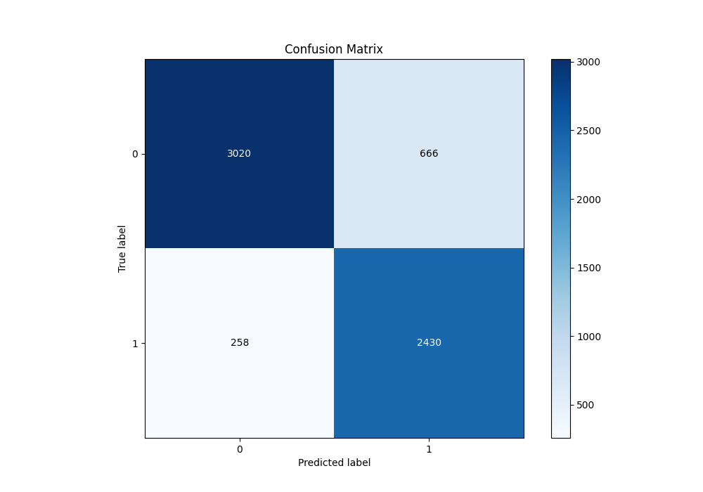
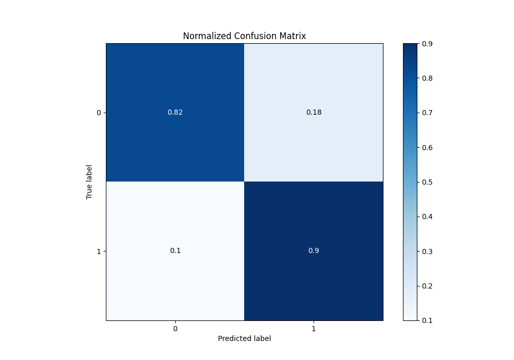
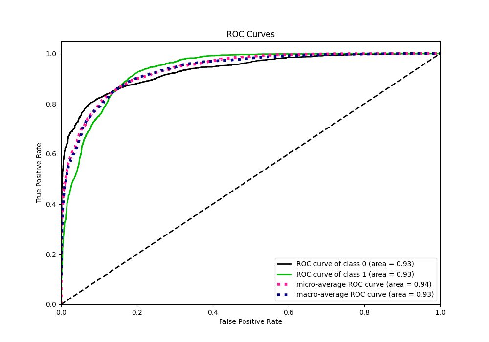
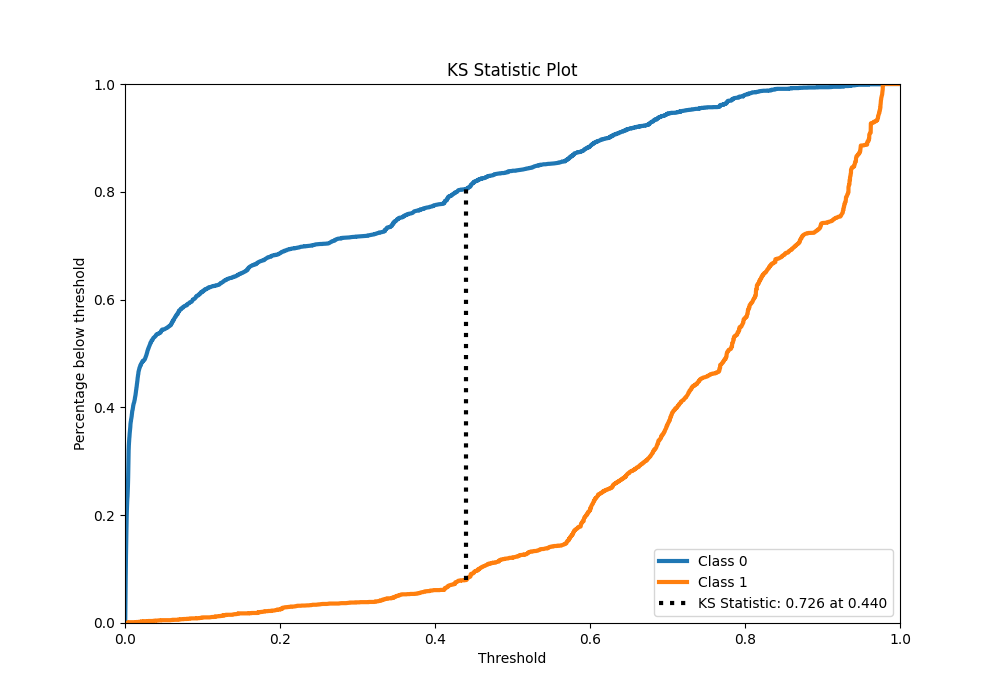
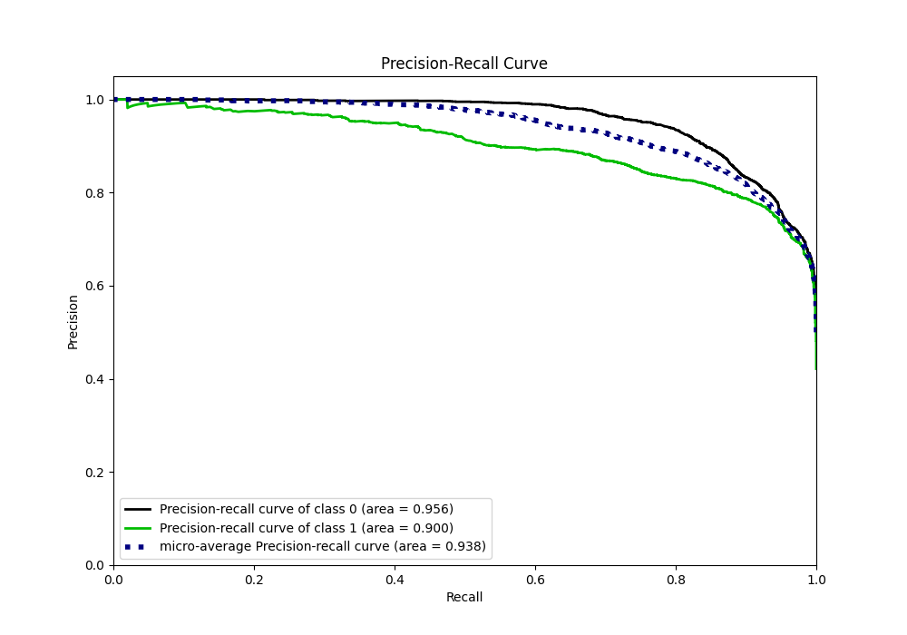
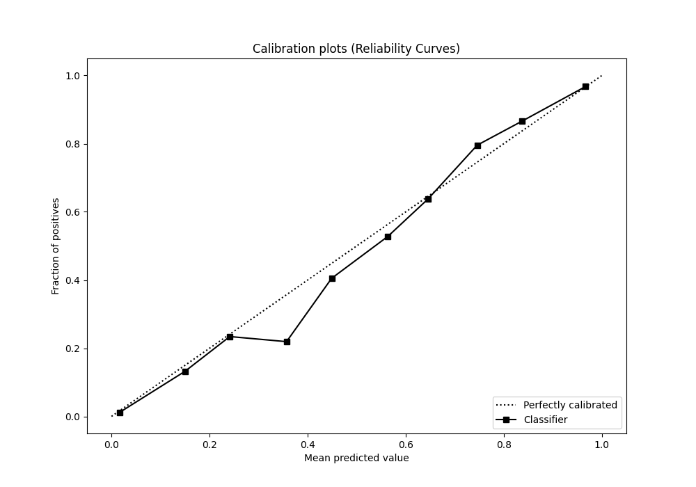
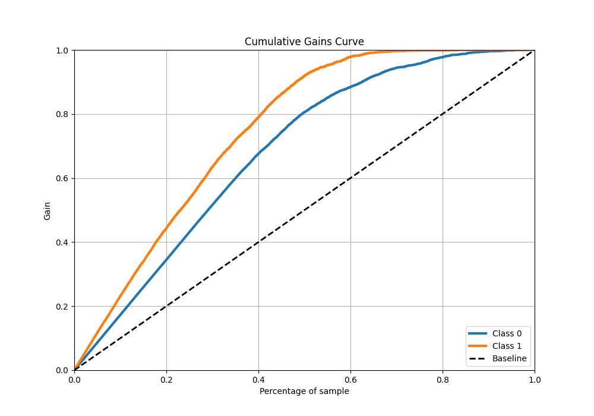
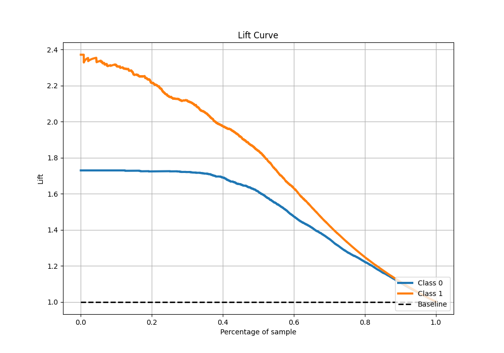

# Summary of 57_RandomForest

[<< Go back](../README.md)

## Random Forest
- **n_jobs**: -1
- **criterion**: entropy
- **max_features**: 0.7
- **min_samples_split**: 30
- **max_depth**: 6
- **eval_metric_name**: f1
- **explain_level**: 0

## Validation
 - **validation_type**: split
 - **train_ratio**: 0.9
 - **shuffle**: True
 - **stratify**: True

## Optimized metric
f1

## Training time

30.2 seconds

## Metric details
|           |    score |     threshold |
|:----------|---------:|--------------:|
| logloss   | 0.322556 | nan           |
| auc       | 0.933376 | nan           |
| f1        | 0.840431 |   0.4455      |
| accuracy  | 0.855036 |   0.451568    |
| precision | 0.992248 |   0.96028     |
| recall    | 1        |   0.000242935 |
| mcc       | 0.714715 |   0.4455      |

## Metric details with threshold from accuracy metric
|           |    score |   threshold |
|:----------|---------:|------------:|
| logloss   | 0.322556 |  nan        |
| auc       | 0.933376 |  nan        |
| f1        | 0.840249 |    0.451568 |
| accuracy  | 0.855036 |    0.451568 |
| precision | 0.784884 |    0.451568 |
| recall    | 0.904018 |    0.451568 |
| mcc       | 0.714704 |    0.451568 |

## Confusion matrix (at threshold=0.451568)
|              |   Predicted as 0 |   Predicted as 1 |
|:-------------|-----------------:|-----------------:|
| Labeled as 0 |             3020 |              666 |
| Labeled as 1 |              258 |             2430 |

## Learning curves

## Confusion Matrix

## Normalized Confusion Matrix

## ROC Curve

## Kolmogorov-Smirnov Statistic

## Precision-Recall Curve

## Calibration Curve

## Cumulative Gains Curve

## Lift Curve

[<< Go back](../README.md)
