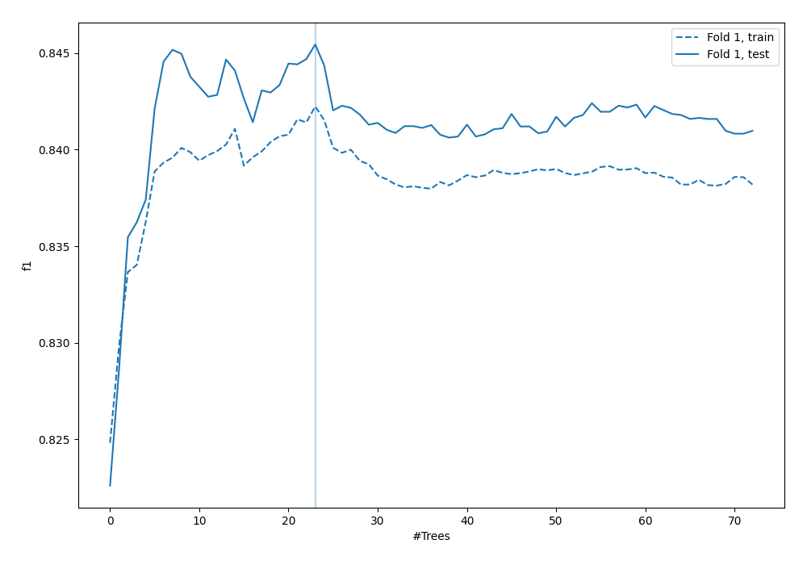
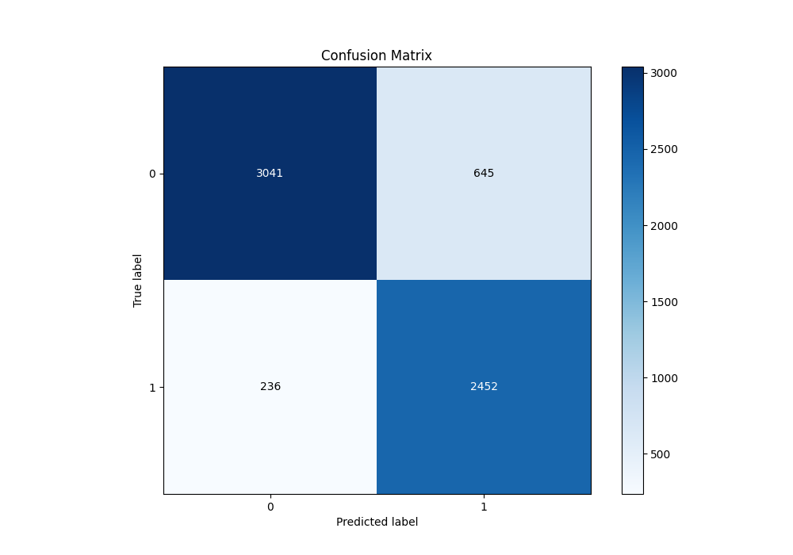
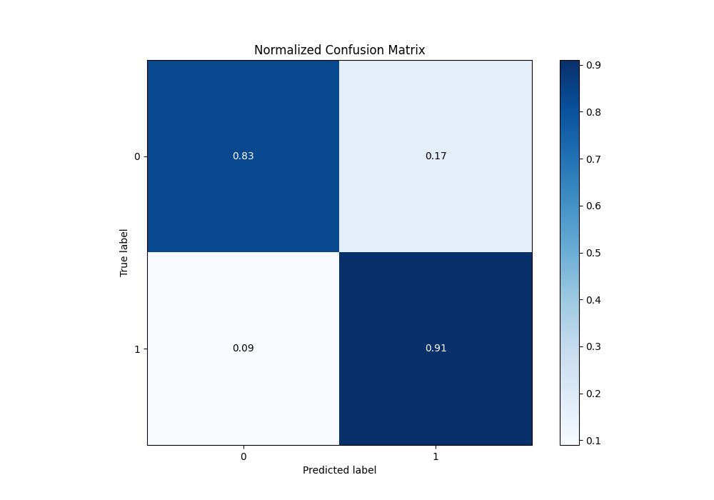
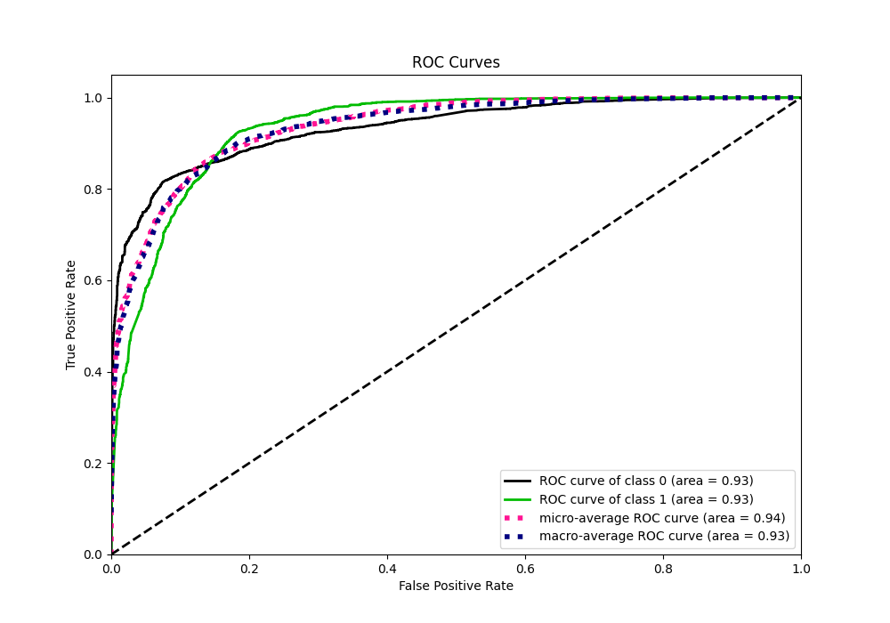
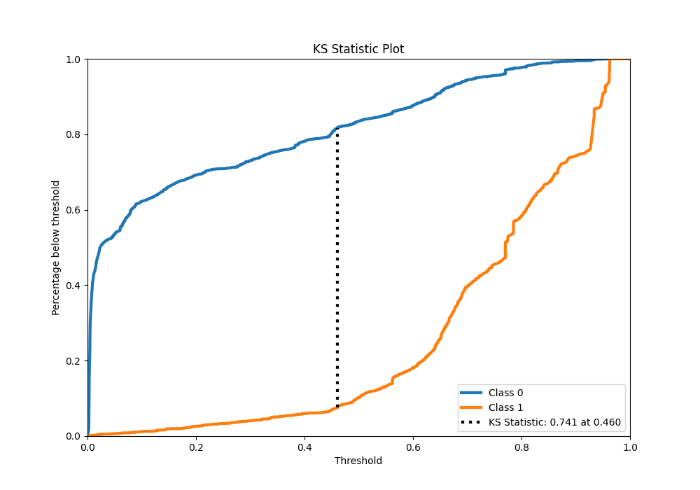
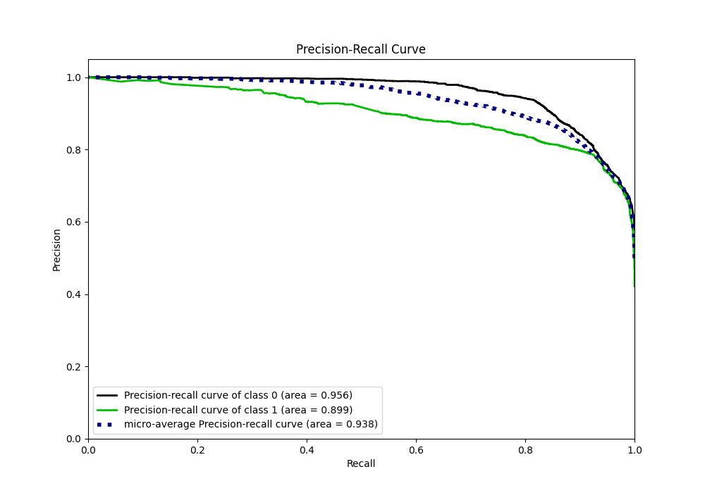
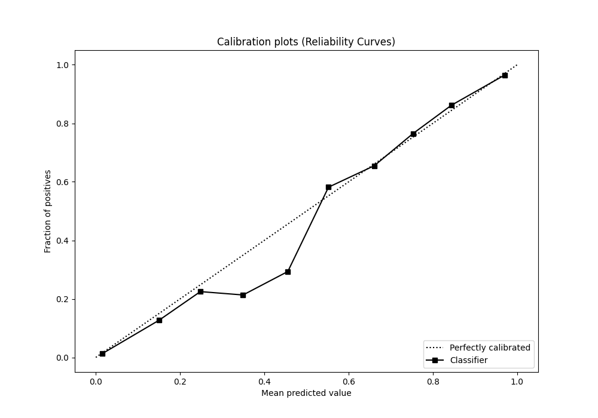
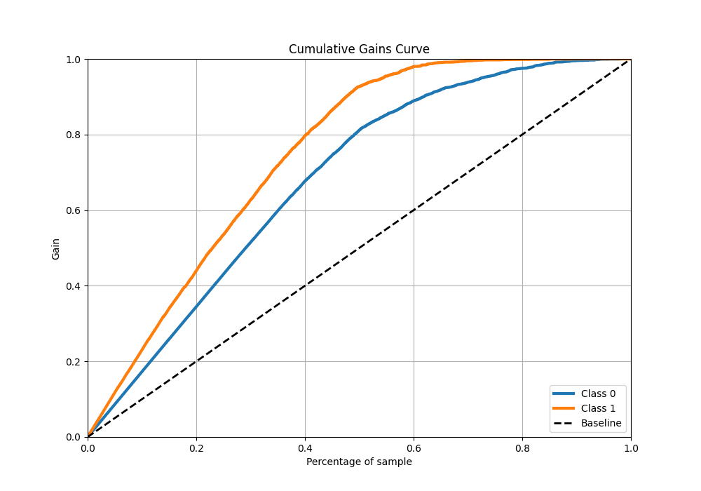
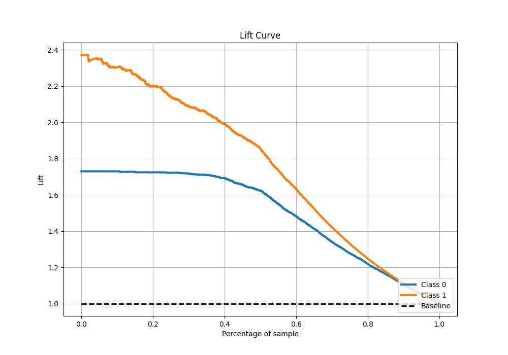

# Summary of 58_RandomForest

[<< Go back](../README.md)

## Random Forest
- **n_jobs**: -1
- **criterion**: gini
- **max_features**: 0.7
- **min_samples_split**: 30
- **max_depth**: 6
- **eval_metric_name**: f1
- **explain_level**: 0

## Validation
 - **validation_type**: split
 - **train_ratio**: 0.9
 - **shuffle**: True
 - **stratify**: True

## Optimized metric
f1

## Training time

19.2 seconds

## Metric details
|           |    score |    threshold |
|:----------|---------:|-------------:|
| logloss   | 0.322412 | nan          |
| auc       | 0.933655 | nan          |
| f1        | 0.849179 |   0.461479   |
| accuracy  | 0.861782 |   0.483669   |
| precision | 0.991903 |   0.950503   |
| recall    | 1        |   0.00204626 |
| mcc       | 0.730966 |   0.461479   |

## Metric details with threshold from accuracy metric
|           |    score |   threshold |
|:----------|---------:|------------:|
| logloss   | 0.322412 |  nan        |
| auc       | 0.933655 |  nan        |
| f1        | 0.84771  |    0.483669 |
| accuracy  | 0.861782 |    0.483669 |
| precision | 0.791734 |    0.483669 |
| recall    | 0.912202 |    0.483669 |
| mcc       | 0.728414 |    0.483669 |

## Confusion matrix (at threshold=0.483669)
|              |   Predicted as 0 |   Predicted as 1 |
|:-------------|-----------------:|-----------------:|
| Labeled as 0 |             3041 |              645 |
| Labeled as 1 |              236 |             2452 |

## Learning curves

## Confusion Matrix

## Normalized Confusion Matrix

## ROC Curve

## Kolmogorov-Smirnov Statistic

## Precision-Recall Curve

## Calibration Curve

## Cumulative Gains Curve

## Lift Curve

[<< Go back](../README.md)
