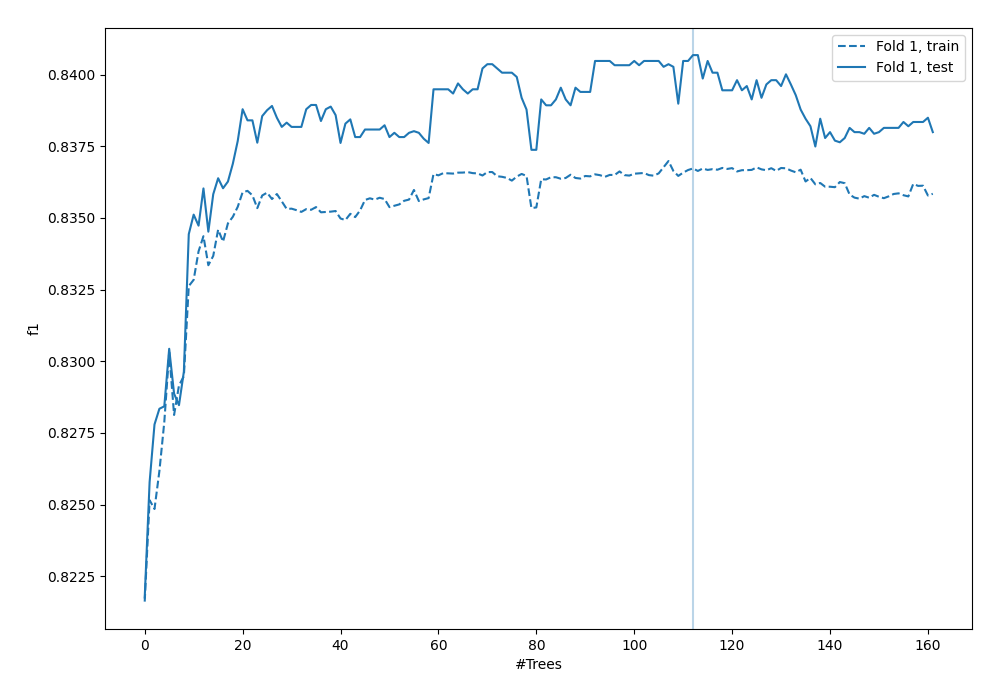
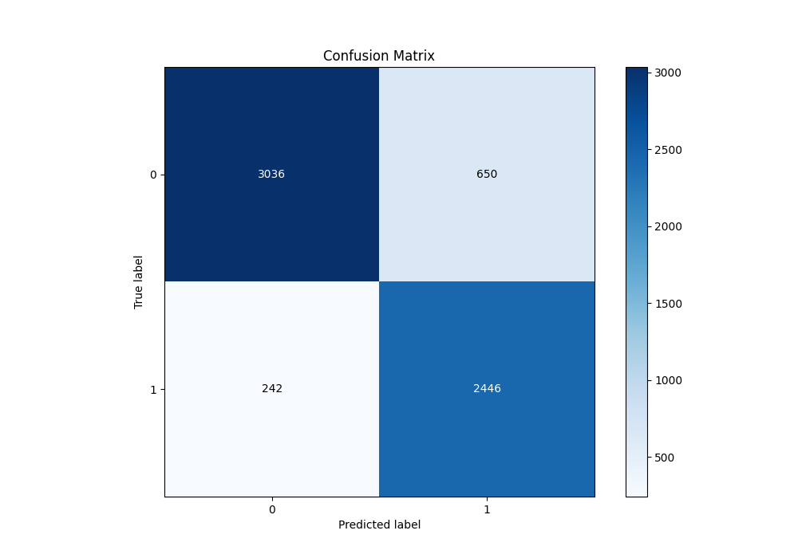
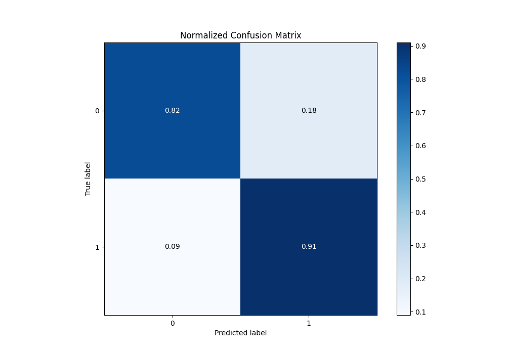
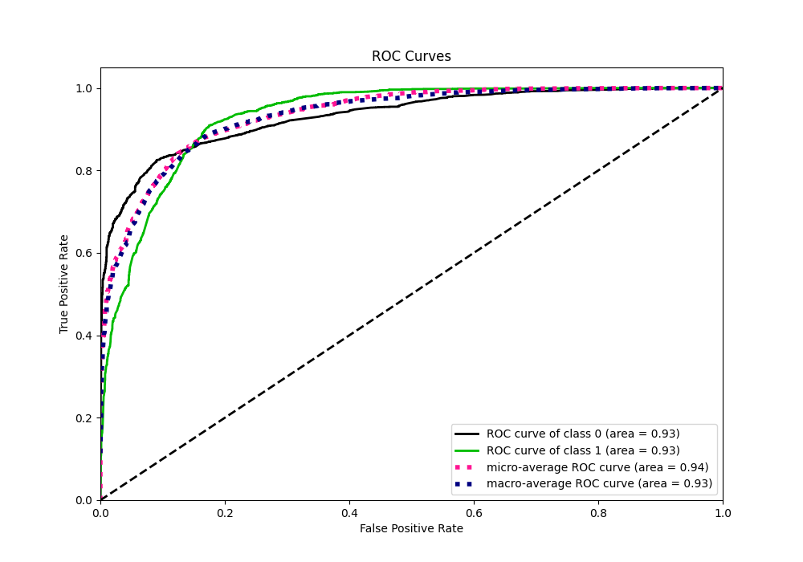
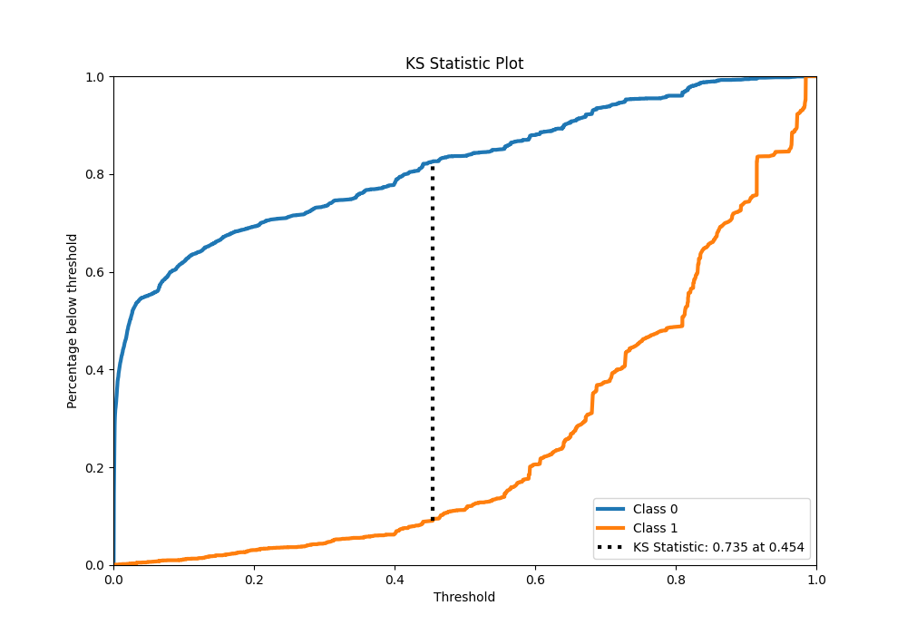
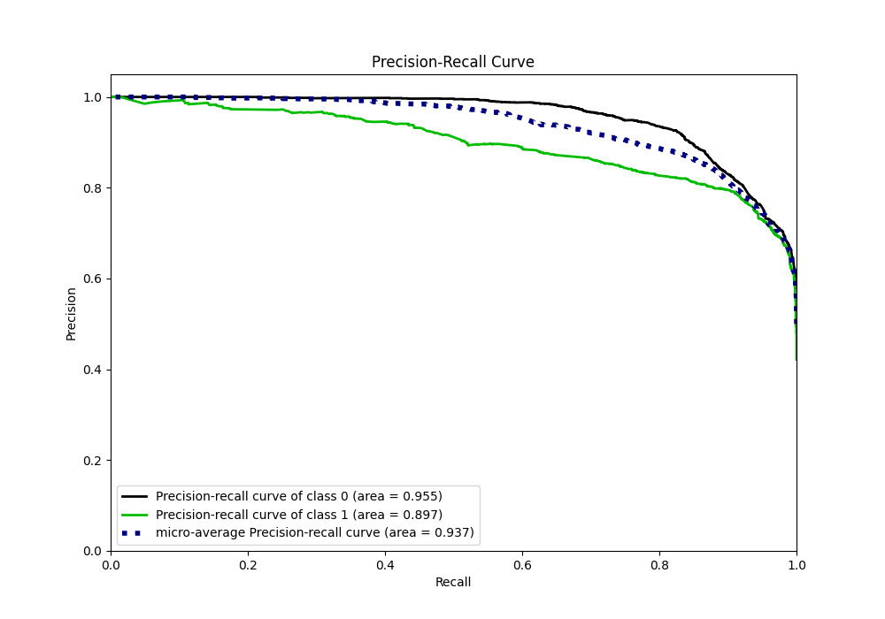
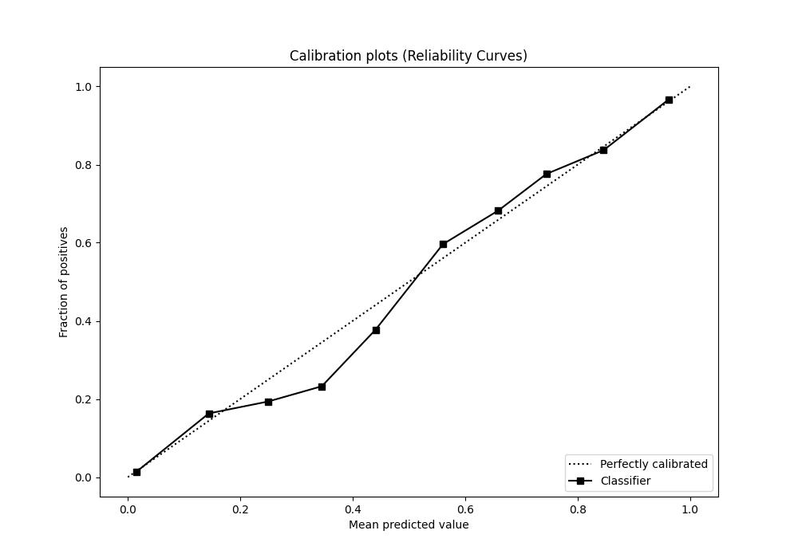
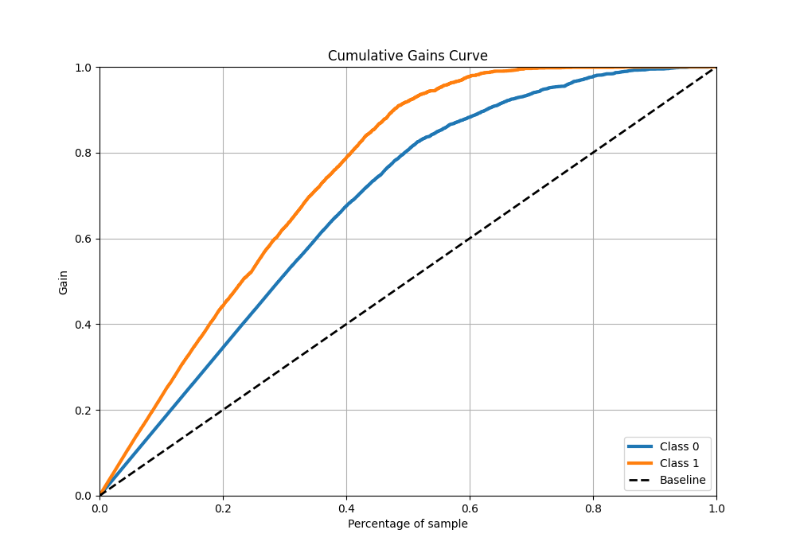
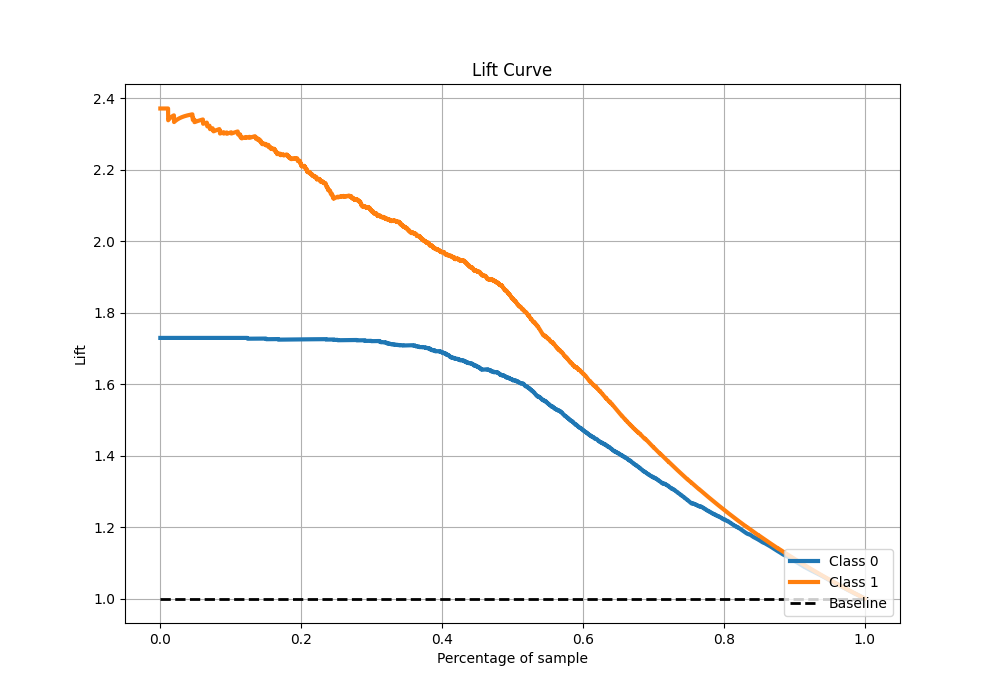

# Summary of 59_RandomForest

[<< Go back](../README.md)

## Random Forest
- **n_jobs**: -1
- **criterion**: entropy
- **max_features**: 1.0
- **min_samples_split**: 40
- **max_depth**: 6
- **eval_metric_name**: f1
- **explain_level**: 0

## Validation
 - **validation_type**: split
 - **train_ratio**: 0.9
 - **shuffle**: True
 - **stratify**: True

## Optimized metric
f1

## Training time

39.4 seconds

## Metric details
|           |    score |     threshold |
|:----------|---------:|--------------:|
| logloss   | 0.323664 | nan           |
| auc       | 0.93183  | nan           |
| f1        | 0.845781 |   0.448522    |
| accuracy  | 0.860056 |   0.448522    |
| precision | 0.991379 |   0.972783    |
| recall    | 1        |   0.000348501 |
| mcc       | 0.724875 |   0.448522    |

## Metric details with threshold from accuracy metric
|           |    score |   threshold |
|:----------|---------:|------------:|
| logloss   | 0.323664 |  nan        |
| auc       | 0.93183  |  nan        |
| f1        | 0.845781 |    0.448522 |
| accuracy  | 0.860056 |    0.448522 |
| precision | 0.790052 |    0.448522 |
| recall    | 0.90997  |    0.448522 |
| mcc       | 0.724875 |    0.448522 |

## Confusion matrix (at threshold=0.448522)
|              |   Predicted as 0 |   Predicted as 1 |
|:-------------|-----------------:|-----------------:|
| Labeled as 0 |             3036 |              650 |
| Labeled as 1 |              242 |             2446 |

## Learning curves

## Confusion Matrix

## Normalized Confusion Matrix

## ROC Curve

## Kolmogorov-Smirnov Statistic

## Precision-Recall Curve

## Calibration Curve

## Cumulative Gains Curve

## Lift Curve

[<< Go back](../README.md)
