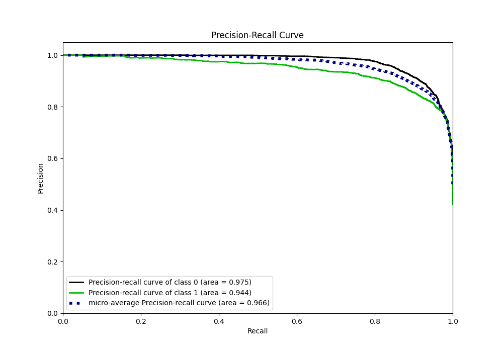

# Summary of 5_Default_CatBoost

[<< Go back](../README.md)

## CatBoost
- **n_jobs**: -1
- **learning_rate**: 0.1
- **depth**: 6
- **rsm**: 1
- **loss_function**: Logloss
- **eval_metric**: F1
- **explain_level**: 0

## Validation
 - **validation_type**: split
 - **train_ratio**: 0.9
 - **shuffle**: True
 - **stratify**: True

## Optimized metric
f1

## Training time

12.7 seconds

## Metric details
|           |    score |     threshold |
|:----------|---------:|--------------:|
| logloss   | 0.242343 | nan           |
| auc       | 0.96272  | nan           |
| f1        | 0.877643 |   0.491291    |
| accuracy  | 0.894415 |   0.541519    |
| precision | 1        |   0.992054    |
| recall    | 1        |   4.76502e-06 |
| mcc       | 0.78493  |   0.491291    |

## Metric details with threshold from accuracy metric
|           |    score |   threshold |
|:----------|---------:|------------:|
| logloss   | 0.242343 |  nan        |
| auc       | 0.96272  |  nan        |
| f1        | 0.875532 |    0.541519 |
| accuracy  | 0.894415 |    0.541519 |
| precision | 0.870541 |    0.541519 |
| recall    | 0.88058  |    0.541519 |
| mcc       | 0.783899 |    0.541519 |

## Confusion matrix (at threshold=0.541519)
|              |   Predicted as 0 |   Predicted as 1 |
|:-------------|-----------------:|-----------------:|
| Labeled as 0 |             3334 |              352 |
| Labeled as 1 |              321 |             2367 |

## Learning curves

## Confusion Matrix

## Normalized Confusion Matrix

## ROC Curve

## Kolmogorov-Smirnov Statistic

## Precision-Recall Curve

## Calibration Curve

## Cumulative Gains Curve

## Lift Curve

[<< Go back](../README.md)
