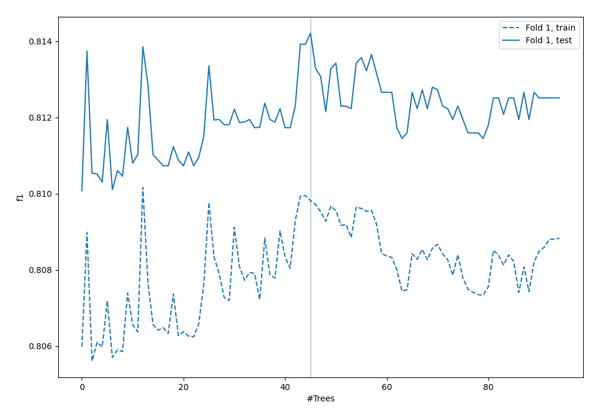
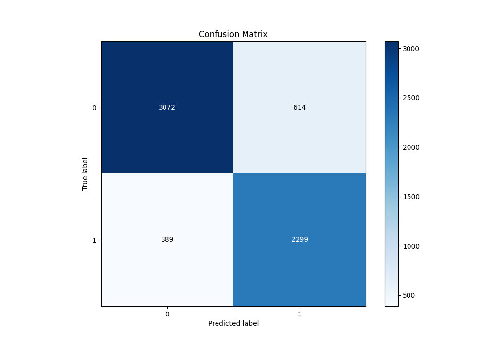
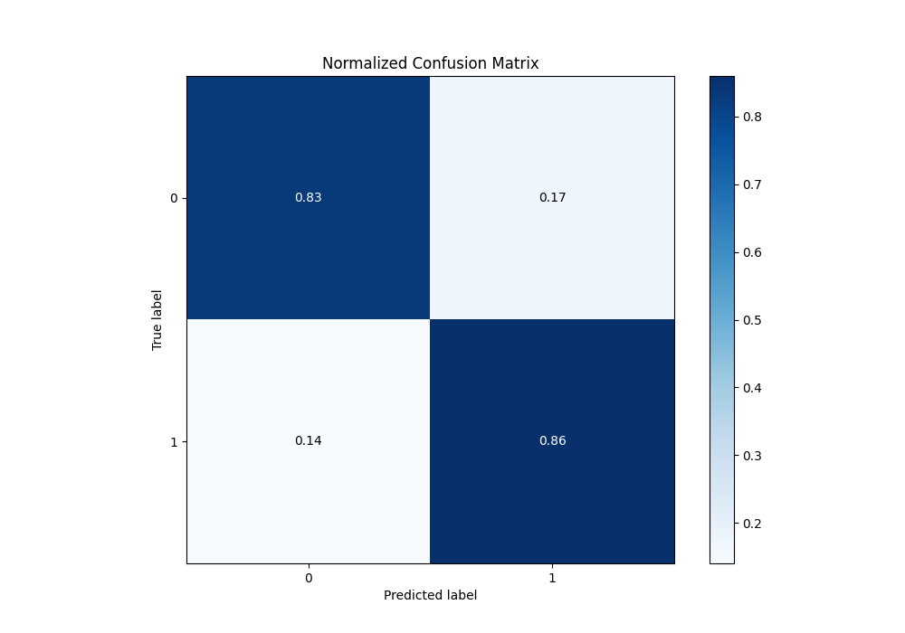
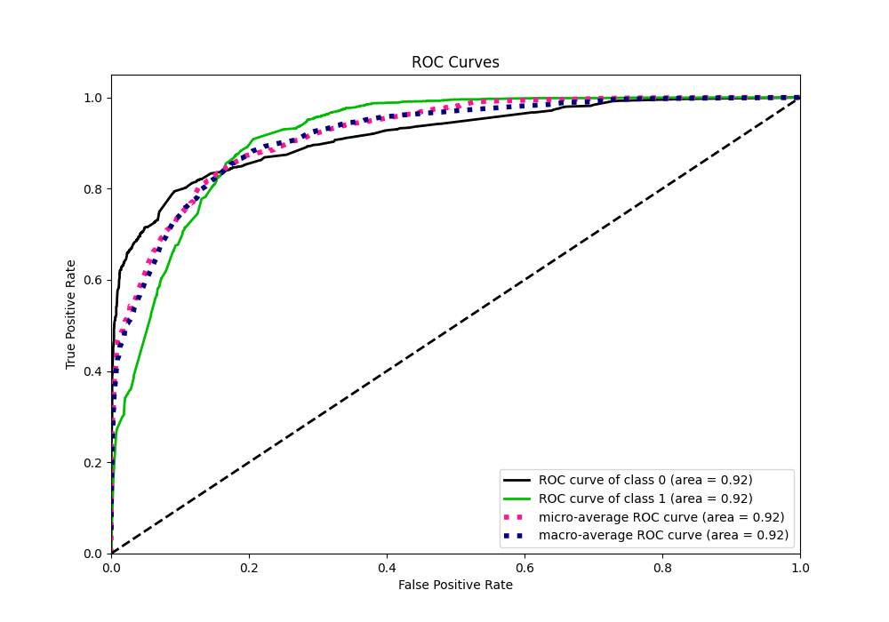
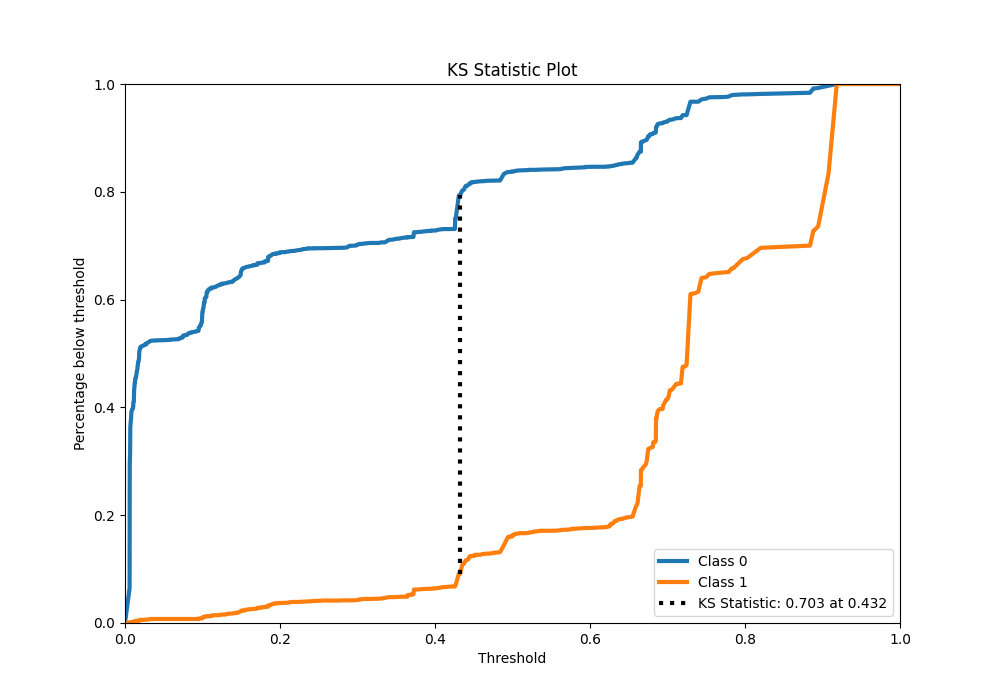
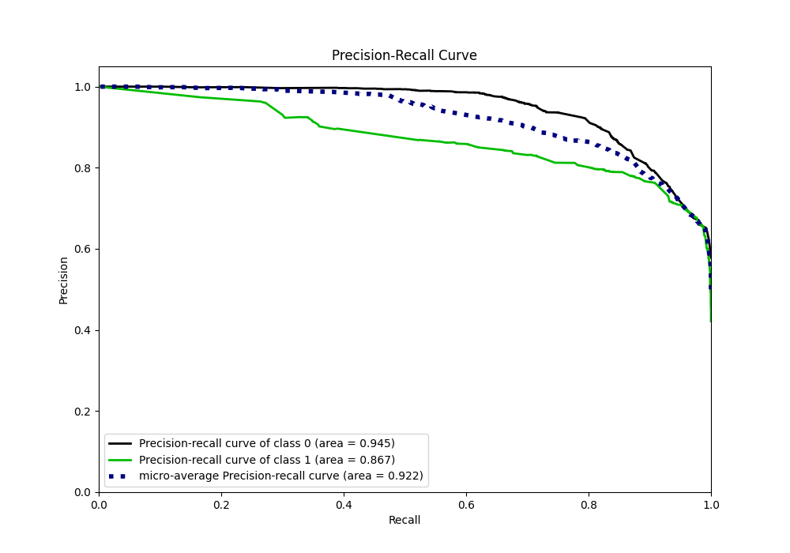
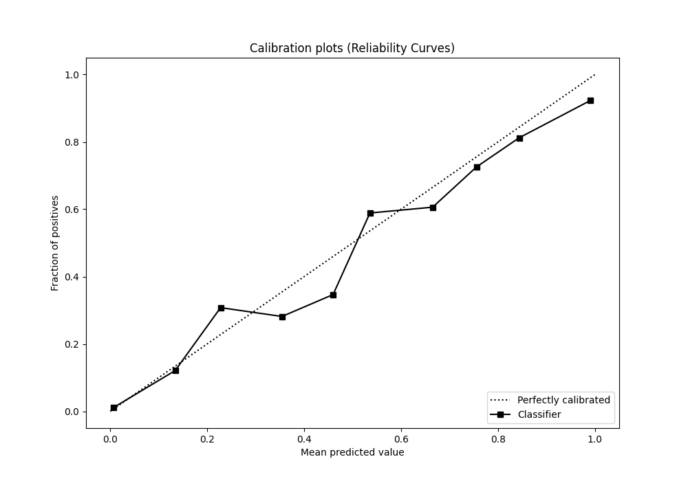
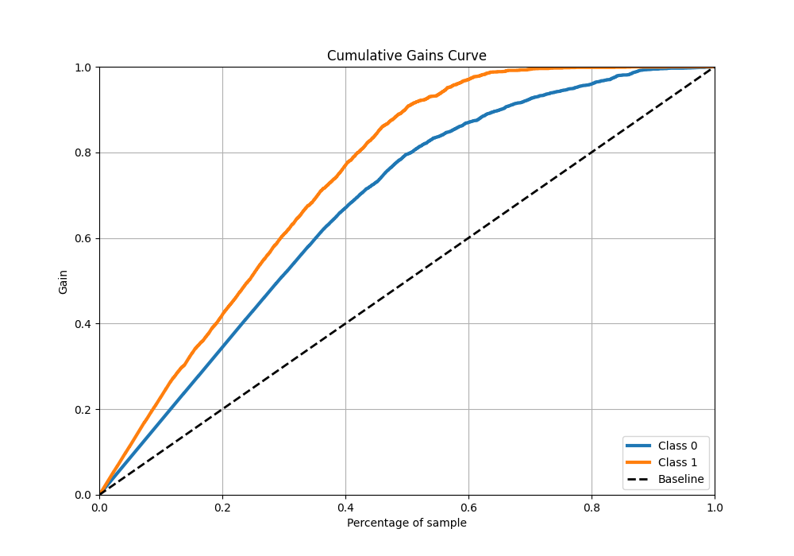
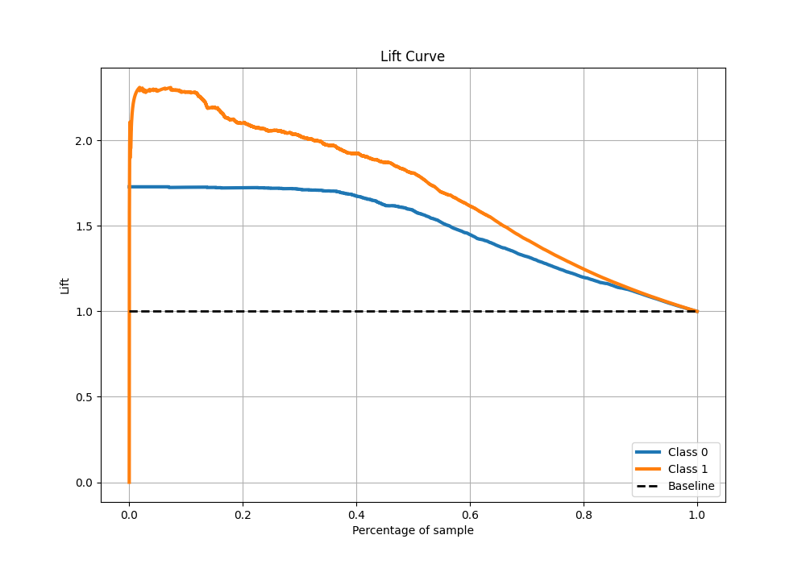

# Summary of 6_Default_RandomForest

[<< Go back](../README.md)

## Random Forest
- **n_jobs**: -1
- **criterion**: gini
- **max_features**: 0.9
- **min_samples_split**: 30
- **max_depth**: 4
- **eval_metric_name**: f1
- **explain_level**: 0

## Validation
 - **validation_type**: split
 - **train_ratio**: 0.9
 - **shuffle**: True
 - **stratify**: True

## Optimized metric
f1

## Training time

22.6 seconds

## Metric details
|           |    score |    threshold |
|:----------|---------:|-------------:|
| logloss   | 0.356953 | nan          |
| auc       | 0.916659 | nan          |
| f1        | 0.82878  |   0.430778   |
| accuracy  | 0.842642 |   0.489038   |
| precision | 0.973799 |   0.907803   |
| recall    | 1        |   0.00534279 |
| mcc       | 0.692842 |   0.430778   |

## Metric details with threshold from accuracy metric
|           |    score |   threshold |
|:----------|---------:|------------:|
| logloss   | 0.356953 |  nan        |
| auc       | 0.916659 |  nan        |
| f1        | 0.820925 |    0.489038 |
| accuracy  | 0.842642 |    0.489038 |
| precision | 0.789221 |    0.489038 |
| recall    | 0.855283 |    0.489038 |
| mcc       | 0.68274  |    0.489038 |

## Confusion matrix (at threshold=0.489038)
|              |   Predicted as 0 |   Predicted as 1 |
|:-------------|-----------------:|-----------------:|
| Labeled as 0 |             3072 |              614 |
| Labeled as 1 |              389 |             2299 |

## Learning curves

## Confusion Matrix

## Normalized Confusion Matrix

## ROC Curve

## Kolmogorov-Smirnov Statistic

## Precision-Recall Curve

## Calibration Curve

## Cumulative Gains Curve

## Lift Curve

[<< Go back](../README.md)
