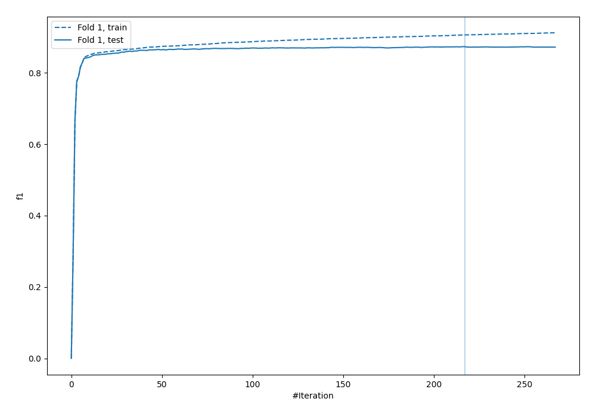
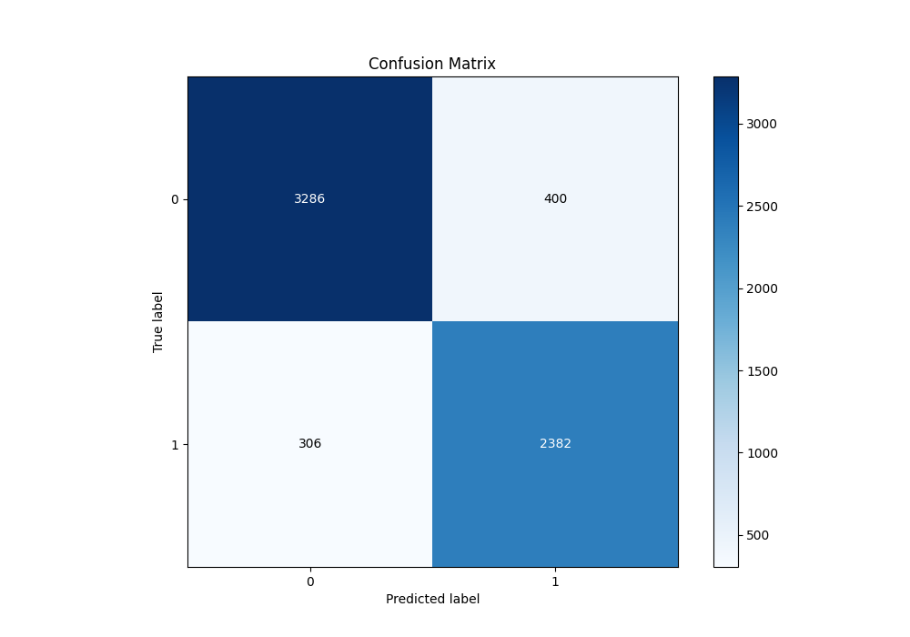
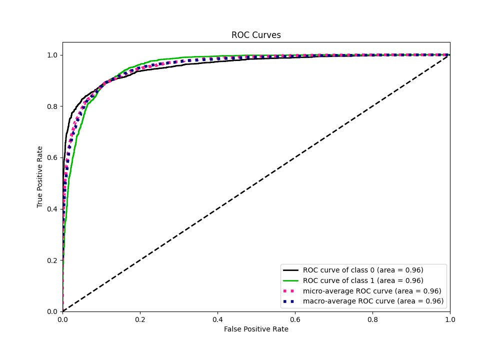
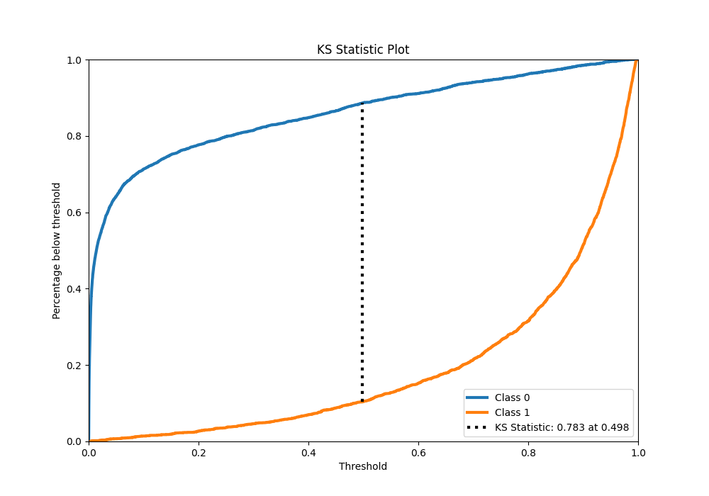
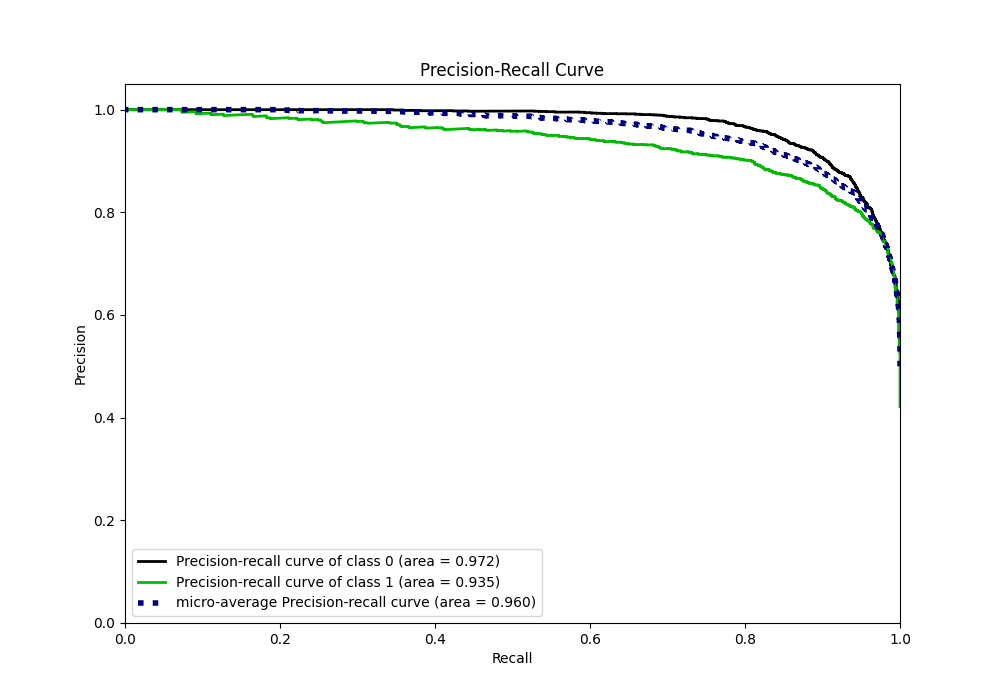
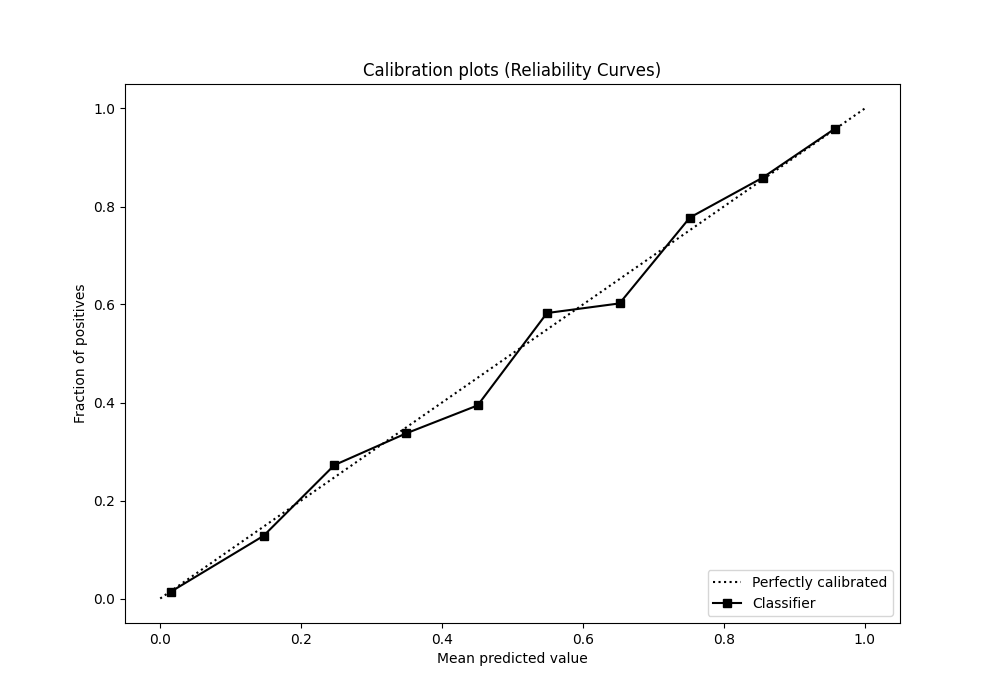
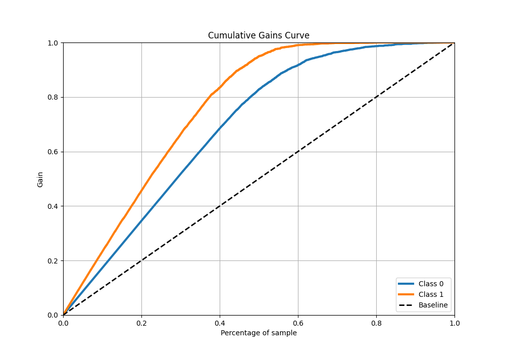
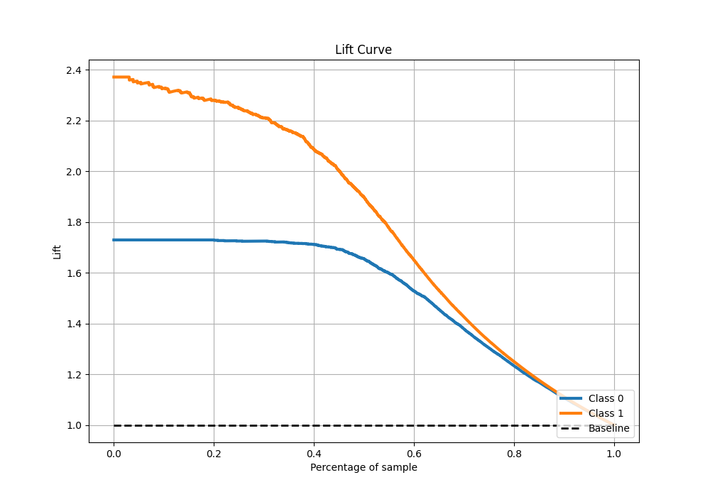

# Summary of 7_Xgboost

[<< Go back](../README.md)

## Extreme Gradient Boosting (Xgboost)
- **n_jobs**: -1
- **objective**: binary:logistic
- **eta**: 0.075
- **max_depth**: 8
- **min_child_weight**: 5
- **subsample**: 1.0
- **colsample_bytree**: 1.0
- **eval_metric**: f1
- **explain_level**: 0

## Validation
 - **validation_type**: split
 - **train_ratio**: 0.9
 - **shuffle**: True
 - **stratify**: True

## Optimized metric
f1

## Training time

8.7 seconds

## Metric details
|           |    score |    threshold |
|:----------|---------:|-------------:|
| logloss   | 0.258589 | nan          |
| auc       | 0.957032 | nan          |
| f1        | 0.87186  |   0.491491   |
| accuracy  | 0.889238 |   0.51921    |
| precision | 1        |   0.990072   |
| recall    | 1        |   9.2894e-05 |
| mcc       | 0.774705 |   0.491491   |

## Metric details with threshold from accuracy metric
|           |    score |   threshold |
|:----------|---------:|------------:|
| logloss   | 0.258589 |   nan       |
| auc       | 0.957032 |   nan       |
| f1        | 0.870932 |     0.51921 |
| accuracy  | 0.889238 |     0.51921 |
| precision | 0.856219 |     0.51921 |
| recall    | 0.886161 |     0.51921 |
| mcc       | 0.774329 |     0.51921 |

## Confusion matrix (at threshold=0.51921)
|              |   Predicted as 0 |   Predicted as 1 |
|:-------------|-----------------:|-----------------:|
| Labeled as 0 |             3286 |              400 |
| Labeled as 1 |              306 |             2382 |

## Learning curves

## Confusion Matrix

## Normalized Confusion Matrix

## ROC Curve

## Kolmogorov-Smirnov Statistic

## Precision-Recall Curve

## Calibration Curve

## Cumulative Gains Curve

## Lift Curve

[<< Go back](../README.md)
