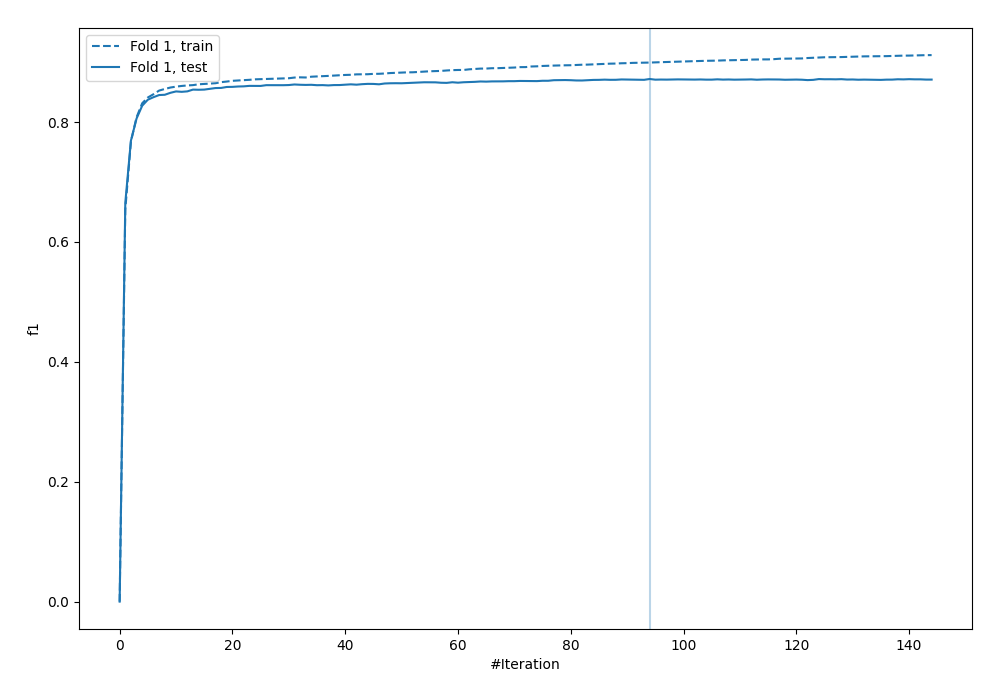
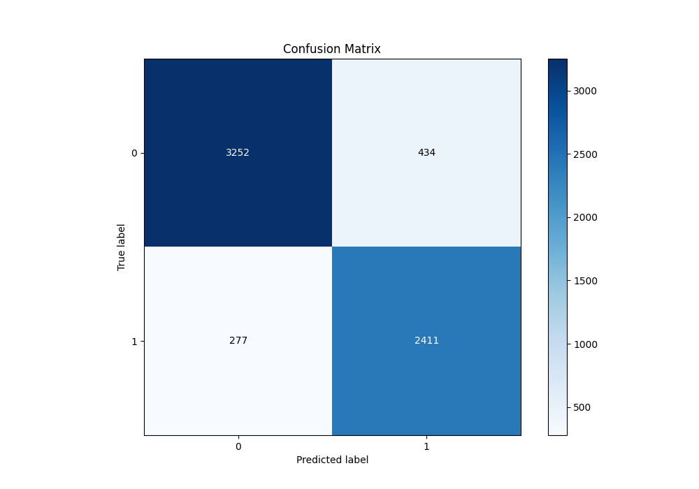
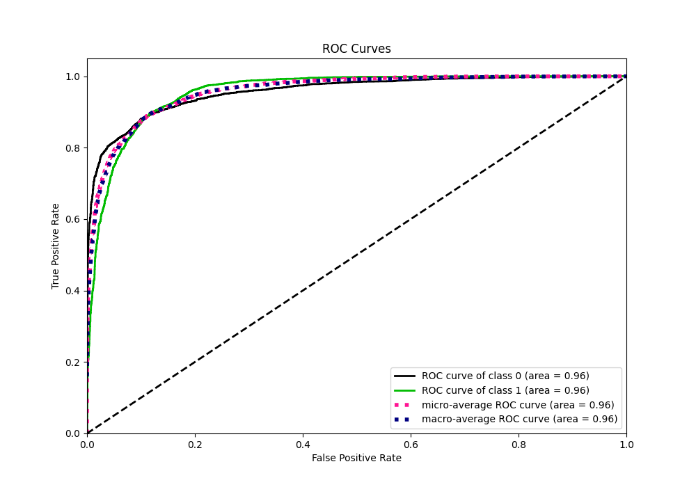
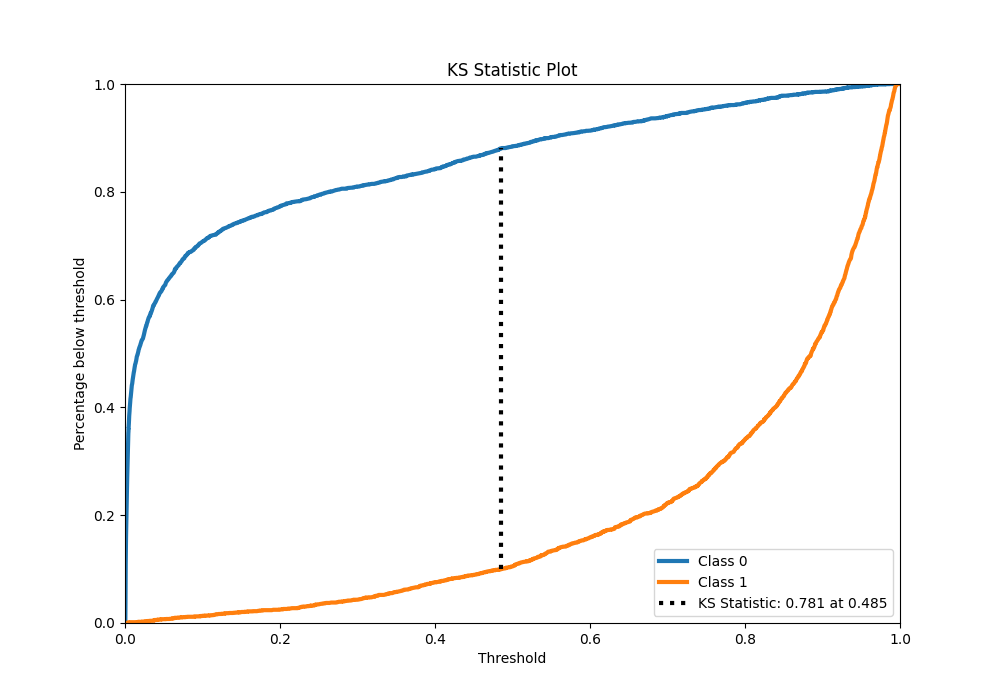
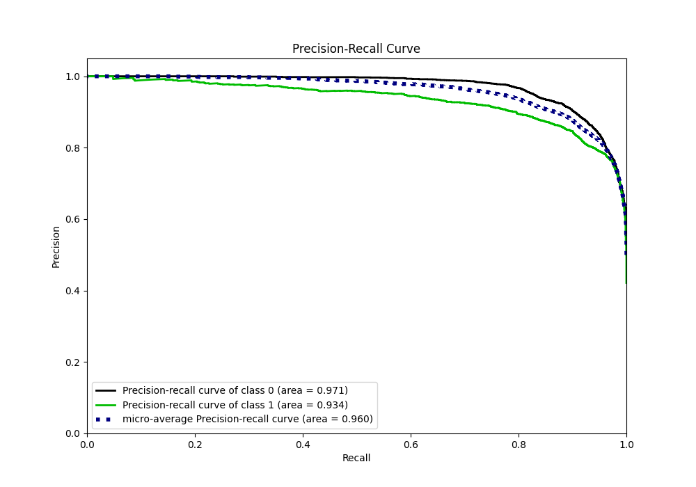
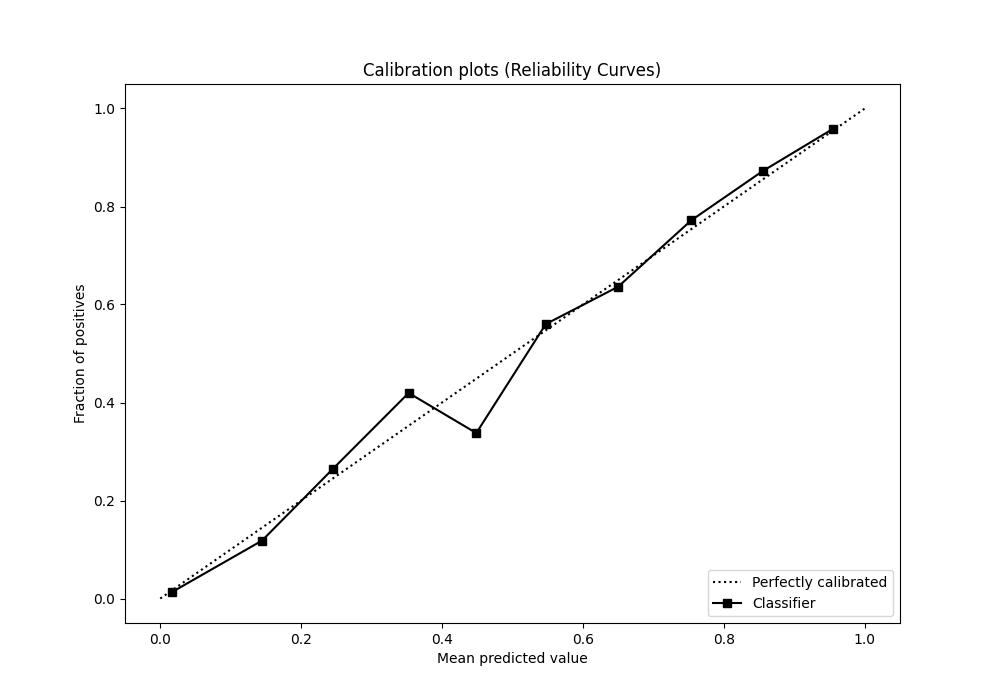
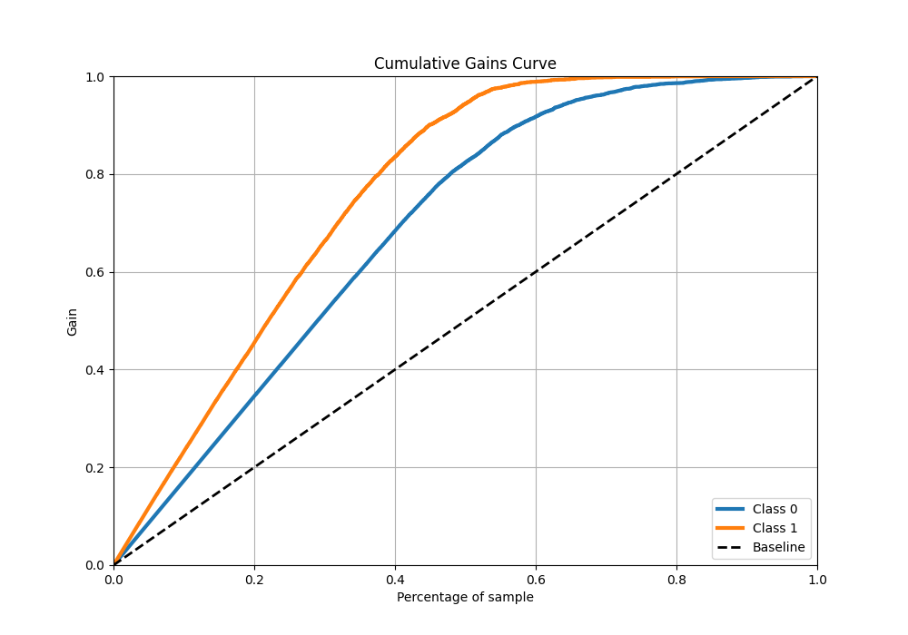
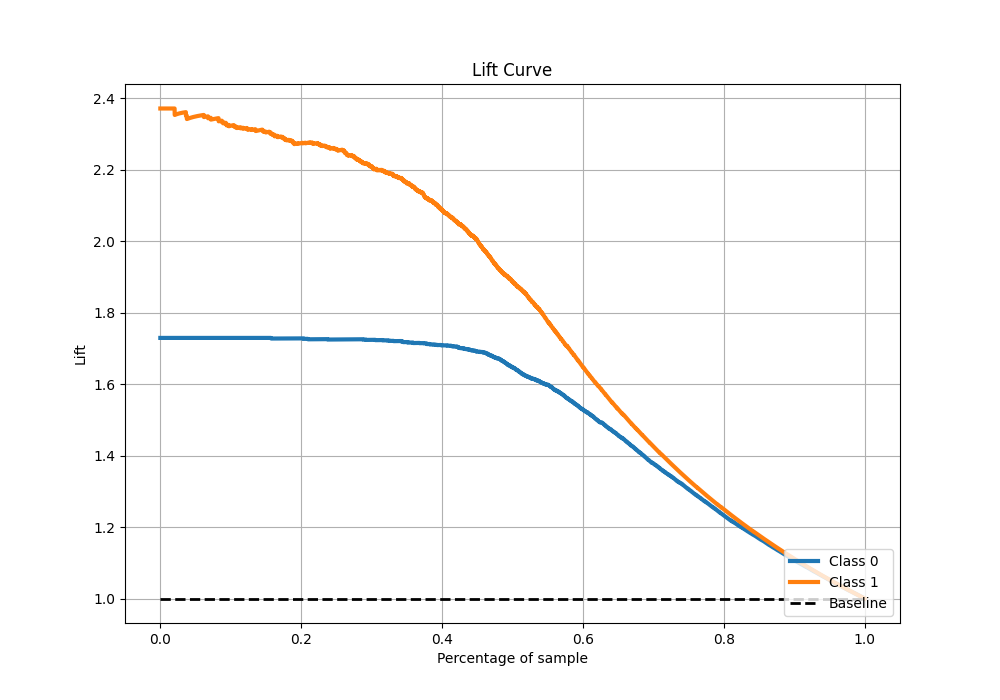

# Summary of 8_Xgboost

[<< Go back](../README.md)

## Extreme Gradient Boosting (Xgboost)
- **n_jobs**: -1
- **objective**: binary:logistic
- **eta**: 0.1
- **max_depth**: 8
- **min_child_weight**: 1
- **subsample**: 1.0
- **colsample_bytree**: 1.0
- **eval_metric**: f1
- **explain_level**: 0

## Validation
 - **validation_type**: split
 - **train_ratio**: 0.9
 - **shuffle**: True
 - **stratify**: True

## Optimized metric
f1

## Training time

6.8 seconds

## Metric details
|           |    score |     threshold |
|:----------|---------:|--------------:|
| logloss   | 0.261097 | nan           |
| auc       | 0.956454 | nan           |
| f1        | 0.871498 |   0.494387    |
| accuracy  | 0.888453 |   0.494387    |
| precision | 0.994975 |   0.982869    |
| recall    | 1        |   0.000232864 |
| mcc       | 0.774066 |   0.494387    |

## Metric details with threshold from accuracy metric
|           |    score |   threshold |
|:----------|---------:|------------:|
| logloss   | 0.261097 |  nan        |
| auc       | 0.956454 |  nan        |
| f1        | 0.871498 |    0.494387 |
| accuracy  | 0.888453 |    0.494387 |
| precision | 0.847452 |    0.494387 |
| recall    | 0.896949 |    0.494387 |
| mcc       | 0.774066 |    0.494387 |

## Confusion matrix (at threshold=0.494387)
|              |   Predicted as 0 |   Predicted as 1 |
|:-------------|-----------------:|-----------------:|
| Labeled as 0 |             3252 |              434 |
| Labeled as 1 |              277 |             2411 |

## Learning curves

## Confusion Matrix

## Normalized Confusion Matrix

## ROC Curve

## Kolmogorov-Smirnov Statistic

## Precision-Recall Curve

## Calibration Curve

## Cumulative Gains Curve

## Lift Curve

[<< Go back](../README.md)
