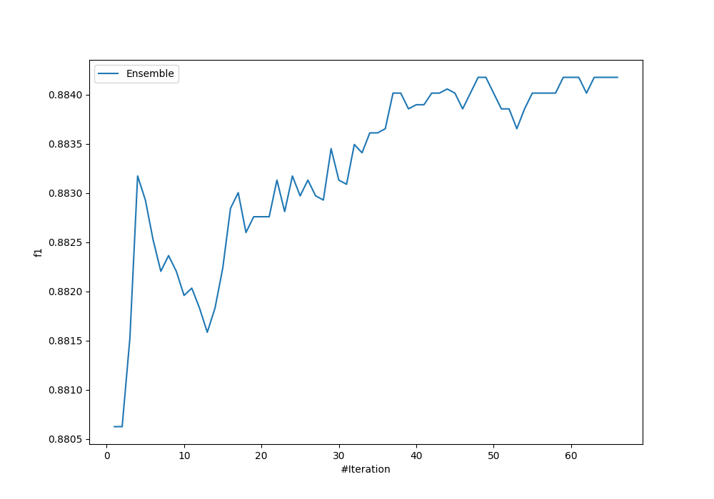
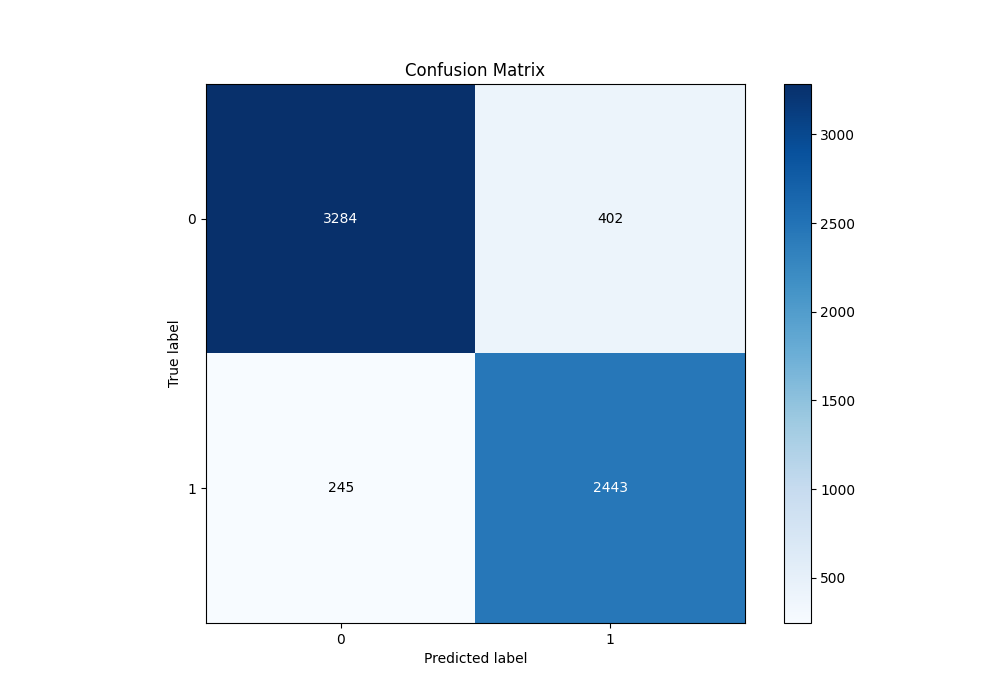
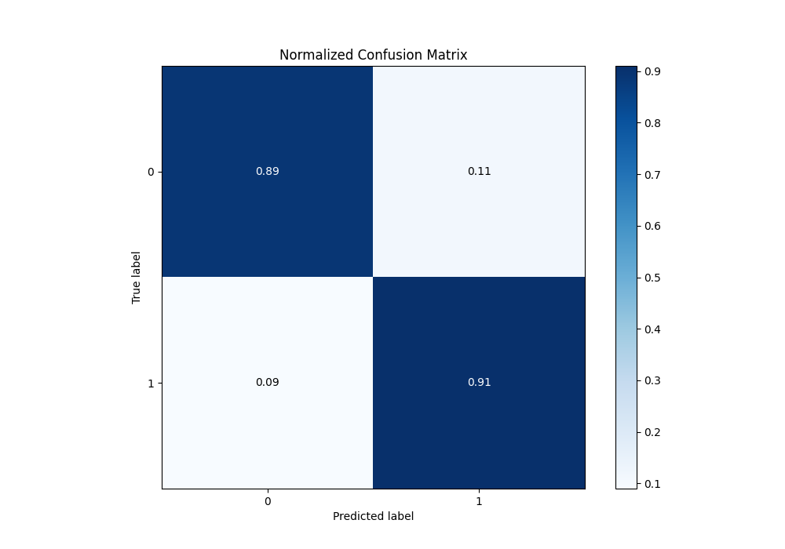
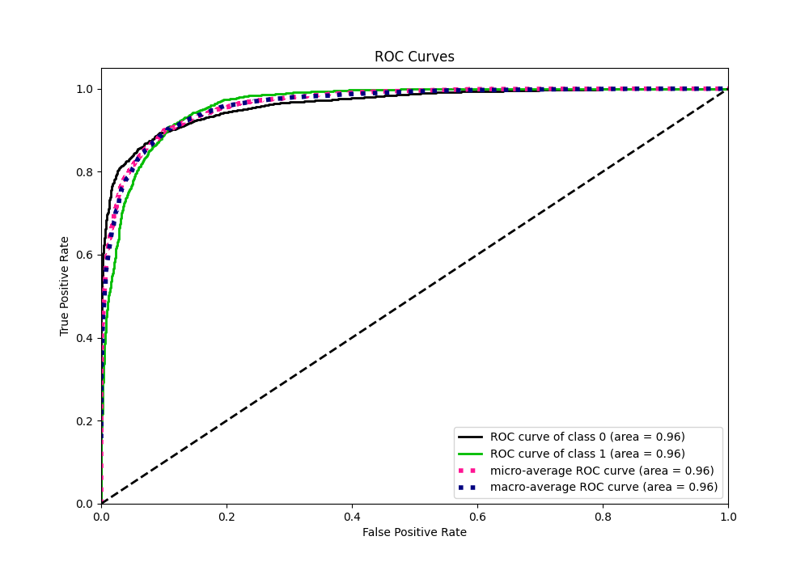
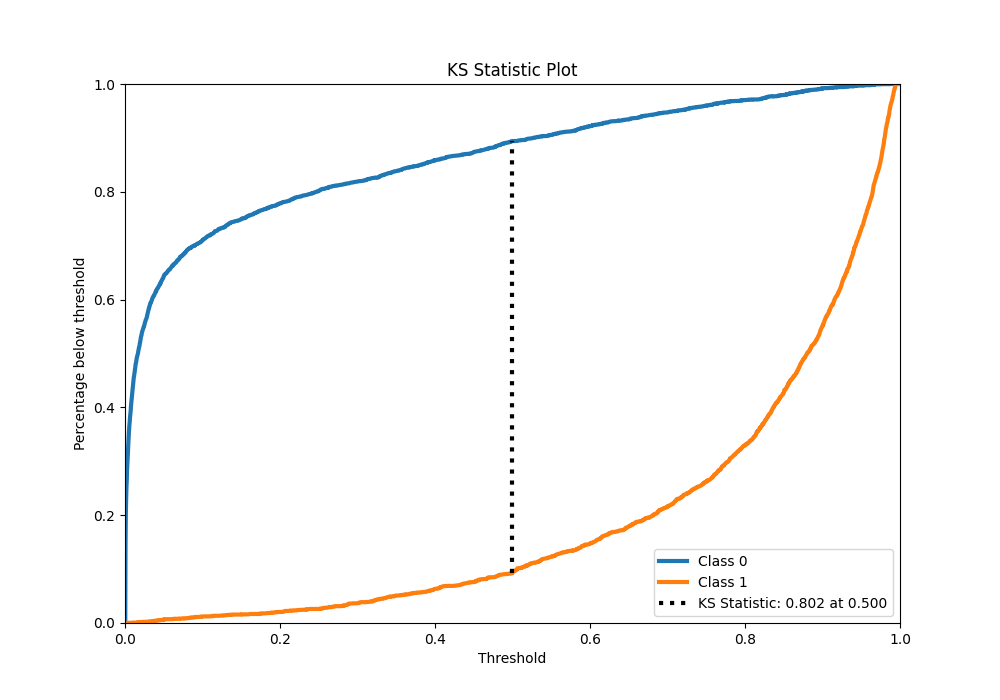
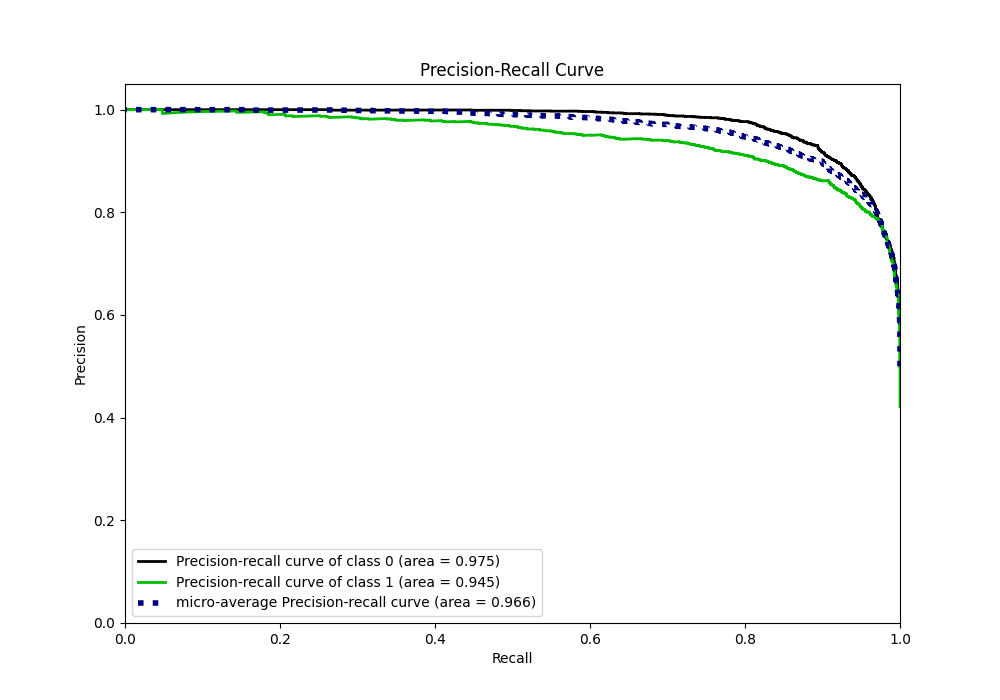
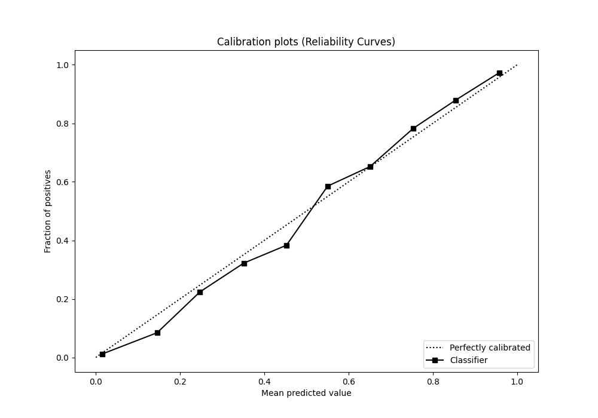
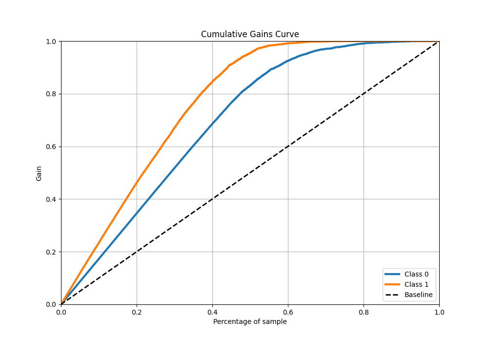
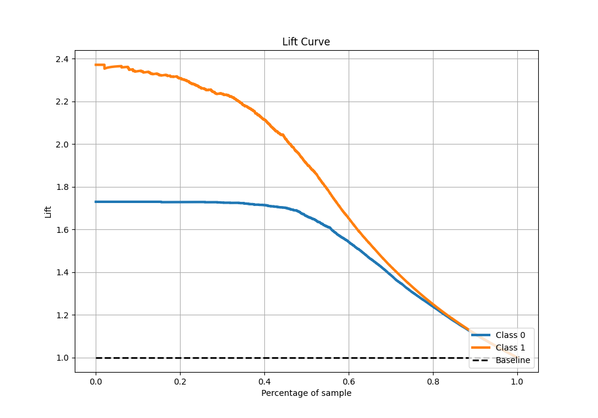

# Summary of Ensemble

[<< Go back](../README.md)

## Ensemble structure
| Model                      |   Weight |
|:---------------------------|---------:|
| 13_Xgboost                 |        1 |
| 16_CatBoost                |        1 |
| 17_CatBoost                |        5 |
| 18_CatBoost                |        2 |
| 18_CatBoost_GoldenFeatures |        1 |
| 19_CatBoost                |        1 |
| 19_CatBoost_GoldenFeatures |        3 |
| 20_CatBoost                |        1 |
| 21_CatBoost                |        4 |
| 23_CatBoost                |        1 |
| 23_CatBoost_KMeansFeatures |        5 |
| 24_CatBoost                |        1 |
| 27_RandomForest            |        1 |
| 34_CatBoost                |        2 |
| 35_CatBoost                |        1 |
| 42_Xgboost                 |        1 |
| 49_CatBoost                |        4 |
| 50_CatBoost                |        1 |
| 51_CatBoost                |        3 |
| 53_Xgboost                 |        1 |
| 56_Xgboost                 |        1 |
| 5_Default_CatBoost         |        4 |
| 7_Xgboost_categorical_mix  |        3 |

## Metric details
|           |    score |     threshold |
|:----------|---------:|--------------:|
| logloss   | 0.243425 | nan           |
| auc       | 0.962789 | nan           |
| f1        | 0.883065 |   0.493161    |
| accuracy  | 0.898494 |   0.493161    |
| precision | 0.997423 |   0.974781    |
| recall    | 1        |   0.000289996 |
| mcc       | 0.794516 |   0.493161    |

## Metric details with threshold from accuracy metric
|           |    score |   threshold |
|:----------|---------:|------------:|
| logloss   | 0.243425 |  nan        |
| auc       | 0.962789 |  nan        |
| f1        | 0.883065 |    0.493161 |
| accuracy  | 0.898494 |    0.493161 |
| precision | 0.858699 |    0.493161 |
| recall    | 0.908854 |    0.493161 |
| mcc       | 0.794516 |    0.493161 |

## Confusion matrix (at threshold=0.493161)
|              |   Predicted as 0 |   Predicted as 1 |
|:-------------|-----------------:|-----------------:|
| Labeled as 0 |             3284 |              402 |
| Labeled as 1 |              245 |             2443 |

## Learning curves

## Confusion Matrix

## Normalized Confusion Matrix

## ROC Curve

## Kolmogorov-Smirnov Statistic

## Precision-Recall Curve

## Calibration Curve

## Cumulative Gains Curve

## Lift Curve

[<< Go back](../README.md)
