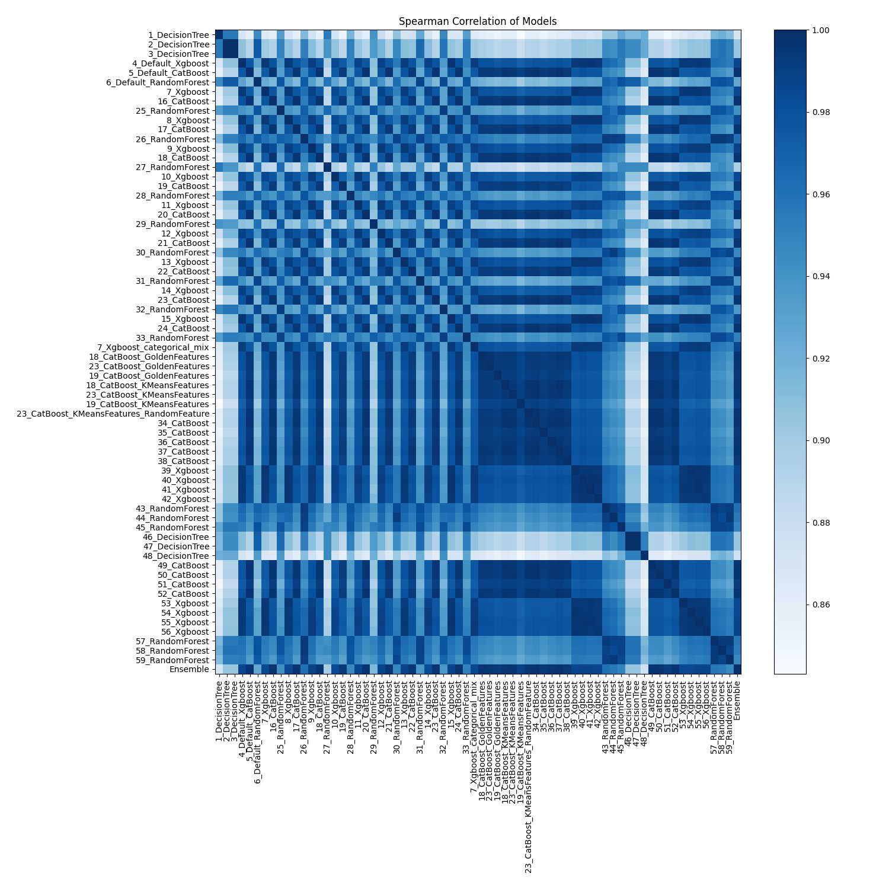

# AutoML Leaderboard

| Best model   | name                                                                                           | model_type    | metric_type   |   metric_value |   train_time |
|:-------------|:-----------------------------------------------------------------------------------------------|:--------------|:--------------|---------------:|-------------:|
|              | [1_DecisionTree](1_DecisionTree/README.md)                                                     | Decision Tree | f1            |       0.808078 |         4.55 |
|              | [2_DecisionTree](2_DecisionTree/README.md)                                                     | Decision Tree | f1            |       0.810104 |         4.76 |
|              | [3_DecisionTree](3_DecisionTree/README.md)                                                     | Decision Tree | f1            |       0.810104 |         4.69 |
|              | [4_Default_Xgboost](4_Default_Xgboost/README.md)                                               | Xgboost       | f1            |       0.869078 |         9.31 |
|              | [5_Default_CatBoost](5_Default_CatBoost/README.md)                                             | CatBoost      | f1            |       0.878013 |        13.19 |
|              | [6_Default_RandomForest](6_Default_RandomForest/README.md)                                     | Random Forest | f1            |       0.814214 |        23.09 |
|              | [7_Xgboost](7_Xgboost/README.md)                                                               | Xgboost       | f1            |       0.873209 |         9.19 |
|              | [16_CatBoost](16_CatBoost/README.md)                                                           | CatBoost      | f1            |       0.877889 |        25.52 |
|              | [25_RandomForest](25_RandomForest/README.md)                                                   | Random Forest | f1            |       0.835085 |        19.02 |
|              | [8_Xgboost](8_Xgboost/README.md)                                                               | Xgboost       | f1            |       0.871739 |         7.27 |
|              | [17_CatBoost](17_CatBoost/README.md)                                                           | CatBoost      | f1            |       0.879782 |        18.29 |
|              | [26_RandomForest](26_RandomForest/README.md)                                                   | Random Forest | f1            |       0.848377 |        29.69 |
|              | [9_Xgboost](9_Xgboost/README.md)                                                               | Xgboost       | f1            |       0.870323 |         7.51 |
|              | [18_CatBoost](18_CatBoost/README.md)                                                           | CatBoost      | f1            |       0.880421 |        18.7  |
|              | [27_RandomForest](27_RandomForest/README.md)                                                   | Random Forest | f1            |       0.809114 |        16.66 |
|              | [10_Xgboost](10_Xgboost/README.md)                                                             | Xgboost       | f1            |       0.865181 |         7.6  |
|              | [19_CatBoost](19_CatBoost/README.md)                                                           | CatBoost      | f1            |       0.880248 |        13.64 |
|              | [28_RandomForest](28_RandomForest/README.md)                                                   | Random Forest | f1            |       0.84016  |        15.76 |
|              | [11_Xgboost](11_Xgboost/README.md)                                                             | Xgboost       | f1            |       0.871665 |         9.8  |
|              | [20_CatBoost](20_CatBoost/README.md)                                                           | CatBoost      | f1            |       0.879257 |        12.16 |
|              | [29_RandomForest](29_RandomForest/README.md)                                                   | Random Forest | f1            |       0.826421 |        15.33 |
|              | [12_Xgboost](12_Xgboost/README.md)                                                             | Xgboost       | f1            |       0.866594 |         8.12 |
|              | [21_CatBoost](21_CatBoost/README.md)                                                           | CatBoost      | f1            |       0.87804  |        10.86 |
|              | [30_RandomForest](30_RandomForest/README.md)                                                   | Random Forest | f1            |       0.843002 |        31.35 |
|              | [13_Xgboost](13_Xgboost/README.md)                                                             | Xgboost       | f1            |       0.870485 |         9.73 |
|              | [22_CatBoost](22_CatBoost/README.md)                                                           | CatBoost      | f1            |       0.872616 |        15.69 |
|              | [31_RandomForest](31_RandomForest/README.md)                                                   | Random Forest | f1            |       0.8323   |        27.51 |
|              | [14_Xgboost](14_Xgboost/README.md)                                                             | Xgboost       | f1            |       0.86887  |         8.45 |
|              | [23_CatBoost](23_CatBoost/README.md)                                                           | CatBoost      | f1            |       0.880319 |        13.69 |
|              | [32_RandomForest](32_RandomForest/README.md)                                                   | Random Forest | f1            |       0.832987 |        33.37 |
|              | [15_Xgboost](15_Xgboost/README.md)                                                             | Xgboost       | f1            |       0.872707 |        10.86 |
|              | [24_CatBoost](24_CatBoost/README.md)                                                           | CatBoost      | f1            |       0.874388 |        18.02 |
|              | [33_RandomForest](33_RandomForest/README.md)                                                   | Random Forest | f1            |       0.834558 |        17.24 |
|              | [7_Xgboost_categorical_mix](7_Xgboost_categorical_mix/README.md)                               | Xgboost       | f1            |       0.869282 |         8.87 |
|              | [18_CatBoost_GoldenFeatures](18_CatBoost_GoldenFeatures/README.md)                             | CatBoost      | f1            |       0.877007 |        17.51 |
|              | [23_CatBoost_GoldenFeatures](23_CatBoost_GoldenFeatures/README.md)                             | CatBoost      | f1            |       0.877792 |        18.24 |
|              | [19_CatBoost_GoldenFeatures](19_CatBoost_GoldenFeatures/README.md)                             | CatBoost      | f1            |       0.878217 |        11.9  |
|              | [18_CatBoost_KMeansFeatures](18_CatBoost_KMeansFeatures/README.md)                             | CatBoost      | f1            |       0.876343 |        14.46 |
|              | [23_CatBoost_KMeansFeatures](23_CatBoost_KMeansFeatures/README.md)                             | CatBoost      | f1            |       0.880624 |        17.69 |
|              | [19_CatBoost_KMeansFeatures](19_CatBoost_KMeansFeatures/README.md)                             | CatBoost      | f1            |       0.880494 |        20.91 |
|              | [23_CatBoost_KMeansFeatures_RandomFeature](23_CatBoost_KMeansFeatures_RandomFeature/README.md) | CatBoost      | f1            |       0.879201 |        14.22 |
|              | [34_CatBoost](34_CatBoost/README.md)                                                           | CatBoost      | f1            |       0.878518 |        23.48 |
|              | [35_CatBoost](35_CatBoost/README.md)                                                           | CatBoost      | f1            |       0.880087 |        13.43 |
|              | [36_CatBoost](36_CatBoost/README.md)                                                           | CatBoost      | f1            |       0.877499 |        16.66 |
|              | [37_CatBoost](37_CatBoost/README.md)                                                           | CatBoost      | f1            |       0.874749 |        20.9  |
|              | [38_CatBoost](38_CatBoost/README.md)                                                           | CatBoost      | f1            |       0.875976 |         9.49 |
|              | [39_Xgboost](39_Xgboost/README.md)                                                             | Xgboost       | f1            |       0.871665 |         7.91 |
|              | [40_Xgboost](40_Xgboost/README.md)                                                             | Xgboost       | f1            |       0.870337 |        10.76 |
|              | [41_Xgboost](41_Xgboost/README.md)                                                             | Xgboost       | f1            |       0.870118 |        11.45 |
|              | [42_Xgboost](42_Xgboost/README.md)                                                             | Xgboost       | f1            |       0.872101 |         7.98 |
|              | [43_RandomForest](43_RandomForest/README.md)                                                   | Random Forest | f1            |       0.848625 |        19.06 |
|              | [44_RandomForest](44_RandomForest/README.md)                                                   | Random Forest | f1            |       0.846617 |        35.71 |
|              | [45_RandomForest](45_RandomForest/README.md)                                                   | Random Forest | f1            |       0.84058  |        16.75 |
|              | [46_DecisionTree](46_DecisionTree/README.md)                                                   | Decision Tree | f1            |       0.81103  |         5.01 |
|              | [47_DecisionTree](47_DecisionTree/README.md)                                                   | Decision Tree | f1            |       0.81103  |         4.92 |
|              | [48_DecisionTree](48_DecisionTree/README.md)                                                   | Decision Tree | f1            |       0.808139 |         4.84 |
|              | [49_CatBoost](49_CatBoost/README.md)                                                           | CatBoost      | f1            |       0.879811 |        13.19 |
|              | [50_CatBoost](50_CatBoost/README.md)                                                           | CatBoost      | f1            |       0.879217 |        15.12 |
|              | [51_CatBoost](51_CatBoost/README.md)                                                           | CatBoost      | f1            |       0.877685 |        16.21 |
|              | [52_CatBoost](52_CatBoost/README.md)                                                           | CatBoost      | f1            |       0.876892 |        15.93 |
|              | [53_Xgboost](53_Xgboost/README.md)                                                             | Xgboost       | f1            |       0.871841 |        10.24 |
|              | [54_Xgboost](54_Xgboost/README.md)                                                             | Xgboost       | f1            |       0.871925 |         8.72 |
|              | [55_Xgboost](55_Xgboost/README.md)                                                             | Xgboost       | f1            |       0.871795 |        12.75 |
|              | [56_Xgboost](56_Xgboost/README.md)                                                             | Xgboost       | f1            |       0.870997 |         7.63 |
|              | [57_RandomForest](57_RandomForest/README.md)                                                   | Random Forest | f1            |       0.836995 |        30.71 |
|              | [58_RandomForest](58_RandomForest/README.md)                                                   | Random Forest | f1            |       0.84544  |        19.7  |
|              | [59_RandomForest](59_RandomForest/README.md)                                                   | Random Forest | f1            |       0.840677 |        39.91 |
| **the best** | [Ensemble](Ensemble/README.md)                                                                 | Ensemble      | f1            |       0.884176 |         6.26 |

### AutoML Performance

### AutoML Performance Boxplot

### Spearman Correlation of Models

